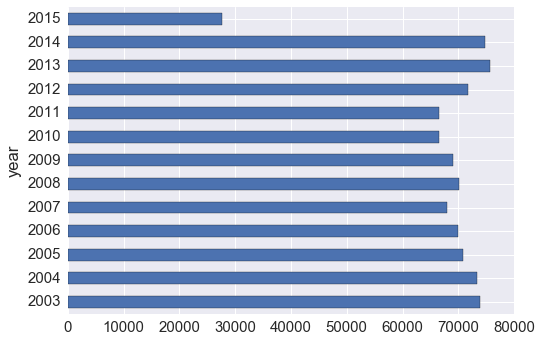
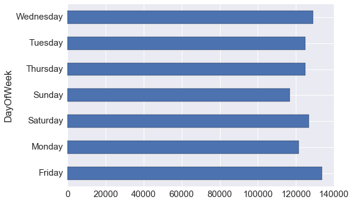
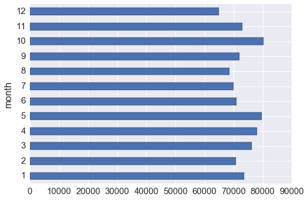
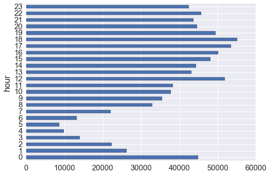
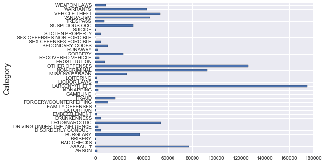
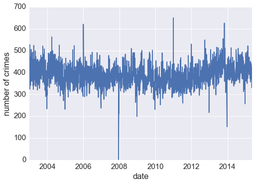
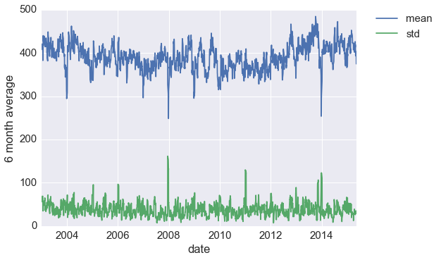
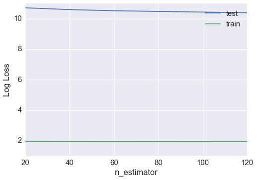
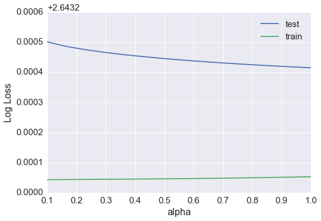

```python
from IPython.display import HTML

HTML('''<script>
code_show=true; 
function code_toggle() {
 if (code_show){
 $('div.input').hide();
 } else {
 $('div.input').show();
 }
 code_show = !code_show
} 
$( document ).ready(code_toggle);
</script>
<form action="javascript:code_toggle()"><input type="submit" value="Click here to toggle on/off the raw code."></form>''')
```


<script>
code_show=true; 
function code_toggle() {
 if (code_show){
 $('div.input').hide();
 } else {
 $('div.input').show();
 }
 code_show = !code_show
} 
$( document ).ready(code_toggle);
</script>
<form action="javascript:code_toggle()"><input type="submit" value="Click here to toggle on/off the raw code."></form>


# An Introductory Study on SF Crime Data

## Bahman Roostaei
### May 2017, Galvanize, San Francisco.

## Source and Purpose of the Analysis

The dataset was acquired from Kaggle [competition](https://www.kaggle.com/c/sf-crime). It portraits occurrances registered by SF Police department over 
the years of 2003-2015. The purpose of this analysis is to gain the first insights into crime occurence in San Francsico, CA districts. Additionaly a first attempt has been made to use machine learnig algorithms to predict crime incidents in terms of time and location. 

Such studies could help rescue teams such as police, fire department and emergency medical services to prepare for upcoming events and better plan their work.

Statistical anlaysis concepts include:
 * Descriptive Statistics:
     * Summary statistics 
     * Exploratory Data Analysis with visualizations
     * Time series analysis
 * Statistical Modeling/Machine Learning:
     * Random Forest Classifier
     * Naive Bayes

## Data


```python
df =pd.read_csv('train.csv')
df.head(3)
```


<div>
<table border="1" class="dataframe">
  <thead>
    <tr style="text-align: right;">
      <th></th>
      <th>Dates</th>
      <th>Category</th>
      <th>Descript</th>
      <th>DayOfWeek</th>
      <th>PdDistrict</th>
      <th>Resolution</th>
      <th>Address</th>
      <th>X</th>
      <th>Y</th>
    </tr>
  </thead>
  <tbody>
    <tr>
      <th>0</th>
      <td>2015-05-13 23:53:00</td>
      <td>WARRANTS</td>
      <td>WARRANT ARREST</td>
      <td>Wednesday</td>
      <td>NORTHERN</td>
      <td>ARREST, BOOKED</td>
      <td>OAK ST / LAGUNA ST</td>
      <td>-122.425892</td>
      <td>37.774599</td>
    </tr>
    <tr>
      <th>1</th>
      <td>2015-05-13 23:53:00</td>
      <td>OTHER OFFENSES</td>
      <td>TRAFFIC VIOLATION ARREST</td>
      <td>Wednesday</td>
      <td>NORTHERN</td>
      <td>ARREST, BOOKED</td>
      <td>OAK ST / LAGUNA ST</td>
      <td>-122.425892</td>
      <td>37.774599</td>
    </tr>
    <tr>
      <th>2</th>
      <td>2015-05-13 23:33:00</td>
      <td>OTHER OFFENSES</td>
      <td>TRAFFIC VIOLATION ARREST</td>
      <td>Wednesday</td>
      <td>NORTHERN</td>
      <td>ARREST, BOOKED</td>
      <td>VANNESS AV / GREENWICH ST</td>
      <td>-122.424363</td>
      <td>37.800414</td>
    </tr>
  </tbody>
</table>
</div>


Data contains numerical (date, location) and categorical features.


```python
# Checking data types in the data frame. 
df.info();
```

    <class 'pandas.core.frame.DataFrame'>
    RangeIndex: 878049 entries, 0 to 878048
    Data columns (total 9 columns):
    Dates         878049 non-null object
    Category      878049 non-null object
    Descript      878049 non-null object
    DayOfWeek     878049 non-null object
    PdDistrict    878049 non-null object
    Resolution    878049 non-null object
    Address       878049 non-null object
    X             878049 non-null float64
    Y             878049 non-null float64
    dtypes: float64(2), object(7)
    memory usage: 60.3+ MB


Size of the dataset:


```python
df.shape
```


    (878049, 9)


There are around 878k events in the dataset. We run an experiment on this data.

# Visualizing Crime Data in SF

In order to visualize the crime data geographocally, we choose the Folium's package. The tileset of choice is OpenStreetMap (which is default); however, Folium can be used with other tilesets like Mapbox or Cloudmade too.

As per Folium's documentation:

"Folium makes it easy to visualize data that’s been manipulated in Python on an interactive Leaflet map. It enables both the binding of data to a map for choropleth visualizations as well as passing Vincent/Vega visualizations as markers on the map."

[Folium Documentation]("https://pypi.python.org/pypi/folium")


```python
SF_COORDINATES = [37.73, -122.40]

# creates an empty map zoomed in San Francisco
map = folium.Map(location=SF_COORDINATES, zoom_start=12)

# creates a marker cluster called "Crime cluster"
marker_cluster = folium.MarkerCluster("Crime Cluster").add_to(map) 

#add a marker for each event, add it to the cluster, not the map
for each in df[:500].iterrows(): # for speed purposes delimited data to 15K
    folium.Marker(location = [each[1]['Y'],each[1]['X']]).add_to(marker_cluster)
    
display(map)
# One can save a map as a html file by using map.create_map(path='map.html') 
```


<div style="width:100%;"><div style="position:relative;width:100%;height:0;padding-bottom:60%;"><iframe src="data:text/html;charset=utf-8;base64,PCFET0NUWVBFIGh0bWw+CjxoZWFkPiAgICAKICAgIDxtZXRhIGh0dHAtZXF1aXY9ImNvbnRlbnQtdHlwZSIgY29udGVudD0idGV4dC9odG1sOyBjaGFyc2V0PVVURi04IiAvPgogICAgPHNjcmlwdD5MX1BSRUZFUl9DQU5WQVMgPSBmYWxzZTsgTF9OT19UT1VDSCA9IGZhbHNlOyBMX0RJU0FCTEVfM0QgPSBmYWxzZTs8L3NjcmlwdD4KICAgIDxzY3JpcHQgc3JjPSJodHRwczovL3VucGtnLmNvbS9sZWFmbGV0QDEuMC4xL2Rpc3QvbGVhZmxldC5qcyI+PC9zY3JpcHQ+CiAgICA8c2NyaXB0IHNyYz0iaHR0cHM6Ly9hamF4Lmdvb2dsZWFwaXMuY29tL2FqYXgvbGlicy9qcXVlcnkvMS4xMS4xL2pxdWVyeS5taW4uanMiPjwvc2NyaXB0PgogICAgPHNjcmlwdCBzcmM9Imh0dHBzOi8vbWF4Y2RuLmJvb3RzdHJhcGNkbi5jb20vYm9vdHN0cmFwLzMuMi4wL2pzL2Jvb3RzdHJhcC5taW4uanMiPjwvc2NyaXB0PgogICAgPHNjcmlwdCBzcmM9Imh0dHBzOi8vY2RuanMuY2xvdWRmbGFyZS5jb20vYWpheC9saWJzL0xlYWZsZXQuYXdlc29tZS1tYXJrZXJzLzIuMC4yL2xlYWZsZXQuYXdlc29tZS1tYXJrZXJzLmpzIj48L3NjcmlwdD4KICAgIDxzY3JpcHQgc3JjPSJodHRwczovL2NkbmpzLmNsb3VkZmxhcmUuY29tL2FqYXgvbGlicy9sZWFmbGV0Lm1hcmtlcmNsdXN0ZXIvMS4wLjAvbGVhZmxldC5tYXJrZXJjbHVzdGVyLXNyYy5qcyI+PC9zY3JpcHQ+CiAgICA8c2NyaXB0IHNyYz0iaHR0cHM6Ly9jZG5qcy5jbG91ZGZsYXJlLmNvbS9hamF4L2xpYnMvbGVhZmxldC5tYXJrZXJjbHVzdGVyLzEuMC4wL2xlYWZsZXQubWFya2VyY2x1c3Rlci5qcyI+PC9zY3JpcHQ+CiAgICA8bGluayByZWw9InN0eWxlc2hlZXQiIGhyZWY9Imh0dHBzOi8vdW5wa2cuY29tL2xlYWZsZXRAMS4wLjEvZGlzdC9sZWFmbGV0LmNzcyIgLz4KICAgIDxsaW5rIHJlbD0ic3R5bGVzaGVldCIgaHJlZj0iaHR0cHM6Ly9tYXhjZG4uYm9vdHN0cmFwY2RuLmNvbS9ib290c3RyYXAvMy4yLjAvY3NzL2Jvb3RzdHJhcC5taW4uY3NzIiAvPgogICAgPGxpbmsgcmVsPSJzdHlsZXNoZWV0IiBocmVmPSJodHRwczovL21heGNkbi5ib290c3RyYXBjZG4uY29tL2Jvb3RzdHJhcC8zLjIuMC9jc3MvYm9vdHN0cmFwLXRoZW1lLm1pbi5jc3MiIC8+CiAgICA8bGluayByZWw9InN0eWxlc2hlZXQiIGhyZWY9Imh0dHBzOi8vbWF4Y2RuLmJvb3RzdHJhcGNkbi5jb20vZm9udC1hd2Vzb21lLzQuNi4zL2Nzcy9mb250LWF3ZXNvbWUubWluLmNzcyIgLz4KICAgIDxsaW5rIHJlbD0ic3R5bGVzaGVldCIgaHJlZj0iaHR0cHM6Ly9jZG5qcy5jbG91ZGZsYXJlLmNvbS9hamF4L2xpYnMvTGVhZmxldC5hd2Vzb21lLW1hcmtlcnMvMi4wLjIvbGVhZmxldC5hd2Vzb21lLW1hcmtlcnMuY3NzIiAvPgogICAgPGxpbmsgcmVsPSJzdHlsZXNoZWV0IiBocmVmPSJodHRwczovL2NkbmpzLmNsb3VkZmxhcmUuY29tL2FqYXgvbGlicy9sZWFmbGV0Lm1hcmtlcmNsdXN0ZXIvMS4wLjAvTWFya2VyQ2x1c3Rlci5EZWZhdWx0LmNzcyIgLz4KICAgIDxsaW5rIHJlbD0ic3R5bGVzaGVldCIgaHJlZj0iaHR0cHM6Ly9jZG5qcy5jbG91ZGZsYXJlLmNvbS9hamF4L2xpYnMvbGVhZmxldC5tYXJrZXJjbHVzdGVyLzEuMC4wL01hcmtlckNsdXN0ZXIuY3NzIiAvPgogICAgPGxpbmsgcmVsPSJzdHlsZXNoZWV0IiBocmVmPSJodHRwczovL3Jhd2dpdC5jb20vcHl0aG9uLXZpc3VhbGl6YXRpb24vZm9saXVtL21hc3Rlci9mb2xpdW0vdGVtcGxhdGVzL2xlYWZsZXQuYXdlc29tZS5yb3RhdGUuY3NzIiAvPgogICAgPHN0eWxlPmh0bWwsIGJvZHkge3dpZHRoOiAxMDAlO2hlaWdodDogMTAwJTttYXJnaW46IDA7cGFkZGluZzogMDt9PC9zdHlsZT4KICAgIDxzdHlsZT4jbWFwIHtwb3NpdGlvbjphYnNvbHV0ZTt0b3A6MDtib3R0b206MDtyaWdodDowO2xlZnQ6MDt9PC9zdHlsZT4KICAgIAogICAgICAgICAgICA8c3R5bGU+ICNtYXBfOWVkMDFjYzIxOTI1NDcxMGE4OTJhZmI2NTUyYjc3YzYgewogICAgICAgICAgICAgICAgcG9zaXRpb24gOiByZWxhdGl2ZTsKICAgICAgICAgICAgICAgIHdpZHRoIDogMTAwLjAlOwogICAgICAgICAgICAgICAgaGVpZ2h0OiAxMDAuMCU7CiAgICAgICAgICAgICAgICBsZWZ0OiAwLjAlOwogICAgICAgICAgICAgICAgdG9wOiAwLjAlOwogICAgICAgICAgICAgICAgfQogICAgICAgICAgICA8L3N0eWxlPgogICAgICAgIAo8L2hlYWQ+Cjxib2R5PiAgICAKICAgIAogICAgICAgICAgICA8ZGl2IGNsYXNzPSJmb2xpdW0tbWFwIiBpZD0ibWFwXzllZDAxY2MyMTkyNTQ3MTBhODkyYWZiNjU1MmI3N2M2IiA+PC9kaXY+CiAgICAgICAgCjwvYm9keT4KPHNjcmlwdD4gICAgCiAgICAKCiAgICAgICAgICAgIAogICAgICAgICAgICAgICAgdmFyIHNvdXRoV2VzdCA9IEwubGF0TG5nKC05MCwgLTE4MCk7CiAgICAgICAgICAgICAgICB2YXIgbm9ydGhFYXN0ID0gTC5sYXRMbmcoOTAsIDE4MCk7CiAgICAgICAgICAgICAgICB2YXIgYm91bmRzID0gTC5sYXRMbmdCb3VuZHMoc291dGhXZXN0LCBub3J0aEVhc3QpOwogICAgICAgICAgICAKCiAgICAgICAgICAgIHZhciBtYXBfOWVkMDFjYzIxOTI1NDcxMGE4OTJhZmI2NTUyYjc3YzYgPSBMLm1hcCgKICAgICAgICAgICAgICAgICAgICAgICAgICAgICAgICAgICdtYXBfOWVkMDFjYzIxOTI1NDcxMGE4OTJhZmI2NTUyYjc3YzYnLAogICAgICAgICAgICAgICAgICAgICAgICAgICAgICAgICAge2NlbnRlcjogWzM3LjczLC0xMjIuNF0sCiAgICAgICAgICAgICAgICAgICAgICAgICAgICAgICAgICB6b29tOiAxMiwKICAgICAgICAgICAgICAgICAgICAgICAgICAgICAgICAgIG1heEJvdW5kczogYm91bmRzLAogICAgICAgICAgICAgICAgICAgICAgICAgICAgICAgICAgbGF5ZXJzOiBbXSwKICAgICAgICAgICAgICAgICAgICAgICAgICAgICAgICAgIHdvcmxkQ29weUp1bXA6IGZhbHNlLAogICAgICAgICAgICAgICAgICAgICAgICAgICAgICAgICAgY3JzOiBMLkNSUy5FUFNHMzg1NwogICAgICAgICAgICAgICAgICAgICAgICAgICAgICAgICB9KTsKICAgICAgICAgICAgCiAgICAgICAgCiAgICAKICAgICAgICAgICAgdmFyIHRpbGVfbGF5ZXJfNDQwYTk4MGU1YThiNDIyMTljM2EwMzNhMWE0ODZmMjcgPSBMLnRpbGVMYXllcigKICAgICAgICAgICAgICAgICdodHRwczovL3tzfS50aWxlLm9wZW5zdHJlZXRtYXAub3JnL3t6fS97eH0ve3l9LnBuZycsCiAgICAgICAgICAgICAgICB7CiAgICAgICAgICAgICAgICAgICAgbWF4Wm9vbTogMTgsCiAgICAgICAgICAgICAgICAgICAgbWluWm9vbTogMSwKICAgICAgICAgICAgICAgICAgICBjb250aW51b3VzV29ybGQ6IGZhbHNlLAogICAgICAgICAgICAgICAgICAgIG5vV3JhcDogZmFsc2UsCiAgICAgICAgICAgICAgICAgICAgYXR0cmlidXRpb246ICdEYXRhIGJ5IDxhIGhyZWY9Imh0dHA6Ly9vcGVuc3RyZWV0bWFwLm9yZyI+T3BlblN0cmVldE1hcDwvYT4sIHVuZGVyIDxhIGhyZWY9Imh0dHA6Ly93d3cub3BlbnN0cmVldG1hcC5vcmcvY29weXJpZ2h0Ij5PRGJMPC9hPi4nLAogICAgICAgICAgICAgICAgICAgIGRldGVjdFJldGluYTogZmFsc2UKICAgICAgICAgICAgICAgICAgICB9CiAgICAgICAgICAgICAgICApLmFkZFRvKG1hcF85ZWQwMWNjMjE5MjU0NzEwYTg5MmFmYjY1NTJiNzdjNik7CgogICAgICAgIAogICAgCiAgICAgICAgICAgIHZhciBtYXJrZXJfY2x1c3Rlcl83NzI4YzlhMTNkMjc0MDUyODY0M2FhNzUyYWQyN2EyNSA9IEwubWFya2VyQ2x1c3Rlckdyb3VwKCk7CiAgICAgICAgICAgIG1hcF85ZWQwMWNjMjE5MjU0NzEwYTg5MmFmYjY1NTJiNzdjNi5hZGRMYXllcihtYXJrZXJfY2x1c3Rlcl83NzI4YzlhMTNkMjc0MDUyODY0M2FhNzUyYWQyN2EyNSk7CiAgICAgICAgICAgIAogICAgCgogICAgICAgICAgICB2YXIgbWFya2VyXzJiMTIxMWEwYzhkNjQ5NzI5OWU2ZjMzNDkzOWJlODNjID0gTC5tYXJrZXIoCiAgICAgICAgICAgICAgICBbMzcuNzc0MzI5OTE1MzgzNiwtMTIyLjQxMDgwMjQ3NzgwOF0sCiAgICAgICAgICAgICAgICB7CiAgICAgICAgICAgICAgICAgICAgaWNvbjogbmV3IEwuSWNvbi5EZWZhdWx0KCkKICAgICAgICAgICAgICAgICAgICB9CiAgICAgICAgICAgICAgICApCiAgICAgICAgICAgICAgICAuYWRkVG8obWFya2VyX2NsdXN0ZXJfNzcyOGM5YTEzZDI3NDA1Mjg2NDNhYTc1MmFkMjdhMjUpOwogICAgICAgICAgICAKICAgIAoKICAgICAgICAgICAgdmFyIG1hcmtlcl83YmJmYjFjM2I1OGY0NGM1OTZiMDIyNzIwZTQyNDVjMiA9IEwubWFya2VyKAogICAgICAgICAgICAgICAgWzM3Ljc3NTQyMDcwNjcxMSwtMTIyLjQwMzQwNDc5MTQ3ODk5XSwKICAgICAgICAgICAgICAgIHsKICAgICAgICAgICAgICAgICAgICBpY29uOiBuZXcgTC5JY29uLkRlZmF1bHQoKQogICAgICAgICAgICAgICAgICAgIH0KICAgICAgICAgICAgICAgICkKICAgICAgICAgICAgICAgIC5hZGRUbyhtYXJrZXJfY2x1c3Rlcl83NzI4YzlhMTNkMjc0MDUyODY0M2FhNzUyYWQyN2EyNSk7CiAgICAgICAgICAgIAogICAgCgogICAgICAgICAgICB2YXIgbWFya2VyXzBhMGYzNDBjMWE1NTRjNmM4MzVlNDRhN2Y5NGVjNDM0ID0gTC5tYXJrZXIoCiAgICAgICAgICAgICAgICBbMzcuNzI3NzAxOTQwNjc2OCwtMTIyLjQxODM5MDczMjg2NV0sCiAgICAgICAgICAgICAgICB7CiAgICAgICAgICAgICAgICAgICAgaWNvbjogbmV3IEwuSWNvbi5EZWZhdWx0KCkKICAgICAgICAgICAgICAgICAgICB9CiAgICAgICAgICAgICAgICApCiAgICAgICAgICAgICAgICAuYWRkVG8obWFya2VyX2NsdXN0ZXJfNzcyOGM5YTEzZDI3NDA1Mjg2NDNhYTc1MmFkMjdhMjUpOwogICAgICAgICAgICAKICAgIAoKICAgICAgICAgICAgdmFyIG1hcmtlcl8zYWU1NDk0ZTBkY2Y0MDk0YmJlNmRkZTE0N2NiMzE1ZCA9IEwubWFya2VyKAogICAgICAgICAgICAgICAgWzM3Ljc3NTQyMDcwNjcxMSwtMTIyLjQwMzQwNDc5MTQ3ODk5XSwKICAgICAgICAgICAgICAgIHsKICAgICAgICAgICAgICAgICAgICBpY29uOiBuZXcgTC5JY29uLkRlZmF1bHQoKQogICAgICAgICAgICAgICAgICAgIH0KICAgICAgICAgICAgICAgICkKICAgICAgICAgICAgICAgIC5hZGRUbyhtYXJrZXJfY2x1c3Rlcl83NzI4YzlhMTNkMjc0MDUyODY0M2FhNzUyYWQyN2EyNSk7CiAgICAgICAgICAgIAogICAgCgogICAgICAgICAgICB2YXIgbWFya2VyXzAzMzcxNDZhOWNlOTQ3ZDNhNDdjZWQ2YjM1Yzg4NTYyID0gTC5tYXJrZXIoCiAgICAgICAgICAgICAgICBbMzcuNzgxMjg4MTI0NTk1MSwtMTIyLjQyMDMzNzk3NzIxMV0sCiAgICAgICAgICAgICAgICB7CiAgICAgICAgICAgICAgICAgICAgaWNvbjogbmV3IEwuSWNvbi5EZWZhdWx0KCkKICAgICAgICAgICAgICAgICAgICB9CiAgICAgICAgICAgICAgICApCiAgICAgICAgICAgICAgICAuYWRkVG8obWFya2VyX2NsdXN0ZXJfNzcyOGM5YTEzZDI3NDA1Mjg2NDNhYTc1MmFkMjdhMjUpOwogICAgICAgICAgICAKICAgIAoKICAgICAgICAgICAgdmFyIG1hcmtlcl9lMzc4OGY0MjA5MGM0MTlkYWFlMWI4OTNmMmU3YmNjOCA9IEwubWFya2VyKAogICAgICAgICAgICAgICAgWzM3Ljc3MDcwNjUzMjk0MzcsLTEyMi40MDQ1ODczMzY4ODY5OV0sCiAgICAgICAgICAgICAgICB7CiAgICAgICAgICAgICAgICAgICAgaWNvbjogbmV3IEwuSWNvbi5EZWZhdWx0KCkKICAgICAgICAgICAgICAgICAgICB9CiAgICAgICAgICAgICAgICApCiAgICAgICAgICAgICAgICAuYWRkVG8obWFya2VyX2NsdXN0ZXJfNzcyOGM5YTEzZDI3NDA1Mjg2NDNhYTc1MmFkMjdhMjUpOwogICAgICAgICAgICAKICAgIAoKICAgICAgICAgICAgdmFyIG1hcmtlcl82OThjOWMxNDllNjU0MmUxOWZmYjk5ZTQ1MzY5MjVlMyA9IEwubWFya2VyKAogICAgICAgICAgICAgICAgWzM3Ljc3NTE1MTExNDA3MDMsLTEyMi40MzY5OTA5MDE4NV0sCiAgICAgICAgICAgICAgICB7CiAgICAgICAgICAgICAgICAgICAgaWNvbjogbmV3IEwuSWNvbi5EZWZhdWx0KCkKICAgICAgICAgICAgICAgICAgICB9CiAgICAgICAgICAgICAgICApCiAgICAgICAgICAgICAgICAuYWRkVG8obWFya2VyX2NsdXN0ZXJfNzcyOGM5YTEzZDI3NDA1Mjg2NDNhYTc1MmFkMjdhMjUpOwogICAgICAgICAgICAKICAgIAoKICAgICAgICAgICAgdmFyIG1hcmtlcl9kYThjM2UzOTdmNDY0YjY3ODhjNTlkYjkwM2U0MGIzNSA9IEwubWFya2VyKAogICAgICAgICAgICAgICAgWzM3LjcxNjg3ODY0NjQyOSwtMTIyLjM4NzUwMTQ3OTQ1XSwKICAgICAgICAgICAgICAgIHsKICAgICAgICAgICAgICAgICAgICBpY29uOiBuZXcgTC5JY29uLkRlZmF1bHQoKQogICAgICAgICAgICAgICAgICAgIH0KICAgICAgICAgICAgICAgICkKICAgICAgICAgICAgICAgIC5hZGRUbyhtYXJrZXJfY2x1c3Rlcl83NzI4YzlhMTNkMjc0MDUyODY0M2FhNzUyYWQyN2EyNSk7CiAgICAgICAgICAgIAogICAgCgogICAgICAgICAgICB2YXIgbWFya2VyXzI1M2Y2YjA4ZDJkNDQwMzc5NzQyYzIyMDA0MWNiZWQ2ID0gTC5tYXJrZXIoCiAgICAgICAgICAgICAgICBbMzcuNzg2NzE5MDE1NTU0LC0xMjIuNDEzMTc0NDk0Mzk2XSwKICAgICAgICAgICAgICAgIHsKICAgICAgICAgICAgICAgICAgICBpY29uOiBuZXcgTC5JY29uLkRlZmF1bHQoKQogICAgICAgICAgICAgICAgICAgIH0KICAgICAgICAgICAgICAgICkKICAgICAgICAgICAgICAgIC5hZGRUbyhtYXJrZXJfY2x1c3Rlcl83NzI4YzlhMTNkMjc0MDUyODY0M2FhNzUyYWQyN2EyNSk7CiAgICAgICAgICAgIAogICAgCgogICAgICAgICAgICB2YXIgbWFya2VyXzcyZTYzNDQxOGJkMzRkYmJhNGU5Y2JkMmJjNzEwMDkwID0gTC5tYXJrZXIoCiAgICAgICAgICAgICAgICBbMzcuNzU4Njk2ODE2NjQ4OSwtMTIyLjQxNzk2NDQ4Mzc2MDAyXSwKICAgICAgICAgICAgICAgIHsKICAgICAgICAgICAgICAgICAgICBpY29uOiBuZXcgTC5JY29uLkRlZmF1bHQoKQogICAgICAgICAgICAgICAgICAgIH0KICAgICAgICAgICAgICAgICkKICAgICAgICAgICAgICAgIC5hZGRUbyhtYXJrZXJfY2x1c3Rlcl83NzI4YzlhMTNkMjc0MDUyODY0M2FhNzUyYWQyN2EyNSk7CiAgICAgICAgICAgIAogICAgCgogICAgICAgICAgICB2YXIgbWFya2VyX2IxZmU1YWJkYzgyNzQ1MzJhNTRjMzMzYzhhNzg5ZGM2ID0gTC5tYXJrZXIoCiAgICAgICAgICAgICAgICBbMzcuNzk4MzgzMDc5MDkxMSwtMTIyLjQwNzUyMTczMDkyMzk5XSwKICAgICAgICAgICAgICAgIHsKICAgICAgICAgICAgICAgICAgICBpY29uOiBuZXcgTC5JY29uLkRlZmF1bHQoKQogICAgICAgICAgICAgICAgICAgIH0KICAgICAgICAgICAgICAgICkKICAgICAgICAgICAgICAgIC5hZGRUbyhtYXJrZXJfY2x1c3Rlcl83NzI4YzlhMTNkMjc0MDUyODY0M2FhNzUyYWQyN2EyNSk7CiAgICAgICAgICAgIAogICAgCgogICAgICAgICAgICB2YXIgbWFya2VyX2I1ZGQ0ZGRkMzllMjQ1ZWNhOWNjNGI2MTJmZjBlZDEwID0gTC5tYXJrZXIoCiAgICAgICAgICAgICAgICBbMzcuNzU1MTY3MTMyNjMxMywtMTIyLjQ3NjM1NDk4NjYyOF0sCiAgICAgICAgICAgICAgICB7CiAgICAgICAgICAgICAgICAgICAgaWNvbjogbmV3IEwuSWNvbi5EZWZhdWx0KCkKICAgICAgICAgICAgICAgICAgICB9CiAgICAgICAgICAgICAgICApCiAgICAgICAgICAgICAgICAuYWRkVG8obWFya2VyX2NsdXN0ZXJfNzcyOGM5YTEzZDI3NDA1Mjg2NDNhYTc1MmFkMjdhMjUpOwogICAgICAgICAgICAKICAgIAoKICAgICAgICAgICAgdmFyIG1hcmtlcl81YjEyNzhmYmU4NTQ0YTIwOGQ0ZjdmNDkwYTRlNTg2ZCA9IEwubWFya2VyKAogICAgICAgICAgICAgICAgWzM3LjgwNzMzMzkzMDU5NTIsLTEyMi40MTkwNjcyMjQzNzldLAogICAgICAgICAgICAgICAgewogICAgICAgICAgICAgICAgICAgIGljb246IG5ldyBMLkljb24uRGVmYXVsdCgpCiAgICAgICAgICAgICAgICAgICAgfQogICAgICAgICAgICAgICAgKQogICAgICAgICAgICAgICAgLmFkZFRvKG1hcmtlcl9jbHVzdGVyXzc3MjhjOWExM2QyNzQwNTI4NjQzYWE3NTJhZDI3YTI1KTsKICAgICAgICAgICAgCiAgICAKCiAgICAgICAgICAgIHZhciBtYXJrZXJfNzI3NjZhYTI3NDY2NGVkYjk1OTQzYWFjMmQzMzgxNWMgPSBMLm1hcmtlcigKICAgICAgICAgICAgICAgIFszNy43MzQ0OTEwOTkxMDU3OTYsLTEyMi4zOTE5Mjk0MDg5Ml0sCiAgICAgICAgICAgICAgICB7CiAgICAgICAgICAgICAgICAgICAgaWNvbjogbmV3IEwuSWNvbi5EZWZhdWx0KCkKICAgICAgICAgICAgICAgICAgICB9CiAgICAgICAgICAgICAgICApCiAgICAgICAgICAgICAgICAuYWRkVG8obWFya2VyX2NsdXN0ZXJfNzcyOGM5YTEzZDI3NDA1Mjg2NDNhYTc1MmFkMjdhMjUpOwogICAgICAgICAgICAKICAgIAoKICAgICAgICAgICAgdmFyIG1hcmtlcl9iMzM1ZTFkZWQ5ZGM0YTQ1YmI1NzY2OGI1OWY2ZWQxMCA9IEwubWFya2VyKAogICAgICAgICAgICAgICAgWzM3Ljc3ODcxOTI2Mjc4OTAwNCwtMTIyLjQxNDc0MzgzNTM4Ml0sCiAgICAgICAgICAgICAgICB7CiAgICAgICAgICAgICAgICAgICAgaWNvbjogbmV3IEwuSWNvbi5EZWZhdWx0KCkKICAgICAgICAgICAgICAgICAgICB9CiAgICAgICAgICAgICAgICApCiAgICAgICAgICAgICAgICAuYWRkVG8obWFya2VyX2NsdXN0ZXJfNzcyOGM5YTEzZDI3NDA1Mjg2NDNhYTc1MmFkMjdhMjUpOwogICAgICAgICAgICAKICAgIAoKICAgICAgICAgICAgdmFyIG1hcmtlcl80MjA3YzkwZmIxMjY0NmZiOWU5ZDhlNDRmMmY2Y2QwMCA9IEwubWFya2VyKAogICAgICAgICAgICAgICAgWzM3Ljc4MDMzMTMyMDkwNjUsLTEyMi40MDY1MDg0ODcwMDMwMV0sCiAgICAgICAgICAgICAgICB7CiAgICAgICAgICAgICAgICAgICAgaWNvbjogbmV3IEwuSWNvbi5EZWZhdWx0KCkKICAgICAgICAgICAgICAgICAgICB9CiAgICAgICAgICAgICAgICApCiAgICAgICAgICAgICAgICAuYWRkVG8obWFya2VyX2NsdXN0ZXJfNzcyOGM5YTEzZDI3NDA1Mjg2NDNhYTc1MmFkMjdhMjUpOwogICAgICAgICAgICAKICAgIAoKICAgICAgICAgICAgdmFyIG1hcmtlcl9lNGI5MTliMGMzZDY0NzI1YTRjODgyMTZhNDYxYWM5OSA9IEwubWFya2VyKAogICAgICAgICAgICAgICAgWzM3Ljc4OTU3Mjc2MjU2MywtMTIyLjM4ODQ4NTU2MjM4N10sCiAgICAgICAgICAgICAgICB7CiAgICAgICAgICAgICAgICAgICAgaWNvbjogbmV3IEwuSWNvbi5EZWZhdWx0KCkKICAgICAgICAgICAgICAgICAgICB9CiAgICAgICAgICAgICAgICApCiAgICAgICAgICAgICAgICAuYWRkVG8obWFya2VyX2NsdXN0ZXJfNzcyOGM5YTEzZDI3NDA1Mjg2NDNhYTc1MmFkMjdhMjUpOwogICAgICAgICAgICAKICAgIAoKICAgICAgICAgICAgdmFyIG1hcmtlcl9hMjcwZGI5M2YzNzA0NWU3YTZkMjhmNWJkOTk1NGZlYiA9IEwubWFya2VyKAogICAgICAgICAgICAgICAgWzM3Ljc3MDY0NjQwNjA5NTksLTEyMi40MzM5NjQ4NzY2MV0sCiAgICAgICAgICAgICAgICB7CiAgICAgICAgICAgICAgICAgICAgaWNvbjogbmV3IEwuSWNvbi5EZWZhdWx0KCkKICAgICAgICAgICAgICAgICAgICB9CiAgICAgICAgICAgICAgICApCiAgICAgICAgICAgICAgICAuYWRkVG8obWFya2VyX2NsdXN0ZXJfNzcyOGM5YTEzZDI3NDA1Mjg2NDNhYTc1MmFkMjdhMjUpOwogICAgICAgICAgICAKICAgIAoKICAgICAgICAgICAgdmFyIG1hcmtlcl85NDlkMGQ2NjhhMmE0MmQ3OWRhMWQ2N2M3OWQ0ODhlYyA9IEwubWFya2VyKAogICAgICAgICAgICAgICAgWzM3Ljc4MDcwMDgzMTg3NzgsLTEyMi40MDg0NjY1NTYxNzNdLAogICAgICAgICAgICAgICAgewogICAgICAgICAgICAgICAgICAgIGljb246IG5ldyBMLkljb24uRGVmYXVsdCgpCiAgICAgICAgICAgICAgICAgICAgfQogICAgICAgICAgICAgICAgKQogICAgICAgICAgICAgICAgLmFkZFRvKG1hcmtlcl9jbHVzdGVyXzc3MjhjOWExM2QyNzQwNTI4NjQzYWE3NTJhZDI3YTI1KTsKICAgICAgICAgICAgCiAgICAKCiAgICAgICAgICAgIHZhciBtYXJrZXJfYzIwMDRkODM2MDI1NGJhMTk3YTUzMzc3Y2M2MDhiNDcgPSBMLm1hcmtlcigKICAgICAgICAgICAgICAgIFszNy43NzczMTAzMjE5Njk3OSwtMTIyLjM5MzExMDY0MDcxM10sCiAgICAgICAgICAgICAgICB7CiAgICAgICAgICAgICAgICAgICAgaWNvbjogbmV3IEwuSWNvbi5EZWZhdWx0KCkKICAgICAgICAgICAgICAgICAgICB9CiAgICAgICAgICAgICAgICApCiAgICAgICAgICAgICAgICAuYWRkVG8obWFya2VyX2NsdXN0ZXJfNzcyOGM5YTEzZDI3NDA1Mjg2NDNhYTc1MmFkMjdhMjUpOwogICAgICAgICAgICAKICAgIAoKICAgICAgICAgICAgdmFyIG1hcmtlcl9hMzAzMjkyNmU4ZWU0YWViOGZhMWU1N2M1OWU2MDkxZiA9IEwubWFya2VyKAogICAgICAgICAgICAgICAgWzM3Ljc4NTA5NDMyMTAxMDMsLTEyMi40MDc4NDUzNzQxMTFdLAogICAgICAgICAgICAgICAgewogICAgICAgICAgICAgICAgICAgIGljb246IG5ldyBMLkljb24uRGVmYXVsdCgpCiAgICAgICAgICAgICAgICAgICAgfQogICAgICAgICAgICAgICAgKQogICAgICAgICAgICAgICAgLmFkZFRvKG1hcmtlcl9jbHVzdGVyXzc3MjhjOWExM2QyNzQwNTI4NjQzYWE3NTJhZDI3YTI1KTsKICAgICAgICAgICAgCiAgICAKCiAgICAgICAgICAgIHZhciBtYXJrZXJfOTJiOTdjZmQ3MDk1NDM0ZjgzMGExMWY0ZWIwYzk4ZjEgPSBMLm1hcmtlcigKICAgICAgICAgICAgICAgIFszNy43NjAxNDE2ODY3ODI2LC0xMjIuMzk0MzU2MzA0OTQ0OTldLAogICAgICAgICAgICAgICAgewogICAgICAgICAgICAgICAgICAgIGljb246IG5ldyBMLkljb24uRGVmYXVsdCgpCiAgICAgICAgICAgICAgICAgICAgfQogICAgICAgICAgICAgICAgKQogICAgICAgICAgICAgICAgLmFkZFRvKG1hcmtlcl9jbHVzdGVyXzc3MjhjOWExM2QyNzQwNTI4NjQzYWE3NTJhZDI3YTI1KTsKICAgICAgICAgICAgCiAgICAKCiAgICAgICAgICAgIHZhciBtYXJrZXJfMGRjMDFmNGEwMzM0NDM3ZmE4ZjNlMTM5NmE4OTBjMTYgPSBMLm1hcmtlcigKICAgICAgICAgICAgICAgIFszNy43MzQ1OTkzNTMzNDc3MDQsLTEyMi4zOTAzNDY3MjQ2NzUwMV0sCiAgICAgICAgICAgICAgICB7CiAgICAgICAgICAgICAgICAgICAgaWNvbjogbmV3IEwuSWNvbi5EZWZhdWx0KCkKICAgICAgICAgICAgICAgICAgICB9CiAgICAgICAgICAgICAgICApCiAgICAgICAgICAgICAgICAuYWRkVG8obWFya2VyX2NsdXN0ZXJfNzcyOGM5YTEzZDI3NDA1Mjg2NDNhYTc1MmFkMjdhMjUpOwogICAgICAgICAgICAKICAgIAoKICAgICAgICAgICAgdmFyIG1hcmtlcl9kODA1NDdmZDQwZjg0OTdmYmRkZjZkYTcxMmQ3NDQwYSA9IEwubWFya2VyKAogICAgICAgICAgICAgICAgWzM3LjgwMDU1ODM1NTg4ODksLTEyMi40Mzg3MjMyNTQ5NjAwMV0sCiAgICAgICAgICAgICAgICB7CiAgICAgICAgICAgICAgICAgICAgaWNvbjogbmV3IEwuSWNvbi5EZWZhdWx0KCkKICAgICAgICAgICAgICAgICAgICB9CiAgICAgICAgICAgICAgICApCiAgICAgICAgICAgICAgICAuYWRkVG8obWFya2VyX2NsdXN0ZXJfNzcyOGM5YTEzZDI3NDA1Mjg2NDNhYTc1MmFkMjdhMjUpOwogICAgICAgICAgICAKICAgIAoKICAgICAgICAgICAgdmFyIG1hcmtlcl80MjBkMWVjM2IyMGE0ZGMzOWM0N2JlYzU0YmVmNmRhNyA9IEwubWFya2VyKAogICAgICAgICAgICAgICAgWzM3LjcxMjA5MjA2NzU2MTQsLTEyMi40MjA4OTEwMzQyXSwKICAgICAgICAgICAgICAgIHsKICAgICAgICAgICAgICAgICAgICBpY29uOiBuZXcgTC5JY29uLkRlZmF1bHQoKQogICAgICAgICAgICAgICAgICAgIH0KICAgICAgICAgICAgICAgICkKICAgICAgICAgICAgICAgIC5hZGRUbyhtYXJrZXJfY2x1c3Rlcl83NzI4YzlhMTNkMjc0MDUyODY0M2FhNzUyYWQyN2EyNSk7CiAgICAgICAgICAgIAogICAgCgogICAgICAgICAgICB2YXIgbWFya2VyX2NiOTJmNTY1ODUzYTQzZDdhYmZmODBjN2VhNWYyMDQwID0gTC5tYXJrZXIoCiAgICAgICAgICAgICAgICBbMzcuODA3NzQ1NDI2MjA3NiwtMTIyLjQxNTc3OTYwNDM4NF0sCiAgICAgICAgICAgICAgICB7CiAgICAgICAgICAgICAgICAgICAgaWNvbjogbmV3IEwuSWNvbi5EZWZhdWx0KCkKICAgICAgICAgICAgICAgICAgICB9CiAgICAgICAgICAgICAgICApCiAgICAgICAgICAgICAgICAuYWRkVG8obWFya2VyX2NsdXN0ZXJfNzcyOGM5YTEzZDI3NDA1Mjg2NDNhYTc1MmFkMjdhMjUpOwogICAgICAgICAgICAKICAgIAoKICAgICAgICAgICAgdmFyIG1hcmtlcl8zNmZlNTcwOWI5ZDQ0ZmJjOGY3MmZjZjgyODRlNDFjYSA9IEwubWFya2VyKAogICAgICAgICAgICAgICAgWzM3Ljc2Mjc0MzY2MDExNDcsLTEyMi40MjE3NDc2NTA0NjNdLAogICAgICAgICAgICAgICAgewogICAgICAgICAgICAgICAgICAgIGljb246IG5ldyBMLkljb24uRGVmYXVsdCgpCiAgICAgICAgICAgICAgICAgICAgfQogICAgICAgICAgICAgICAgKQogICAgICAgICAgICAgICAgLmFkZFRvKG1hcmtlcl9jbHVzdGVyXzc3MjhjOWExM2QyNzQwNTI4NjQzYWE3NTJhZDI3YTI1KTsKICAgICAgICAgICAgCiAgICAKCiAgICAgICAgICAgIHZhciBtYXJrZXJfNThlNTliZTFmNWU0NGUwMThiMTNjYTFhNGI3YzAxNDUgPSBMLm1hcmtlcigKICAgICAgICAgICAgICAgIFszNy43OTgxOTEzMzA3MDU4LC0xMjIuNDAzNjc5OTgyMzNdLAogICAgICAgICAgICAgICAgewogICAgICAgICAgICAgICAgICAgIGljb246IG5ldyBMLkljb24uRGVmYXVsdCgpCiAgICAgICAgICAgICAgICAgICAgfQogICAgICAgICAgICAgICAgKQogICAgICAgICAgICAgICAgLmFkZFRvKG1hcmtlcl9jbHVzdGVyXzc3MjhjOWExM2QyNzQwNTI4NjQzYWE3NTJhZDI3YTI1KTsKICAgICAgICAgICAgCiAgICAKCiAgICAgICAgICAgIHZhciBtYXJrZXJfZWE5YjFmYWYzNjU2NDU2M2E1YmI1Yzg0ZTU1MDJlMzMgPSBMLm1hcmtlcigKICAgICAgICAgICAgICAgIFszNy43MDg4MDYxODQ2MDY3OSwtMTIyLjQyMzYyODA0MTI5N10sCiAgICAgICAgICAgICAgICB7CiAgICAgICAgICAgICAgICAgICAgaWNvbjogbmV3IEwuSWNvbi5EZWZhdWx0KCkKICAgICAgICAgICAgICAgICAgICB9CiAgICAgICAgICAgICAgICApCiAgICAgICAgICAgICAgICAuYWRkVG8obWFya2VyX2NsdXN0ZXJfNzcyOGM5YTEzZDI3NDA1Mjg2NDNhYTc1MmFkMjdhMjUpOwogICAgICAgICAgICAKICAgIAoKICAgICAgICAgICAgdmFyIG1hcmtlcl8zNzc0YWZjODE1NWY0NzhiYmI5YjVmNTZmZWQwZDVkYiA9IEwubWFya2VyKAogICAgICAgICAgICAgICAgWzM3Ljc2NDIyMDU2MDM3NDUsLTEyMi40MTk2NTgzNDM3MV0sCiAgICAgICAgICAgICAgICB7CiAgICAgICAgICAgICAgICAgICAgaWNvbjogbmV3IEwuSWNvbi5EZWZhdWx0KCkKICAgICAgICAgICAgICAgICAgICB9CiAgICAgICAgICAgICAgICApCiAgICAgICAgICAgICAgICAuYWRkVG8obWFya2VyX2NsdXN0ZXJfNzcyOGM5YTEzZDI3NDA1Mjg2NDNhYTc1MmFkMjdhMjUpOwogICAgICAgICAgICAKICAgIAoKICAgICAgICAgICAgdmFyIG1hcmtlcl9mMWY2YjYzMjU1NjY0MzRiOTQ5N2U3ZTcxMDlhMjc2ZCA9IEwubWFya2VyKAogICAgICAgICAgICAgICAgWzM3LjcyNDU4OTE2MDkwMSwtMTIyLjQzNDg3MDU0MzY0NV0sCiAgICAgICAgICAgICAgICB7CiAgICAgICAgICAgICAgICAgICAgaWNvbjogbmV3IEwuSWNvbi5EZWZhdWx0KCkKICAgICAgICAgICAgICAgICAgICB9CiAgICAgICAgICAgICAgICApCiAgICAgICAgICAgICAgICAuYWRkVG8obWFya2VyX2NsdXN0ZXJfNzcyOGM5YTEzZDI3NDA1Mjg2NDNhYTc1MmFkMjdhMjUpOwogICAgICAgICAgICAKICAgIAoKICAgICAgICAgICAgdmFyIG1hcmtlcl84NTQxMjRmNjlkYjA0Y2YyOGRlN2M0ZTM2NDRmZTA5MCA9IEwubWFya2VyKAogICAgICAgICAgICAgICAgWzM3Ljc4ODEyNDI3MzQ0MzIsLTEyMi40MTc2NzI5MjM2MjZdLAogICAgICAgICAgICAgICAgewogICAgICAgICAgICAgICAgICAgIGljb246IG5ldyBMLkljb24uRGVmYXVsdCgpCiAgICAgICAgICAgICAgICAgICAgfQogICAgICAgICAgICAgICAgKQogICAgICAgICAgICAgICAgLmFkZFRvKG1hcmtlcl9jbHVzdGVyXzc3MjhjOWExM2QyNzQwNTI4NjQzYWE3NTJhZDI3YTI1KTsKICAgICAgICAgICAgCiAgICAKCiAgICAgICAgICAgIHZhciBtYXJrZXJfZGRkMTk0NGRlZjVhNDVlZTg3N2U0OTBhZDA1MDY4NGUgPSBMLm1hcmtlcigKICAgICAgICAgICAgICAgIFszNy43MTMxMDcyMzIxNDIzLC0xMjIuMzg3ODMzNjUyMzI1XSwKICAgICAgICAgICAgICAgIHsKICAgICAgICAgICAgICAgICAgICBpY29uOiBuZXcgTC5JY29uLkRlZmF1bHQoKQogICAgICAgICAgICAgICAgICAgIH0KICAgICAgICAgICAgICAgICkKICAgICAgICAgICAgICAgIC5hZGRUbyhtYXJrZXJfY2x1c3Rlcl83NzI4YzlhMTNkMjc0MDUyODY0M2FhNzUyYWQyN2EyNSk7CiAgICAgICAgICAgIAogICAgCgogICAgICAgICAgICB2YXIgbWFya2VyXzA5NDUxYjJmZDZkMDQ1YzViMWM1Y2E3MjhmMDMxNTM2ID0gTC5tYXJrZXIoCiAgICAgICAgICAgICAgICBbMzcuNzg0Mjk3Mzg0MzMxMjA0LC0xMjIuNDEwMTU3MDczOTExXSwKICAgICAgICAgICAgICAgIHsKICAgICAgICAgICAgICAgICAgICBpY29uOiBuZXcgTC5JY29uLkRlZmF1bHQoKQogICAgICAgICAgICAgICAgICAgIH0KICAgICAgICAgICAgICAgICkKICAgICAgICAgICAgICAgIC5hZGRUbyhtYXJrZXJfY2x1c3Rlcl83NzI4YzlhMTNkMjc0MDUyODY0M2FhNzUyYWQyN2EyNSk7CiAgICAgICAgICAgIAogICAgCgogICAgICAgICAgICB2YXIgbWFya2VyXzJlMzIwNzcwYzQ2NzQwYzI5MmY0MzM4ZDI3ZGI0MzIxID0gTC5tYXJrZXIoCiAgICAgICAgICAgICAgICBbMzcuNzQ5MTU4MTk0MjkxNSwtMTIyLjQzNjAzMjc1MDk0OV0sCiAgICAgICAgICAgICAgICB7CiAgICAgICAgICAgICAgICAgICAgaWNvbjogbmV3IEwuSWNvbi5EZWZhdWx0KCkKICAgICAgICAgICAgICAgICAgICB9CiAgICAgICAgICAgICAgICApCiAgICAgICAgICAgICAgICAuYWRkVG8obWFya2VyX2NsdXN0ZXJfNzcyOGM5YTEzZDI3NDA1Mjg2NDNhYTc1MmFkMjdhMjUpOwogICAgICAgICAgICAKICAgIAoKICAgICAgICAgICAgdmFyIG1hcmtlcl8yNGMwOGViN2E5MWI0ODU5YTU0NTg2MjU0YWZlZTk4YSA9IEwubWFya2VyKAogICAgICAgICAgICAgICAgWzM3Ljc3OTUxNDAzMDA2MywtMTIyLjQxMzU2NDA5MTc0NF0sCiAgICAgICAgICAgICAgICB7CiAgICAgICAgICAgICAgICAgICAgaWNvbjogbmV3IEwuSWNvbi5EZWZhdWx0KCkKICAgICAgICAgICAgICAgICAgICB9CiAgICAgICAgICAgICAgICApCiAgICAgICAgICAgICAgICAuYWRkVG8obWFya2VyX2NsdXN0ZXJfNzcyOGM5YTEzZDI3NDA1Mjg2NDNhYTc1MmFkMjdhMjUpOwogICAgICAgICAgICAKICAgIAoKICAgICAgICAgICAgdmFyIG1hcmtlcl9hNDViOGVkZjdmY2Q0YjE0YTZjZmRhZWExNzVjMTUwNCA9IEwubWFya2VyKAogICAgICAgICAgICAgICAgWzM3Ljc4NDE4ODkwNzUyNjcxLC0xMjIuNDEwMTM1MjM2Mzc2OTldLAogICAgICAgICAgICAgICAgewogICAgICAgICAgICAgICAgICAgIGljb246IG5ldyBMLkljb24uRGVmYXVsdCgpCiAgICAgICAgICAgICAgICAgICAgfQogICAgICAgICAgICAgICAgKQogICAgICAgICAgICAgICAgLmFkZFRvKG1hcmtlcl9jbHVzdGVyXzc3MjhjOWExM2QyNzQwNTI4NjQzYWE3NTJhZDI3YTI1KTsKICAgICAgICAgICAgCiAgICAKCiAgICAgICAgICAgIHZhciBtYXJrZXJfMjk2OWIyYjAwOTEyNGMyZjgyODlhYzQ1NWZjYTRjMzYgPSBMLm1hcmtlcigKICAgICAgICAgICAgICAgIFszNy43ODg5MDQ3Njc4NzE3MDYsLTEyMi40MDQwMTMzOTI0NTM5OV0sCiAgICAgICAgICAgICAgICB7CiAgICAgICAgICAgICAgICAgICAgaWNvbjogbmV3IEwuSWNvbi5EZWZhdWx0KCkKICAgICAgICAgICAgICAgICAgICB9CiAgICAgICAgICAgICAgICApCiAgICAgICAgICAgICAgICAuYWRkVG8obWFya2VyX2NsdXN0ZXJfNzcyOGM5YTEzZDI3NDA1Mjg2NDNhYTc1MmFkMjdhMjUpOwogICAgICAgICAgICAKICAgIAoKICAgICAgICAgICAgdmFyIG1hcmtlcl9lOTc0YzkxNzIxN2M0ODUxOGI0NTY5ZjYwOWE4MGI5MSA9IEwubWFya2VyKAogICAgICAgICAgICAgICAgWzM3Ljc4NTA0NTg2NzA0NTUsLTEyMi4zOTcyMzQyOTYzOTVdLAogICAgICAgICAgICAgICAgewogICAgICAgICAgICAgICAgICAgIGljb246IG5ldyBMLkljb24uRGVmYXVsdCgpCiAgICAgICAgICAgICAgICAgICAgfQogICAgICAgICAgICAgICAgKQogICAgICAgICAgICAgICAgLmFkZFRvKG1hcmtlcl9jbHVzdGVyXzc3MjhjOWExM2QyNzQwNTI4NjQzYWE3NTJhZDI3YTI1KTsKICAgICAgICAgICAgCiAgICAKCiAgICAgICAgICAgIHZhciBtYXJrZXJfNDU4MThiYjEyMzM2NGQyYjhhNmYwYjBiZGE5NmRiY2EgPSBMLm1hcmtlcigKICAgICAgICAgICAgICAgIFszNy43Mzk3MzMwMjI3OTg1LC0xMjIuMzgyOTMyODUyNTIwMDFdLAogICAgICAgICAgICAgICAgewogICAgICAgICAgICAgICAgICAgIGljb246IG5ldyBMLkljb24uRGVmYXVsdCgpCiAgICAgICAgICAgICAgICAgICAgfQogICAgICAgICAgICAgICAgKQogICAgICAgICAgICAgICAgLmFkZFRvKG1hcmtlcl9jbHVzdGVyXzc3MjhjOWExM2QyNzQwNTI4NjQzYWE3NTJhZDI3YTI1KTsKICAgICAgICAgICAgCiAgICAKCiAgICAgICAgICAgIHZhciBtYXJrZXJfYmUxOWU4Nzg2Mjc3NDcyZDg0MjM0MWJkMjgwOTZiMTYgPSBMLm1hcmtlcigKICAgICAgICAgICAgICAgIFszNy43NjY4MDUzODQyOTUwMDQsLTEyMi40MTc2NDc4ODQ3MTNdLAogICAgICAgICAgICAgICAgewogICAgICAgICAgICAgICAgICAgIGljb246IG5ldyBMLkljb24uRGVmYXVsdCgpCiAgICAgICAgICAgICAgICAgICAgfQogICAgICAgICAgICAgICAgKQogICAgICAgICAgICAgICAgLmFkZFRvKG1hcmtlcl9jbHVzdGVyXzc3MjhjOWExM2QyNzQwNTI4NjQzYWE3NTJhZDI3YTI1KTsKICAgICAgICAgICAgCiAgICAKCiAgICAgICAgICAgIHZhciBtYXJrZXJfZTA2ZTZjMzg5ODk3NDgwODg4ZmQ3MjBkYzE4YTc5NGEgPSBMLm1hcmtlcigKICAgICAgICAgICAgICAgIFszNy43MzI0Mzg4NjQ5ODIsLTEyMi40MDU2MTAyNjgyMjJdLAogICAgICAgICAgICAgICAgewogICAgICAgICAgICAgICAgICAgIGljb246IG5ldyBMLkljb24uRGVmYXVsdCgpCiAgICAgICAgICAgICAgICAgICAgfQogICAgICAgICAgICAgICAgKQogICAgICAgICAgICAgICAgLmFkZFRvKG1hcmtlcl9jbHVzdGVyXzc3MjhjOWExM2QyNzQwNTI4NjQzYWE3NTJhZDI3YTI1KTsKICAgICAgICAgICAgCiAgICAKCiAgICAgICAgICAgIHZhciBtYXJrZXJfNjM2ZGY2MGRjYTNjNDEwN2EwMWJjYzFhMTY0ZWZjZDAgPSBMLm1hcmtlcigKICAgICAgICAgICAgICAgIFszNy43ODU3ODI4MjMzODc5LC0xMjIuNDI4MTUxMTQwMTYxOTldLAogICAgICAgICAgICAgICAgewogICAgICAgICAgICAgICAgICAgIGljb246IG5ldyBMLkljb24uRGVmYXVsdCgpCiAgICAgICAgICAgICAgICAgICAgfQogICAgICAgICAgICAgICAgKQogICAgICAgICAgICAgICAgLmFkZFRvKG1hcmtlcl9jbHVzdGVyXzc3MjhjOWExM2QyNzQwNTI4NjQzYWE3NTJhZDI3YTI1KTsKICAgICAgICAgICAgCiAgICAKCiAgICAgICAgICAgIHZhciBtYXJrZXJfOGZhMzA4Yjk1Y2QxNDdlMWFkNzcyYWYzODg3ZTVlZDggPSBMLm1hcmtlcigKICAgICAgICAgICAgICAgIFszNy43ODExMzQwNTY4MjQzLC0xMjIuNDA5MDExMjA2NjM5MDFdLAogICAgICAgICAgICAgICAgewogICAgICAgICAgICAgICAgICAgIGljb246IG5ldyBMLkljb24uRGVmYXVsdCgpCiAgICAgICAgICAgICAgICAgICAgfQogICAgICAgICAgICAgICAgKQogICAgICAgICAgICAgICAgLmFkZFRvKG1hcmtlcl9jbHVzdGVyXzc3MjhjOWExM2QyNzQwNTI4NjQzYWE3NTJhZDI3YTI1KTsKICAgICAgICAgICAgCiAgICAKCiAgICAgICAgICAgIHZhciBtYXJrZXJfZDliMzA3YTYwMjU5NDhiMDhmNWZiNzFjMzJjN2U3ZjEgPSBMLm1hcmtlcigKICAgICAgICAgICAgICAgIFszNy43NDc0NjEzMTgxOTA0OTYsLTEyMi40ODEzMDUwMTkxODM5OV0sCiAgICAgICAgICAgICAgICB7CiAgICAgICAgICAgICAgICAgICAgaWNvbjogbmV3IEwuSWNvbi5EZWZhdWx0KCkKICAgICAgICAgICAgICAgICAgICB9CiAgICAgICAgICAgICAgICApCiAgICAgICAgICAgICAgICAuYWRkVG8obWFya2VyX2NsdXN0ZXJfNzcyOGM5YTEzZDI3NDA1Mjg2NDNhYTc1MmFkMjdhMjUpOwogICAgICAgICAgICAKICAgIAoKICAgICAgICAgICAgdmFyIG1hcmtlcl8xZjUzZTgxNGY2ZjU0ZDg1YmQzZDZiODc0ZmYzOTExMCA9IEwubWFya2VyKAogICAgICAgICAgICAgICAgWzM3Ljc2NjEwNzYyMDUzOTcxNCwtMTIyLjQ1ODQwMjE3NzU4MDAxXSwKICAgICAgICAgICAgICAgIHsKICAgICAgICAgICAgICAgICAgICBpY29uOiBuZXcgTC5JY29uLkRlZmF1bHQoKQogICAgICAgICAgICAgICAgICAgIH0KICAgICAgICAgICAgICAgICkKICAgICAgICAgICAgICAgIC5hZGRUbyhtYXJrZXJfY2x1c3Rlcl83NzI4YzlhMTNkMjc0MDUyODY0M2FhNzUyYWQyN2EyNSk7CiAgICAgICAgICAgIAogICAgCgogICAgICAgICAgICB2YXIgbWFya2VyXzhlMzIyN2NkNDgyODQyODliZDI1MWY1ZjYyMmYzZGY5ID0gTC5tYXJrZXIoCiAgICAgICAgICAgICAgICBbMzcuNzgwMzg3NTAxMzU1NSwtMTIyLjQwNzg3NzExNzM1MjAyXSwKICAgICAgICAgICAgICAgIHsKICAgICAgICAgICAgICAgICAgICBpY29uOiBuZXcgTC5JY29uLkRlZmF1bHQoKQogICAgICAgICAgICAgICAgICAgIH0KICAgICAgICAgICAgICAgICkKICAgICAgICAgICAgICAgIC5hZGRUbyhtYXJrZXJfY2x1c3Rlcl83NzI4YzlhMTNkMjc0MDUyODY0M2FhNzUyYWQyN2EyNSk7CiAgICAgICAgICAgIAogICAgCgogICAgICAgICAgICB2YXIgbWFya2VyXzdhOWU4ZjE1NzM0NTRhMzZiOTU4OGI1NzY0YjJmYzliID0gTC5tYXJrZXIoCiAgICAgICAgICAgICAgICBbMzcuNzc4MjgxNTQ1NTk4OSwtMTIyLjQyMzMyOTkyNDM2MV0sCiAgICAgICAgICAgICAgICB7CiAgICAgICAgICAgICAgICAgICAgaWNvbjogbmV3IEwuSWNvbi5EZWZhdWx0KCkKICAgICAgICAgICAgICAgICAgICB9CiAgICAgICAgICAgICAgICApCiAgICAgICAgICAgICAgICAuYWRkVG8obWFya2VyX2NsdXN0ZXJfNzcyOGM5YTEzZDI3NDA1Mjg2NDNhYTc1MmFkMjdhMjUpOwogICAgICAgICAgICAKICAgIAoKICAgICAgICAgICAgdmFyIG1hcmtlcl8xMDE4NTM5ODVlNTc0ZDg0YTQ5ZDJiZmUzYjI0ZjJiMiA9IEwubWFya2VyKAogICAgICAgICAgICAgICAgWzM3Ljc4NjE0OTM5NDc1OTQsLTEyMi40MTcyNzMzNDQ5MzldLAogICAgICAgICAgICAgICAgewogICAgICAgICAgICAgICAgICAgIGljb246IG5ldyBMLkljb24uRGVmYXVsdCgpCiAgICAgICAgICAgICAgICAgICAgfQogICAgICAgICAgICAgICAgKQogICAgICAgICAgICAgICAgLmFkZFRvKG1hcmtlcl9jbHVzdGVyXzc3MjhjOWExM2QyNzQwNTI4NjQzYWE3NTJhZDI3YTI1KTsKICAgICAgICAgICAgCiAgICAKCiAgICAgICAgICAgIHZhciBtYXJrZXJfYzMzY2MzNWYzMmI4NGQ1ZWIxYmY2YmY2MDZkZDY5MjAgPSBMLm1hcmtlcigKICAgICAgICAgICAgICAgIFszNy43Nzc1MzIxOTM1MjE3OSwtMTIyLjQ0MDg3OTUyMTg1M10sCiAgICAgICAgICAgICAgICB7CiAgICAgICAgICAgICAgICAgICAgaWNvbjogbmV3IEwuSWNvbi5EZWZhdWx0KCkKICAgICAgICAgICAgICAgICAgICB9CiAgICAgICAgICAgICAgICApCiAgICAgICAgICAgICAgICAuYWRkVG8obWFya2VyX2NsdXN0ZXJfNzcyOGM5YTEzZDI3NDA1Mjg2NDNhYTc1MmFkMjdhMjUpOwogICAgICAgICAgICAKICAgIAoKICAgICAgICAgICAgdmFyIG1hcmtlcl9kNjJjYjYzODUwMDE0MTBjOTkyYmRmMzg4ZDQzMTQ0NSA9IEwubWFya2VyKAogICAgICAgICAgICAgICAgWzM3Ljc4MzAyOTU3MTYwNDQsLTEyMi40MzEwNDYzNjYwODldLAogICAgICAgICAgICAgICAgewogICAgICAgICAgICAgICAgICAgIGljb246IG5ldyBMLkljb24uRGVmYXVsdCgpCiAgICAgICAgICAgICAgICAgICAgfQogICAgICAgICAgICAgICAgKQogICAgICAgICAgICAgICAgLmFkZFRvKG1hcmtlcl9jbHVzdGVyXzc3MjhjOWExM2QyNzQwNTI4NjQzYWE3NTJhZDI3YTI1KTsKICAgICAgICAgICAgCiAgICAKCiAgICAgICAgICAgIHZhciBtYXJrZXJfZmVmOGZmZjQ4NzRhNDljYjkwMWE4NmI2ZjgwMzQ4NTggPSBMLm1hcmtlcigKICAgICAgICAgICAgICAgIFszNy43ODI4MDExNzM3NzQ1LC0xMjIuNDY3NjMwMjMwMzY1XSwKICAgICAgICAgICAgICAgIHsKICAgICAgICAgICAgICAgICAgICBpY29uOiBuZXcgTC5JY29uLkRlZmF1bHQoKQogICAgICAgICAgICAgICAgICAgIH0KICAgICAgICAgICAgICAgICkKICAgICAgICAgICAgICAgIC5hZGRUbyhtYXJrZXJfY2x1c3Rlcl83NzI4YzlhMTNkMjc0MDUyODY0M2FhNzUyYWQyN2EyNSk7CiAgICAgICAgICAgIAogICAgCgogICAgICAgICAgICB2YXIgbWFya2VyXzFkMmJkNDdkMzUxYTRiZTJiYmQ1ZGRhOTJkYjA2MTU2ID0gTC5tYXJrZXIoCiAgICAgICAgICAgICAgICBbMzcuODAzMTA4OTg0MDM3NiwtMTIyLjQxNDM1NDMwMTE1MTAxXSwKICAgICAgICAgICAgICAgIHsKICAgICAgICAgICAgICAgICAgICBpY29uOiBuZXcgTC5JY29uLkRlZmF1bHQoKQogICAgICAgICAgICAgICAgICAgIH0KICAgICAgICAgICAgICAgICkKICAgICAgICAgICAgICAgIC5hZGRUbyhtYXJrZXJfY2x1c3Rlcl83NzI4YzlhMTNkMjc0MDUyODY0M2FhNzUyYWQyN2EyNSk7CiAgICAgICAgICAgIAogICAgCgogICAgICAgICAgICB2YXIgbWFya2VyXzY3N2M5MTBiZmQ2ZTRiZTI4YTcyZGRjYTliYjY2ZjVhID0gTC5tYXJrZXIoCiAgICAgICAgICAgICAgICBbMzcuNzE3MDA4NzE1NDQ1NzksLTEyMi4zOTk5ODUxMzQ0OF0sCiAgICAgICAgICAgICAgICB7CiAgICAgICAgICAgICAgICAgICAgaWNvbjogbmV3IEwuSWNvbi5EZWZhdWx0KCkKICAgICAgICAgICAgICAgICAgICB9CiAgICAgICAgICAgICAgICApCiAgICAgICAgICAgICAgICAuYWRkVG8obWFya2VyX2NsdXN0ZXJfNzcyOGM5YTEzZDI3NDA1Mjg2NDNhYTc1MmFkMjdhMjUpOwogICAgICAgICAgICAKICAgIAoKICAgICAgICAgICAgdmFyIG1hcmtlcl8wYWI2YjY4NDUzODc0YTYwOTE2ZDk3YzdmMDhjODZiZiA9IEwubWFya2VyKAogICAgICAgICAgICAgICAgWzM3Ljc3NTQyMDcwNjcxMSwtMTIyLjQwMzQwNDc5MTQ3ODk5XSwKICAgICAgICAgICAgICAgIHsKICAgICAgICAgICAgICAgICAgICBpY29uOiBuZXcgTC5JY29uLkRlZmF1bHQoKQogICAgICAgICAgICAgICAgICAgIH0KICAgICAgICAgICAgICAgICkKICAgICAgICAgICAgICAgIC5hZGRUbyhtYXJrZXJfY2x1c3Rlcl83NzI4YzlhMTNkMjc0MDUyODY0M2FhNzUyYWQyN2EyNSk7CiAgICAgICAgICAgIAogICAgCgogICAgICAgICAgICB2YXIgbWFya2VyXzNmMGVkM2ZiODYzNTQyZDY5OGRiMTE3YTFjMzZhMjAwID0gTC5tYXJrZXIoCiAgICAgICAgICAgICAgICBbMzcuNzY2OTAzMTU1NDU5Nzk0LC0xMjIuNDEwNjEyMTYyOTU3XSwKICAgICAgICAgICAgICAgIHsKICAgICAgICAgICAgICAgICAgICBpY29uOiBuZXcgTC5JY29uLkRlZmF1bHQoKQogICAgICAgICAgICAgICAgICAgIH0KICAgICAgICAgICAgICAgICkKICAgICAgICAgICAgICAgIC5hZGRUbyhtYXJrZXJfY2x1c3Rlcl83NzI4YzlhMTNkMjc0MDUyODY0M2FhNzUyYWQyN2EyNSk7CiAgICAgICAgICAgIAogICAgCgogICAgICAgICAgICB2YXIgbWFya2VyXzE4MzM0ZGNhZTMwODQ3MDg4MDdmZDYyZWU2MTZmMWIwID0gTC5tYXJrZXIoCiAgICAgICAgICAgICAgICBbMzcuNzc5NTE1MjI0NDAwNSwtMTIyLjQ0ODczNDk5MDk0NjAxXSwKICAgICAgICAgICAgICAgIHsKICAgICAgICAgICAgICAgICAgICBpY29uOiBuZXcgTC5JY29uLkRlZmF1bHQoKQogICAgICAgICAgICAgICAgICAgIH0KICAgICAgICAgICAgICAgICkKICAgICAgICAgICAgICAgIC5hZGRUbyhtYXJrZXJfY2x1c3Rlcl83NzI4YzlhMTNkMjc0MDUyODY0M2FhNzUyYWQyN2EyNSk7CiAgICAgICAgICAgIAogICAgCgogICAgICAgICAgICB2YXIgbWFya2VyX2RhOWM5NjdjZTYxMzQwNmViNGU4Y2MzYWZmMWRiYzIwID0gTC5tYXJrZXIoCiAgICAgICAgICAgICAgICBbMzcuNzk2NDgwMzQ1MzE1LC0xMjIuNDA2NjczMzMzNDQxXSwKICAgICAgICAgICAgICAgIHsKICAgICAgICAgICAgICAgICAgICBpY29uOiBuZXcgTC5JY29uLkRlZmF1bHQoKQogICAgICAgICAgICAgICAgICAgIH0KICAgICAgICAgICAgICAgICkKICAgICAgICAgICAgICAgIC5hZGRUbyhtYXJrZXJfY2x1c3Rlcl83NzI4YzlhMTNkMjc0MDUyODY0M2FhNzUyYWQyN2EyNSk7CiAgICAgICAgICAgIAogICAgCgogICAgICAgICAgICB2YXIgbWFya2VyXzU5M2JmOWFlNTZkZDRhNmU4ODI0ZjFjNmUwODNhMDBmID0gTC5tYXJrZXIoCiAgICAgICAgICAgICAgICBbMzcuNzM2MTczMjQ5ODk1NSwtMTIyLjQwOTIxNTI1NTk2OTAyXSwKICAgICAgICAgICAgICAgIHsKICAgICAgICAgICAgICAgICAgICBpY29uOiBuZXcgTC5JY29uLkRlZmF1bHQoKQogICAgICAgICAgICAgICAgICAgIH0KICAgICAgICAgICAgICAgICkKICAgICAgICAgICAgICAgIC5hZGRUbyhtYXJrZXJfY2x1c3Rlcl83NzI4YzlhMTNkMjc0MDUyODY0M2FhNzUyYWQyN2EyNSk7CiAgICAgICAgICAgIAogICAgCgogICAgICAgICAgICB2YXIgbWFya2VyXzRmYTMxZWI2ZDcyYjRmNGNiYzdhNzA0NjYwMTZhYzg0ID0gTC5tYXJrZXIoCiAgICAgICAgICAgICAgICBbMzcuNzMwMzgxMzU3OTk4OSwtMTIyLjQwODU4MTUxOTIxNl0sCiAgICAgICAgICAgICAgICB7CiAgICAgICAgICAgICAgICAgICAgaWNvbjogbmV3IEwuSWNvbi5EZWZhdWx0KCkKICAgICAgICAgICAgICAgICAgICB9CiAgICAgICAgICAgICAgICApCiAgICAgICAgICAgICAgICAuYWRkVG8obWFya2VyX2NsdXN0ZXJfNzcyOGM5YTEzZDI3NDA1Mjg2NDNhYTc1MmFkMjdhMjUpOwogICAgICAgICAgICAKICAgIAoKICAgICAgICAgICAgdmFyIG1hcmtlcl8yM2YwOThmNTQ0N2Y0MWZiODQzZDQzYTZlZDUwMjliYyA9IEwubWFya2VyKAogICAgICAgICAgICAgICAgWzM3Ljc3NjE1OTMwOTc2Njg5NiwtMTIyLjQyMTE0OTQwNzcxNF0sCiAgICAgICAgICAgICAgICB7CiAgICAgICAgICAgICAgICAgICAgaWNvbjogbmV3IEwuSWNvbi5EZWZhdWx0KCkKICAgICAgICAgICAgICAgICAgICB9CiAgICAgICAgICAgICAgICApCiAgICAgICAgICAgICAgICAuYWRkVG8obWFya2VyX2NsdXN0ZXJfNzcyOGM5YTEzZDI3NDA1Mjg2NDNhYTc1MmFkMjdhMjUpOwogICAgICAgICAgICAKICAgIAoKICAgICAgICAgICAgdmFyIG1hcmtlcl9lNjE1ZjM0NzllYTg0YWJkODQ2MTEyNmIyOTg4MzU5NiA9IEwubWFya2VyKAogICAgICAgICAgICAgICAgWzM3Ljc4MjY0MzUyODA5MzksLTEyMi40NDM1OTcwNDc1MTFdLAogICAgICAgICAgICAgICAgewogICAgICAgICAgICAgICAgICAgIGljb246IG5ldyBMLkljb24uRGVmYXVsdCgpCiAgICAgICAgICAgICAgICAgICAgfQogICAgICAgICAgICAgICAgKQogICAgICAgICAgICAgICAgLmFkZFRvKG1hcmtlcl9jbHVzdGVyXzc3MjhjOWExM2QyNzQwNTI4NjQzYWE3NTJhZDI3YTI1KTsKICAgICAgICAgICAgCiAgICAKCiAgICAgICAgICAgIHZhciBtYXJrZXJfN2M2YTUzMDBhZWU2NGM2ZjkxNTliOGRjYjgwNzM0YzggPSBMLm1hcmtlcigKICAgICAgICAgICAgICAgIFszNy44MDE2MzA2Mzk4MDY3LC0xMjIuNDQ3ODIxNDQ2NjYyXSwKICAgICAgICAgICAgICAgIHsKICAgICAgICAgICAgICAgICAgICBpY29uOiBuZXcgTC5JY29uLkRlZmF1bHQoKQogICAgICAgICAgICAgICAgICAgIH0KICAgICAgICAgICAgICAgICkKICAgICAgICAgICAgICAgIC5hZGRUbyhtYXJrZXJfY2x1c3Rlcl83NzI4YzlhMTNkMjc0MDUyODY0M2FhNzUyYWQyN2EyNSk7CiAgICAgICAgICAgIAogICAgCgogICAgICAgICAgICB2YXIgbWFya2VyXzgxN2M5NWExYTg1ZTQwNTZiOGFlNzExNTdiMWEyZDM1ID0gTC5tYXJrZXIoCiAgICAgICAgICAgICAgICBbMzcuNzgwNzc4NDI1MzczMiwtMTIyLjQwODM2ODU3OTM0NV0sCiAgICAgICAgICAgICAgICB7CiAgICAgICAgICAgICAgICAgICAgaWNvbjogbmV3IEwuSWNvbi5EZWZhdWx0KCkKICAgICAgICAgICAgICAgICAgICB9CiAgICAgICAgICAgICAgICApCiAgICAgICAgICAgICAgICAuYWRkVG8obWFya2VyX2NsdXN0ZXJfNzcyOGM5YTEzZDI3NDA1Mjg2NDNhYTc1MmFkMjdhMjUpOwogICAgICAgICAgICAKICAgIAoKICAgICAgICAgICAgdmFyIG1hcmtlcl84NWY4YmQ3YjQ2NGY0Y2Y4Yjc1MmE0ZjY1MDdhMTJlYiA9IEwubWFya2VyKAogICAgICAgICAgICAgICAgWzM3Ljc4ODg1NTcwNDI2OTcxLC0xMjIuNDExMDY4ODY5NzAzXSwKICAgICAgICAgICAgICAgIHsKICAgICAgICAgICAgICAgICAgICBpY29uOiBuZXcgTC5JY29uLkRlZmF1bHQoKQogICAgICAgICAgICAgICAgICAgIH0KICAgICAgICAgICAgICAgICkKICAgICAgICAgICAgICAgIC5hZGRUbyhtYXJrZXJfY2x1c3Rlcl83NzI4YzlhMTNkMjc0MDUyODY0M2FhNzUyYWQyN2EyNSk7CiAgICAgICAgICAgIAogICAgCgogICAgICAgICAgICB2YXIgbWFya2VyXzc5Y2U0YTIxMzE4OTQ2ZDRhMzRjZWUzMTFjZGIzZWY4ID0gTC5tYXJrZXIoCiAgICAgICAgICAgICAgICBbMzcuNzg2MDQzMjIyMjk5MjA2LC0xMjIuNDEwNTA5MjU4Nzk0OTldLAogICAgICAgICAgICAgICAgewogICAgICAgICAgICAgICAgICAgIGljb246IG5ldyBMLkljb24uRGVmYXVsdCgpCiAgICAgICAgICAgICAgICAgICAgfQogICAgICAgICAgICAgICAgKQogICAgICAgICAgICAgICAgLmFkZFRvKG1hcmtlcl9jbHVzdGVyXzc3MjhjOWExM2QyNzQwNTI4NjQzYWE3NTJhZDI3YTI1KTsKICAgICAgICAgICAgCiAgICAKCiAgICAgICAgICAgIHZhciBtYXJrZXJfZWJhNjUzODNiZDA1NGRjNGFkMmU5MzQ5YTQ4NjMyODggPSBMLm1hcmtlcigKICAgICAgICAgICAgICAgIFszNy43NTg4MzEyMTM0Njc5LC0xMjIuNDE1NzgxMjgxNTkzXSwKICAgICAgICAgICAgICAgIHsKICAgICAgICAgICAgICAgICAgICBpY29uOiBuZXcgTC5JY29uLkRlZmF1bHQoKQogICAgICAgICAgICAgICAgICAgIH0KICAgICAgICAgICAgICAgICkKICAgICAgICAgICAgICAgIC5hZGRUbyhtYXJrZXJfY2x1c3Rlcl83NzI4YzlhMTNkMjc0MDUyODY0M2FhNzUyYWQyN2EyNSk7CiAgICAgICAgICAgIAogICAgCgogICAgICAgICAgICB2YXIgbWFya2VyXzkwYTJiN2QzZjllMjRiM2ViZTQxYmI5YjdiZDI4ZDE4ID0gTC5tYXJrZXIoCiAgICAgICAgICAgICAgICBbMzcuNzc2MzcwMDk4MTQ1NSwtMTIyLjQxOTUwNzU0NjE2OV0sCiAgICAgICAgICAgICAgICB7CiAgICAgICAgICAgICAgICAgICAgaWNvbjogbmV3IEwuSWNvbi5EZWZhdWx0KCkKICAgICAgICAgICAgICAgICAgICB9CiAgICAgICAgICAgICAgICApCiAgICAgICAgICAgICAgICAuYWRkVG8obWFya2VyX2NsdXN0ZXJfNzcyOGM5YTEzZDI3NDA1Mjg2NDNhYTc1MmFkMjdhMjUpOwogICAgICAgICAgICAKICAgIAoKICAgICAgICAgICAgdmFyIG1hcmtlcl9iOWVjNWFmYWY0YTA0ZTg0OGRjODEyMTZhYzIzZjg0NiA9IEwubWFya2VyKAogICAgICAgICAgICAgICAgWzM3Ljc4NzE5Nzk1OTEwNjIsLTEyMi40MDkwNTUxOTEzNjRdLAogICAgICAgICAgICAgICAgewogICAgICAgICAgICAgICAgICAgIGljb246IG5ldyBMLkljb24uRGVmYXVsdCgpCiAgICAgICAgICAgICAgICAgICAgfQogICAgICAgICAgICAgICAgKQogICAgICAgICAgICAgICAgLmFkZFRvKG1hcmtlcl9jbHVzdGVyXzc3MjhjOWExM2QyNzQwNTI4NjQzYWE3NTJhZDI3YTI1KTsKICAgICAgICAgICAgCiAgICAKCiAgICAgICAgICAgIHZhciBtYXJrZXJfN2VjZmJiZjgwMTVmNDRmMmJlMTc3ZmRhNDhmMjhkM2UgPSBMLm1hcmtlcigKICAgICAgICAgICAgICAgIFszNy43NzA3NTM4MzgzOTI3LC0xMjIuNDMzMTIxMjUyNjAzXSwKICAgICAgICAgICAgICAgIHsKICAgICAgICAgICAgICAgICAgICBpY29uOiBuZXcgTC5JY29uLkRlZmF1bHQoKQogICAgICAgICAgICAgICAgICAgIH0KICAgICAgICAgICAgICAgICkKICAgICAgICAgICAgICAgIC5hZGRUbyhtYXJrZXJfY2x1c3Rlcl83NzI4YzlhMTNkMjc0MDUyODY0M2FhNzUyYWQyN2EyNSk7CiAgICAgICAgICAgIAogICAgCgogICAgICAgICAgICB2YXIgbWFya2VyXzE0NTg2MTBmOThiOTQ0NGU5MzI0Y2JlOWNkZDllMDU3ID0gTC5tYXJrZXIoCiAgICAgICAgICAgICAgICBbMzcuNzk3OTQ2NjczMjk4MywtMTIyLjQwNjQ2MDY0MzUwN10sCiAgICAgICAgICAgICAgICB7CiAgICAgICAgICAgICAgICAgICAgaWNvbjogbmV3IEwuSWNvbi5EZWZhdWx0KCkKICAgICAgICAgICAgICAgICAgICB9CiAgICAgICAgICAgICAgICApCiAgICAgICAgICAgICAgICAuYWRkVG8obWFya2VyX2NsdXN0ZXJfNzcyOGM5YTEzZDI3NDA1Mjg2NDNhYTc1MmFkMjdhMjUpOwogICAgICAgICAgICAKICAgIAoKICAgICAgICAgICAgdmFyIG1hcmtlcl9iOTk5MmQ4N2EwMDM0NWIzODU3M2Q0N2Q5YjUzN2NhNiA9IEwubWFya2VyKAogICAgICAgICAgICAgICAgWzM3Ljc4Mjg0MzAyMzMyMTI5LC0xMjIuNDEzMjM3NTE2Njc2XSwKICAgICAgICAgICAgICAgIHsKICAgICAgICAgICAgICAgICAgICBpY29uOiBuZXcgTC5JY29uLkRlZmF1bHQoKQogICAgICAgICAgICAgICAgICAgIH0KICAgICAgICAgICAgICAgICkKICAgICAgICAgICAgICAgIC5hZGRUbyhtYXJrZXJfY2x1c3Rlcl83NzI4YzlhMTNkMjc0MDUyODY0M2FhNzUyYWQyN2EyNSk7CiAgICAgICAgICAgIAogICAgCgogICAgICAgICAgICB2YXIgbWFya2VyXzE0MzhjNTNhMjdmZDRmOWM4ZTMzZTM3OTMyM2I2ZDQ0ID0gTC5tYXJrZXIoCiAgICAgICAgICAgICAgICBbMzcuNzE3MDM1NjQ2NjAwNiwtMTIyLjQ2NTI2MjYyMDkwN10sCiAgICAgICAgICAgICAgICB7CiAgICAgICAgICAgICAgICAgICAgaWNvbjogbmV3IEwuSWNvbi5EZWZhdWx0KCkKICAgICAgICAgICAgICAgICAgICB9CiAgICAgICAgICAgICAgICApCiAgICAgICAgICAgICAgICAuYWRkVG8obWFya2VyX2NsdXN0ZXJfNzcyOGM5YTEzZDI3NDA1Mjg2NDNhYTc1MmFkMjdhMjUpOwogICAgICAgICAgICAKICAgIAoKICAgICAgICAgICAgdmFyIG1hcmtlcl9mMmViM2Y5MWU4YmQ0NGE4YWRhYTY4MTRiYjkzYzE5NCA9IEwubWFya2VyKAogICAgICAgICAgICAgICAgWzM3Ljc5MjQ1MDgxMTE3MjEsLTEyMi40MDU5NDIyODc2Njg5OV0sCiAgICAgICAgICAgICAgICB7CiAgICAgICAgICAgICAgICAgICAgaWNvbjogbmV3IEwuSWNvbi5EZWZhdWx0KCkKICAgICAgICAgICAgICAgICAgICB9CiAgICAgICAgICAgICAgICApCiAgICAgICAgICAgICAgICAuYWRkVG8obWFya2VyX2NsdXN0ZXJfNzcyOGM5YTEzZDI3NDA1Mjg2NDNhYTc1MmFkMjdhMjUpOwogICAgICAgICAgICAKICAgIAoKICAgICAgICAgICAgdmFyIG1hcmtlcl80MDhhMWViMWQ5MTA0NWZjOTUzMmUyNWNhNjhlYjQ0YiA9IEwubWFya2VyKAogICAgICAgICAgICAgICAgWzM3Ljc4MDgyMTUxOTU0MSwtMTIyLjQ2ODU2NDE2MjQ3XSwKICAgICAgICAgICAgICAgIHsKICAgICAgICAgICAgICAgICAgICBpY29uOiBuZXcgTC5JY29uLkRlZmF1bHQoKQogICAgICAgICAgICAgICAgICAgIH0KICAgICAgICAgICAgICAgICkKICAgICAgICAgICAgICAgIC5hZGRUbyhtYXJrZXJfY2x1c3Rlcl83NzI4YzlhMTNkMjc0MDUyODY0M2FhNzUyYWQyN2EyNSk7CiAgICAgICAgICAgIAogICAgCgogICAgICAgICAgICB2YXIgbWFya2VyXzE3OGIzNzg1MWRhZTRlNGE5M2MyNGZmZGU0M2IzMDY3ID0gTC5tYXJrZXIoCiAgICAgICAgICAgICAgICBbMzcuNzg3MjgwNzA3NTg3OSwtMTIyLjQyMDAyMTQ3MTA1NF0sCiAgICAgICAgICAgICAgICB7CiAgICAgICAgICAgICAgICAgICAgaWNvbjogbmV3IEwuSWNvbi5EZWZhdWx0KCkKICAgICAgICAgICAgICAgICAgICB9CiAgICAgICAgICAgICAgICApCiAgICAgICAgICAgICAgICAuYWRkVG8obWFya2VyX2NsdXN0ZXJfNzcyOGM5YTEzZDI3NDA1Mjg2NDNhYTc1MmFkMjdhMjUpOwogICAgICAgICAgICAKICAgIAoKICAgICAgICAgICAgdmFyIG1hcmtlcl9iMzYyMDJiMDIyNWY0ZWM4OWZlNDJkMTI1ZjEyNjEyYSA9IEwubWFya2VyKAogICAgICAgICAgICAgICAgWzM3Ljc4MjQ5NDg5MDc3MzUsLTEyMi40MTA2ODk5MDc3ODddLAogICAgICAgICAgICAgICAgewogICAgICAgICAgICAgICAgICAgIGljb246IG5ldyBMLkljb24uRGVmYXVsdCgpCiAgICAgICAgICAgICAgICAgICAgfQogICAgICAgICAgICAgICAgKQogICAgICAgICAgICAgICAgLmFkZFRvKG1hcmtlcl9jbHVzdGVyXzc3MjhjOWExM2QyNzQwNTI4NjQzYWE3NTJhZDI3YTI1KTsKICAgICAgICAgICAgCiAgICAKCiAgICAgICAgICAgIHZhciBtYXJrZXJfMzNjMzk2ZGY2MDk4NDMxMjk4ZGUzMWVhM2IyYWE5MDYgPSBMLm1hcmtlcigKICAgICAgICAgICAgICAgIFszNy43ODIxMzcyNDkxNjE5LC0xMjIuMzk3ODE0NTA2MzM0XSwKICAgICAgICAgICAgICAgIHsKICAgICAgICAgICAgICAgICAgICBpY29uOiBuZXcgTC5JY29uLkRlZmF1bHQoKQogICAgICAgICAgICAgICAgICAgIH0KICAgICAgICAgICAgICAgICkKICAgICAgICAgICAgICAgIC5hZGRUbyhtYXJrZXJfY2x1c3Rlcl83NzI4YzlhMTNkMjc0MDUyODY0M2FhNzUyYWQyN2EyNSk7CiAgICAgICAgICAgIAogICAgCgogICAgICAgICAgICB2YXIgbWFya2VyX2IwOWQzY2RjNjM0MjRkNDhhMTUzNzA0MmQwMWMzMjZlID0gTC5tYXJrZXIoCiAgICAgICAgICAgICAgICBbMzcuNzMzNjIwMjM2NDU4LC0xMjIuNDIyOTkwNzM3NDg4OTldLAogICAgICAgICAgICAgICAgewogICAgICAgICAgICAgICAgICAgIGljb246IG5ldyBMLkljb24uRGVmYXVsdCgpCiAgICAgICAgICAgICAgICAgICAgfQogICAgICAgICAgICAgICAgKQogICAgICAgICAgICAgICAgLmFkZFRvKG1hcmtlcl9jbHVzdGVyXzc3MjhjOWExM2QyNzQwNTI4NjQzYWE3NTJhZDI3YTI1KTsKICAgICAgICAgICAgCiAgICAKCiAgICAgICAgICAgIHZhciBtYXJrZXJfMGQ1YjYzNDI4ZThlNDdmODk5ZjdjNDViZTYzNTRjODUgPSBMLm1hcmtlcigKICAgICAgICAgICAgICAgIFszNy43NzU0MjA3MDY3MTEsLTEyMi40MDM0MDQ3OTE0Nzg5OV0sCiAgICAgICAgICAgICAgICB7CiAgICAgICAgICAgICAgICAgICAgaWNvbjogbmV3IEwuSWNvbi5EZWZhdWx0KCkKICAgICAgICAgICAgICAgICAgICB9CiAgICAgICAgICAgICAgICApCiAgICAgICAgICAgICAgICAuYWRkVG8obWFya2VyX2NsdXN0ZXJfNzcyOGM5YTEzZDI3NDA1Mjg2NDNhYTc1MmFkMjdhMjUpOwogICAgICAgICAgICAKICAgIAoKICAgICAgICAgICAgdmFyIG1hcmtlcl8wZGRkMTg1YTg2MmU0MjU3ODI1NjdhZmQ4NmYxYjdjYSA9IEwubWFya2VyKAogICAgICAgICAgICAgICAgWzM3Ljc1MTQ5NDQ4OTYyOTM5NCwtMTIyLjQxNzIwODg4Nzk1NjAxXSwKICAgICAgICAgICAgICAgIHsKICAgICAgICAgICAgICAgICAgICBpY29uOiBuZXcgTC5JY29uLkRlZmF1bHQoKQogICAgICAgICAgICAgICAgICAgIH0KICAgICAgICAgICAgICAgICkKICAgICAgICAgICAgICAgIC5hZGRUbyhtYXJrZXJfY2x1c3Rlcl83NzI4YzlhMTNkMjc0MDUyODY0M2FhNzUyYWQyN2EyNSk7CiAgICAgICAgICAgIAogICAgCgogICAgICAgICAgICB2YXIgbWFya2VyX2Q0OTNhNzViZGU1MDRhMzE4MzZiOWJlNGY2MDAyMGFjID0gTC5tYXJrZXIoCiAgICAgICAgICAgICAgICBbMzcuNzg0MDg4ODY4MDM4OSwtMTIyLjQwMTU2MDk2NzUxM10sCiAgICAgICAgICAgICAgICB7CiAgICAgICAgICAgICAgICAgICAgaWNvbjogbmV3IEwuSWNvbi5EZWZhdWx0KCkKICAgICAgICAgICAgICAgICAgICB9CiAgICAgICAgICAgICAgICApCiAgICAgICAgICAgICAgICAuYWRkVG8obWFya2VyX2NsdXN0ZXJfNzcyOGM5YTEzZDI3NDA1Mjg2NDNhYTc1MmFkMjdhMjUpOwogICAgICAgICAgICAKICAgIAoKICAgICAgICAgICAgdmFyIG1hcmtlcl9hNzVkY2U3YTViMmI0OTJhOTYxZjI5ODQwMTFkNjhkNyA9IEwubWFya2VyKAogICAgICAgICAgICAgICAgWzM3Ljc4OTQ3NjgwNzU3MjMsLTEyMi40MTQ1NzY4OTddLAogICAgICAgICAgICAgICAgewogICAgICAgICAgICAgICAgICAgIGljb246IG5ldyBMLkljb24uRGVmYXVsdCgpCiAgICAgICAgICAgICAgICAgICAgfQogICAgICAgICAgICAgICAgKQogICAgICAgICAgICAgICAgLmFkZFRvKG1hcmtlcl9jbHVzdGVyXzc3MjhjOWExM2QyNzQwNTI4NjQzYWE3NTJhZDI3YTI1KTsKICAgICAgICAgICAgCiAgICAKCiAgICAgICAgICAgIHZhciBtYXJrZXJfMjNkMWZiMzA5MGQ3NDc4ZTgyZDZjNzgyYTE2ZTZiN2QgPSBMLm1hcmtlcigKICAgICAgICAgICAgICAgIFszNy43NzU0MjA3MDY3MTEsLTEyMi40MDM0MDQ3OTE0Nzg5OV0sCiAgICAgICAgICAgICAgICB7CiAgICAgICAgICAgICAgICAgICAgaWNvbjogbmV3IEwuSWNvbi5EZWZhdWx0KCkKICAgICAgICAgICAgICAgICAgICB9CiAgICAgICAgICAgICAgICApCiAgICAgICAgICAgICAgICAuYWRkVG8obWFya2VyX2NsdXN0ZXJfNzcyOGM5YTEzZDI3NDA1Mjg2NDNhYTc1MmFkMjdhMjUpOwogICAgICAgICAgICAKICAgIAoKICAgICAgICAgICAgdmFyIG1hcmtlcl9mZTNlNmYwMjBmNzQ0ZDQ0ODE0ODIwNzQwNGZjODg1MiA9IEwubWFya2VyKAogICAgICAgICAgICAgICAgWzM3Ljc3Nzg3Mjc3OTc1ODYsLTEyMi4zOTE0MjUwNjk4NTcwMV0sCiAgICAgICAgICAgICAgICB7CiAgICAgICAgICAgICAgICAgICAgaWNvbjogbmV3IEwuSWNvbi5EZWZhdWx0KCkKICAgICAgICAgICAgICAgICAgICB9CiAgICAgICAgICAgICAgICApCiAgICAgICAgICAgICAgICAuYWRkVG8obWFya2VyX2NsdXN0ZXJfNzcyOGM5YTEzZDI3NDA1Mjg2NDNhYTc1MmFkMjdhMjUpOwogICAgICAgICAgICAKICAgIAoKICAgICAgICAgICAgdmFyIG1hcmtlcl82NmViOTFkMDYyMmU0OTY5YTAwZTAzM2JmZmM5ZDM4OCA9IEwubWFya2VyKAogICAgICAgICAgICAgICAgWzM3LjcyNTgwNzMwMDEyODM5NSwtMTIyLjQ1NjU4MzAyMTI0OV0sCiAgICAgICAgICAgICAgICB7CiAgICAgICAgICAgICAgICAgICAgaWNvbjogbmV3IEwuSWNvbi5EZWZhdWx0KCkKICAgICAgICAgICAgICAgICAgICB9CiAgICAgICAgICAgICAgICApCiAgICAgICAgICAgICAgICAuYWRkVG8obWFya2VyX2NsdXN0ZXJfNzcyOGM5YTEzZDI3NDA1Mjg2NDNhYTc1MmFkMjdhMjUpOwogICAgICAgICAgICAKICAgIAoKICAgICAgICAgICAgdmFyIG1hcmtlcl82ZWY1YTJkMGI1Yjk0OTFiYmRkN2ExZWY3Y2Y5YmExNiA9IEwubWFya2VyKAogICAgICAgICAgICAgICAgWzM3LjcxMzEwNTk4NTM2MTc5LC0xMjIuNDYwODMwMTc4MDUxXSwKICAgICAgICAgICAgICAgIHsKICAgICAgICAgICAgICAgICAgICBpY29uOiBuZXcgTC5JY29uLkRlZmF1bHQoKQogICAgICAgICAgICAgICAgICAgIH0KICAgICAgICAgICAgICAgICkKICAgICAgICAgICAgICAgIC5hZGRUbyhtYXJrZXJfY2x1c3Rlcl83NzI4YzlhMTNkMjc0MDUyODY0M2FhNzUyYWQyN2EyNSk7CiAgICAgICAgICAgIAogICAgCgogICAgICAgICAgICB2YXIgbWFya2VyXzgzNjAzN2NmYWVmMjRiMmQ5NjAxZjk0N2IyODZmZjVkID0gTC5tYXJrZXIoCiAgICAgICAgICAgICAgICBbMzcuNzc0MjI4NzIyODAwOCwtMTIyLjQyODM2NzExMjI4Nl0sCiAgICAgICAgICAgICAgICB7CiAgICAgICAgICAgICAgICAgICAgaWNvbjogbmV3IEwuSWNvbi5EZWZhdWx0KCkKICAgICAgICAgICAgICAgICAgICB9CiAgICAgICAgICAgICAgICApCiAgICAgICAgICAgICAgICAuYWRkVG8obWFya2VyX2NsdXN0ZXJfNzcyOGM5YTEzZDI3NDA1Mjg2NDNhYTc1MmFkMjdhMjUpOwogICAgICAgICAgICAKICAgIAoKICAgICAgICAgICAgdmFyIG1hcmtlcl85NDMwYmYxMTRiMTY0YjJiYTE1OGRkODZkZjQxODExZSA9IEwubWFya2VyKAogICAgICAgICAgICAgICAgWzM3Ljc4MTYxNTAyNjU3ODYsLTEyMi40MDk0MjAzNjQ1Nl0sCiAgICAgICAgICAgICAgICB7CiAgICAgICAgICAgICAgICAgICAgaWNvbjogbmV3IEwuSWNvbi5EZWZhdWx0KCkKICAgICAgICAgICAgICAgICAgICB9CiAgICAgICAgICAgICAgICApCiAgICAgICAgICAgICAgICAuYWRkVG8obWFya2VyX2NsdXN0ZXJfNzcyOGM5YTEzZDI3NDA1Mjg2NDNhYTc1MmFkMjdhMjUpOwogICAgICAgICAgICAKICAgIAoKICAgICAgICAgICAgdmFyIG1hcmtlcl8zMWM4MDE5YTA3OWU0NDU2ODQzMTNhMDE1NzMzNDQ3MiA9IEwubWFya2VyKAogICAgICAgICAgICAgICAgWzM3LjczMjM4MDczMDIyMjYsLTEyMi4zNzgyNjgwMTg0ODEwMV0sCiAgICAgICAgICAgICAgICB7CiAgICAgICAgICAgICAgICAgICAgaWNvbjogbmV3IEwuSWNvbi5EZWZhdWx0KCkKICAgICAgICAgICAgICAgICAgICB9CiAgICAgICAgICAgICAgICApCiAgICAgICAgICAgICAgICAuYWRkVG8obWFya2VyX2NsdXN0ZXJfNzcyOGM5YTEzZDI3NDA1Mjg2NDNhYTc1MmFkMjdhMjUpOwogICAgICAgICAgICAKICAgIAoKICAgICAgICAgICAgdmFyIG1hcmtlcl82YjI4YmM1ODIxNDQ0MTQxYmI3ZDUwOGRlZjM3ZDQ1YSA9IEwubWFya2VyKAogICAgICAgICAgICAgICAgWzM3Ljc4MTM5ODczNDA4OTIsLTEyMi40MDkyNDc2NzU1NDcwMV0sCiAgICAgICAgICAgICAgICB7CiAgICAgICAgICAgICAgICAgICAgaWNvbjogbmV3IEwuSWNvbi5EZWZhdWx0KCkKICAgICAgICAgICAgICAgICAgICB9CiAgICAgICAgICAgICAgICApCiAgICAgICAgICAgICAgICAuYWRkVG8obWFya2VyX2NsdXN0ZXJfNzcyOGM5YTEzZDI3NDA1Mjg2NDNhYTc1MmFkMjdhMjUpOwogICAgICAgICAgICAKICAgIAoKICAgICAgICAgICAgdmFyIG1hcmtlcl81NWRhYTU4NTE3MzM0MTIwYTk1MmE0NDM2YWUzMTc5MCA9IEwubWFya2VyKAogICAgICAgICAgICAgICAgWzM3LjcyMzgwMTcyMzYwMzM5NCwtMTIyLjQ3MzQ2NTM2NTA5NzAxXSwKICAgICAgICAgICAgICAgIHsKICAgICAgICAgICAgICAgICAgICBpY29uOiBuZXcgTC5JY29uLkRlZmF1bHQoKQogICAgICAgICAgICAgICAgICAgIH0KICAgICAgICAgICAgICAgICkKICAgICAgICAgICAgICAgIC5hZGRUbyhtYXJrZXJfY2x1c3Rlcl83NzI4YzlhMTNkMjc0MDUyODY0M2FhNzUyYWQyN2EyNSk7CiAgICAgICAgICAgIAogICAgCgogICAgICAgICAgICB2YXIgbWFya2VyX2VkZDg5MGY3MmE3NjQ2OTRiOWJiYjMxNTY1MjJjNzUyID0gTC5tYXJrZXIoCiAgICAgICAgICAgICAgICBbMzcuNzA4Nzk4MTA1NTA5NiwtMTIyLjQzNzk4NTM2MjYyOF0sCiAgICAgICAgICAgICAgICB7CiAgICAgICAgICAgICAgICAgICAgaWNvbjogbmV3IEwuSWNvbi5EZWZhdWx0KCkKICAgICAgICAgICAgICAgICAgICB9CiAgICAgICAgICAgICAgICApCiAgICAgICAgICAgICAgICAuYWRkVG8obWFya2VyX2NsdXN0ZXJfNzcyOGM5YTEzZDI3NDA1Mjg2NDNhYTc1MmFkMjdhMjUpOwogICAgICAgICAgICAKICAgIAoKICAgICAgICAgICAgdmFyIG1hcmtlcl9iOGY0YzFiZmQyZmY0ODYwODM3ZDAyMzU2YjI4MjQ1NCA9IEwubWFya2VyKAogICAgICAgICAgICAgICAgWzM3LjgwMDU0NTg2MDIwNDUsLTEyMi40MTU5NDcxNjI1OTldLAogICAgICAgICAgICAgICAgewogICAgICAgICAgICAgICAgICAgIGljb246IG5ldyBMLkljb24uRGVmYXVsdCgpCiAgICAgICAgICAgICAgICAgICAgfQogICAgICAgICAgICAgICAgKQogICAgICAgICAgICAgICAgLmFkZFRvKG1hcmtlcl9jbHVzdGVyXzc3MjhjOWExM2QyNzQwNTI4NjQzYWE3NTJhZDI3YTI1KTsKICAgICAgICAgICAgCiAgICAKCiAgICAgICAgICAgIHZhciBtYXJrZXJfMjM0MTc5YjQ1ZThmNDc0NmJlNzAyZGQxN2NkYmQzYTUgPSBMLm1hcmtlcigKICAgICAgICAgICAgICAgIFszNy43ODkxNjI0NzEyMDcsLTEyMi4zODg5MTk2NjI1NDddLAogICAgICAgICAgICAgICAgewogICAgICAgICAgICAgICAgICAgIGljb246IG5ldyBMLkljb24uRGVmYXVsdCgpCiAgICAgICAgICAgICAgICAgICAgfQogICAgICAgICAgICAgICAgKQogICAgICAgICAgICAgICAgLmFkZFRvKG1hcmtlcl9jbHVzdGVyXzc3MjhjOWExM2QyNzQwNTI4NjQzYWE3NTJhZDI3YTI1KTsKICAgICAgICAgICAgCiAgICAKCiAgICAgICAgICAgIHZhciBtYXJrZXJfOTQyZGFkNDg1ZWU0NGM0N2EwZGMzNGE2OTQzZjk3NWYgPSBMLm1hcmtlcigKICAgICAgICAgICAgICAgIFszNy43OTQ4NDE4MDc3NDA3LC0xMjIuNDMwODM4Mzc4NDAzXSwKICAgICAgICAgICAgICAgIHsKICAgICAgICAgICAgICAgICAgICBpY29uOiBuZXcgTC5JY29uLkRlZmF1bHQoKQogICAgICAgICAgICAgICAgICAgIH0KICAgICAgICAgICAgICAgICkKICAgICAgICAgICAgICAgIC5hZGRUbyhtYXJrZXJfY2x1c3Rlcl83NzI4YzlhMTNkMjc0MDUyODY0M2FhNzUyYWQyN2EyNSk7CiAgICAgICAgICAgIAogICAgCgogICAgICAgICAgICB2YXIgbWFya2VyX2QyMTRkZDEwNGNhODQwNWE5NTFjY2ExYzc0YjBkNDU1ID0gTC5tYXJrZXIoCiAgICAgICAgICAgICAgICBbMzcuNzQxMzUxNjU5NDQwNCwtMTIyLjQ2MjI4NDk1MTc0MTAxXSwKICAgICAgICAgICAgICAgIHsKICAgICAgICAgICAgICAgICAgICBpY29uOiBuZXcgTC5JY29uLkRlZmF1bHQoKQogICAgICAgICAgICAgICAgICAgIH0KICAgICAgICAgICAgICAgICkKICAgICAgICAgICAgICAgIC5hZGRUbyhtYXJrZXJfY2x1c3Rlcl83NzI4YzlhMTNkMjc0MDUyODY0M2FhNzUyYWQyN2EyNSk7CiAgICAgICAgICAgIAogICAgCgogICAgICAgICAgICB2YXIgbWFya2VyXzU0N2JmMmE2OTJhZDQ5MGQ5YjliYTg2MGVkNjUzMTM5ID0gTC5tYXJrZXIoCiAgICAgICAgICAgICAgICBbMzcuNzc2MjI0NzY1ODU2LC0xMjIuNDQzMTMzNzU4MDAxXSwKICAgICAgICAgICAgICAgIHsKICAgICAgICAgICAgICAgICAgICBpY29uOiBuZXcgTC5JY29uLkRlZmF1bHQoKQogICAgICAgICAgICAgICAgICAgIH0KICAgICAgICAgICAgICAgICkKICAgICAgICAgICAgICAgIC5hZGRUbyhtYXJrZXJfY2x1c3Rlcl83NzI4YzlhMTNkMjc0MDUyODY0M2FhNzUyYWQyN2EyNSk7CiAgICAgICAgICAgIAogICAgCgogICAgICAgICAgICB2YXIgbWFya2VyX2E0ZmMzMGY2MjNjMDQzOTU4MWZlYzIwNzA2ODhmN2Q3ID0gTC5tYXJrZXIoCiAgICAgICAgICAgICAgICBbMzcuODA2NDI2NzMxNjc5MDA0LC0xMjIuNDA3MTQ5MzA0NjU3XSwKICAgICAgICAgICAgICAgIHsKICAgICAgICAgICAgICAgICAgICBpY29uOiBuZXcgTC5JY29uLkRlZmF1bHQoKQogICAgICAgICAgICAgICAgICAgIH0KICAgICAgICAgICAgICAgICkKICAgICAgICAgICAgICAgIC5hZGRUbyhtYXJrZXJfY2x1c3Rlcl83NzI4YzlhMTNkMjc0MDUyODY0M2FhNzUyYWQyN2EyNSk7CiAgICAgICAgICAgIAogICAgCgogICAgICAgICAgICB2YXIgbWFya2VyX2M1ZTY4YzY1ZWQ2ZTQ0MDFhYWRkOTc1ZWQ2ZWE5MDVmID0gTC5tYXJrZXIoCiAgICAgICAgICAgICAgICBbMzcuNzE0MDM1MDk0MTA5NzA0LC0xMjIuNDU0MTU0NDM2NDk5MDFdLAogICAgICAgICAgICAgICAgewogICAgICAgICAgICAgICAgICAgIGljb246IG5ldyBMLkljb24uRGVmYXVsdCgpCiAgICAgICAgICAgICAgICAgICAgfQogICAgICAgICAgICAgICAgKQogICAgICAgICAgICAgICAgLmFkZFRvKG1hcmtlcl9jbHVzdGVyXzc3MjhjOWExM2QyNzQwNTI4NjQzYWE3NTJhZDI3YTI1KTsKICAgICAgICAgICAgCiAgICAKCiAgICAgICAgICAgIHZhciBtYXJrZXJfOTFhNDg5MjQyMjkzNDhkN2I3ODU4YmZmMTI5MTQ2ZjUgPSBMLm1hcmtlcigKICAgICAgICAgICAgICAgIFszNy43NTExMjcwMTc0MzI1LC0xMjIuNTA1ODI1NjcxNzk1MDFdLAogICAgICAgICAgICAgICAgewogICAgICAgICAgICAgICAgICAgIGljb246IG5ldyBMLkljb24uRGVmYXVsdCgpCiAgICAgICAgICAgICAgICAgICAgfQogICAgICAgICAgICAgICAgKQogICAgICAgICAgICAgICAgLmFkZFRvKG1hcmtlcl9jbHVzdGVyXzc3MjhjOWExM2QyNzQwNTI4NjQzYWE3NTJhZDI3YTI1KTsKICAgICAgICAgICAgCiAgICAKCiAgICAgICAgICAgIHZhciBtYXJrZXJfNzVkYWI2NTlhNTQ0NGY5ODg0MzQ5MDdiZTIxMDAwMDEgPSBMLm1hcmtlcigKICAgICAgICAgICAgICAgIFszNy44MDY3NTc5MDIzMTA2LC0xMjIuNDEyMTQzMzEwNTg1OTldLAogICAgICAgICAgICAgICAgewogICAgICAgICAgICAgICAgICAgIGljb246IG5ldyBMLkljb24uRGVmYXVsdCgpCiAgICAgICAgICAgICAgICAgICAgfQogICAgICAgICAgICAgICAgKQogICAgICAgICAgICAgICAgLmFkZFRvKG1hcmtlcl9jbHVzdGVyXzc3MjhjOWExM2QyNzQwNTI4NjQzYWE3NTJhZDI3YTI1KTsKICAgICAgICAgICAgCiAgICAKCiAgICAgICAgICAgIHZhciBtYXJrZXJfOGU2YmQ1MjcyZTI2NGM3MzkxYjE2ZDhmMDI5NDNkNWUgPSBMLm1hcmtlcigKICAgICAgICAgICAgICAgIFszNy43NjE4MzU4MDEyNDIyMSwtMTIyLjQxOTM2MDM1Mjc2ODk5XSwKICAgICAgICAgICAgICAgIHsKICAgICAgICAgICAgICAgICAgICBpY29uOiBuZXcgTC5JY29uLkRlZmF1bHQoKQogICAgICAgICAgICAgICAgICAgIH0KICAgICAgICAgICAgICAgICkKICAgICAgICAgICAgICAgIC5hZGRUbyhtYXJrZXJfY2x1c3Rlcl83NzI4YzlhMTNkMjc0MDUyODY0M2FhNzUyYWQyN2EyNSk7CiAgICAgICAgICAgIAogICAgCgogICAgICAgICAgICB2YXIgbWFya2VyX2Y1Y2MzZmEyZTQwZDRiMWI5Yjk5MzExMzcwOTQzNDFjID0gTC5tYXJrZXIoCiAgICAgICAgICAgICAgICBbMzcuNzQyNzcxNTU5MzA0NCwtMTIyLjQzNjI2Njg2OTM3MV0sCiAgICAgICAgICAgICAgICB7CiAgICAgICAgICAgICAgICAgICAgaWNvbjogbmV3IEwuSWNvbi5EZWZhdWx0KCkKICAgICAgICAgICAgICAgICAgICB9CiAgICAgICAgICAgICAgICApCiAgICAgICAgICAgICAgICAuYWRkVG8obWFya2VyX2NsdXN0ZXJfNzcyOGM5YTEzZDI3NDA1Mjg2NDNhYTc1MmFkMjdhMjUpOwogICAgICAgICAgICAKICAgIAoKICAgICAgICAgICAgdmFyIG1hcmtlcl8wYTJiNDE2ZjBlMWY0YjE4OTc0NWYxZDI2OWI0MDc1ZCA9IEwubWFya2VyKAogICAgICAgICAgICAgICAgWzM3LjgwMjQ2MzM0MTcxMzIxLC0xMjIuNDA0NTg2MTc1MDA3OTldLAogICAgICAgICAgICAgICAgewogICAgICAgICAgICAgICAgICAgIGljb246IG5ldyBMLkljb24uRGVmYXVsdCgpCiAgICAgICAgICAgICAgICAgICAgfQogICAgICAgICAgICAgICAgKQogICAgICAgICAgICAgICAgLmFkZFRvKG1hcmtlcl9jbHVzdGVyXzc3MjhjOWExM2QyNzQwNTI4NjQzYWE3NTJhZDI3YTI1KTsKICAgICAgICAgICAgCiAgICAKCiAgICAgICAgICAgIHZhciBtYXJrZXJfZTNjYjAxMTc3OWMwNGU4ZTg5MmE1ZGRiNDAzNTllZDAgPSBMLm1hcmtlcigKICAgICAgICAgICAgICAgIFszNy43MjM2MDE0NDgzNTYxMDYsLTEyMi40Mzg4MDgwNDE5NV0sCiAgICAgICAgICAgICAgICB7CiAgICAgICAgICAgICAgICAgICAgaWNvbjogbmV3IEwuSWNvbi5EZWZhdWx0KCkKICAgICAgICAgICAgICAgICAgICB9CiAgICAgICAgICAgICAgICApCiAgICAgICAgICAgICAgICAuYWRkVG8obWFya2VyX2NsdXN0ZXJfNzcyOGM5YTEzZDI3NDA1Mjg2NDNhYTc1MmFkMjdhMjUpOwogICAgICAgICAgICAKICAgIAoKICAgICAgICAgICAgdmFyIG1hcmtlcl83ZTBhYTBhZTQ3OTY0MjBmYTQ1YmVjMTQzMDdlOWVmZCA9IEwubWFya2VyKAogICAgICAgICAgICAgICAgWzM3Ljc2NDkxNzg5MDk0MjQsLTEyMi40MjE4ODYzNTc5ODFdLAogICAgICAgICAgICAgICAgewogICAgICAgICAgICAgICAgICAgIGljb246IG5ldyBMLkljb24uRGVmYXVsdCgpCiAgICAgICAgICAgICAgICAgICAgfQogICAgICAgICAgICAgICAgKQogICAgICAgICAgICAgICAgLmFkZFRvKG1hcmtlcl9jbHVzdGVyXzc3MjhjOWExM2QyNzQwNTI4NjQzYWE3NTJhZDI3YTI1KTsKICAgICAgICAgICAgCiAgICAKCiAgICAgICAgICAgIHZhciBtYXJrZXJfNWYwMDBmNjlhZmU2NGUxYWFlMzY0OTA3Y2RmMzJkOGYgPSBMLm1hcmtlcigKICAgICAgICAgICAgICAgIFszNy43NzQ4NDQxMTgxMTU3LC0xMjIuNDE1Mzc0MTM1ODkxXSwKICAgICAgICAgICAgICAgIHsKICAgICAgICAgICAgICAgICAgICBpY29uOiBuZXcgTC5JY29uLkRlZmF1bHQoKQogICAgICAgICAgICAgICAgICAgIH0KICAgICAgICAgICAgICAgICkKICAgICAgICAgICAgICAgIC5hZGRUbyhtYXJrZXJfY2x1c3Rlcl83NzI4YzlhMTNkMjc0MDUyODY0M2FhNzUyYWQyN2EyNSk7CiAgICAgICAgICAgIAogICAgCgogICAgICAgICAgICB2YXIgbWFya2VyXzZkMzhjMGE5NDFmNjQ0MDQ4MjRhNDI4MWM4YWM1ZTVjID0gTC5tYXJrZXIoCiAgICAgICAgICAgICAgICBbMzcuNzcyMzEzMTk3NjgxNCwtMTIyLjUwOTg5NTQxODIzOV0sCiAgICAgICAgICAgICAgICB7CiAgICAgICAgICAgICAgICAgICAgaWNvbjogbmV3IEwuSWNvbi5EZWZhdWx0KCkKICAgICAgICAgICAgICAgICAgICB9CiAgICAgICAgICAgICAgICApCiAgICAgICAgICAgICAgICAuYWRkVG8obWFya2VyX2NsdXN0ZXJfNzcyOGM5YTEzZDI3NDA1Mjg2NDNhYTc1MmFkMjdhMjUpOwogICAgICAgICAgICAKICAgIAoKICAgICAgICAgICAgdmFyIG1hcmtlcl9jNDZkZjllZTg2YTA0OGEzODc0NGFmY2U4OTMzYTk4ZiA9IEwubWFya2VyKAogICAgICAgICAgICAgICAgWzM3Ljc4NTA2Mjk0MjE2NjEsLTEyMi40MDY1MjA5ODcxNDM5OV0sCiAgICAgICAgICAgICAgICB7CiAgICAgICAgICAgICAgICAgICAgaWNvbjogbmV3IEwuSWNvbi5EZWZhdWx0KCkKICAgICAgICAgICAgICAgICAgICB9CiAgICAgICAgICAgICAgICApCiAgICAgICAgICAgICAgICAuYWRkVG8obWFya2VyX2NsdXN0ZXJfNzcyOGM5YTEzZDI3NDA1Mjg2NDNhYTc1MmFkMjdhMjUpOwogICAgICAgICAgICAKICAgIAoKICAgICAgICAgICAgdmFyIG1hcmtlcl8xYzhkMmI5ZDVlOGQ0OTM0OWZiNThmYzA2MjdjZGU5NyA9IEwubWFya2VyKAogICAgICAgICAgICAgICAgWzM3LjczNjA0MDUyOTAzODQsLTEyMi40OTIzMzA1MjI4OV0sCiAgICAgICAgICAgICAgICB7CiAgICAgICAgICAgICAgICAgICAgaWNvbjogbmV3IEwuSWNvbi5EZWZhdWx0KCkKICAgICAgICAgICAgICAgICAgICB9CiAgICAgICAgICAgICAgICApCiAgICAgICAgICAgICAgICAuYWRkVG8obWFya2VyX2NsdXN0ZXJfNzcyOGM5YTEzZDI3NDA1Mjg2NDNhYTc1MmFkMjdhMjUpOwogICAgICAgICAgICAKICAgIAoKICAgICAgICAgICAgdmFyIG1hcmtlcl8xZDVkNmZmYjY1MTc0MzQwOWEwNTFlOTY5NTZmZjJjOCA9IEwubWFya2VyKAogICAgICAgICAgICAgICAgWzM3Ljc4Nzc2NTM5NDE4NzM5NiwtMTIyLjQwNTA0MzI0ODQwNTk5XSwKICAgICAgICAgICAgICAgIHsKICAgICAgICAgICAgICAgICAgICBpY29uOiBuZXcgTC5JY29uLkRlZmF1bHQoKQogICAgICAgICAgICAgICAgICAgIH0KICAgICAgICAgICAgICAgICkKICAgICAgICAgICAgICAgIC5hZGRUbyhtYXJrZXJfY2x1c3Rlcl83NzI4YzlhMTNkMjc0MDUyODY0M2FhNzUyYWQyN2EyNSk7CiAgICAgICAgICAgIAogICAgCgogICAgICAgICAgICB2YXIgbWFya2VyXzQ3YTQ0ZDA2MDk1NTQwNThiNDkzNzFkNDZiN2RjM2ViID0gTC5tYXJrZXIoCiAgICAgICAgICAgICAgICBbMzcuNzk3NjA5OTQ2MzY1NCwtMTIyLjQzMTgzMTg1NzgxNF0sCiAgICAgICAgICAgICAgICB7CiAgICAgICAgICAgICAgICAgICAgaWNvbjogbmV3IEwuSWNvbi5EZWZhdWx0KCkKICAgICAgICAgICAgICAgICAgICB9CiAgICAgICAgICAgICAgICApCiAgICAgICAgICAgICAgICAuYWRkVG8obWFya2VyX2NsdXN0ZXJfNzcyOGM5YTEzZDI3NDA1Mjg2NDNhYTc1MmFkMjdhMjUpOwogICAgICAgICAgICAKICAgIAoKICAgICAgICAgICAgdmFyIG1hcmtlcl9lZWVjYWJkN2ZhNjE0OTVhODY3NDQ5Yzc0ZDFkZDgyYiA9IEwubWFya2VyKAogICAgICAgICAgICAgICAgWzM3LjcxNjcyMTkzMjk1NDQsLTEyMi4zOTY2Nzc1NTQ1NjRdLAogICAgICAgICAgICAgICAgewogICAgICAgICAgICAgICAgICAgIGljb246IG5ldyBMLkljb24uRGVmYXVsdCgpCiAgICAgICAgICAgICAgICAgICAgfQogICAgICAgICAgICAgICAgKQogICAgICAgICAgICAgICAgLmFkZFRvKG1hcmtlcl9jbHVzdGVyXzc3MjhjOWExM2QyNzQwNTI4NjQzYWE3NTJhZDI3YTI1KTsKICAgICAgICAgICAgCiAgICAKCiAgICAgICAgICAgIHZhciBtYXJrZXJfNmFhMTZmMzk4ZTI2NDI1MjgzYTQxYzY1NjQ0ZjQwYzMgPSBMLm1hcmtlcigKICAgICAgICAgICAgICAgIFszNy43NjEyMTQyMjM2NjI3MSwtMTIyLjQxNjA3MDkzMjgxMV0sCiAgICAgICAgICAgICAgICB7CiAgICAgICAgICAgICAgICAgICAgaWNvbjogbmV3IEwuSWNvbi5EZWZhdWx0KCkKICAgICAgICAgICAgICAgICAgICB9CiAgICAgICAgICAgICAgICApCiAgICAgICAgICAgICAgICAuYWRkVG8obWFya2VyX2NsdXN0ZXJfNzcyOGM5YTEzZDI3NDA1Mjg2NDNhYTc1MmFkMjdhMjUpOwogICAgICAgICAgICAKICAgIAoKICAgICAgICAgICAgdmFyIG1hcmtlcl9lYzc4NjIyYjVjOTc0N2MxYWE1MTM5ZjM1M2Q0MjZiMyA9IEwubWFya2VyKAogICAgICAgICAgICAgICAgWzM3Ljc4NjYzNzgxMjY1ODc5NiwtMTIyLjQ2ODkxNjYxMDI5MzAxXSwKICAgICAgICAgICAgICAgIHsKICAgICAgICAgICAgICAgICAgICBpY29uOiBuZXcgTC5JY29uLkRlZmF1bHQoKQogICAgICAgICAgICAgICAgICAgIH0KICAgICAgICAgICAgICAgICkKICAgICAgICAgICAgICAgIC5hZGRUbyhtYXJrZXJfY2x1c3Rlcl83NzI4YzlhMTNkMjc0MDUyODY0M2FhNzUyYWQyN2EyNSk7CiAgICAgICAgICAgIAogICAgCgogICAgICAgICAgICB2YXIgbWFya2VyX2M5MWFhYmNjZThkYzRiMWRhOTkwMWRhZmU3MzA4MzBlID0gTC5tYXJrZXIoCiAgICAgICAgICAgICAgICBbMzcuNzMyMzM3ODc2OTM2OTk1LC0xMjIuNDA4MTQzNzIwNzAzXSwKICAgICAgICAgICAgICAgIHsKICAgICAgICAgICAgICAgICAgICBpY29uOiBuZXcgTC5JY29uLkRlZmF1bHQoKQogICAgICAgICAgICAgICAgICAgIH0KICAgICAgICAgICAgICAgICkKICAgICAgICAgICAgICAgIC5hZGRUbyhtYXJrZXJfY2x1c3Rlcl83NzI4YzlhMTNkMjc0MDUyODY0M2FhNzUyYWQyN2EyNSk7CiAgICAgICAgICAgIAogICAgCgogICAgICAgICAgICB2YXIgbWFya2VyXzA2ODVjM2IxYjIwOTQ0YTk5N2NlYThkY2M0ZGNjZjk2ID0gTC5tYXJrZXIoCiAgICAgICAgICAgICAgICBbMzcuNzg0Mjk3Mzg0MzMxMjA0LC0xMjIuNDEwMTU3MDczOTExXSwKICAgICAgICAgICAgICAgIHsKICAgICAgICAgICAgICAgICAgICBpY29uOiBuZXcgTC5JY29uLkRlZmF1bHQoKQogICAgICAgICAgICAgICAgICAgIH0KICAgICAgICAgICAgICAgICkKICAgICAgICAgICAgICAgIC5hZGRUbyhtYXJrZXJfY2x1c3Rlcl83NzI4YzlhMTNkMjc0MDUyODY0M2FhNzUyYWQyN2EyNSk7CiAgICAgICAgICAgIAogICAgCgogICAgICAgICAgICB2YXIgbWFya2VyX2I4YjM5ODBlMWI3MDQ3YzRhNzM0MjQ5Y2UxZTgxNTNhID0gTC5tYXJrZXIoCiAgICAgICAgICAgICAgICBbMzcuNzgwOTU3MDc5NDYzNCwtMTIyLjM5OTkyMTEyNDMwMDk5XSwKICAgICAgICAgICAgICAgIHsKICAgICAgICAgICAgICAgICAgICBpY29uOiBuZXcgTC5JY29uLkRlZmF1bHQoKQogICAgICAgICAgICAgICAgICAgIH0KICAgICAgICAgICAgICAgICkKICAgICAgICAgICAgICAgIC5hZGRUbyhtYXJrZXJfY2x1c3Rlcl83NzI4YzlhMTNkMjc0MDUyODY0M2FhNzUyYWQyN2EyNSk7CiAgICAgICAgICAgIAogICAgCgogICAgICAgICAgICB2YXIgbWFya2VyXzgwNmI2NDcwMjc1ZTRmMzZiNGQwNzFmY2RlOGI1YzZjID0gTC5tYXJrZXIoCiAgICAgICAgICAgICAgICBbMzcuNzc2MjkzNjc2ODQ1NSwtMTIyLjQxNjU0MjYwMjYyOF0sCiAgICAgICAgICAgICAgICB7CiAgICAgICAgICAgICAgICAgICAgaWNvbjogbmV3IEwuSWNvbi5EZWZhdWx0KCkKICAgICAgICAgICAgICAgICAgICB9CiAgICAgICAgICAgICAgICApCiAgICAgICAgICAgICAgICAuYWRkVG8obWFya2VyX2NsdXN0ZXJfNzcyOGM5YTEzZDI3NDA1Mjg2NDNhYTc1MmFkMjdhMjUpOwogICAgICAgICAgICAKICAgIAoKICAgICAgICAgICAgdmFyIG1hcmtlcl84OGU2YmRhNDI1YTI0Mzc4YTgzODhhODkzMzU2NGVhYyA9IEwubWFya2VyKAogICAgICAgICAgICAgICAgWzM3Ljc1OTU1NDQxMjUyMzYwNiwtMTIyLjQxNjg3ODY5MTMyMjk5XSwKICAgICAgICAgICAgICAgIHsKICAgICAgICAgICAgICAgICAgICBpY29uOiBuZXcgTC5JY29uLkRlZmF1bHQoKQogICAgICAgICAgICAgICAgICAgIH0KICAgICAgICAgICAgICAgICkKICAgICAgICAgICAgICAgIC5hZGRUbyhtYXJrZXJfY2x1c3Rlcl83NzI4YzlhMTNkMjc0MDUyODY0M2FhNzUyYWQyN2EyNSk7CiAgICAgICAgICAgIAogICAgCgogICAgICAgICAgICB2YXIgbWFya2VyXzk1ZTdjZTBjMzkxZjRmZWI4NjZmYzEwZGQ0OGM1MzU1ID0gTC5tYXJrZXIoCiAgICAgICAgICAgICAgICBbMzcuNzIzNTQwNTI0Mzk0NiwtMTIyLjQyNDc2NjM0NTA3NF0sCiAgICAgICAgICAgICAgICB7CiAgICAgICAgICAgICAgICAgICAgaWNvbjogbmV3IEwuSWNvbi5EZWZhdWx0KCkKICAgICAgICAgICAgICAgICAgICB9CiAgICAgICAgICAgICAgICApCiAgICAgICAgICAgICAgICAuYWRkVG8obWFya2VyX2NsdXN0ZXJfNzcyOGM5YTEzZDI3NDA1Mjg2NDNhYTc1MmFkMjdhMjUpOwogICAgICAgICAgICAKICAgIAoKICAgICAgICAgICAgdmFyIG1hcmtlcl9kMGNlNTcyODc5Mjc0NjEzYTNlM2E3Y2ViZjk3NzJjOSA9IEwubWFya2VyKAogICAgICAgICAgICAgICAgWzM3Ljc4NDE4OTM1MDE0MjUsLTEyMi40MDc2MzM1MjA3NDJdLAogICAgICAgICAgICAgICAgewogICAgICAgICAgICAgICAgICAgIGljb246IG5ldyBMLkljb24uRGVmYXVsdCgpCiAgICAgICAgICAgICAgICAgICAgfQogICAgICAgICAgICAgICAgKQogICAgICAgICAgICAgICAgLmFkZFRvKG1hcmtlcl9jbHVzdGVyXzc3MjhjOWExM2QyNzQwNTI4NjQzYWE3NTJhZDI3YTI1KTsKICAgICAgICAgICAgCiAgICAKCiAgICAgICAgICAgIHZhciBtYXJrZXJfN2JmNmZiOTZmODM4NDc4Yzk0MmQxYTEyYzU3MTMyODMgPSBMLm1hcmtlcigKICAgICAgICAgICAgICAgIFszNy43ODIwNzQ3MjQ3NzQ0LC0xMjIuNDgyMjAzODk0MTIxXSwKICAgICAgICAgICAgICAgIHsKICAgICAgICAgICAgICAgICAgICBpY29uOiBuZXcgTC5JY29uLkRlZmF1bHQoKQogICAgICAgICAgICAgICAgICAgIH0KICAgICAgICAgICAgICAgICkKICAgICAgICAgICAgICAgIC5hZGRUbyhtYXJrZXJfY2x1c3Rlcl83NzI4YzlhMTNkMjc0MDUyODY0M2FhNzUyYWQyN2EyNSk7CiAgICAgICAgICAgIAogICAgCgogICAgICAgICAgICB2YXIgbWFya2VyXzlmOTZkMmQ4YjAwMzQxZTRiMWY3NDFlNjhkMjhkYmJlID0gTC5tYXJrZXIoCiAgICAgICAgICAgICAgICBbMzcuNzM2NDQzODk5NjczMjEsLTEyMi4zOTQ0Mzg4NTk5MTRdLAogICAgICAgICAgICAgICAgewogICAgICAgICAgICAgICAgICAgIGljb246IG5ldyBMLkljb24uRGVmYXVsdCgpCiAgICAgICAgICAgICAgICAgICAgfQogICAgICAgICAgICAgICAgKQogICAgICAgICAgICAgICAgLmFkZFRvKG1hcmtlcl9jbHVzdGVyXzc3MjhjOWExM2QyNzQwNTI4NjQzYWE3NTJhZDI3YTI1KTsKICAgICAgICAgICAgCiAgICAKCiAgICAgICAgICAgIHZhciBtYXJrZXJfMjllYWEyOWRkNjRhNGUyZGJlZjJhMzA1N2I1Y2M2ZTggPSBMLm1hcmtlcigKICAgICAgICAgICAgICAgIFszNy43ODM4MzQ0Mzc0MTQxLC0xMjIuNDEyOTMwNTIyMDU5XSwKICAgICAgICAgICAgICAgIHsKICAgICAgICAgICAgICAgICAgICBpY29uOiBuZXcgTC5JY29uLkRlZmF1bHQoKQogICAgICAgICAgICAgICAgICAgIH0KICAgICAgICAgICAgICAgICkKICAgICAgICAgICAgICAgIC5hZGRUbyhtYXJrZXJfY2x1c3Rlcl83NzI4YzlhMTNkMjc0MDUyODY0M2FhNzUyYWQyN2EyNSk7CiAgICAgICAgICAgIAogICAgCgogICAgICAgICAgICB2YXIgbWFya2VyXzViZjAyMzVjYmE2MzQ2OWI4MmE3YTg4ZmI0NTY4ZjE1ID0gTC5tYXJrZXIoCiAgICAgICAgICAgICAgICBbMzcuNzY1NDQ4MDE4MDI2NTk2LC0xMjIuNDEzMTA3NjIyNjkzXSwKICAgICAgICAgICAgICAgIHsKICAgICAgICAgICAgICAgICAgICBpY29uOiBuZXcgTC5JY29uLkRlZmF1bHQoKQogICAgICAgICAgICAgICAgICAgIH0KICAgICAgICAgICAgICAgICkKICAgICAgICAgICAgICAgIC5hZGRUbyhtYXJrZXJfY2x1c3Rlcl83NzI4YzlhMTNkMjc0MDUyODY0M2FhNzUyYWQyN2EyNSk7CiAgICAgICAgICAgIAogICAgCgogICAgICAgICAgICB2YXIgbWFya2VyXzM1ODA1OTQ3M2U2ZjQ0MmNhYzEyYmFjYjIyYzAzMTBmID0gTC5tYXJrZXIoCiAgICAgICAgICAgICAgICBbMzcuNzg5NzU5NjkzODM0MjA2LC0xMjIuNDA0ODI4MDE4NzldLAogICAgICAgICAgICAgICAgewogICAgICAgICAgICAgICAgICAgIGljb246IG5ldyBMLkljb24uRGVmYXVsdCgpCiAgICAgICAgICAgICAgICAgICAgfQogICAgICAgICAgICAgICAgKQogICAgICAgICAgICAgICAgLmFkZFRvKG1hcmtlcl9jbHVzdGVyXzc3MjhjOWExM2QyNzQwNTI4NjQzYWE3NTJhZDI3YTI1KTsKICAgICAgICAgICAgCiAgICAKCiAgICAgICAgICAgIHZhciBtYXJrZXJfYjYzMmExMzNmNzI3NGU0N2FiODkzNmM2ZGE2MjZlMmUgPSBMLm1hcmtlcigKICAgICAgICAgICAgICAgIFszNy43NzIzMTMxOTc2ODE0LC0xMjIuNTA5ODk1NDE4MjM5XSwKICAgICAgICAgICAgICAgIHsKICAgICAgICAgICAgICAgICAgICBpY29uOiBuZXcgTC5JY29uLkRlZmF1bHQoKQogICAgICAgICAgICAgICAgICAgIH0KICAgICAgICAgICAgICAgICkKICAgICAgICAgICAgICAgIC5hZGRUbyhtYXJrZXJfY2x1c3Rlcl83NzI4YzlhMTNkMjc0MDUyODY0M2FhNzUyYWQyN2EyNSk7CiAgICAgICAgICAgIAogICAgCgogICAgICAgICAgICB2YXIgbWFya2VyXzJlODA2Y2FhNmM2NTQ5ZDVhNjNlZTRmZTEwOTIxNmVkID0gTC5tYXJrZXIoCiAgICAgICAgICAgICAgICBbMzcuNzQ4MzMzNzczODY3OCwtMTIyLjUwMzkzNzQzMDQzNjk5XSwKICAgICAgICAgICAgICAgIHsKICAgICAgICAgICAgICAgICAgICBpY29uOiBuZXcgTC5JY29uLkRlZmF1bHQoKQogICAgICAgICAgICAgICAgICAgIH0KICAgICAgICAgICAgICAgICkKICAgICAgICAgICAgICAgIC5hZGRUbyhtYXJrZXJfY2x1c3Rlcl83NzI4YzlhMTNkMjc0MDUyODY0M2FhNzUyYWQyN2EyNSk7CiAgICAgICAgICAgIAogICAgCgogICAgICAgICAgICB2YXIgbWFya2VyXzE2ZTYzM2VkOTlmYzRmNGU4M2I1NjJmMzc0YmU0YmRlID0gTC5tYXJrZXIoCiAgICAgICAgICAgICAgICBbMzcuNzE5Njc1NDEzMDg5OSwtMTIyLjQyNjU1OTU4NjUwMjk5XSwKICAgICAgICAgICAgICAgIHsKICAgICAgICAgICAgICAgICAgICBpY29uOiBuZXcgTC5JY29uLkRlZmF1bHQoKQogICAgICAgICAgICAgICAgICAgIH0KICAgICAgICAgICAgICAgICkKICAgICAgICAgICAgICAgIC5hZGRUbyhtYXJrZXJfY2x1c3Rlcl83NzI4YzlhMTNkMjc0MDUyODY0M2FhNzUyYWQyN2EyNSk7CiAgICAgICAgICAgIAogICAgCgogICAgICAgICAgICB2YXIgbWFya2VyXzg1YTRiZTlkZmFmMDQyOGY5NmE0ZDVlNGUwYjVjMjAzID0gTC5tYXJrZXIoCiAgICAgICAgICAgICAgICBbMzcuODAzNzI3MDMxNjI2Mzk0LC0xMjIuNDI4NDAyNTE1OTM2XSwKICAgICAgICAgICAgICAgIHsKICAgICAgICAgICAgICAgICAgICBpY29uOiBuZXcgTC5JY29uLkRlZmF1bHQoKQogICAgICAgICAgICAgICAgICAgIH0KICAgICAgICAgICAgICAgICkKICAgICAgICAgICAgICAgIC5hZGRUbyhtYXJrZXJfY2x1c3Rlcl83NzI4YzlhMTNkMjc0MDUyODY0M2FhNzUyYWQyN2EyNSk7CiAgICAgICAgICAgIAogICAgCgogICAgICAgICAgICB2YXIgbWFya2VyXzQ2NDhiNTY4OGU1NjRjYTY4YzJkNmQ0MGY5OGI2NWVjID0gTC5tYXJrZXIoCiAgICAgICAgICAgICAgICBbMzcuNzU0NDk0NzA3MzU2MSwtMTIyLjQzNDM5MzUwNzA3MTk5XSwKICAgICAgICAgICAgICAgIHsKICAgICAgICAgICAgICAgICAgICBpY29uOiBuZXcgTC5JY29uLkRlZmF1bHQoKQogICAgICAgICAgICAgICAgICAgIH0KICAgICAgICAgICAgICAgICkKICAgICAgICAgICAgICAgIC5hZGRUbyhtYXJrZXJfY2x1c3Rlcl83NzI4YzlhMTNkMjc0MDUyODY0M2FhNzUyYWQyN2EyNSk7CiAgICAgICAgICAgIAogICAgCgogICAgICAgICAgICB2YXIgbWFya2VyX2YxMzNkNTE2ZDEyOTQyMjU5MWM4Yjk5MTBmMjYyMDNhID0gTC5tYXJrZXIoCiAgICAgICAgICAgICAgICBbMzcuNzE5NjgzODA4NjExMSwtMTIyLjQ1MTY0NjE1MTQwMzAxXSwKICAgICAgICAgICAgICAgIHsKICAgICAgICAgICAgICAgICAgICBpY29uOiBuZXcgTC5JY29uLkRlZmF1bHQoKQogICAgICAgICAgICAgICAgICAgIH0KICAgICAgICAgICAgICAgICkKICAgICAgICAgICAgICAgIC5hZGRUbyhtYXJrZXJfY2x1c3Rlcl83NzI4YzlhMTNkMjc0MDUyODY0M2FhNzUyYWQyN2EyNSk7CiAgICAgICAgICAgIAogICAgCgogICAgICAgICAgICB2YXIgbWFya2VyXzY5MzY2MGI1YmQwMTRiMzFhN2ViNzMzYTVkZTI4MDBmID0gTC5tYXJrZXIoCiAgICAgICAgICAgICAgICBbMzcuNzY5NTc2ODU2NTU3MywtMTIyLjQyMjI2NzU2NjI2M10sCiAgICAgICAgICAgICAgICB7CiAgICAgICAgICAgICAgICAgICAgaWNvbjogbmV3IEwuSWNvbi5EZWZhdWx0KCkKICAgICAgICAgICAgICAgICAgICB9CiAgICAgICAgICAgICAgICApCiAgICAgICAgICAgICAgICAuYWRkVG8obWFya2VyX2NsdXN0ZXJfNzcyOGM5YTEzZDI3NDA1Mjg2NDNhYTc1MmFkMjdhMjUpOwogICAgICAgICAgICAKICAgIAoKICAgICAgICAgICAgdmFyIG1hcmtlcl9kZjhlN2FlYzE1NTg0OTRkOTYwMjgxMjc5NDY0M2ZlZSA9IEwubWFya2VyKAogICAgICAgICAgICAgICAgWzM3LjcyMzM0NDY0MzkwMDEwNiwtMTIyLjQyNzY5MTM2OTc4OTk4XSwKICAgICAgICAgICAgICAgIHsKICAgICAgICAgICAgICAgICAgICBpY29uOiBuZXcgTC5JY29uLkRlZmF1bHQoKQogICAgICAgICAgICAgICAgICAgIH0KICAgICAgICAgICAgICAgICkKICAgICAgICAgICAgICAgIC5hZGRUbyhtYXJrZXJfY2x1c3Rlcl83NzI4YzlhMTNkMjc0MDUyODY0M2FhNzUyYWQyN2EyNSk7CiAgICAgICAgICAgIAogICAgCgogICAgICAgICAgICB2YXIgbWFya2VyXzc5YjEwMTMyZjIyMDQzMDg4MTBlYzk4ODE5M2E5MjM1ID0gTC5tYXJrZXIoCiAgICAgICAgICAgICAgICBbMzcuNzM0NTA3NzY0ODc0MSwtMTIyLjQ1Njk3MTIzMDUyNjAxXSwKICAgICAgICAgICAgICAgIHsKICAgICAgICAgICAgICAgICAgICBpY29uOiBuZXcgTC5JY29uLkRlZmF1bHQoKQogICAgICAgICAgICAgICAgICAgIH0KICAgICAgICAgICAgICAgICkKICAgICAgICAgICAgICAgIC5hZGRUbyhtYXJrZXJfY2x1c3Rlcl83NzI4YzlhMTNkMjc0MDUyODY0M2FhNzUyYWQyN2EyNSk7CiAgICAgICAgICAgIAogICAgCgogICAgICAgICAgICB2YXIgbWFya2VyXzU5ZTgwN2QzNWJhMTQ0ZDdhYmNlMGJkYjU4MWZjZDYwID0gTC5tYXJrZXIoCiAgICAgICAgICAgICAgICBbMzcuNzc2NDMxNDIxNDAwNzk0LC0xMjIuNTAxNzMzMTgxOTc5XSwKICAgICAgICAgICAgICAgIHsKICAgICAgICAgICAgICAgICAgICBpY29uOiBuZXcgTC5JY29uLkRlZmF1bHQoKQogICAgICAgICAgICAgICAgICAgIH0KICAgICAgICAgICAgICAgICkKICAgICAgICAgICAgICAgIC5hZGRUbyhtYXJrZXJfY2x1c3Rlcl83NzI4YzlhMTNkMjc0MDUyODY0M2FhNzUyYWQyN2EyNSk7CiAgICAgICAgICAgIAogICAgCgogICAgICAgICAgICB2YXIgbWFya2VyXzhmYzJmN2Q3ZWExZjQzZDNhNzA1M2U3MzUxMjU5NDhhID0gTC5tYXJrZXIoCiAgICAgICAgICAgICAgICBbMzcuNzk5NDE1MTM0MTE2OCwtMTIyLjQxNjkyNzU4NTc1OV0sCiAgICAgICAgICAgICAgICB7CiAgICAgICAgICAgICAgICAgICAgaWNvbjogbmV3IEwuSWNvbi5EZWZhdWx0KCkKICAgICAgICAgICAgICAgICAgICB9CiAgICAgICAgICAgICAgICApCiAgICAgICAgICAgICAgICAuYWRkVG8obWFya2VyX2NsdXN0ZXJfNzcyOGM5YTEzZDI3NDA1Mjg2NDNhYTc1MmFkMjdhMjUpOwogICAgICAgICAgICAKICAgIAoKICAgICAgICAgICAgdmFyIG1hcmtlcl82Y2NiZWEwM2JiZGE0NTU0YWY2MzBiMmExNTUzNTMwOSA9IEwubWFya2VyKAogICAgICAgICAgICAgICAgWzM3Ljc2NTI4MTY0OTM2ODYsLTEyMi40NTM1ODYwMjc2NjU5OV0sCiAgICAgICAgICAgICAgICB7CiAgICAgICAgICAgICAgICAgICAgaWNvbjogbmV3IEwuSWNvbi5EZWZhdWx0KCkKICAgICAgICAgICAgICAgICAgICB9CiAgICAgICAgICAgICAgICApCiAgICAgICAgICAgICAgICAuYWRkVG8obWFya2VyX2NsdXN0ZXJfNzcyOGM5YTEzZDI3NDA1Mjg2NDNhYTc1MmFkMjdhMjUpOwogICAgICAgICAgICAKICAgIAoKICAgICAgICAgICAgdmFyIG1hcmtlcl9mNTYwYzk5MmU1Zjc0YmFhOWYzNzU4YWVhMGVlMDg0NyA9IEwubWFya2VyKAogICAgICAgICAgICAgICAgWzM3Ljc3NzQ5MzY3NzczNSwtMTIyLjQxNjI5MzgyMDkzNV0sCiAgICAgICAgICAgICAgICB7CiAgICAgICAgICAgICAgICAgICAgaWNvbjogbmV3IEwuSWNvbi5EZWZhdWx0KCkKICAgICAgICAgICAgICAgICAgICB9CiAgICAgICAgICAgICAgICApCiAgICAgICAgICAgICAgICAuYWRkVG8obWFya2VyX2NsdXN0ZXJfNzcyOGM5YTEzZDI3NDA1Mjg2NDNhYTc1MmFkMjdhMjUpOwogICAgICAgICAgICAKICAgIAoKICAgICAgICAgICAgdmFyIG1hcmtlcl83M2QwNDQ1NTllYWI0NDE0OTU4ODY4ZmJiZjRhMDNhNCA9IEwubWFya2VyKAogICAgICAgICAgICAgICAgWzM3LjcwODk5NTEyMTgzMzMsLTEyMi40MTMzODYwMDI4MV0sCiAgICAgICAgICAgICAgICB7CiAgICAgICAgICAgICAgICAgICAgaWNvbjogbmV3IEwuSWNvbi5EZWZhdWx0KCkKICAgICAgICAgICAgICAgICAgICB9CiAgICAgICAgICAgICAgICApCiAgICAgICAgICAgICAgICAuYWRkVG8obWFya2VyX2NsdXN0ZXJfNzcyOGM5YTEzZDI3NDA1Mjg2NDNhYTc1MmFkMjdhMjUpOwogICAgICAgICAgICAKICAgIAoKICAgICAgICAgICAgdmFyIG1hcmtlcl82NWFkMWU5YzE0OWE0YjJmYmM2OTU0MDgyNDJmODgwNyA9IEwubWFya2VyKAogICAgICAgICAgICAgICAgWzM3Ljc1MjIzOTE2NTI2MjUsLTEyMi40MTg0NDgxODYxMDFdLAogICAgICAgICAgICAgICAgewogICAgICAgICAgICAgICAgICAgIGljb246IG5ldyBMLkljb24uRGVmYXVsdCgpCiAgICAgICAgICAgICAgICAgICAgfQogICAgICAgICAgICAgICAgKQogICAgICAgICAgICAgICAgLmFkZFRvKG1hcmtlcl9jbHVzdGVyXzc3MjhjOWExM2QyNzQwNTI4NjQzYWE3NTJhZDI3YTI1KTsKICAgICAgICAgICAgCiAgICAKCiAgICAgICAgICAgIHZhciBtYXJrZXJfZjM4MGQwNDk4ZGE1NGIxODg4YmE5OGM4NjI4ZDNmZmYgPSBMLm1hcmtlcigKICAgICAgICAgICAgICAgIFszNy43Nzk1NDk2MjYwNzU1LC0xMjIuNDA3NDk2ODQ4NzJdLAogICAgICAgICAgICAgICAgewogICAgICAgICAgICAgICAgICAgIGljb246IG5ldyBMLkljb24uRGVmYXVsdCgpCiAgICAgICAgICAgICAgICAgICAgfQogICAgICAgICAgICAgICAgKQogICAgICAgICAgICAgICAgLmFkZFRvKG1hcmtlcl9jbHVzdGVyXzc3MjhjOWExM2QyNzQwNTI4NjQzYWE3NTJhZDI3YTI1KTsKICAgICAgICAgICAgCiAgICAKCiAgICAgICAgICAgIHZhciBtYXJrZXJfYjFlN2QxMzFlMThhNDgzYWEyZjJjNWVjMzE5MzVkOGUgPSBMLm1hcmtlcigKICAgICAgICAgICAgICAgIFszNy43MjE2NjUzOTE0OTkyOSwtMTIyLjM4OTMxNjE0MjI1M10sCiAgICAgICAgICAgICAgICB7CiAgICAgICAgICAgICAgICAgICAgaWNvbjogbmV3IEwuSWNvbi5EZWZhdWx0KCkKICAgICAgICAgICAgICAgICAgICB9CiAgICAgICAgICAgICAgICApCiAgICAgICAgICAgICAgICAuYWRkVG8obWFya2VyX2NsdXN0ZXJfNzcyOGM5YTEzZDI3NDA1Mjg2NDNhYTc1MmFkMjdhMjUpOwogICAgICAgICAgICAKICAgIAoKICAgICAgICAgICAgdmFyIG1hcmtlcl81Y2JhMjRiYzk5Mjc0MjRmYTU4YWUyMzlkZmFhNDdjZCA9IEwubWFya2VyKAogICAgICAgICAgICAgICAgWzM3Ljc4NTAyMjY2MjI3ODYsLTEyMi40MTE5ODc2NDM1OTUwMV0sCiAgICAgICAgICAgICAgICB7CiAgICAgICAgICAgICAgICAgICAgaWNvbjogbmV3IEwuSWNvbi5EZWZhdWx0KCkKICAgICAgICAgICAgICAgICAgICB9CiAgICAgICAgICAgICAgICApCiAgICAgICAgICAgICAgICAuYWRkVG8obWFya2VyX2NsdXN0ZXJfNzcyOGM5YTEzZDI3NDA1Mjg2NDNhYTc1MmFkMjdhMjUpOwogICAgICAgICAgICAKICAgIAoKICAgICAgICAgICAgdmFyIG1hcmtlcl82ZjhlZDAwZmMzNDQ0MWM4ODU0MzEzYmNjZWZjNTgwZiA9IEwubWFya2VyKAogICAgICAgICAgICAgICAgWzM3LjgwMjAyMTI0MTcxMzMsLTEyMi40MTEzOTAzNjI3MTVdLAogICAgICAgICAgICAgICAgewogICAgICAgICAgICAgICAgICAgIGljb246IG5ldyBMLkljb24uRGVmYXVsdCgpCiAgICAgICAgICAgICAgICAgICAgfQogICAgICAgICAgICAgICAgKQogICAgICAgICAgICAgICAgLmFkZFRvKG1hcmtlcl9jbHVzdGVyXzc3MjhjOWExM2QyNzQwNTI4NjQzYWE3NTJhZDI3YTI1KTsKICAgICAgICAgICAgCiAgICAKCiAgICAgICAgICAgIHZhciBtYXJrZXJfMjk0ZjQzMWViNmE4NGZhYzlhZDBiM2UxMWE0YTVjYzYgPSBMLm1hcmtlcigKICAgICAgICAgICAgICAgIFszNy43NjQyMjA1NjAzNzQ1LC0xMjIuNDE5NjU4MzQzNzFdLAogICAgICAgICAgICAgICAgewogICAgICAgICAgICAgICAgICAgIGljb246IG5ldyBMLkljb24uRGVmYXVsdCgpCiAgICAgICAgICAgICAgICAgICAgfQogICAgICAgICAgICAgICAgKQogICAgICAgICAgICAgICAgLmFkZFRvKG1hcmtlcl9jbHVzdGVyXzc3MjhjOWExM2QyNzQwNTI4NjQzYWE3NTJhZDI3YTI1KTsKICAgICAgICAgICAgCiAgICAKCiAgICAgICAgICAgIHZhciBtYXJrZXJfMTM3YzQxZWY4ZDVmNDRkYmFiMjM2M2I2YzVjMGZhZDcgPSBMLm1hcmtlcigKICAgICAgICAgICAgICAgIFszNy43ODI1ODU5ODk1NjI1LC0xMjIuNDA4NTYwMDM3Mjk2MDFdLAogICAgICAgICAgICAgICAgewogICAgICAgICAgICAgICAgICAgIGljb246IG5ldyBMLkljb24uRGVmYXVsdCgpCiAgICAgICAgICAgICAgICAgICAgfQogICAgICAgICAgICAgICAgKQogICAgICAgICAgICAgICAgLmFkZFRvKG1hcmtlcl9jbHVzdGVyXzc3MjhjOWExM2QyNzQwNTI4NjQzYWE3NTJhZDI3YTI1KTsKICAgICAgICAgICAgCiAgICAKCiAgICAgICAgICAgIHZhciBtYXJrZXJfMWVlMDZkNGUwNGZjNDBjMGFlNjhiMjU3MWIxNzk0MDggPSBMLm1hcmtlcigKICAgICAgICAgICAgICAgIFszNy43NjMwMzU1NTQwMjEyODYsLTEyMi41MDk2NjIxNTk3MV0sCiAgICAgICAgICAgICAgICB7CiAgICAgICAgICAgICAgICAgICAgaWNvbjogbmV3IEwuSWNvbi5EZWZhdWx0KCkKICAgICAgICAgICAgICAgICAgICB9CiAgICAgICAgICAgICAgICApCiAgICAgICAgICAgICAgICAuYWRkVG8obWFya2VyX2NsdXN0ZXJfNzcyOGM5YTEzZDI3NDA1Mjg2NDNhYTc1MmFkMjdhMjUpOwogICAgICAgICAgICAKICAgIAoKICAgICAgICAgICAgdmFyIG1hcmtlcl81MzdlOGUxYmJhN2U0Nzk2ODQ1MjExYmViZjhkMzFmZSA9IEwubWFya2VyKAogICAgICAgICAgICAgICAgWzM3Ljc3OTA4NDc5NDUwMDgsLTEyMi40NDI4ODEyMTQ5ODZdLAogICAgICAgICAgICAgICAgewogICAgICAgICAgICAgICAgICAgIGljb246IG5ldyBMLkljb24uRGVmYXVsdCgpCiAgICAgICAgICAgICAgICAgICAgfQogICAgICAgICAgICAgICAgKQogICAgICAgICAgICAgICAgLmFkZFRvKG1hcmtlcl9jbHVzdGVyXzc3MjhjOWExM2QyNzQwNTI4NjQzYWE3NTJhZDI3YTI1KTsKICAgICAgICAgICAgCiAgICAKCiAgICAgICAgICAgIHZhciBtYXJrZXJfYmE5ZTYzNzBiZjEyNGRkNjgxNmNmNTM1NTg2M2Q5MDEgPSBMLm1hcmtlcigKICAgICAgICAgICAgICAgIFszNy43OTI1MTk1NDM3NzcyOTYsLTEyMi40MzM3NDI0NDU5NDJdLAogICAgICAgICAgICAgICAgewogICAgICAgICAgICAgICAgICAgIGljb246IG5ldyBMLkljb24uRGVmYXVsdCgpCiAgICAgICAgICAgICAgICAgICAgfQogICAgICAgICAgICAgICAgKQogICAgICAgICAgICAgICAgLmFkZFRvKG1hcmtlcl9jbHVzdGVyXzc3MjhjOWExM2QyNzQwNTI4NjQzYWE3NTJhZDI3YTI1KTsKICAgICAgICAgICAgCiAgICAKCiAgICAgICAgICAgIHZhciBtYXJrZXJfNzQyMTAxYzY1NjdlNDAxZDhmM2JmNDJlZDQ3ZGViOWIgPSBMLm1hcmtlcigKICAgICAgICAgICAgICAgIFszNy43ODA0MDE5NjAyNDMxMDQsLTEyMi40MDEwODQ1ODUwNTldLAogICAgICAgICAgICAgICAgewogICAgICAgICAgICAgICAgICAgIGljb246IG5ldyBMLkljb24uRGVmYXVsdCgpCiAgICAgICAgICAgICAgICAgICAgfQogICAgICAgICAgICAgICAgKQogICAgICAgICAgICAgICAgLmFkZFRvKG1hcmtlcl9jbHVzdGVyXzc3MjhjOWExM2QyNzQwNTI4NjQzYWE3NTJhZDI3YTI1KTsKICAgICAgICAgICAgCiAgICAKCiAgICAgICAgICAgIHZhciBtYXJrZXJfNDU2NDIxY2Y2MzNkNGNhZjkxZTEyYmIwZDk4MTY5N2UgPSBMLm1hcmtlcigKICAgICAgICAgICAgICAgIFszNy43NTM4OTM1MDQ3NDYzLC0xMjIuNDg1NTk1NTAxMzcxMDFdLAogICAgICAgICAgICAgICAgewogICAgICAgICAgICAgICAgICAgIGljb246IG5ldyBMLkljb24uRGVmYXVsdCgpCiAgICAgICAgICAgICAgICAgICAgfQogICAgICAgICAgICAgICAgKQogICAgICAgICAgICAgICAgLmFkZFRvKG1hcmtlcl9jbHVzdGVyXzc3MjhjOWExM2QyNzQwNTI4NjQzYWE3NTJhZDI3YTI1KTsKICAgICAgICAgICAgCiAgICAKCiAgICAgICAgICAgIHZhciBtYXJrZXJfZDU5ODg2MDE4ZGQ4NGExYmI1NTI3MDg1YmMwZmQ3ZjYgPSBMLm1hcmtlcigKICAgICAgICAgICAgICAgIFszNy43NTk4MDA3OTczMzM0LC0xMjIuNDk4NDI2NjYxMjI4MDFdLAogICAgICAgICAgICAgICAgewogICAgICAgICAgICAgICAgICAgIGljb246IG5ldyBMLkljb24uRGVmYXVsdCgpCiAgICAgICAgICAgICAgICAgICAgfQogICAgICAgICAgICAgICAgKQogICAgICAgICAgICAgICAgLmFkZFRvKG1hcmtlcl9jbHVzdGVyXzc3MjhjOWExM2QyNzQwNTI4NjQzYWE3NTJhZDI3YTI1KTsKICAgICAgICAgICAgCiAgICAKCiAgICAgICAgICAgIHZhciBtYXJrZXJfZTJkNDMxZmFlNWIwNDg5YWJiZWQ1YTZmMjQ3NzkyYTQgPSBMLm1hcmtlcigKICAgICAgICAgICAgICAgIFszNy43OTgwMTM0NzQ1NDg3LC0xMjIuNDA1MDY1NDgzMDc3XSwKICAgICAgICAgICAgICAgIHsKICAgICAgICAgICAgICAgICAgICBpY29uOiBuZXcgTC5JY29uLkRlZmF1bHQoKQogICAgICAgICAgICAgICAgICAgIH0KICAgICAgICAgICAgICAgICkKICAgICAgICAgICAgICAgIC5hZGRUbyhtYXJrZXJfY2x1c3Rlcl83NzI4YzlhMTNkMjc0MDUyODY0M2FhNzUyYWQyN2EyNSk7CiAgICAgICAgICAgIAogICAgCgogICAgICAgICAgICB2YXIgbWFya2VyXzVjYWZiZmU3MjQwMTRhZDBhNTQxM2MzNmQ4NWFiOWMxID0gTC5tYXJrZXIoCiAgICAgICAgICAgICAgICBbMzcuNzUxODEwNzY4MDIyNzksLTEyMi40MDU3Mjg0Nzc5ODldLAogICAgICAgICAgICAgICAgewogICAgICAgICAgICAgICAgICAgIGljb246IG5ldyBMLkljb24uRGVmYXVsdCgpCiAgICAgICAgICAgICAgICAgICAgfQogICAgICAgICAgICAgICAgKQogICAgICAgICAgICAgICAgLmFkZFRvKG1hcmtlcl9jbHVzdGVyXzc3MjhjOWExM2QyNzQwNTI4NjQzYWE3NTJhZDI3YTI1KTsKICAgICAgICAgICAgCiAgICAKCiAgICAgICAgICAgIHZhciBtYXJrZXJfMjdhNTRkYzhhYzA3NGMzM2E0ZjQ1YmJmMmYxMTAyMmIgPSBMLm1hcmtlcigKICAgICAgICAgICAgICAgIFszNy43Nzc5NDcwODY0NzY0OTUsLTEyMi40MDMzMTQ3NzQwNTFdLAogICAgICAgICAgICAgICAgewogICAgICAgICAgICAgICAgICAgIGljb246IG5ldyBMLkljb24uRGVmYXVsdCgpCiAgICAgICAgICAgICAgICAgICAgfQogICAgICAgICAgICAgICAgKQogICAgICAgICAgICAgICAgLmFkZFRvKG1hcmtlcl9jbHVzdGVyXzc3MjhjOWExM2QyNzQwNTI4NjQzYWE3NTJhZDI3YTI1KTsKICAgICAgICAgICAgCiAgICAKCiAgICAgICAgICAgIHZhciBtYXJrZXJfNGU0NzQzYjEyMjE1NDIwMjg3M2FmNTY0MWRjNDI5YjggPSBMLm1hcmtlcigKICAgICAgICAgICAgICAgIFszNy43ODczMDY0MTYwMTksLTEyMi40MDMyODQ4NDMxMDYwMV0sCiAgICAgICAgICAgICAgICB7CiAgICAgICAgICAgICAgICAgICAgaWNvbjogbmV3IEwuSWNvbi5EZWZhdWx0KCkKICAgICAgICAgICAgICAgICAgICB9CiAgICAgICAgICAgICAgICApCiAgICAgICAgICAgICAgICAuYWRkVG8obWFya2VyX2NsdXN0ZXJfNzcyOGM5YTEzZDI3NDA1Mjg2NDNhYTc1MmFkMjdhMjUpOwogICAgICAgICAgICAKICAgIAoKICAgICAgICAgICAgdmFyIG1hcmtlcl9hNDM5MDJhNWRiMmE0OTUxYmFiN2RmZmQ5YzZiYTRlNiA9IEwubWFya2VyKAogICAgICAgICAgICAgICAgWzM3LjcyOTI1Njc5NDA0NTUsLTEyMi4zODY3NjI4ODk5MTNdLAogICAgICAgICAgICAgICAgewogICAgICAgICAgICAgICAgICAgIGljb246IG5ldyBMLkljb24uRGVmYXVsdCgpCiAgICAgICAgICAgICAgICAgICAgfQogICAgICAgICAgICAgICAgKQogICAgICAgICAgICAgICAgLmFkZFRvKG1hcmtlcl9jbHVzdGVyXzc3MjhjOWExM2QyNzQwNTI4NjQzYWE3NTJhZDI3YTI1KTsKICAgICAgICAgICAgCiAgICAKCiAgICAgICAgICAgIHZhciBtYXJrZXJfMDQ4ZDgwYTM1ZTFkNDlhZTg0ODdkZTljYzAxYmQzZTIgPSBMLm1hcmtlcigKICAgICAgICAgICAgICAgIFszNy43ODM1Njk5Mzg2OTE4LC0xMjIuNDA4NDIxMTE2OTIyXSwKICAgICAgICAgICAgICAgIHsKICAgICAgICAgICAgICAgICAgICBpY29uOiBuZXcgTC5JY29uLkRlZmF1bHQoKQogICAgICAgICAgICAgICAgICAgIH0KICAgICAgICAgICAgICAgICkKICAgICAgICAgICAgICAgIC5hZGRUbyhtYXJrZXJfY2x1c3Rlcl83NzI4YzlhMTNkMjc0MDUyODY0M2FhNzUyYWQyN2EyNSk7CiAgICAgICAgICAgIAogICAgCgogICAgICAgICAgICB2YXIgbWFya2VyXzEzYWYyODdkZTEyMTQ2Njc5NmVjNjZhMmE1ZTQ4N2VlID0gTC5tYXJrZXIoCiAgICAgICAgICAgICAgICBbMzcuNzgxNzU0MDU4ODQ4MjEsLTEyMi40MDk2OTYzNTU1NjYwMV0sCiAgICAgICAgICAgICAgICB7CiAgICAgICAgICAgICAgICAgICAgaWNvbjogbmV3IEwuSWNvbi5EZWZhdWx0KCkKICAgICAgICAgICAgICAgICAgICB9CiAgICAgICAgICAgICAgICApCiAgICAgICAgICAgICAgICAuYWRkVG8obWFya2VyX2NsdXN0ZXJfNzcyOGM5YTEzZDI3NDA1Mjg2NDNhYTc1MmFkMjdhMjUpOwogICAgICAgICAgICAKICAgIAoKICAgICAgICAgICAgdmFyIG1hcmtlcl9lMmI5MTQ0MzNiYzg0ZGY1OGY5NmFhMjYzYmMzYTY5MyA9IEwubWFya2VyKAogICAgICAgICAgICAgICAgWzM3Ljc4NjM1MTY1NTkxOTYsLTEyMi40MjQwNjI3MDc4NzldLAogICAgICAgICAgICAgICAgewogICAgICAgICAgICAgICAgICAgIGljb246IG5ldyBMLkljb24uRGVmYXVsdCgpCiAgICAgICAgICAgICAgICAgICAgfQogICAgICAgICAgICAgICAgKQogICAgICAgICAgICAgICAgLmFkZFRvKG1hcmtlcl9jbHVzdGVyXzc3MjhjOWExM2QyNzQwNTI4NjQzYWE3NTJhZDI3YTI1KTsKICAgICAgICAgICAgCiAgICAKCiAgICAgICAgICAgIHZhciBtYXJrZXJfNDJkYjQzOWFkYTgwNDkyOThmYjVlODdhYjQyYjVkZTcgPSBMLm1hcmtlcigKICAgICAgICAgICAgICAgIFszNy43ODM5OTE2NzY3OTMyMiwtMTIyLjQwODA2ODM0NTE1NDk5XSwKICAgICAgICAgICAgICAgIHsKICAgICAgICAgICAgICAgICAgICBpY29uOiBuZXcgTC5JY29uLkRlZmF1bHQoKQogICAgICAgICAgICAgICAgICAgIH0KICAgICAgICAgICAgICAgICkKICAgICAgICAgICAgICAgIC5hZGRUbyhtYXJrZXJfY2x1c3Rlcl83NzI4YzlhMTNkMjc0MDUyODY0M2FhNzUyYWQyN2EyNSk7CiAgICAgICAgICAgIAogICAgCgogICAgICAgICAgICB2YXIgbWFya2VyX2FlNDYzZWU0OGFjYzQ0Y2ViZTExYmU1Y2Y2M2ZkNGE5ID0gTC5tYXJrZXIoCiAgICAgICAgICAgICAgICBbMzcuNzE3MzI3MzgyMzk5MywtMTIyLjQzMDUxNzk1Mjc5OF0sCiAgICAgICAgICAgICAgICB7CiAgICAgICAgICAgICAgICAgICAgaWNvbjogbmV3IEwuSWNvbi5EZWZhdWx0KCkKICAgICAgICAgICAgICAgICAgICB9CiAgICAgICAgICAgICAgICApCiAgICAgICAgICAgICAgICAuYWRkVG8obWFya2VyX2NsdXN0ZXJfNzcyOGM5YTEzZDI3NDA1Mjg2NDNhYTc1MmFkMjdhMjUpOwogICAgICAgICAgICAKICAgIAoKICAgICAgICAgICAgdmFyIG1hcmtlcl9hNTNiNDhjN2RhMzQ0YjUxYTM2ZjE4ZmFjZGJiMDRkNSA9IEwubWFya2VyKAogICAgICAgICAgICAgICAgWzM3Ljc4MDA0Nzg1Mjk5MjMsLTEyMi40MzE5Nzk1NzYzODZdLAogICAgICAgICAgICAgICAgewogICAgICAgICAgICAgICAgICAgIGljb246IG5ldyBMLkljb24uRGVmYXVsdCgpCiAgICAgICAgICAgICAgICAgICAgfQogICAgICAgICAgICAgICAgKQogICAgICAgICAgICAgICAgLmFkZFRvKG1hcmtlcl9jbHVzdGVyXzc3MjhjOWExM2QyNzQwNTI4NjQzYWE3NTJhZDI3YTI1KTsKICAgICAgICAgICAgCiAgICAKCiAgICAgICAgICAgIHZhciBtYXJrZXJfNmQ4ZGQ2ZDExNmEzNGRmYTllOGU0YTI2NDhkZWQ5NTUgPSBMLm1hcmtlcigKICAgICAgICAgICAgICAgIFszNy43ODQwODg4NjgwMzg5LC0xMjIuNDAxNTYwOTY3NTEzXSwKICAgICAgICAgICAgICAgIHsKICAgICAgICAgICAgICAgICAgICBpY29uOiBuZXcgTC5JY29uLkRlZmF1bHQoKQogICAgICAgICAgICAgICAgICAgIH0KICAgICAgICAgICAgICAgICkKICAgICAgICAgICAgICAgIC5hZGRUbyhtYXJrZXJfY2x1c3Rlcl83NzI4YzlhMTNkMjc0MDUyODY0M2FhNzUyYWQyN2EyNSk7CiAgICAgICAgICAgIAogICAgCgogICAgICAgICAgICB2YXIgbWFya2VyX2ZhNTc5ZGI5MmU5YTQ5MTA5OWY2YjU1OWQ3YmM2MzNjID0gTC5tYXJrZXIoCiAgICAgICAgICAgICAgICBbMzcuNzE2Mjc2NjgyMjkxNzA2LC0xMjIuNDA2OTU1NjE0MTQ0OTldLAogICAgICAgICAgICAgICAgewogICAgICAgICAgICAgICAgICAgIGljb246IG5ldyBMLkljb24uRGVmYXVsdCgpCiAgICAgICAgICAgICAgICAgICAgfQogICAgICAgICAgICAgICAgKQogICAgICAgICAgICAgICAgLmFkZFRvKG1hcmtlcl9jbHVzdGVyXzc3MjhjOWExM2QyNzQwNTI4NjQzYWE3NTJhZDI3YTI1KTsKICAgICAgICAgICAgCiAgICAKCiAgICAgICAgICAgIHZhciBtYXJrZXJfNDA0NGQ3YTgyNjA5NDllNWJjZDg3YjZiNWFjODg0MDcgPSBMLm1hcmtlcigKICAgICAgICAgICAgICAgIFszNy43ODkzNTQwNzIxMDE2LC0xMjIuNDAwMDMyMzU5NzIxXSwKICAgICAgICAgICAgICAgIHsKICAgICAgICAgICAgICAgICAgICBpY29uOiBuZXcgTC5JY29uLkRlZmF1bHQoKQogICAgICAgICAgICAgICAgICAgIH0KICAgICAgICAgICAgICAgICkKICAgICAgICAgICAgICAgIC5hZGRUbyhtYXJrZXJfY2x1c3Rlcl83NzI4YzlhMTNkMjc0MDUyODY0M2FhNzUyYWQyN2EyNSk7CiAgICAgICAgICAgIAogICAgCgogICAgICAgICAgICB2YXIgbWFya2VyX2U4MzczMmY4ZGVkZDQ4OTc4MWFjNTU5OGIyMDUyOGNmID0gTC5tYXJrZXIoCiAgICAgICAgICAgICAgICBbMzcuNzgyMTE5ODQ4ODkzMSwtMTIyLjQxNTY2OTY2MTQ0M10sCiAgICAgICAgICAgICAgICB7CiAgICAgICAgICAgICAgICAgICAgaWNvbjogbmV3IEwuSWNvbi5EZWZhdWx0KCkKICAgICAgICAgICAgICAgICAgICB9CiAgICAgICAgICAgICAgICApCiAgICAgICAgICAgICAgICAuYWRkVG8obWFya2VyX2NsdXN0ZXJfNzcyOGM5YTEzZDI3NDA1Mjg2NDNhYTc1MmFkMjdhMjUpOwogICAgICAgICAgICAKICAgIAoKICAgICAgICAgICAgdmFyIG1hcmtlcl9mNWYwMGFjN2NkYmM0MjBiOWZhMzM5OWVkMWY2MTZhZSA9IEwubWFya2VyKAogICAgICAgICAgICAgICAgWzM3Ljc4NzQwNzQxMjUyMjc5NiwtMTIyLjQwNzQxMzAyNTk2M10sCiAgICAgICAgICAgICAgICB7CiAgICAgICAgICAgICAgICAgICAgaWNvbjogbmV3IEwuSWNvbi5EZWZhdWx0KCkKICAgICAgICAgICAgICAgICAgICB9CiAgICAgICAgICAgICAgICApCiAgICAgICAgICAgICAgICAuYWRkVG8obWFya2VyX2NsdXN0ZXJfNzcyOGM5YTEzZDI3NDA1Mjg2NDNhYTc1MmFkMjdhMjUpOwogICAgICAgICAgICAKICAgIAoKICAgICAgICAgICAgdmFyIG1hcmtlcl83ZDM0ZWQ1MWFlYjQ0YmI0OTgxZDUwNTU3ZTU0NWQxZSA9IEwubWFya2VyKAogICAgICAgICAgICAgICAgWzM3Ljc5OTMwNDk1MDc1NDEwNiwtMTIyLjQxNzc5NDgyMzUwNTk5XSwKICAgICAgICAgICAgICAgIHsKICAgICAgICAgICAgICAgICAgICBpY29uOiBuZXcgTC5JY29uLkRlZmF1bHQoKQogICAgICAgICAgICAgICAgICAgIH0KICAgICAgICAgICAgICAgICkKICAgICAgICAgICAgICAgIC5hZGRUbyhtYXJrZXJfY2x1c3Rlcl83NzI4YzlhMTNkMjc0MDUyODY0M2FhNzUyYWQyN2EyNSk7CiAgICAgICAgICAgIAogICAgCgogICAgICAgICAgICB2YXIgbWFya2VyXzBjYmRmMTA1NDc4NTQwMGRiODJlNjdlMDMwMWY2ZTllID0gTC5tYXJrZXIoCiAgICAgICAgICAgICAgICBbMzcuNzgyMDIzODQ3ODk3NSwtMTIyLjQwMTE2MTU1NTYwMl0sCiAgICAgICAgICAgICAgICB7CiAgICAgICAgICAgICAgICAgICAgaWNvbjogbmV3IEwuSWNvbi5EZWZhdWx0KCkKICAgICAgICAgICAgICAgICAgICB9CiAgICAgICAgICAgICAgICApCiAgICAgICAgICAgICAgICAuYWRkVG8obWFya2VyX2NsdXN0ZXJfNzcyOGM5YTEzZDI3NDA1Mjg2NDNhYTc1MmFkMjdhMjUpOwogICAgICAgICAgICAKICAgIAoKICAgICAgICAgICAgdmFyIG1hcmtlcl80NWI1OTI1NjRhOWM0YWQ0OWNjZjI3N2ZlZmVjMDQ0MiA9IEwubWFya2VyKAogICAgICAgICAgICAgICAgWzM3LjgwMTc4Nzg4NjU0NjMsLTEyMi40MTMyNDkxNTc1ODk5OV0sCiAgICAgICAgICAgICAgICB7CiAgICAgICAgICAgICAgICAgICAgaWNvbjogbmV3IEwuSWNvbi5EZWZhdWx0KCkKICAgICAgICAgICAgICAgICAgICB9CiAgICAgICAgICAgICAgICApCiAgICAgICAgICAgICAgICAuYWRkVG8obWFya2VyX2NsdXN0ZXJfNzcyOGM5YTEzZDI3NDA1Mjg2NDNhYTc1MmFkMjdhMjUpOwogICAgICAgICAgICAKICAgIAoKICAgICAgICAgICAgdmFyIG1hcmtlcl9hZmQwODUxNWQxN2Q0YzUxOWVmYzdjYWJjYzkwOWU0MyA9IEwubWFya2VyKAogICAgICAgICAgICAgICAgWzM3Ljc3OTM5NzQ4NjI3ODc5NiwtMTIyLjQ3ODMwMzI3OTQ5Nl0sCiAgICAgICAgICAgICAgICB7CiAgICAgICAgICAgICAgICAgICAgaWNvbjogbmV3IEwuSWNvbi5EZWZhdWx0KCkKICAgICAgICAgICAgICAgICAgICB9CiAgICAgICAgICAgICAgICApCiAgICAgICAgICAgICAgICAuYWRkVG8obWFya2VyX2NsdXN0ZXJfNzcyOGM5YTEzZDI3NDA1Mjg2NDNhYTc1MmFkMjdhMjUpOwogICAgICAgICAgICAKICAgIAoKICAgICAgICAgICAgdmFyIG1hcmtlcl9jYjgyMTA0YWMyODQ0NGJkOGUzYTMxNjQ2MDI0MGIwMCA9IEwubWFya2VyKAogICAgICAgICAgICAgICAgWzM3Ljc2NTc4Mjc1NDQzMjIsLTEyMi40MDc1MzgzMzIzMjcwMV0sCiAgICAgICAgICAgICAgICB7CiAgICAgICAgICAgICAgICAgICAgaWNvbjogbmV3IEwuSWNvbi5EZWZhdWx0KCkKICAgICAgICAgICAgICAgICAgICB9CiAgICAgICAgICAgICAgICApCiAgICAgICAgICAgICAgICAuYWRkVG8obWFya2VyX2NsdXN0ZXJfNzcyOGM5YTEzZDI3NDA1Mjg2NDNhYTc1MmFkMjdhMjUpOwogICAgICAgICAgICAKICAgIAoKICAgICAgICAgICAgdmFyIG1hcmtlcl80M2RlYzZlODRlZmM0MDEzYmNhNzFlNTA5NmJhYzg0NyA9IEwubWFya2VyKAogICAgICAgICAgICAgICAgWzM3Ljc4MTI3MDc0MzQ0OTQsLTEyMi40MTEzMzk1NjI1NTY5OV0sCiAgICAgICAgICAgICAgICB7CiAgICAgICAgICAgICAgICAgICAgaWNvbjogbmV3IEwuSWNvbi5EZWZhdWx0KCkKICAgICAgICAgICAgICAgICAgICB9CiAgICAgICAgICAgICAgICApCiAgICAgICAgICAgICAgICAuYWRkVG8obWFya2VyX2NsdXN0ZXJfNzcyOGM5YTEzZDI3NDA1Mjg2NDNhYTc1MmFkMjdhMjUpOwogICAgICAgICAgICAKICAgIAoKICAgICAgICAgICAgdmFyIG1hcmtlcl8xOGRmNTc5NDI4MzY0M2FlOGUzOGUxY2RhNDhhNjQ2NiA9IEwubWFya2VyKAogICAgICAgICAgICAgICAgWzM3Ljc3NTQyMDcwNjcxMSwtMTIyLjQwMzQwNDc5MTQ3ODk5XSwKICAgICAgICAgICAgICAgIHsKICAgICAgICAgICAgICAgICAgICBpY29uOiBuZXcgTC5JY29uLkRlZmF1bHQoKQogICAgICAgICAgICAgICAgICAgIH0KICAgICAgICAgICAgICAgICkKICAgICAgICAgICAgICAgIC5hZGRUbyhtYXJrZXJfY2x1c3Rlcl83NzI4YzlhMTNkMjc0MDUyODY0M2FhNzUyYWQyN2EyNSk7CiAgICAgICAgICAgIAogICAgCgogICAgICAgICAgICB2YXIgbWFya2VyXzQ5ZmMzM2U1MzIxZjQyZmZiMjY1MWNkZGZlYmRkMmI1ID0gTC5tYXJrZXIoCiAgICAgICAgICAgICAgICBbMzcuNzgzMjE0NTE4OTc4MywtMTIyLjQxMDc2ODc2NjM1XSwKICAgICAgICAgICAgICAgIHsKICAgICAgICAgICAgICAgICAgICBpY29uOiBuZXcgTC5JY29uLkRlZmF1bHQoKQogICAgICAgICAgICAgICAgICAgIH0KICAgICAgICAgICAgICAgICkKICAgICAgICAgICAgICAgIC5hZGRUbyhtYXJrZXJfY2x1c3Rlcl83NzI4YzlhMTNkMjc0MDUyODY0M2FhNzUyYWQyN2EyNSk7CiAgICAgICAgICAgIAogICAgCgogICAgICAgICAgICB2YXIgbWFya2VyXzQwYzgzYmI0ZDE3MjRlNjY4N2Y0OTZmNjIxOTBkMjllID0gTC5tYXJrZXIoCiAgICAgICAgICAgICAgICBbMzcuNzc1NDIwNzA2NzExLC0xMjIuNDAzNDA0NzkxNDc4OTldLAogICAgICAgICAgICAgICAgewogICAgICAgICAgICAgICAgICAgIGljb246IG5ldyBMLkljb24uRGVmYXVsdCgpCiAgICAgICAgICAgICAgICAgICAgfQogICAgICAgICAgICAgICAgKQogICAgICAgICAgICAgICAgLmFkZFRvKG1hcmtlcl9jbHVzdGVyXzc3MjhjOWExM2QyNzQwNTI4NjQzYWE3NTJhZDI3YTI1KTsKICAgICAgICAgICAgCiAgICAKCiAgICAgICAgICAgIHZhciBtYXJrZXJfYjliYjJhZjhlNzNjNDJhMDk2MDNlNWUwMTA2ZTdhOTEgPSBMLm1hcmtlcigKICAgICAgICAgICAgICAgIFszNy43Mzc2ODI1NjgzMTY4LC0xMjIuMzc5MTExMDQ0NTAxXSwKICAgICAgICAgICAgICAgIHsKICAgICAgICAgICAgICAgICAgICBpY29uOiBuZXcgTC5JY29uLkRlZmF1bHQoKQogICAgICAgICAgICAgICAgICAgIH0KICAgICAgICAgICAgICAgICkKICAgICAgICAgICAgICAgIC5hZGRUbyhtYXJrZXJfY2x1c3Rlcl83NzI4YzlhMTNkMjc0MDUyODY0M2FhNzUyYWQyN2EyNSk7CiAgICAgICAgICAgIAogICAgCgogICAgICAgICAgICB2YXIgbWFya2VyXzU0ZjZlYWY2YTc3NzQyZWFhNzhlNmVhNzE2MTI1NGM0ID0gTC5tYXJrZXIoCiAgICAgICAgICAgICAgICBbMzcuNzg1OTQwNzMwNDIwOSwtMTIyLjQxODkxODM5MDIxOF0sCiAgICAgICAgICAgICAgICB7CiAgICAgICAgICAgICAgICAgICAgaWNvbjogbmV3IEwuSWNvbi5EZWZhdWx0KCkKICAgICAgICAgICAgICAgICAgICB9CiAgICAgICAgICAgICAgICApCiAgICAgICAgICAgICAgICAuYWRkVG8obWFya2VyX2NsdXN0ZXJfNzcyOGM5YTEzZDI3NDA1Mjg2NDNhYTc1MmFkMjdhMjUpOwogICAgICAgICAgICAKICAgIAoKICAgICAgICAgICAgdmFyIG1hcmtlcl9hMTAxZTFiNjQ4OWU0OGM1YWRhODYzYWE5ZWQ4Y2ViNSA9IEwubWFya2VyKAogICAgICAgICAgICAgICAgWzM3Ljc4MTM5ODczNDA4OTIsLTEyMi40MDkyNDc2NzU1NDcwMV0sCiAgICAgICAgICAgICAgICB7CiAgICAgICAgICAgICAgICAgICAgaWNvbjogbmV3IEwuSWNvbi5EZWZhdWx0KCkKICAgICAgICAgICAgICAgICAgICB9CiAgICAgICAgICAgICAgICApCiAgICAgICAgICAgICAgICAuYWRkVG8obWFya2VyX2NsdXN0ZXJfNzcyOGM5YTEzZDI3NDA1Mjg2NDNhYTc1MmFkMjdhMjUpOwogICAgICAgICAgICAKICAgIAoKICAgICAgICAgICAgdmFyIG1hcmtlcl9lY2VkZDczNDkwZjE0MjcxYTY3ZDQ1YzU0ODkzMmNlYyA9IEwubWFya2VyKAogICAgICAgICAgICAgICAgWzM3Ljc5OTQ4ODA3MTc2MzMsLTEyMi40MDkwMTcwMDc2MTI5OV0sCiAgICAgICAgICAgICAgICB7CiAgICAgICAgICAgICAgICAgICAgaWNvbjogbmV3IEwuSWNvbi5EZWZhdWx0KCkKICAgICAgICAgICAgICAgICAgICB9CiAgICAgICAgICAgICAgICApCiAgICAgICAgICAgICAgICAuYWRkVG8obWFya2VyX2NsdXN0ZXJfNzcyOGM5YTEzZDI3NDA1Mjg2NDNhYTc1MmFkMjdhMjUpOwogICAgICAgICAgICAKICAgIAoKICAgICAgICAgICAgdmFyIG1hcmtlcl8wOTdhNTI0ZGRlYTM0MjgxODE4YmJiZmQwMTE3NzgxMCA9IEwubWFya2VyKAogICAgICAgICAgICAgICAgWzM3LjczOTg2MTQxOTgyNzksLTEyMi40ODM5OTcyNTM2NDkwMV0sCiAgICAgICAgICAgICAgICB7CiAgICAgICAgICAgICAgICAgICAgaWNvbjogbmV3IEwuSWNvbi5EZWZhdWx0KCkKICAgICAgICAgICAgICAgICAgICB9CiAgICAgICAgICAgICAgICApCiAgICAgICAgICAgICAgICAuYWRkVG8obWFya2VyX2NsdXN0ZXJfNzcyOGM5YTEzZDI3NDA1Mjg2NDNhYTc1MmFkMjdhMjUpOwogICAgICAgICAgICAKICAgIAoKICAgICAgICAgICAgdmFyIG1hcmtlcl9mOWIwZmQxZmE5NTE0ZjU5YTAxOWYwMTg3MWQ5ODViYyA9IEwubWFya2VyKAogICAgICAgICAgICAgICAgWzM3LjcyODUzNTYyMDUwOTEsLTEyMi40NTgwODUxNzM2MDldLAogICAgICAgICAgICAgICAgewogICAgICAgICAgICAgICAgICAgIGljb246IG5ldyBMLkljb24uRGVmYXVsdCgpCiAgICAgICAgICAgICAgICAgICAgfQogICAgICAgICAgICAgICAgKQogICAgICAgICAgICAgICAgLmFkZFRvKG1hcmtlcl9jbHVzdGVyXzc3MjhjOWExM2QyNzQwNTI4NjQzYWE3NTJhZDI3YTI1KTsKICAgICAgICAgICAgCiAgICAKCiAgICAgICAgICAgIHZhciBtYXJrZXJfMmVjZTFlZjQ5ZGVkNDM1Njg1Zjc1MGQ0ZGI5NGYwNjUgPSBMLm1hcmtlcigKICAgICAgICAgICAgICAgIFszNy43ODc5NjUyNTY5Nzk3LC0xMjIuNDE4NDY3NzQ3OTMxXSwKICAgICAgICAgICAgICAgIHsKICAgICAgICAgICAgICAgICAgICBpY29uOiBuZXcgTC5JY29uLkRlZmF1bHQoKQogICAgICAgICAgICAgICAgICAgIH0KICAgICAgICAgICAgICAgICkKICAgICAgICAgICAgICAgIC5hZGRUbyhtYXJrZXJfY2x1c3Rlcl83NzI4YzlhMTNkMjc0MDUyODY0M2FhNzUyYWQyN2EyNSk7CiAgICAgICAgICAgIAogICAgCgogICAgICAgICAgICB2YXIgbWFya2VyX2ExYTliMzFkYTliZTQ2YjdhYjU0YTgwZDIzMzljZjQwID0gTC5tYXJrZXIoCiAgICAgICAgICAgICAgICBbMzcuNzc3MzA1MjUwODM3OSwtMTIyLjUwMjI3NjEwMDkxMV0sCiAgICAgICAgICAgICAgICB7CiAgICAgICAgICAgICAgICAgICAgaWNvbjogbmV3IEwuSWNvbi5EZWZhdWx0KCkKICAgICAgICAgICAgICAgICAgICB9CiAgICAgICAgICAgICAgICApCiAgICAgICAgICAgICAgICAuYWRkVG8obWFya2VyX2NsdXN0ZXJfNzcyOGM5YTEzZDI3NDA1Mjg2NDNhYTc1MmFkMjdhMjUpOwogICAgICAgICAgICAKICAgIAoKICAgICAgICAgICAgdmFyIG1hcmtlcl9jOTRlNzRjNzVlMDk0YTYxODY0N2YxYzRmYzg3YTUyOCA9IEwubWFya2VyKAogICAgICAgICAgICAgICAgWzM3Ljc4NzE0ODgwNzk3OSwtMTIyLjQwOTg3NjYyMjUzMjAxXSwKICAgICAgICAgICAgICAgIHsKICAgICAgICAgICAgICAgICAgICBpY29uOiBuZXcgTC5JY29uLkRlZmF1bHQoKQogICAgICAgICAgICAgICAgICAgIH0KICAgICAgICAgICAgICAgICkKICAgICAgICAgICAgICAgIC5hZGRUbyhtYXJrZXJfY2x1c3Rlcl83NzI4YzlhMTNkMjc0MDUyODY0M2FhNzUyYWQyN2EyNSk7CiAgICAgICAgICAgIAogICAgCgogICAgICAgICAgICB2YXIgbWFya2VyXzYzNjAxMWFkODEzYzQ4NjVhYTE3ZGI0M2NhODRmY2E0ID0gTC5tYXJrZXIoCiAgICAgICAgICAgICAgICBbMzcuNzc1NDIwNzA2NzExLC0xMjIuNDAzNDA0NzkxNDc4OTldLAogICAgICAgICAgICAgICAgewogICAgICAgICAgICAgICAgICAgIGljb246IG5ldyBMLkljb24uRGVmYXVsdCgpCiAgICAgICAgICAgICAgICAgICAgfQogICAgICAgICAgICAgICAgKQogICAgICAgICAgICAgICAgLmFkZFRvKG1hcmtlcl9jbHVzdGVyXzc3MjhjOWExM2QyNzQwNTI4NjQzYWE3NTJhZDI3YTI1KTsKICAgICAgICAgICAgCiAgICAKCiAgICAgICAgICAgIHZhciBtYXJrZXJfOTQ1YWMzMzhlMGRkNDFlYmJhMjZmMmUyZTQwMGY2N2EgPSBMLm1hcmtlcigKICAgICAgICAgICAgICAgIFszNy43ODEzNzg2MzA2OTYyLC0xMjIuNDc3Mzc0OTA3MTMzOTldLAogICAgICAgICAgICAgICAgewogICAgICAgICAgICAgICAgICAgIGljb246IG5ldyBMLkljb24uRGVmYXVsdCgpCiAgICAgICAgICAgICAgICAgICAgfQogICAgICAgICAgICAgICAgKQogICAgICAgICAgICAgICAgLmFkZFRvKG1hcmtlcl9jbHVzdGVyXzc3MjhjOWExM2QyNzQwNTI4NjQzYWE3NTJhZDI3YTI1KTsKICAgICAgICAgICAgCiAgICAKCiAgICAgICAgICAgIHZhciBtYXJrZXJfM2E1MGJjYzc2ZDIwNDdjMzhlZTVhNDFlMjI3NGViNGYgPSBMLm1hcmtlcigKICAgICAgICAgICAgICAgIFszNy43Nzk3ODcwNjc2NDk1LC0xMjIuNDE1MTI3ODM3NjA4XSwKICAgICAgICAgICAgICAgIHsKICAgICAgICAgICAgICAgICAgICBpY29uOiBuZXcgTC5JY29uLkRlZmF1bHQoKQogICAgICAgICAgICAgICAgICAgIH0KICAgICAgICAgICAgICAgICkKICAgICAgICAgICAgICAgIC5hZGRUbyhtYXJrZXJfY2x1c3Rlcl83NzI4YzlhMTNkMjc0MDUyODY0M2FhNzUyYWQyN2EyNSk7CiAgICAgICAgICAgIAogICAgCgogICAgICAgICAgICB2YXIgbWFya2VyXzU3YjNkNGMzOWQxZTRkYzY4ZDAzYzk0ZGIwNWNmMTk3ID0gTC5tYXJrZXIoCiAgICAgICAgICAgICAgICBbMzcuNzc2MDQzMDgzNDUzNDk0LC0xMjIuNDI1MzcwNjAxNzk4XSwKICAgICAgICAgICAgICAgIHsKICAgICAgICAgICAgICAgICAgICBpY29uOiBuZXcgTC5JY29uLkRlZmF1bHQoKQogICAgICAgICAgICAgICAgICAgIH0KICAgICAgICAgICAgICAgICkKICAgICAgICAgICAgICAgIC5hZGRUbyhtYXJrZXJfY2x1c3Rlcl83NzI4YzlhMTNkMjc0MDUyODY0M2FhNzUyYWQyN2EyNSk7CiAgICAgICAgICAgIAogICAgCgogICAgICAgICAgICB2YXIgbWFya2VyXzVmZmYxYmRmOWQ1MjRlYTFhZjk5ZWVkZTcwNDE1ZWE4ID0gTC5tYXJrZXIoCiAgICAgICAgICAgICAgICBbMzcuNzMyMjkwMTM1Mzk0MjksLTEyMi4zODk2MDMxNjk5NThdLAogICAgICAgICAgICAgICAgewogICAgICAgICAgICAgICAgICAgIGljb246IG5ldyBMLkljb24uRGVmYXVsdCgpCiAgICAgICAgICAgICAgICAgICAgfQogICAgICAgICAgICAgICAgKQogICAgICAgICAgICAgICAgLmFkZFRvKG1hcmtlcl9jbHVzdGVyXzc3MjhjOWExM2QyNzQwNTI4NjQzYWE3NTJhZDI3YTI1KTsKICAgICAgICAgICAgCiAgICAKCiAgICAgICAgICAgIHZhciBtYXJrZXJfNjdjYmE2NmJjYjUzNGIwZWJkZWQ4ZTJkYjVkNWNlODYgPSBMLm1hcmtlcigKICAgICAgICAgICAgICAgIFszNy43ODI4Mjc2NDk4ODM3OSwtMTIyLjQwOTcwODQyMzcyMTAxXSwKICAgICAgICAgICAgICAgIHsKICAgICAgICAgICAgICAgICAgICBpY29uOiBuZXcgTC5JY29uLkRlZmF1bHQoKQogICAgICAgICAgICAgICAgICAgIH0KICAgICAgICAgICAgICAgICkKICAgICAgICAgICAgICAgIC5hZGRUbyhtYXJrZXJfY2x1c3Rlcl83NzI4YzlhMTNkMjc0MDUyODY0M2FhNzUyYWQyN2EyNSk7CiAgICAgICAgICAgIAogICAgCgogICAgICAgICAgICB2YXIgbWFya2VyXzcwODRjZWYwMGZmYjQ2Zjc4MzA4Y2Q3ODlmOGQ5M2M4ID0gTC5tYXJrZXIoCiAgICAgICAgICAgICAgICBbMzcuNzM2NjE4MDkxMzE3MSwtMTIyLjQzMTM1MTI4MDM5N10sCiAgICAgICAgICAgICAgICB7CiAgICAgICAgICAgICAgICAgICAgaWNvbjogbmV3IEwuSWNvbi5EZWZhdWx0KCkKICAgICAgICAgICAgICAgICAgICB9CiAgICAgICAgICAgICAgICApCiAgICAgICAgICAgICAgICAuYWRkVG8obWFya2VyX2NsdXN0ZXJfNzcyOGM5YTEzZDI3NDA1Mjg2NDNhYTc1MmFkMjdhMjUpOwogICAgICAgICAgICAKICAgIAoKICAgICAgICAgICAgdmFyIG1hcmtlcl9lMGY5NzdkN2M2ZGE0MDE3OTVlMzNiZTdhZGMwNWI2MiA9IEwubWFya2VyKAogICAgICAgICAgICAgICAgWzM3Ljc2ODc0OTQzNzE0MDQsLTEyMi40MjE0ODUzNDYwOTY5OV0sCiAgICAgICAgICAgICAgICB7CiAgICAgICAgICAgICAgICAgICAgaWNvbjogbmV3IEwuSWNvbi5EZWZhdWx0KCkKICAgICAgICAgICAgICAgICAgICB9CiAgICAgICAgICAgICAgICApCiAgICAgICAgICAgICAgICAuYWRkVG8obWFya2VyX2NsdXN0ZXJfNzcyOGM5YTEzZDI3NDA1Mjg2NDNhYTc1MmFkMjdhMjUpOwogICAgICAgICAgICAKICAgIAoKICAgICAgICAgICAgdmFyIG1hcmtlcl9lZTFlODUwOGQxYmU0YzNmODAwODRhMjMxYmU0N2VmMSA9IEwubWFya2VyKAogICAgICAgICAgICAgICAgWzM3Ljc4MjM3OTg5NzA0NzcwNCwtMTIyLjQxNzM0MDUzMzIyOF0sCiAgICAgICAgICAgICAgICB7CiAgICAgICAgICAgICAgICAgICAgaWNvbjogbmV3IEwuSWNvbi5EZWZhdWx0KCkKICAgICAgICAgICAgICAgICAgICB9CiAgICAgICAgICAgICAgICApCiAgICAgICAgICAgICAgICAuYWRkVG8obWFya2VyX2NsdXN0ZXJfNzcyOGM5YTEzZDI3NDA1Mjg2NDNhYTc1MmFkMjdhMjUpOwogICAgICAgICAgICAKICAgIAoKICAgICAgICAgICAgdmFyIG1hcmtlcl85YzJhMmExNTNkMTk0NDhmYjgxNWU5N2UwMTUxMGYxYSA9IEwubWFya2VyKAogICAgICAgICAgICAgICAgWzM3Ljc2NzQyNTU3MzUwMDcsLTEyMi40NDQyOTYwNDcxMjVdLAogICAgICAgICAgICAgICAgewogICAgICAgICAgICAgICAgICAgIGljb246IG5ldyBMLkljb24uRGVmYXVsdCgpCiAgICAgICAgICAgICAgICAgICAgfQogICAgICAgICAgICAgICAgKQogICAgICAgICAgICAgICAgLmFkZFRvKG1hcmtlcl9jbHVzdGVyXzc3MjhjOWExM2QyNzQwNTI4NjQzYWE3NTJhZDI3YTI1KTsKICAgICAgICAgICAgCiAgICAKCiAgICAgICAgICAgIHZhciBtYXJrZXJfYzZmYmM3YzZkNGUzNGE5ZmEyZWJhODMwMzdkOWI1M2EgPSBMLm1hcmtlcigKICAgICAgICAgICAgICAgIFszNy43MzM3MjYwMTAwNjIxMSwtMTIyLjQzNDE2NjQwNTUzNV0sCiAgICAgICAgICAgICAgICB7CiAgICAgICAgICAgICAgICAgICAgaWNvbjogbmV3IEwuSWNvbi5EZWZhdWx0KCkKICAgICAgICAgICAgICAgICAgICB9CiAgICAgICAgICAgICAgICApCiAgICAgICAgICAgICAgICAuYWRkVG8obWFya2VyX2NsdXN0ZXJfNzcyOGM5YTEzZDI3NDA1Mjg2NDNhYTc1MmFkMjdhMjUpOwogICAgICAgICAgICAKICAgIAoKICAgICAgICAgICAgdmFyIG1hcmtlcl9iMTJhZmQ5YTJmMDU0ZGIxYjI1NWMwZGJiYWRhNGU5MSA9IEwubWFya2VyKAogICAgICAgICAgICAgICAgWzM3LjcyODYxMDU5OTc4MDcsLTEyMi40Mjc4OTczNzQ5NzYwMV0sCiAgICAgICAgICAgICAgICB7CiAgICAgICAgICAgICAgICAgICAgaWNvbjogbmV3IEwuSWNvbi5EZWZhdWx0KCkKICAgICAgICAgICAgICAgICAgICB9CiAgICAgICAgICAgICAgICApCiAgICAgICAgICAgICAgICAuYWRkVG8obWFya2VyX2NsdXN0ZXJfNzcyOGM5YTEzZDI3NDA1Mjg2NDNhYTc1MmFkMjdhMjUpOwogICAgICAgICAgICAKICAgIAoKICAgICAgICAgICAgdmFyIG1hcmtlcl9hZjhiZDdlOTc1OTU0ZTYzYThkYjYxMGRlNDMxZGVlYSA9IEwubWFya2VyKAogICAgICAgICAgICAgICAgWzM3Ljc1OTM4MzA0MjEzNjIsLTEyMi41MDc5MzE1OTk0Njk5OF0sCiAgICAgICAgICAgICAgICB7CiAgICAgICAgICAgICAgICAgICAgaWNvbjogbmV3IEwuSWNvbi5EZWZhdWx0KCkKICAgICAgICAgICAgICAgICAgICB9CiAgICAgICAgICAgICAgICApCiAgICAgICAgICAgICAgICAuYWRkVG8obWFya2VyX2NsdXN0ZXJfNzcyOGM5YTEzZDI3NDA1Mjg2NDNhYTc1MmFkMjdhMjUpOwogICAgICAgICAgICAKICAgIAoKICAgICAgICAgICAgdmFyIG1hcmtlcl85YzEwOTg0OGFkNGU0NDdiYTE0ZWNjYWE3MGNjMGM1ZCA9IEwubWFya2VyKAogICAgICAgICAgICAgICAgWzM3Ljc2MTY0MjgyMjU1MTksLTEyMi40MDExOTE5MjI2MjNdLAogICAgICAgICAgICAgICAgewogICAgICAgICAgICAgICAgICAgIGljb246IG5ldyBMLkljb24uRGVmYXVsdCgpCiAgICAgICAgICAgICAgICAgICAgfQogICAgICAgICAgICAgICAgKQogICAgICAgICAgICAgICAgLmFkZFRvKG1hcmtlcl9jbHVzdGVyXzc3MjhjOWExM2QyNzQwNTI4NjQzYWE3NTJhZDI3YTI1KTsKICAgICAgICAgICAgCiAgICAKCiAgICAgICAgICAgIHZhciBtYXJrZXJfZDkwM2IxMTU5YjYzNGFiZGJiMjkyZTUzMGNhNTA0MzIgPSBMLm1hcmtlcigKICAgICAgICAgICAgICAgIFszNy43ODU0MTIxMTI1NjY3OTYsLTEyMi40MzA1NzkyODAxMjhdLAogICAgICAgICAgICAgICAgewogICAgICAgICAgICAgICAgICAgIGljb246IG5ldyBMLkljb24uRGVmYXVsdCgpCiAgICAgICAgICAgICAgICAgICAgfQogICAgICAgICAgICAgICAgKQogICAgICAgICAgICAgICAgLmFkZFRvKG1hcmtlcl9jbHVzdGVyXzc3MjhjOWExM2QyNzQwNTI4NjQzYWE3NTJhZDI3YTI1KTsKICAgICAgICAgICAgCiAgICAKCiAgICAgICAgICAgIHZhciBtYXJrZXJfZDZlMzEwOWY3NzgyNDI0NzliOThkZmY1MjNmZDlhOWMgPSBMLm1hcmtlcigKICAgICAgICAgICAgICAgIFszNy43ODEyNzA3NDM0NDk0LC0xMjIuNDExMzM5NTYyNTU2OTldLAogICAgICAgICAgICAgICAgewogICAgICAgICAgICAgICAgICAgIGljb246IG5ldyBMLkljb24uRGVmYXVsdCgpCiAgICAgICAgICAgICAgICAgICAgfQogICAgICAgICAgICAgICAgKQogICAgICAgICAgICAgICAgLmFkZFRvKG1hcmtlcl9jbHVzdGVyXzc3MjhjOWExM2QyNzQwNTI4NjQzYWE3NTJhZDI3YTI1KTsKICAgICAgICAgICAgCiAgICAKCiAgICAgICAgICAgIHZhciBtYXJrZXJfZGUxYzBmYTQwMDg1NGRlNzk5OTNkNGM1MmNkZTlhZDEgPSBMLm1hcmtlcigKICAgICAgICAgICAgICAgIFszNy43OTAyOTExMjY0NzY3OTUsLTEyMi40MzQwNDg0NjQ5MDQwMV0sCiAgICAgICAgICAgICAgICB7CiAgICAgICAgICAgICAgICAgICAgaWNvbjogbmV3IEwuSWNvbi5EZWZhdWx0KCkKICAgICAgICAgICAgICAgICAgICB9CiAgICAgICAgICAgICAgICApCiAgICAgICAgICAgICAgICAuYWRkVG8obWFya2VyX2NsdXN0ZXJfNzcyOGM5YTEzZDI3NDA1Mjg2NDNhYTc1MmFkMjdhMjUpOwogICAgICAgICAgICAKICAgIAoKICAgICAgICAgICAgdmFyIG1hcmtlcl9kMjk4MmRhYTM2MDA0NGExODEzNzFlNTM4ZDlhMzJlMiA9IEwubWFya2VyKAogICAgICAgICAgICAgICAgWzM3Ljc3MjM0MzEzOTM3MTQsLTEyMi40MTM0MjM2NDE1NTA5OV0sCiAgICAgICAgICAgICAgICB7CiAgICAgICAgICAgICAgICAgICAgaWNvbjogbmV3IEwuSWNvbi5EZWZhdWx0KCkKICAgICAgICAgICAgICAgICAgICB9CiAgICAgICAgICAgICAgICApCiAgICAgICAgICAgICAgICAuYWRkVG8obWFya2VyX2NsdXN0ZXJfNzcyOGM5YTEzZDI3NDA1Mjg2NDNhYTc1MmFkMjdhMjUpOwogICAgICAgICAgICAKICAgIAoKICAgICAgICAgICAgdmFyIG1hcmtlcl80ZTZjMmEzZWU1NjM0MjVhOTlmY2FmNDQ5MzYzNjBiYSA9IEwubWFya2VyKAogICAgICAgICAgICAgICAgWzM3Ljc2MzE2NzE5OTQ2ODQsLTEyMi40MjM5NjIxMjQyNzddLAogICAgICAgICAgICAgICAgewogICAgICAgICAgICAgICAgICAgIGljb246IG5ldyBMLkljb24uRGVmYXVsdCgpCiAgICAgICAgICAgICAgICAgICAgfQogICAgICAgICAgICAgICAgKQogICAgICAgICAgICAgICAgLmFkZFRvKG1hcmtlcl9jbHVzdGVyXzc3MjhjOWExM2QyNzQwNTI4NjQzYWE3NTJhZDI3YTI1KTsKICAgICAgICAgICAgCiAgICAKCiAgICAgICAgICAgIHZhciBtYXJrZXJfZjVhMmFmZjhmMmExNDg4NmIzMzcyZTNkZDliNWE3NjkgPSBMLm1hcmtlcigKICAgICAgICAgICAgICAgIFszNy43Mjk2MDQ2Njc0ODAzOTUsLTEyMi4zODQ5ODEyNzY5MDM5OV0sCiAgICAgICAgICAgICAgICB7CiAgICAgICAgICAgICAgICAgICAgaWNvbjogbmV3IEwuSWNvbi5EZWZhdWx0KCkKICAgICAgICAgICAgICAgICAgICB9CiAgICAgICAgICAgICAgICApCiAgICAgICAgICAgICAgICAuYWRkVG8obWFya2VyX2NsdXN0ZXJfNzcyOGM5YTEzZDI3NDA1Mjg2NDNhYTc1MmFkMjdhMjUpOwogICAgICAgICAgICAKICAgIAoKICAgICAgICAgICAgdmFyIG1hcmtlcl82NzkxZTkzYzM4Zjc0Y2EzYjBkOTBiYThhODBiZDg2ZSA9IEwubWFya2VyKAogICAgICAgICAgICAgICAgWzM3Ljc4MDg0OTMyNDc2MjQsLTEyMi40MzY0NDMwNTQ0OV0sCiAgICAgICAgICAgICAgICB7CiAgICAgICAgICAgICAgICAgICAgaWNvbjogbmV3IEwuSWNvbi5EZWZhdWx0KCkKICAgICAgICAgICAgICAgICAgICB9CiAgICAgICAgICAgICAgICApCiAgICAgICAgICAgICAgICAuYWRkVG8obWFya2VyX2NsdXN0ZXJfNzcyOGM5YTEzZDI3NDA1Mjg2NDNhYTc1MmFkMjdhMjUpOwogICAgICAgICAgICAKICAgIAoKICAgICAgICAgICAgdmFyIG1hcmtlcl9jODA5MDY5OTdjMzM0OGJjYmQ1ZDg3Mjc5Mjk3NmY5YiA9IEwubWFya2VyKAogICAgICAgICAgICAgICAgWzM3LjcxMDY4NjAxMDQxMSwtMTIyLjQxMTg0NzA0MjM2MDk5XSwKICAgICAgICAgICAgICAgIHsKICAgICAgICAgICAgICAgICAgICBpY29uOiBuZXcgTC5JY29uLkRlZmF1bHQoKQogICAgICAgICAgICAgICAgICAgIH0KICAgICAgICAgICAgICAgICkKICAgICAgICAgICAgICAgIC5hZGRUbyhtYXJrZXJfY2x1c3Rlcl83NzI4YzlhMTNkMjc0MDUyODY0M2FhNzUyYWQyN2EyNSk7CiAgICAgICAgICAgIAogICAgCgogICAgICAgICAgICB2YXIgbWFya2VyX2QwODFjMDJmZTI3NDRkMTdhYWM0ZTVlNmI5MjdlNWQ4ID0gTC5tYXJrZXIoCiAgICAgICAgICAgICAgICBbMzcuNzA5NTU3NDA3NzU0OCwtMTIyLjQ0NjA3Njg3Njg4NDk5XSwKICAgICAgICAgICAgICAgIHsKICAgICAgICAgICAgICAgICAgICBpY29uOiBuZXcgTC5JY29uLkRlZmF1bHQoKQogICAgICAgICAgICAgICAgICAgIH0KICAgICAgICAgICAgICAgICkKICAgICAgICAgICAgICAgIC5hZGRUbyhtYXJrZXJfY2x1c3Rlcl83NzI4YzlhMTNkMjc0MDUyODY0M2FhNzUyYWQyN2EyNSk7CiAgICAgICAgICAgIAogICAgCgogICAgICAgICAgICB2YXIgbWFya2VyX2U4MzdiZmUxOWQ1ZjQ1YjQ5NGU1YzA5MzhiNWZlOGQ1ID0gTC5tYXJrZXIoCiAgICAgICAgICAgICAgICBbMzcuNzgwNjE1MDg4Mjg3MywtMTIyLjQ1NjIxNjM1MDYzMl0sCiAgICAgICAgICAgICAgICB7CiAgICAgICAgICAgICAgICAgICAgaWNvbjogbmV3IEwuSWNvbi5EZWZhdWx0KCkKICAgICAgICAgICAgICAgICAgICB9CiAgICAgICAgICAgICAgICApCiAgICAgICAgICAgICAgICAuYWRkVG8obWFya2VyX2NsdXN0ZXJfNzcyOGM5YTEzZDI3NDA1Mjg2NDNhYTc1MmFkMjdhMjUpOwogICAgICAgICAgICAKICAgIAoKICAgICAgICAgICAgdmFyIG1hcmtlcl85MmE5ZWQ4NzcwYzE0ZWZkYmQ1ZmZmNDQ0ZTNkNjQ3NCA9IEwubWFya2VyKAogICAgICAgICAgICAgICAgWzM3Ljc2MDUwMDA3MjYwNDEsLTEyMi40MTQ4NDUxMzkyMTRdLAogICAgICAgICAgICAgICAgewogICAgICAgICAgICAgICAgICAgIGljb246IG5ldyBMLkljb24uRGVmYXVsdCgpCiAgICAgICAgICAgICAgICAgICAgfQogICAgICAgICAgICAgICAgKQogICAgICAgICAgICAgICAgLmFkZFRvKG1hcmtlcl9jbHVzdGVyXzc3MjhjOWExM2QyNzQwNTI4NjQzYWE3NTJhZDI3YTI1KTsKICAgICAgICAgICAgCiAgICAKCiAgICAgICAgICAgIHZhciBtYXJrZXJfMWEzYmVkZDJjNzAyNGVhN2FkNWUwMDdiZjczMjhkYTQgPSBMLm1hcmtlcigKICAgICAgICAgICAgICAgIFszNy43ODcyNTYwOTI3OTkyOTYsLTEyMi40MDQwOTQ2NjI0NV0sCiAgICAgICAgICAgICAgICB7CiAgICAgICAgICAgICAgICAgICAgaWNvbjogbmV3IEwuSWNvbi5EZWZhdWx0KCkKICAgICAgICAgICAgICAgICAgICB9CiAgICAgICAgICAgICAgICApCiAgICAgICAgICAgICAgICAuYWRkVG8obWFya2VyX2NsdXN0ZXJfNzcyOGM5YTEzZDI3NDA1Mjg2NDNhYTc1MmFkMjdhMjUpOwogICAgICAgICAgICAKICAgIAoKICAgICAgICAgICAgdmFyIG1hcmtlcl9jNzBiMDliODU2YjA0NmFmOGQyNGNlOWJiYmYyNDc3NCA9IEwubWFya2VyKAogICAgICAgICAgICAgICAgWzM3Ljc0MDQzOTczNjkwODQsLTEyMi40MjEyNDMwMTE2MTk5OV0sCiAgICAgICAgICAgICAgICB7CiAgICAgICAgICAgICAgICAgICAgaWNvbjogbmV3IEwuSWNvbi5EZWZhdWx0KCkKICAgICAgICAgICAgICAgICAgICB9CiAgICAgICAgICAgICAgICApCiAgICAgICAgICAgICAgICAuYWRkVG8obWFya2VyX2NsdXN0ZXJfNzcyOGM5YTEzZDI3NDA1Mjg2NDNhYTc1MmFkMjdhMjUpOwogICAgICAgICAgICAKICAgIAoKICAgICAgICAgICAgdmFyIG1hcmtlcl8zMjJhN2ZkZDI4YTI0Yzg0ODg1ODRhMzU4M2Q0ZmU2YSA9IEwubWFya2VyKAogICAgICAgICAgICAgICAgWzM3Ljc3MTk4NTc3MTEzNjEsLTEyMi40MTkxMDU3NDA3NTE5OV0sCiAgICAgICAgICAgICAgICB7CiAgICAgICAgICAgICAgICAgICAgaWNvbjogbmV3IEwuSWNvbi5EZWZhdWx0KCkKICAgICAgICAgICAgICAgICAgICB9CiAgICAgICAgICAgICAgICApCiAgICAgICAgICAgICAgICAuYWRkVG8obWFya2VyX2NsdXN0ZXJfNzcyOGM5YTEzZDI3NDA1Mjg2NDNhYTc1MmFkMjdhMjUpOwogICAgICAgICAgICAKICAgIAoKICAgICAgICAgICAgdmFyIG1hcmtlcl9iZGE1Y2QwZTY3ZDQ0ODQwOGI5ODM1NzBiNTdmMjYyYiA9IEwubWFya2VyKAogICAgICAgICAgICAgICAgWzM3Ljc2ODE2OTQzNDYxNzUsLTEyMi40MzU2Mzc0MzY3MjFdLAogICAgICAgICAgICAgICAgewogICAgICAgICAgICAgICAgICAgIGljb246IG5ldyBMLkljb24uRGVmYXVsdCgpCiAgICAgICAgICAgICAgICAgICAgfQogICAgICAgICAgICAgICAgKQogICAgICAgICAgICAgICAgLmFkZFRvKG1hcmtlcl9jbHVzdGVyXzc3MjhjOWExM2QyNzQwNTI4NjQzYWE3NTJhZDI3YTI1KTsKICAgICAgICAgICAgCiAgICAKCiAgICAgICAgICAgIHZhciBtYXJrZXJfMzNlMzJkMDE5NjNkNDRkNTkxMDY2OTQzYzFmYjNiZmYgPSBMLm1hcmtlcigKICAgICAgICAgICAgICAgIFszNy43NTY0ODY0MTA5MzA5LC0xMjIuNDA2NTM5MTE1MTQ4XSwKICAgICAgICAgICAgICAgIHsKICAgICAgICAgICAgICAgICAgICBpY29uOiBuZXcgTC5JY29uLkRlZmF1bHQoKQogICAgICAgICAgICAgICAgICAgIH0KICAgICAgICAgICAgICAgICkKICAgICAgICAgICAgICAgIC5hZGRUbyhtYXJrZXJfY2x1c3Rlcl83NzI4YzlhMTNkMjc0MDUyODY0M2FhNzUyYWQyN2EyNSk7CiAgICAgICAgICAgIAogICAgCgogICAgICAgICAgICB2YXIgbWFya2VyXzRiNTc2ZGQyYjg2OTQ0MmI5ZGYzOWNkY2E4OGFhNjY3ID0gTC5tYXJrZXIoCiAgICAgICAgICAgICAgICBbMzcuNzcwMTA5OTI5ODE3NSwtMTIyLjQyMDAxMDE3NTYwOV0sCiAgICAgICAgICAgICAgICB7CiAgICAgICAgICAgICAgICAgICAgaWNvbjogbmV3IEwuSWNvbi5EZWZhdWx0KCkKICAgICAgICAgICAgICAgICAgICB9CiAgICAgICAgICAgICAgICApCiAgICAgICAgICAgICAgICAuYWRkVG8obWFya2VyX2NsdXN0ZXJfNzcyOGM5YTEzZDI3NDA1Mjg2NDNhYTc1MmFkMjdhMjUpOwogICAgICAgICAgICAKICAgIAoKICAgICAgICAgICAgdmFyIG1hcmtlcl8yNGNjYWY4ODE4ZjE0MTAyYmZkZGIwMmQwZGNiY2VkNCA9IEwubWFya2VyKAogICAgICAgICAgICAgICAgWzM3Ljc4OTI0NzQ1MTk3MjMsLTEyMi4zODkwMDgyOTU3MDldLAogICAgICAgICAgICAgICAgewogICAgICAgICAgICAgICAgICAgIGljb246IG5ldyBMLkljb24uRGVmYXVsdCgpCiAgICAgICAgICAgICAgICAgICAgfQogICAgICAgICAgICAgICAgKQogICAgICAgICAgICAgICAgLmFkZFRvKG1hcmtlcl9jbHVzdGVyXzc3MjhjOWExM2QyNzQwNTI4NjQzYWE3NTJhZDI3YTI1KTsKICAgICAgICAgICAgCiAgICAKCiAgICAgICAgICAgIHZhciBtYXJrZXJfODZiOWExZGJhN2Q1NGJmZWJhYWEwMDk3M2UzNGVkOGYgPSBMLm1hcmtlcigKICAgICAgICAgICAgICAgIFszNy43ODQwMjgwMTU3OTY5LC0xMjIuNDMxMjQwNDM1ODI5XSwKICAgICAgICAgICAgICAgIHsKICAgICAgICAgICAgICAgICAgICBpY29uOiBuZXcgTC5JY29uLkRlZmF1bHQoKQogICAgICAgICAgICAgICAgICAgIH0KICAgICAgICAgICAgICAgICkKICAgICAgICAgICAgICAgIC5hZGRUbyhtYXJrZXJfY2x1c3Rlcl83NzI4YzlhMTNkMjc0MDUyODY0M2FhNzUyYWQyN2EyNSk7CiAgICAgICAgICAgIAogICAgCgogICAgICAgICAgICB2YXIgbWFya2VyXzUyYTBmMDg3OTc2ODQxMGQ5Y2Y2OTU4ZTUxNDliNDZiID0gTC5tYXJrZXIoCiAgICAgICAgICAgICAgICBbMzcuNzI5ODQ4MDEzODY1MiwtMTIyLjM5MDQxMjI3NDg4NF0sCiAgICAgICAgICAgICAgICB7CiAgICAgICAgICAgICAgICAgICAgaWNvbjogbmV3IEwuSWNvbi5EZWZhdWx0KCkKICAgICAgICAgICAgICAgICAgICB9CiAgICAgICAgICAgICAgICApCiAgICAgICAgICAgICAgICAuYWRkVG8obWFya2VyX2NsdXN0ZXJfNzcyOGM5YTEzZDI3NDA1Mjg2NDNhYTc1MmFkMjdhMjUpOwogICAgICAgICAgICAKICAgIAoKICAgICAgICAgICAgdmFyIG1hcmtlcl8wYzYwNTQ4YzQ3YTg0MjJlYjMxMzk4NDFiZWE1MDc4YSA9IEwubWFya2VyKAogICAgICAgICAgICAgICAgWzM3Ljc3OTA5NjM2MDM3NCwtMTIyLjM5MDg1ODYwOTEyNF0sCiAgICAgICAgICAgICAgICB7CiAgICAgICAgICAgICAgICAgICAgaWNvbjogbmV3IEwuSWNvbi5EZWZhdWx0KCkKICAgICAgICAgICAgICAgICAgICB9CiAgICAgICAgICAgICAgICApCiAgICAgICAgICAgICAgICAuYWRkVG8obWFya2VyX2NsdXN0ZXJfNzcyOGM5YTEzZDI3NDA1Mjg2NDNhYTc1MmFkMjdhMjUpOwogICAgICAgICAgICAKICAgIAoKICAgICAgICAgICAgdmFyIG1hcmtlcl9jNjM1MTA2MzMxZGI0YjI0YmEyNDJlY2UyMTkzMWQ5MyA9IEwubWFya2VyKAogICAgICAgICAgICAgICAgWzM3LjcxNDgxMDA0MzMzNzcsLTEyMi40MzU4MjkyNzIwNDldLAogICAgICAgICAgICAgICAgewogICAgICAgICAgICAgICAgICAgIGljb246IG5ldyBMLkljb24uRGVmYXVsdCgpCiAgICAgICAgICAgICAgICAgICAgfQogICAgICAgICAgICAgICAgKQogICAgICAgICAgICAgICAgLmFkZFRvKG1hcmtlcl9jbHVzdGVyXzc3MjhjOWExM2QyNzQwNTI4NjQzYWE3NTJhZDI3YTI1KTsKICAgICAgICAgICAgCiAgICAKCiAgICAgICAgICAgIHZhciBtYXJrZXJfYmRmM2EwOWI4NzU0NDE5YWFkZjJkYWQwZmU3MzY5MDMgPSBMLm1hcmtlcigKICAgICAgICAgICAgICAgIFszNy43NjM3OTkwMjI3NjA4LC0xMjIuNDcxNjY2Njc1NzcxXSwKICAgICAgICAgICAgICAgIHsKICAgICAgICAgICAgICAgICAgICBpY29uOiBuZXcgTC5JY29uLkRlZmF1bHQoKQogICAgICAgICAgICAgICAgICAgIH0KICAgICAgICAgICAgICAgICkKICAgICAgICAgICAgICAgIC5hZGRUbyhtYXJrZXJfY2x1c3Rlcl83NzI4YzlhMTNkMjc0MDUyODY0M2FhNzUyYWQyN2EyNSk7CiAgICAgICAgICAgIAogICAgCgogICAgICAgICAgICB2YXIgbWFya2VyXzkwZDY5NmY4M2Y4YzRlN2U4NmI5ZjJhOGJjNGVjYWNkID0gTC5tYXJrZXIoCiAgICAgICAgICAgICAgICBbMzcuNzgyMjMwNTg3MDAzNiwtMTIyLjQxMDI5MzUxOTY5XSwKICAgICAgICAgICAgICAgIHsKICAgICAgICAgICAgICAgICAgICBpY29uOiBuZXcgTC5JY29uLkRlZmF1bHQoKQogICAgICAgICAgICAgICAgICAgIH0KICAgICAgICAgICAgICAgICkKICAgICAgICAgICAgICAgIC5hZGRUbyhtYXJrZXJfY2x1c3Rlcl83NzI4YzlhMTNkMjc0MDUyODY0M2FhNzUyYWQyN2EyNSk7CiAgICAgICAgICAgIAogICAgCgogICAgICAgICAgICB2YXIgbWFya2VyXzM5MWJkMTNkZDZlNDQwOGE4ZDQ2MDRmMDczYmQzZTNlID0gTC5tYXJrZXIoCiAgICAgICAgICAgICAgICBbMzcuNzEzMzY1Nzk4MjIxLC0xMjIuNDY3MDE0NTcyMjk2MDFdLAogICAgICAgICAgICAgICAgewogICAgICAgICAgICAgICAgICAgIGljb246IG5ldyBMLkljb24uRGVmYXVsdCgpCiAgICAgICAgICAgICAgICAgICAgfQogICAgICAgICAgICAgICAgKQogICAgICAgICAgICAgICAgLmFkZFRvKG1hcmtlcl9jbHVzdGVyXzc3MjhjOWExM2QyNzQwNTI4NjQzYWE3NTJhZDI3YTI1KTsKICAgICAgICAgICAgCiAgICAKCiAgICAgICAgICAgIHZhciBtYXJrZXJfMmI1ZmMxOGMyN2YxNDgzMjk2ZmEwOWU2ZDAyYTk2ZGIgPSBMLm1hcmtlcigKICAgICAgICAgICAgICAgIFszNy43OTIzODQwODEzODEyLC0xMjIuNDIxMDU2ODc4MjAyOTldLAogICAgICAgICAgICAgICAgewogICAgICAgICAgICAgICAgICAgIGljb246IG5ldyBMLkljb24uRGVmYXVsdCgpCiAgICAgICAgICAgICAgICAgICAgfQogICAgICAgICAgICAgICAgKQogICAgICAgICAgICAgICAgLmFkZFRvKG1hcmtlcl9jbHVzdGVyXzc3MjhjOWExM2QyNzQwNTI4NjQzYWE3NTJhZDI3YTI1KTsKICAgICAgICAgICAgCiAgICAKCiAgICAgICAgICAgIHZhciBtYXJrZXJfNmVjZTMzNDY4NGRlNDdhNTlmNjExMzFmYTRkYTNiZGMgPSBMLm1hcmtlcigKICAgICAgICAgICAgICAgIFszNy43ODMzNDMwNjM2MjM0LC0xMjIuNDE5MTU5MTkwOTg0XSwKICAgICAgICAgICAgICAgIHsKICAgICAgICAgICAgICAgICAgICBpY29uOiBuZXcgTC5JY29uLkRlZmF1bHQoKQogICAgICAgICAgICAgICAgICAgIH0KICAgICAgICAgICAgICAgICkKICAgICAgICAgICAgICAgIC5hZGRUbyhtYXJrZXJfY2x1c3Rlcl83NzI4YzlhMTNkMjc0MDUyODY0M2FhNzUyYWQyN2EyNSk7CiAgICAgICAgICAgIAogICAgCgogICAgICAgICAgICB2YXIgbWFya2VyXzNhMzg3ZGZkNWM1ODQ5Zjk5OTkxYTU1NzQxNGRlMjlhID0gTC5tYXJrZXIoCiAgICAgICAgICAgICAgICBbMzcuNzg5OTIwMDAyMzg1LC0xMjIuNDIyMDYyNzMwMjg3XSwKICAgICAgICAgICAgICAgIHsKICAgICAgICAgICAgICAgICAgICBpY29uOiBuZXcgTC5JY29uLkRlZmF1bHQoKQogICAgICAgICAgICAgICAgICAgIH0KICAgICAgICAgICAgICAgICkKICAgICAgICAgICAgICAgIC5hZGRUbyhtYXJrZXJfY2x1c3Rlcl83NzI4YzlhMTNkMjc0MDUyODY0M2FhNzUyYWQyN2EyNSk7CiAgICAgICAgICAgIAogICAgCgogICAgICAgICAgICB2YXIgbWFya2VyX2Y4Nzc4MDU3MTk5MzQwYTM5Mzk5ZTY5Y2ZjMGIzNjE0ID0gTC5tYXJrZXIoCiAgICAgICAgICAgICAgICBbMzcuNzgxNjU0MjgwNTg0NywtMTIyLjQxNTUwODI0Mjc4OV0sCiAgICAgICAgICAgICAgICB7CiAgICAgICAgICAgICAgICAgICAgaWNvbjogbmV3IEwuSWNvbi5EZWZhdWx0KCkKICAgICAgICAgICAgICAgICAgICB9CiAgICAgICAgICAgICAgICApCiAgICAgICAgICAgICAgICAuYWRkVG8obWFya2VyX2NsdXN0ZXJfNzcyOGM5YTEzZDI3NDA1Mjg2NDNhYTc1MmFkMjdhMjUpOwogICAgICAgICAgICAKICAgIAoKICAgICAgICAgICAgdmFyIG1hcmtlcl9mNjMyMDYxYjhlZWI0NGJjOWIyOWY5MmQyYjI2MDQxMyA9IEwubWFya2VyKAogICAgICAgICAgICAgICAgWzM3Ljc4Mjc5MTA1Mjg5NzEsLTEyMi40ODgwODA4NjQwOThdLAogICAgICAgICAgICAgICAgewogICAgICAgICAgICAgICAgICAgIGljb246IG5ldyBMLkljb24uRGVmYXVsdCgpCiAgICAgICAgICAgICAgICAgICAgfQogICAgICAgICAgICAgICAgKQogICAgICAgICAgICAgICAgLmFkZFRvKG1hcmtlcl9jbHVzdGVyXzc3MjhjOWExM2QyNzQwNTI4NjQzYWE3NTJhZDI3YTI1KTsKICAgICAgICAgICAgCiAgICAKCiAgICAgICAgICAgIHZhciBtYXJrZXJfYzRiZWQ1NjhmMGE0NGVjNGE0NmJiMzk1M2Y2ODhlMTQgPSBMLm1hcmtlcigKICAgICAgICAgICAgICAgIFszNy43NzY1MDE5MTI0NTc0LC0xMjIuNDE0OTUzMDQzMDQ1XSwKICAgICAgICAgICAgICAgIHsKICAgICAgICAgICAgICAgICAgICBpY29uOiBuZXcgTC5JY29uLkRlZmF1bHQoKQogICAgICAgICAgICAgICAgICAgIH0KICAgICAgICAgICAgICAgICkKICAgICAgICAgICAgICAgIC5hZGRUbyhtYXJrZXJfY2x1c3Rlcl83NzI4YzlhMTNkMjc0MDUyODY0M2FhNzUyYWQyN2EyNSk7CiAgICAgICAgICAgIAogICAgCgogICAgICAgICAgICB2YXIgbWFya2VyXzQ2YjYzMTViOGNhZTQ5OTRhZjZjZDcwYTVmNWJlZmUwID0gTC5tYXJrZXIoCiAgICAgICAgICAgICAgICBbMzcuNzgyMzcxMDM1NDg4NiwtMTIyLjQ0ODA0MzEyNDQ1NF0sCiAgICAgICAgICAgICAgICB7CiAgICAgICAgICAgICAgICAgICAgaWNvbjogbmV3IEwuSWNvbi5EZWZhdWx0KCkKICAgICAgICAgICAgICAgICAgICB9CiAgICAgICAgICAgICAgICApCiAgICAgICAgICAgICAgICAuYWRkVG8obWFya2VyX2NsdXN0ZXJfNzcyOGM5YTEzZDI3NDA1Mjg2NDNhYTc1MmFkMjdhMjUpOwogICAgICAgICAgICAKICAgIAoKICAgICAgICAgICAgdmFyIG1hcmtlcl80M2VjOTc3OTA4ZjY0Y2YyODkzYzFhYzcyOTBmYzhmYyA9IEwubWFya2VyKAogICAgICAgICAgICAgICAgWzM3Ljc4NDY1NzYzMjkwMjYsLTEyMi40MTQ0MzMxNTUwN10sCiAgICAgICAgICAgICAgICB7CiAgICAgICAgICAgICAgICAgICAgaWNvbjogbmV3IEwuSWNvbi5EZWZhdWx0KCkKICAgICAgICAgICAgICAgICAgICB9CiAgICAgICAgICAgICAgICApCiAgICAgICAgICAgICAgICAuYWRkVG8obWFya2VyX2NsdXN0ZXJfNzcyOGM5YTEzZDI3NDA1Mjg2NDNhYTc1MmFkMjdhMjUpOwogICAgICAgICAgICAKICAgIAoKICAgICAgICAgICAgdmFyIG1hcmtlcl82MzEzMzQ3ZDI4ZWQ0MzJhYTdmNzI0ODBmYzc5NjliMiA9IEwubWFya2VyKAogICAgICAgICAgICAgICAgWzM3Ljc3ODQ2OTIxOTk0NjcxLC0xMjIuNTEzNjQyMDY0MjY1XSwKICAgICAgICAgICAgICAgIHsKICAgICAgICAgICAgICAgICAgICBpY29uOiBuZXcgTC5JY29uLkRlZmF1bHQoKQogICAgICAgICAgICAgICAgICAgIH0KICAgICAgICAgICAgICAgICkKICAgICAgICAgICAgICAgIC5hZGRUbyhtYXJrZXJfY2x1c3Rlcl83NzI4YzlhMTNkMjc0MDUyODY0M2FhNzUyYWQyN2EyNSk7CiAgICAgICAgICAgIAogICAgCgogICAgICAgICAgICB2YXIgbWFya2VyXzFhNTFlYTZhZmNiOTRiMDk4NzNiZTdiMDc2MDBlNzAzID0gTC5tYXJrZXIoCiAgICAgICAgICAgICAgICBbMzcuNzgyOTgyODU5MTQ4Nzk1LC0xMjIuNDgzOTM3NzY0Njc2XSwKICAgICAgICAgICAgICAgIHsKICAgICAgICAgICAgICAgICAgICBpY29uOiBuZXcgTC5JY29uLkRlZmF1bHQoKQogICAgICAgICAgICAgICAgICAgIH0KICAgICAgICAgICAgICAgICkKICAgICAgICAgICAgICAgIC5hZGRUbyhtYXJrZXJfY2x1c3Rlcl83NzI4YzlhMTNkMjc0MDUyODY0M2FhNzUyYWQyN2EyNSk7CiAgICAgICAgICAgIAogICAgCgogICAgICAgICAgICB2YXIgbWFya2VyX2VlN2RlZjYyNjU2ZTRjMmY4YTg0Y2UyYzQ1MGE3OWMzID0gTC5tYXJrZXIoCiAgICAgICAgICAgICAgICBbMzcuNzY5NDU1NjE3ODU5Mjg2LC0xMjIuNDI5MTI4NzgzNDc3XSwKICAgICAgICAgICAgICAgIHsKICAgICAgICAgICAgICAgICAgICBpY29uOiBuZXcgTC5JY29uLkRlZmF1bHQoKQogICAgICAgICAgICAgICAgICAgIH0KICAgICAgICAgICAgICAgICkKICAgICAgICAgICAgICAgIC5hZGRUbyhtYXJrZXJfY2x1c3Rlcl83NzI4YzlhMTNkMjc0MDUyODY0M2FhNzUyYWQyN2EyNSk7CiAgICAgICAgICAgIAogICAgCgogICAgICAgICAgICB2YXIgbWFya2VyX2ZkODI4MzY4NjFiZjRhOThiZWI1MzcyYmJlNjEwYjBkID0gTC5tYXJrZXIoCiAgICAgICAgICAgICAgICBbMzcuNzY1ODQyNzIxMzM3MiwtMTIyLjQxOTgxNDU5MzgxMV0sCiAgICAgICAgICAgICAgICB7CiAgICAgICAgICAgICAgICAgICAgaWNvbjogbmV3IEwuSWNvbi5EZWZhdWx0KCkKICAgICAgICAgICAgICAgICAgICB9CiAgICAgICAgICAgICAgICApCiAgICAgICAgICAgICAgICAuYWRkVG8obWFya2VyX2NsdXN0ZXJfNzcyOGM5YTEzZDI3NDA1Mjg2NDNhYTc1MmFkMjdhMjUpOwogICAgICAgICAgICAKICAgIAoKICAgICAgICAgICAgdmFyIG1hcmtlcl9mNGE1MmJhYzhhNzc0ODZkYTgyYWFiMjllODA0MjZlYSA9IEwubWFya2VyKAogICAgICAgICAgICAgICAgWzM3Ljc2MTA5MDEyNDA3Mzc5NiwtMTIyLjQxODEyNDI2MjMzMV0sCiAgICAgICAgICAgICAgICB7CiAgICAgICAgICAgICAgICAgICAgaWNvbjogbmV3IEwuSWNvbi5EZWZhdWx0KCkKICAgICAgICAgICAgICAgICAgICB9CiAgICAgICAgICAgICAgICApCiAgICAgICAgICAgICAgICAuYWRkVG8obWFya2VyX2NsdXN0ZXJfNzcyOGM5YTEzZDI3NDA1Mjg2NDNhYTc1MmFkMjdhMjUpOwogICAgICAgICAgICAKICAgIAoKICAgICAgICAgICAgdmFyIG1hcmtlcl8zMGZkZTdlYjJmZmU0YmVmOTgyNTJiOWI3NThiN2RmOSA9IEwubWFya2VyKAogICAgICAgICAgICAgICAgWzM3Ljc1MzUyMDI4OTgwMDUsLTEyMi40MTAyMTA2NzI0NTNdLAogICAgICAgICAgICAgICAgewogICAgICAgICAgICAgICAgICAgIGljb246IG5ldyBMLkljb24uRGVmYXVsdCgpCiAgICAgICAgICAgICAgICAgICAgfQogICAgICAgICAgICAgICAgKQogICAgICAgICAgICAgICAgLmFkZFRvKG1hcmtlcl9jbHVzdGVyXzc3MjhjOWExM2QyNzQwNTI4NjQzYWE3NTJhZDI3YTI1KTsKICAgICAgICAgICAgCiAgICAKCiAgICAgICAgICAgIHZhciBtYXJrZXJfOWM4ZGY2ZTk4Y2EyNDZhMWEzM2E3YmEyNzczYjU2NzkgPSBMLm1hcmtlcigKICAgICAgICAgICAgICAgIFszNy43NDM3MjA5ODA5MDY3LC0xMjIuNTA0MjMwNzMyMTkyXSwKICAgICAgICAgICAgICAgIHsKICAgICAgICAgICAgICAgICAgICBpY29uOiBuZXcgTC5JY29uLkRlZmF1bHQoKQogICAgICAgICAgICAgICAgICAgIH0KICAgICAgICAgICAgICAgICkKICAgICAgICAgICAgICAgIC5hZGRUbyhtYXJrZXJfY2x1c3Rlcl83NzI4YzlhMTNkMjc0MDUyODY0M2FhNzUyYWQyN2EyNSk7CiAgICAgICAgICAgIAogICAgCgogICAgICAgICAgICB2YXIgbWFya2VyXzZiZWQ3OTJkYzUzNzQ1MmQ5ODlhOWI1YjhlMjJkN2FhID0gTC5tYXJrZXIoCiAgICAgICAgICAgICAgICBbMzcuNzE0MzAwNTM1NzI5NCwtMTIyLjQ2MzUwMDIwNzcxMl0sCiAgICAgICAgICAgICAgICB7CiAgICAgICAgICAgICAgICAgICAgaWNvbjogbmV3IEwuSWNvbi5EZWZhdWx0KCkKICAgICAgICAgICAgICAgICAgICB9CiAgICAgICAgICAgICAgICApCiAgICAgICAgICAgICAgICAuYWRkVG8obWFya2VyX2NsdXN0ZXJfNzcyOGM5YTEzZDI3NDA1Mjg2NDNhYTc1MmFkMjdhMjUpOwogICAgICAgICAgICAKICAgIAoKICAgICAgICAgICAgdmFyIG1hcmtlcl81ZTdhN2I2YTUzNjQ0ZWI2YmMyYjIzMTU5YmJmYWIzOSA9IEwubWFya2VyKAogICAgICAgICAgICAgICAgWzM3Ljc3Mzc2MDQwMzE2NywtMTIyLjQwODUxODM5NDUzNTAxXSwKICAgICAgICAgICAgICAgIHsKICAgICAgICAgICAgICAgICAgICBpY29uOiBuZXcgTC5JY29uLkRlZmF1bHQoKQogICAgICAgICAgICAgICAgICAgIH0KICAgICAgICAgICAgICAgICkKICAgICAgICAgICAgICAgIC5hZGRUbyhtYXJrZXJfY2x1c3Rlcl83NzI4YzlhMTNkMjc0MDUyODY0M2FhNzUyYWQyN2EyNSk7CiAgICAgICAgICAgIAogICAgCgogICAgICAgICAgICB2YXIgbWFya2VyX2IzM2U3MmJhYWM2OTQzOWNhOTIwM2JiNjBmM2Y1MTk1ID0gTC5tYXJrZXIoCiAgICAgICAgICAgICAgICBbMzcuNzY4MzkwMTE0MDY5MSwtMTIyLjQ1MjU0MDMxMjY0NjAxXSwKICAgICAgICAgICAgICAgIHsKICAgICAgICAgICAgICAgICAgICBpY29uOiBuZXcgTC5JY29uLkRlZmF1bHQoKQogICAgICAgICAgICAgICAgICAgIH0KICAgICAgICAgICAgICAgICkKICAgICAgICAgICAgICAgIC5hZGRUbyhtYXJrZXJfY2x1c3Rlcl83NzI4YzlhMTNkMjc0MDUyODY0M2FhNzUyYWQyN2EyNSk7CiAgICAgICAgICAgIAogICAgCgogICAgICAgICAgICB2YXIgbWFya2VyX2Q2MjEyZGNmMWQ0ZTQ2ZDk4NmYwOTQzN2JiMWNkNjZlID0gTC5tYXJrZXIoCiAgICAgICAgICAgICAgICBbMzcuNzc2NDM4MDk0NDQ0NCwtMTIyLjQxODUwMDU4NDQzNF0sCiAgICAgICAgICAgICAgICB7CiAgICAgICAgICAgICAgICAgICAgaWNvbjogbmV3IEwuSWNvbi5EZWZhdWx0KCkKICAgICAgICAgICAgICAgICAgICB9CiAgICAgICAgICAgICAgICApCiAgICAgICAgICAgICAgICAuYWRkVG8obWFya2VyX2NsdXN0ZXJfNzcyOGM5YTEzZDI3NDA1Mjg2NDNhYTc1MmFkMjdhMjUpOwogICAgICAgICAgICAKICAgIAoKICAgICAgICAgICAgdmFyIG1hcmtlcl8yZTU0Yjc1M2U0ODA0NWExODAyNDE2ODhjYjczYjJlNSA9IEwubWFya2VyKAogICAgICAgICAgICAgICAgWzM3LjczMTk0OTc1MjI2NDc5NiwtMTIyLjQ3MzY4Njg5NDM2MV0sCiAgICAgICAgICAgICAgICB7CiAgICAgICAgICAgICAgICAgICAgaWNvbjogbmV3IEwuSWNvbi5EZWZhdWx0KCkKICAgICAgICAgICAgICAgICAgICB9CiAgICAgICAgICAgICAgICApCiAgICAgICAgICAgICAgICAuYWRkVG8obWFya2VyX2NsdXN0ZXJfNzcyOGM5YTEzZDI3NDA1Mjg2NDNhYTc1MmFkMjdhMjUpOwogICAgICAgICAgICAKICAgIAoKICAgICAgICAgICAgdmFyIG1hcmtlcl80ZDkyYmI0Y2VmYjA0MDk2OTc1NTYwMTBhNTY4MzhjMSA9IEwubWFya2VyKAogICAgICAgICAgICAgICAgWzM3Ljc1MjE5NzA5MjgxNCwtMTIyLjM5NzQ4NjkxNTY3MTAxXSwKICAgICAgICAgICAgICAgIHsKICAgICAgICAgICAgICAgICAgICBpY29uOiBuZXcgTC5JY29uLkRlZmF1bHQoKQogICAgICAgICAgICAgICAgICAgIH0KICAgICAgICAgICAgICAgICkKICAgICAgICAgICAgICAgIC5hZGRUbyhtYXJrZXJfY2x1c3Rlcl83NzI4YzlhMTNkMjc0MDUyODY0M2FhNzUyYWQyN2EyNSk7CiAgICAgICAgICAgIAogICAgCgogICAgICAgICAgICB2YXIgbWFya2VyXzhlNTVlY2ExY2M1NzRkZjU5NzE5ZThmY2Q2OWM0YjE4ID0gTC5tYXJrZXIoCiAgICAgICAgICAgICAgICBbMzcuNzQ3NDk1NTI2ODU0Mjk0LC0xMjIuNDE4NzMyNzYzMDU3OTldLAogICAgICAgICAgICAgICAgewogICAgICAgICAgICAgICAgICAgIGljb246IG5ldyBMLkljb24uRGVmYXVsdCgpCiAgICAgICAgICAgICAgICAgICAgfQogICAgICAgICAgICAgICAgKQogICAgICAgICAgICAgICAgLmFkZFRvKG1hcmtlcl9jbHVzdGVyXzc3MjhjOWExM2QyNzQwNTI4NjQzYWE3NTJhZDI3YTI1KTsKICAgICAgICAgICAgCiAgICAKCiAgICAgICAgICAgIHZhciBtYXJrZXJfZTdmOWZiYTZlOTA0NGM5Y2I0NzEzYWI4MjMyMWZiYzMgPSBMLm1hcmtlcigKICAgICAgICAgICAgICAgIFszNy43NTM0NzQ3Mzk2NDcyLC0xMjIuNDEwOTcwOTEzMTc0OTldLAogICAgICAgICAgICAgICAgewogICAgICAgICAgICAgICAgICAgIGljb246IG5ldyBMLkljb24uRGVmYXVsdCgpCiAgICAgICAgICAgICAgICAgICAgfQogICAgICAgICAgICAgICAgKQogICAgICAgICAgICAgICAgLmFkZFRvKG1hcmtlcl9jbHVzdGVyXzc3MjhjOWExM2QyNzQwNTI4NjQzYWE3NTJhZDI3YTI1KTsKICAgICAgICAgICAgCiAgICAKCiAgICAgICAgICAgIHZhciBtYXJrZXJfZmIxN2VhMzQxNDdlNGNmZDlmYmNjMmNlNDM3NTQ5YzYgPSBMLm1hcmtlcigKICAgICAgICAgICAgICAgIFszNy43NTA5ODQ3MDQ4NzQ3LC0xMjIuNDY1NDAzNzc5NDY0XSwKICAgICAgICAgICAgICAgIHsKICAgICAgICAgICAgICAgICAgICBpY29uOiBuZXcgTC5JY29uLkRlZmF1bHQoKQogICAgICAgICAgICAgICAgICAgIH0KICAgICAgICAgICAgICAgICkKICAgICAgICAgICAgICAgIC5hZGRUbyhtYXJrZXJfY2x1c3Rlcl83NzI4YzlhMTNkMjc0MDUyODY0M2FhNzUyYWQyN2EyNSk7CiAgICAgICAgICAgIAogICAgCgogICAgICAgICAgICB2YXIgbWFya2VyXzkwNDZlYTE1NWI1MTQ5MjBhZDRmMmE2Nzg3MTgyMzA2ID0gTC5tYXJrZXIoCiAgICAgICAgICAgICAgICBbMzcuNzU2NDg2NDEwOTMwOSwtMTIyLjQwNjUzOTExNTE0OF0sCiAgICAgICAgICAgICAgICB7CiAgICAgICAgICAgICAgICAgICAgaWNvbjogbmV3IEwuSWNvbi5EZWZhdWx0KCkKICAgICAgICAgICAgICAgICAgICB9CiAgICAgICAgICAgICAgICApCiAgICAgICAgICAgICAgICAuYWRkVG8obWFya2VyX2NsdXN0ZXJfNzcyOGM5YTEzZDI3NDA1Mjg2NDNhYTc1MmFkMjdhMjUpOwogICAgICAgICAgICAKICAgIAoKICAgICAgICAgICAgdmFyIG1hcmtlcl9kMzE1OGM4NWQ5OTQ0YWYxODAxNzkwMDNkYzczYWFiMSA9IEwubWFya2VyKAogICAgICAgICAgICAgICAgWzM3LjcxNzg1ODQ1MDY4MiwtMTIyLjQ1OTAwNzI4Nzg5Nl0sCiAgICAgICAgICAgICAgICB7CiAgICAgICAgICAgICAgICAgICAgaWNvbjogbmV3IEwuSWNvbi5EZWZhdWx0KCkKICAgICAgICAgICAgICAgICAgICB9CiAgICAgICAgICAgICAgICApCiAgICAgICAgICAgICAgICAuYWRkVG8obWFya2VyX2NsdXN0ZXJfNzcyOGM5YTEzZDI3NDA1Mjg2NDNhYTc1MmFkMjdhMjUpOwogICAgICAgICAgICAKICAgIAoKICAgICAgICAgICAgdmFyIG1hcmtlcl8wYmZjMTExY2QwYTk0ODgzOWZmNjhjMzE1MWJjYzkxNyA9IEwubWFya2VyKAogICAgICAgICAgICAgICAgWzM3Ljc4MDYxNDg3NjE1NCwtMTIyLjQxNjU3Nzc5MjQ0Nl0sCiAgICAgICAgICAgICAgICB7CiAgICAgICAgICAgICAgICAgICAgaWNvbjogbmV3IEwuSWNvbi5EZWZhdWx0KCkKICAgICAgICAgICAgICAgICAgICB9CiAgICAgICAgICAgICAgICApCiAgICAgICAgICAgICAgICAuYWRkVG8obWFya2VyX2NsdXN0ZXJfNzcyOGM5YTEzZDI3NDA1Mjg2NDNhYTc1MmFkMjdhMjUpOwogICAgICAgICAgICAKICAgIAoKICAgICAgICAgICAgdmFyIG1hcmtlcl84NzJhMjQwYjcxZmY0NWNkOTQ1YjU0NGM2ZDIxNDRmYyA9IEwubWFya2VyKAogICAgICAgICAgICAgICAgWzM3Ljc4MTQ4MzI1MjM1MzcsLTEyMi40MjA2OTEzODY2NjRdLAogICAgICAgICAgICAgICAgewogICAgICAgICAgICAgICAgICAgIGljb246IG5ldyBMLkljb24uRGVmYXVsdCgpCiAgICAgICAgICAgICAgICAgICAgfQogICAgICAgICAgICAgICAgKQogICAgICAgICAgICAgICAgLmFkZFRvKG1hcmtlcl9jbHVzdGVyXzc3MjhjOWExM2QyNzQwNTI4NjQzYWE3NTJhZDI3YTI1KTsKICAgICAgICAgICAgCiAgICAKCiAgICAgICAgICAgIHZhciBtYXJrZXJfY2FmNTQ3MTg3NzlkNDRkMWI1ZjMzN2JhNWUzOTlhMDcgPSBMLm1hcmtlcigKICAgICAgICAgICAgICAgIFszNy43MTEzMjMwMTE3NTcyLC0xMjIuNDQ1MTM1NjQ2MzU2XSwKICAgICAgICAgICAgICAgIHsKICAgICAgICAgICAgICAgICAgICBpY29uOiBuZXcgTC5JY29uLkRlZmF1bHQoKQogICAgICAgICAgICAgICAgICAgIH0KICAgICAgICAgICAgICAgICkKICAgICAgICAgICAgICAgIC5hZGRUbyhtYXJrZXJfY2x1c3Rlcl83NzI4YzlhMTNkMjc0MDUyODY0M2FhNzUyYWQyN2EyNSk7CiAgICAgICAgICAgIAogICAgCgogICAgICAgICAgICB2YXIgbWFya2VyX2E4YWRjMmI2NGQ1ODRjMmE4NmI0MzlhNWVkYjdkNDA5ID0gTC5tYXJrZXIoCiAgICAgICAgICAgICAgICBbMzcuNzY5MDc0ODAwMzg0NywtMTIyLjQxMzM1NDE4NzAxNzk5XSwKICAgICAgICAgICAgICAgIHsKICAgICAgICAgICAgICAgICAgICBpY29uOiBuZXcgTC5JY29uLkRlZmF1bHQoKQogICAgICAgICAgICAgICAgICAgIH0KICAgICAgICAgICAgICAgICkKICAgICAgICAgICAgICAgIC5hZGRUbyhtYXJrZXJfY2x1c3Rlcl83NzI4YzlhMTNkMjc0MDUyODY0M2FhNzUyYWQyN2EyNSk7CiAgICAgICAgICAgIAogICAgCgogICAgICAgICAgICB2YXIgbWFya2VyXzk3N2M1OTJhYzEyOTRjZDc5OWEyMjI1MTE4YjA5YTMyID0gTC5tYXJrZXIoCiAgICAgICAgICAgICAgICBbMzcuNzg0ODY1NjkzOTI5NywtMTIyLjQxMjc4NDA5NjUwOV0sCiAgICAgICAgICAgICAgICB7CiAgICAgICAgICAgICAgICAgICAgaWNvbjogbmV3IEwuSWNvbi5EZWZhdWx0KCkKICAgICAgICAgICAgICAgICAgICB9CiAgICAgICAgICAgICAgICApCiAgICAgICAgICAgICAgICAuYWRkVG8obWFya2VyX2NsdXN0ZXJfNzcyOGM5YTEzZDI3NDA1Mjg2NDNhYTc1MmFkMjdhMjUpOwogICAgICAgICAgICAKICAgIAoKICAgICAgICAgICAgdmFyIG1hcmtlcl84NWMwY2UxZjc1MjE0YmE0OGJhZGU2ZjQxNWVmN2E4YSA9IEwubWFya2VyKAogICAgICAgICAgICAgICAgWzM3Ljc2MzI0MjcxNDYzMzcwNSwtMTIyLjQyMjcwMTEzMTA4NF0sCiAgICAgICAgICAgICAgICB7CiAgICAgICAgICAgICAgICAgICAgaWNvbjogbmV3IEwuSWNvbi5EZWZhdWx0KCkKICAgICAgICAgICAgICAgICAgICB9CiAgICAgICAgICAgICAgICApCiAgICAgICAgICAgICAgICAuYWRkVG8obWFya2VyX2NsdXN0ZXJfNzcyOGM5YTEzZDI3NDA1Mjg2NDNhYTc1MmFkMjdhMjUpOwogICAgICAgICAgICAKICAgIAoKICAgICAgICAgICAgdmFyIG1hcmtlcl9jNTg5ODM2ZGVhMTg0YzE0OWFiNzhiMmZlYzIzZjhhYSA9IEwubWFya2VyKAogICAgICAgICAgICAgICAgWzM3Ljc4NDk2NTExMTI1MjUsLTEyMi40MjEzNzI3NjI3NDA5OV0sCiAgICAgICAgICAgICAgICB7CiAgICAgICAgICAgICAgICAgICAgaWNvbjogbmV3IEwuSWNvbi5EZWZhdWx0KCkKICAgICAgICAgICAgICAgICAgICB9CiAgICAgICAgICAgICAgICApCiAgICAgICAgICAgICAgICAuYWRkVG8obWFya2VyX2NsdXN0ZXJfNzcyOGM5YTEzZDI3NDA1Mjg2NDNhYTc1MmFkMjdhMjUpOwogICAgICAgICAgICAKICAgIAoKICAgICAgICAgICAgdmFyIG1hcmtlcl84NWY0ODBjZmUxNzU0N2EyYjM2NTdiZjZmMDA0YWQxZSA9IEwubWFya2VyKAogICAgICAgICAgICAgICAgWzM3Ljc3NTQyMDcwNjcxMSwtMTIyLjQwMzQwNDc5MTQ3ODk5XSwKICAgICAgICAgICAgICAgIHsKICAgICAgICAgICAgICAgICAgICBpY29uOiBuZXcgTC5JY29uLkRlZmF1bHQoKQogICAgICAgICAgICAgICAgICAgIH0KICAgICAgICAgICAgICAgICkKICAgICAgICAgICAgICAgIC5hZGRUbyhtYXJrZXJfY2x1c3Rlcl83NzI4YzlhMTNkMjc0MDUyODY0M2FhNzUyYWQyN2EyNSk7CiAgICAgICAgICAgIAogICAgCgogICAgICAgICAgICB2YXIgbWFya2VyXzI2ZDFmNGM2ZGE0OTQ4MzU4NjE2NDIwNmJhMWIwZThjID0gTC5tYXJrZXIoCiAgICAgICAgICAgICAgICBbMzcuNzI4NTI4MDYyNzQ2NSwtMTIyLjQ3NTY0NzQ2MDc4NTk5XSwKICAgICAgICAgICAgICAgIHsKICAgICAgICAgICAgICAgICAgICBpY29uOiBuZXcgTC5JY29uLkRlZmF1bHQoKQogICAgICAgICAgICAgICAgICAgIH0KICAgICAgICAgICAgICAgICkKICAgICAgICAgICAgICAgIC5hZGRUbyhtYXJrZXJfY2x1c3Rlcl83NzI4YzlhMTNkMjc0MDUyODY0M2FhNzUyYWQyN2EyNSk7CiAgICAgICAgICAgIAogICAgCgogICAgICAgICAgICB2YXIgbWFya2VyXzJkYzJlNjQwNTdlMTRlMjRiZDM5NWU1MmJmMjQ4ZGFkID0gTC5tYXJrZXIoCiAgICAgICAgICAgICAgICBbMzcuNzU4Njg0NDg5Nzc5MSwtMTIyLjM5NzA1NTkyOTY2OTk5XSwKICAgICAgICAgICAgICAgIHsKICAgICAgICAgICAgICAgICAgICBpY29uOiBuZXcgTC5JY29uLkRlZmF1bHQoKQogICAgICAgICAgICAgICAgICAgIH0KICAgICAgICAgICAgICAgICkKICAgICAgICAgICAgICAgIC5hZGRUbyhtYXJrZXJfY2x1c3Rlcl83NzI4YzlhMTNkMjc0MDUyODY0M2FhNzUyYWQyN2EyNSk7CiAgICAgICAgICAgIAogICAgCgogICAgICAgICAgICB2YXIgbWFya2VyX2Q3MGM5NzIxNGUxYjQ2NzM4YWU3YWY1MTAzZGI3NTI1ID0gTC5tYXJrZXIoCiAgICAgICAgICAgICAgICBbMzcuNzEwMDE3NDk2OTk0MywtMTIyLjQxOTgwNjA1OTQ0NDAxXSwKICAgICAgICAgICAgICAgIHsKICAgICAgICAgICAgICAgICAgICBpY29uOiBuZXcgTC5JY29uLkRlZmF1bHQoKQogICAgICAgICAgICAgICAgICAgIH0KICAgICAgICAgICAgICAgICkKICAgICAgICAgICAgICAgIC5hZGRUbyhtYXJrZXJfY2x1c3Rlcl83NzI4YzlhMTNkMjc0MDUyODY0M2FhNzUyYWQyN2EyNSk7CiAgICAgICAgICAgIAogICAgCgogICAgICAgICAgICB2YXIgbWFya2VyXzVhMzAyODgzMTFkNzRlOTI5NzY2NGM5MzJlNWRhY2FhID0gTC5tYXJrZXIoCiAgICAgICAgICAgICAgICBbMzcuNzg1MzUzMDM1ODkzNiwtMTIyLjQxMjg4MzE3NzkzMzAxXSwKICAgICAgICAgICAgICAgIHsKICAgICAgICAgICAgICAgICAgICBpY29uOiBuZXcgTC5JY29uLkRlZmF1bHQoKQogICAgICAgICAgICAgICAgICAgIH0KICAgICAgICAgICAgICAgICkKICAgICAgICAgICAgICAgIC5hZGRUbyhtYXJrZXJfY2x1c3Rlcl83NzI4YzlhMTNkMjc0MDUyODY0M2FhNzUyYWQyN2EyNSk7CiAgICAgICAgICAgIAogICAgCgogICAgICAgICAgICB2YXIgbWFya2VyXzgyYWIyNzM5MmIxYTRiYzJiYWU4NmE2ZmM5YzNlMmE4ID0gTC5tYXJrZXIoCiAgICAgICAgICAgICAgICBbMzcuNzczMDk5NDgyMDQ4LC0xMjIuNDE1NTY0NDY1Njk1XSwKICAgICAgICAgICAgICAgIHsKICAgICAgICAgICAgICAgICAgICBpY29uOiBuZXcgTC5JY29uLkRlZmF1bHQoKQogICAgICAgICAgICAgICAgICAgIH0KICAgICAgICAgICAgICAgICkKICAgICAgICAgICAgICAgIC5hZGRUbyhtYXJrZXJfY2x1c3Rlcl83NzI4YzlhMTNkMjc0MDUyODY0M2FhNzUyYWQyN2EyNSk7CiAgICAgICAgICAgIAogICAgCgogICAgICAgICAgICB2YXIgbWFya2VyX2QwMjk5YzdlZDE5MTQyNTU4NTU4MjM2NWUzYjRlMDUxID0gTC5tYXJrZXIoCiAgICAgICAgICAgICAgICBbMzcuNzgyMDIwNDI1NTg2NiwtMTIyLjQxMzA2OTkyNjM5N10sCiAgICAgICAgICAgICAgICB7CiAgICAgICAgICAgICAgICAgICAgaWNvbjogbmV3IEwuSWNvbi5EZWZhdWx0KCkKICAgICAgICAgICAgICAgICAgICB9CiAgICAgICAgICAgICAgICApCiAgICAgICAgICAgICAgICAuYWRkVG8obWFya2VyX2NsdXN0ZXJfNzcyOGM5YTEzZDI3NDA1Mjg2NDNhYTc1MmFkMjdhMjUpOwogICAgICAgICAgICAKICAgIAoKICAgICAgICAgICAgdmFyIG1hcmtlcl80YjQxOThmMjY4ZDg0MTg0YWI0ZTBmYWI2MDYxOGJhYiA9IEwubWFya2VyKAogICAgICAgICAgICAgICAgWzM3Ljc3MzI0NTg2NTIwMzYsLTEyMi40Mjg5OTE5MDYzNDVdLAogICAgICAgICAgICAgICAgewogICAgICAgICAgICAgICAgICAgIGljb246IG5ldyBMLkljb24uRGVmYXVsdCgpCiAgICAgICAgICAgICAgICAgICAgfQogICAgICAgICAgICAgICAgKQogICAgICAgICAgICAgICAgLmFkZFRvKG1hcmtlcl9jbHVzdGVyXzc3MjhjOWExM2QyNzQwNTI4NjQzYWE3NTJhZDI3YTI1KTsKICAgICAgICAgICAgCiAgICAKCiAgICAgICAgICAgIHZhciBtYXJrZXJfOWQ0ODZmYmU0YTU1NDgwZjhiNWNiNzllYTE2Nzk1NDggPSBMLm1hcmtlcigKICAgICAgICAgICAgICAgIFszNy43MjMyMDA0NDc4NDA3OTYsLTEyMi40MjcyNTM4NTAxNV0sCiAgICAgICAgICAgICAgICB7CiAgICAgICAgICAgICAgICAgICAgaWNvbjogbmV3IEwuSWNvbi5EZWZhdWx0KCkKICAgICAgICAgICAgICAgICAgICB9CiAgICAgICAgICAgICAgICApCiAgICAgICAgICAgICAgICAuYWRkVG8obWFya2VyX2NsdXN0ZXJfNzcyOGM5YTEzZDI3NDA1Mjg2NDNhYTc1MmFkMjdhMjUpOwogICAgICAgICAgICAKICAgIAoKICAgICAgICAgICAgdmFyIG1hcmtlcl8zZGRmOTY2NTFlZjU0ZDg0ODEwNWQ2NDk2ZTJkOTFkZCA9IEwubWFya2VyKAogICAgICAgICAgICAgICAgWzM3LjcxNDkwNzYyODEwOTUsLTEyMi40NTkwNDUxNjE0NDVdLAogICAgICAgICAgICAgICAgewogICAgICAgICAgICAgICAgICAgIGljb246IG5ldyBMLkljb24uRGVmYXVsdCgpCiAgICAgICAgICAgICAgICAgICAgfQogICAgICAgICAgICAgICAgKQogICAgICAgICAgICAgICAgLmFkZFRvKG1hcmtlcl9jbHVzdGVyXzc3MjhjOWExM2QyNzQwNTI4NjQzYWE3NTJhZDI3YTI1KTsKICAgICAgICAgICAgCiAgICAKCiAgICAgICAgICAgIHZhciBtYXJrZXJfZWZiZjc0NjA1NGUyNGU5Mzg0YTZhNzM2ZDg4YTYwMWQgPSBMLm1hcmtlcigKICAgICAgICAgICAgICAgIFszNy43NzI2MjExNTg2NTA3LC0xMjIuNDMzOTI0MzA3NzkxXSwKICAgICAgICAgICAgICAgIHsKICAgICAgICAgICAgICAgICAgICBpY29uOiBuZXcgTC5JY29uLkRlZmF1bHQoKQogICAgICAgICAgICAgICAgICAgIH0KICAgICAgICAgICAgICAgICkKICAgICAgICAgICAgICAgIC5hZGRUbyhtYXJrZXJfY2x1c3Rlcl83NzI4YzlhMTNkMjc0MDUyODY0M2FhNzUyYWQyN2EyNSk7CiAgICAgICAgICAgIAogICAgCgogICAgICAgICAgICB2YXIgbWFya2VyXzYxNDVjNTllNzA3ZTQ5NjhiMjBiMDQ2Y2FkZTYwNWVjID0gTC5tYXJrZXIoCiAgICAgICAgICAgICAgICBbMzcuNzU3MjMyMjI3OTE0LC0xMjIuNDE1NjI5MzMyNDQ2XSwKICAgICAgICAgICAgICAgIHsKICAgICAgICAgICAgICAgICAgICBpY29uOiBuZXcgTC5JY29uLkRlZmF1bHQoKQogICAgICAgICAgICAgICAgICAgIH0KICAgICAgICAgICAgICAgICkKICAgICAgICAgICAgICAgIC5hZGRUbyhtYXJrZXJfY2x1c3Rlcl83NzI4YzlhMTNkMjc0MDUyODY0M2FhNzUyYWQyN2EyNSk7CiAgICAgICAgICAgIAogICAgCgogICAgICAgICAgICB2YXIgbWFya2VyXzkzMTVhYWY2YzhhNDQyNDY4NWQxZjY1ODJlNDIxMmI5ID0gTC5tYXJrZXIoCiAgICAgICAgICAgICAgICBbMzcuNzE5MTk1Njk2OTczNCwtMTIyLjM4ODQxNjEwODIyOTAxXSwKICAgICAgICAgICAgICAgIHsKICAgICAgICAgICAgICAgICAgICBpY29uOiBuZXcgTC5JY29uLkRlZmF1bHQoKQogICAgICAgICAgICAgICAgICAgIH0KICAgICAgICAgICAgICAgICkKICAgICAgICAgICAgICAgIC5hZGRUbyhtYXJrZXJfY2x1c3Rlcl83NzI4YzlhMTNkMjc0MDUyODY0M2FhNzUyYWQyN2EyNSk7CiAgICAgICAgICAgIAogICAgCgogICAgICAgICAgICB2YXIgbWFya2VyXzBmMjdmZjQwNzFkYzRlNWRiYTEwYWFmMDliMmYxOGRiID0gTC5tYXJrZXIoCiAgICAgICAgICAgICAgICBbMzcuNzgxNzU0MDU4ODcxMiwtMTIyLjQwOTY5NjM1NTU1OF0sCiAgICAgICAgICAgICAgICB7CiAgICAgICAgICAgICAgICAgICAgaWNvbjogbmV3IEwuSWNvbi5EZWZhdWx0KCkKICAgICAgICAgICAgICAgICAgICB9CiAgICAgICAgICAgICAgICApCiAgICAgICAgICAgICAgICAuYWRkVG8obWFya2VyX2NsdXN0ZXJfNzcyOGM5YTEzZDI3NDA1Mjg2NDNhYTc1MmFkMjdhMjUpOwogICAgICAgICAgICAKICAgIAoKICAgICAgICAgICAgdmFyIG1hcmtlcl80ZGQyYmJhMjkzZWU0MjZlYWIzNmNkNWIwYTQxNTMxOSA9IEwubWFya2VyKAogICAgICAgICAgICAgICAgWzM3Ljc0NjUyODQzNDQ5NjYxLC0xMjIuNDE2NDkwNTEzODI5XSwKICAgICAgICAgICAgICAgIHsKICAgICAgICAgICAgICAgICAgICBpY29uOiBuZXcgTC5JY29uLkRlZmF1bHQoKQogICAgICAgICAgICAgICAgICAgIH0KICAgICAgICAgICAgICAgICkKICAgICAgICAgICAgICAgIC5hZGRUbyhtYXJrZXJfY2x1c3Rlcl83NzI4YzlhMTNkMjc0MDUyODY0M2FhNzUyYWQyN2EyNSk7CiAgICAgICAgICAgIAogICAgCgogICAgICAgICAgICB2YXIgbWFya2VyXzNhNWFmNTRlMGI4NjQ0NmJiZTcxODYyNDEzNDRkYjY4ID0gTC5tYXJrZXIoCiAgICAgICAgICAgICAgICBbMzcuNzg4NDg4MTUyMDkwNiwtMTIyLjQyMTk0OTQ4NzU1NF0sCiAgICAgICAgICAgICAgICB7CiAgICAgICAgICAgICAgICAgICAgaWNvbjogbmV3IEwuSWNvbi5EZWZhdWx0KCkKICAgICAgICAgICAgICAgICAgICB9CiAgICAgICAgICAgICAgICApCiAgICAgICAgICAgICAgICAuYWRkVG8obWFya2VyX2NsdXN0ZXJfNzcyOGM5YTEzZDI3NDA1Mjg2NDNhYTc1MmFkMjdhMjUpOwogICAgICAgICAgICAKICAgIAoKICAgICAgICAgICAgdmFyIG1hcmtlcl80OWYxNmI0ODQ5Y2Y0NjU1YjZkMGVhMzFlMDFlNTUwZSA9IEwubWFya2VyKAogICAgICAgICAgICAgICAgWzM3LjcyODczNDA1MTc5MjEsLTEyMi40MzI5NDg3MzgwNzhdLAogICAgICAgICAgICAgICAgewogICAgICAgICAgICAgICAgICAgIGljb246IG5ldyBMLkljb24uRGVmYXVsdCgpCiAgICAgICAgICAgICAgICAgICAgfQogICAgICAgICAgICAgICAgKQogICAgICAgICAgICAgICAgLmFkZFRvKG1hcmtlcl9jbHVzdGVyXzc3MjhjOWExM2QyNzQwNTI4NjQzYWE3NTJhZDI3YTI1KTsKICAgICAgICAgICAgCiAgICAKCiAgICAgICAgICAgIHZhciBtYXJrZXJfYWVhZmZlMDcxNmM5NGQwYzkyN2UwMjFkNjIyMTIxNDggPSBMLm1hcmtlcigKICAgICAgICAgICAgICAgIFszNy43MjY4MTY2MDU1MjgxLC0xMjIuNDczNzkzNDMwMzA1MDFdLAogICAgICAgICAgICAgICAgewogICAgICAgICAgICAgICAgICAgIGljb246IG5ldyBMLkljb24uRGVmYXVsdCgpCiAgICAgICAgICAgICAgICAgICAgfQogICAgICAgICAgICAgICAgKQogICAgICAgICAgICAgICAgLmFkZFRvKG1hcmtlcl9jbHVzdGVyXzc3MjhjOWExM2QyNzQwNTI4NjQzYWE3NTJhZDI3YTI1KTsKICAgICAgICAgICAgCiAgICAKCiAgICAgICAgICAgIHZhciBtYXJrZXJfNmFjODcxYTEyN2MwNGI4ZDllYzVkNjc5Y2JkYTQwYmEgPSBMLm1hcmtlcigKICAgICAgICAgICAgICAgIFszNy43ODg5NDA3ODI5NTcsLTEyMi40MjAyODU3MjkzNjhdLAogICAgICAgICAgICAgICAgewogICAgICAgICAgICAgICAgICAgIGljb246IG5ldyBMLkljb24uRGVmYXVsdCgpCiAgICAgICAgICAgICAgICAgICAgfQogICAgICAgICAgICAgICAgKQogICAgICAgICAgICAgICAgLmFkZFRvKG1hcmtlcl9jbHVzdGVyXzc3MjhjOWExM2QyNzQwNTI4NjQzYWE3NTJhZDI3YTI1KTsKICAgICAgICAgICAgCiAgICAKCiAgICAgICAgICAgIHZhciBtYXJrZXJfNGJkZjM1N2FjOGVkNGFmNzgxMDg4ZTVkMmEyOWVlMDYgPSBMLm1hcmtlcigKICAgICAgICAgICAgICAgIFszNy43MjE1MzU0MzE2NzA4LC0xMjIuNDAxMDczNzA2OTg0MDFdLAogICAgICAgICAgICAgICAgewogICAgICAgICAgICAgICAgICAgIGljb246IG5ldyBMLkljb24uRGVmYXVsdCgpCiAgICAgICAgICAgICAgICAgICAgfQogICAgICAgICAgICAgICAgKQogICAgICAgICAgICAgICAgLmFkZFRvKG1hcmtlcl9jbHVzdGVyXzc3MjhjOWExM2QyNzQwNTI4NjQzYWE3NTJhZDI3YTI1KTsKICAgICAgICAgICAgCiAgICAKCiAgICAgICAgICAgIHZhciBtYXJrZXJfYTQwOTM0ZTg5YjJjNGE2Yzg0YTRkNjhiOTVhMTBkODIgPSBMLm1hcmtlcigKICAgICAgICAgICAgICAgIFszNy43ODE0NzMzNTIxNDU0LC0xMjIuNDE4OTI1NTQ0NDg2XSwKICAgICAgICAgICAgICAgIHsKICAgICAgICAgICAgICAgICAgICBpY29uOiBuZXcgTC5JY29uLkRlZmF1bHQoKQogICAgICAgICAgICAgICAgICAgIH0KICAgICAgICAgICAgICAgICkKICAgICAgICAgICAgICAgIC5hZGRUbyhtYXJrZXJfY2x1c3Rlcl83NzI4YzlhMTNkMjc0MDUyODY0M2FhNzUyYWQyN2EyNSk7CiAgICAgICAgICAgIAogICAgCgogICAgICAgICAgICB2YXIgbWFya2VyX2ZjYjE0ODg4MTM4YTQ3MDM5YWZiNWRiOGE0YjE2NjQ0ID0gTC5tYXJrZXIoCiAgICAgICAgICAgICAgICBbMzcuNzY0OTk2ODYyMjkzNywtMTIyLjQyMDU4MDQ0MDExMTAxXSwKICAgICAgICAgICAgICAgIHsKICAgICAgICAgICAgICAgICAgICBpY29uOiBuZXcgTC5JY29uLkRlZmF1bHQoKQogICAgICAgICAgICAgICAgICAgIH0KICAgICAgICAgICAgICAgICkKICAgICAgICAgICAgICAgIC5hZGRUbyhtYXJrZXJfY2x1c3Rlcl83NzI4YzlhMTNkMjc0MDUyODY0M2FhNzUyYWQyN2EyNSk7CiAgICAgICAgICAgIAogICAgCgogICAgICAgICAgICB2YXIgbWFya2VyX2M1NmVlMmE0ZjhlOTRlZDlhNjc1ZjU4ZDU2NGQyYzZlID0gTC5tYXJrZXIoCiAgICAgICAgICAgICAgICBbMzcuNzQyOTk3MDE0NDA3NiwtMTIyLjQyMTY0NDQ3ODQ0Njk5XSwKICAgICAgICAgICAgICAgIHsKICAgICAgICAgICAgICAgICAgICBpY29uOiBuZXcgTC5JY29uLkRlZmF1bHQoKQogICAgICAgICAgICAgICAgICAgIH0KICAgICAgICAgICAgICAgICkKICAgICAgICAgICAgICAgIC5hZGRUbyhtYXJrZXJfY2x1c3Rlcl83NzI4YzlhMTNkMjc0MDUyODY0M2FhNzUyYWQyN2EyNSk7CiAgICAgICAgICAgIAogICAgCgogICAgICAgICAgICB2YXIgbWFya2VyX2VkNzRlZGEzMWI4NzQ1N2Q5MTNiYmFlZWI4NTFmMzAwID0gTC5tYXJrZXIoCiAgICAgICAgICAgICAgICBbMzcuNzI4MzY5OTA1OTA4OSwtMTIyLjM3MzA5NjMwOTgwOF0sCiAgICAgICAgICAgICAgICB7CiAgICAgICAgICAgICAgICAgICAgaWNvbjogbmV3IEwuSWNvbi5EZWZhdWx0KCkKICAgICAgICAgICAgICAgICAgICB9CiAgICAgICAgICAgICAgICApCiAgICAgICAgICAgICAgICAuYWRkVG8obWFya2VyX2NsdXN0ZXJfNzcyOGM5YTEzZDI3NDA1Mjg2NDNhYTc1MmFkMjdhMjUpOwogICAgICAgICAgICAKICAgIAoKICAgICAgICAgICAgdmFyIG1hcmtlcl8zYzFhZGVjOTZiMGI0OWI1YjVlMzEyOThiY2RmZjI1ZCA9IEwubWFya2VyKAogICAgICAgICAgICAgICAgWzM3Ljc1MjQyNzM3NjcyOTEsLTEyMi4zOTQ1ODg2MDEwOTZdLAogICAgICAgICAgICAgICAgewogICAgICAgICAgICAgICAgICAgIGljb246IG5ldyBMLkljb24uRGVmYXVsdCgpCiAgICAgICAgICAgICAgICAgICAgfQogICAgICAgICAgICAgICAgKQogICAgICAgICAgICAgICAgLmFkZFRvKG1hcmtlcl9jbHVzdGVyXzc3MjhjOWExM2QyNzQwNTI4NjQzYWE3NTJhZDI3YTI1KTsKICAgICAgICAgICAgCiAgICAKCiAgICAgICAgICAgIHZhciBtYXJrZXJfYWNhMWYwZmM3MTIwNDljNjk3YzMxOGIxNjYxMzA0ZWQgPSBMLm1hcmtlcigKICAgICAgICAgICAgICAgIFszNy43ODQ0NzY2NTkwMjIwMDUsLTEyMi40MTU0MTQxNzg2MzFdLAogICAgICAgICAgICAgICAgewogICAgICAgICAgICAgICAgICAgIGljb246IG5ldyBMLkljb24uRGVmYXVsdCgpCiAgICAgICAgICAgICAgICAgICAgfQogICAgICAgICAgICAgICAgKQogICAgICAgICAgICAgICAgLmFkZFRvKG1hcmtlcl9jbHVzdGVyXzc3MjhjOWExM2QyNzQwNTI4NjQzYWE3NTJhZDI3YTI1KTsKICAgICAgICAgICAgCiAgICAKCiAgICAgICAgICAgIHZhciBtYXJrZXJfMjY3NTI0ZTFjZTlhNDNmN2EwMGUyMDIyNDdiYmQyM2IgPSBMLm1hcmtlcigKICAgICAgICAgICAgICAgIFszNy43MzAwMDQ0MDI0ODMyLC0xMjIuMzc0NjY5NjAwODU4XSwKICAgICAgICAgICAgICAgIHsKICAgICAgICAgICAgICAgICAgICBpY29uOiBuZXcgTC5JY29uLkRlZmF1bHQoKQogICAgICAgICAgICAgICAgICAgIH0KICAgICAgICAgICAgICAgICkKICAgICAgICAgICAgICAgIC5hZGRUbyhtYXJrZXJfY2x1c3Rlcl83NzI4YzlhMTNkMjc0MDUyODY0M2FhNzUyYWQyN2EyNSk7CiAgICAgICAgICAgIAogICAgCgogICAgICAgICAgICB2YXIgbWFya2VyXzg0YmJkMzJjZGQ0MjQ2N2RhYWFiY2ZmZjg0ZjZkZDNjID0gTC5tYXJrZXIoCiAgICAgICAgICAgICAgICBbMzcuNzk0NjExODE3OTkyLC0xMjIuNDAzOTk0ODYyNjc0MDFdLAogICAgICAgICAgICAgICAgewogICAgICAgICAgICAgICAgICAgIGljb246IG5ldyBMLkljb24uRGVmYXVsdCgpCiAgICAgICAgICAgICAgICAgICAgfQogICAgICAgICAgICAgICAgKQogICAgICAgICAgICAgICAgLmFkZFRvKG1hcmtlcl9jbHVzdGVyXzc3MjhjOWExM2QyNzQwNTI4NjQzYWE3NTJhZDI3YTI1KTsKICAgICAgICAgICAgCiAgICAKCiAgICAgICAgICAgIHZhciBtYXJrZXJfOTNmMWNkZjFkZjA5NGFlMjgwYzAyOThhYWNjODczNzkgPSBMLm1hcmtlcigKICAgICAgICAgICAgICAgIFszNy43OTkyNTMxOTI1NTU0LC0xMjIuNDA5MDMxNTA1OTcwOTldLAogICAgICAgICAgICAgICAgewogICAgICAgICAgICAgICAgICAgIGljb246IG5ldyBMLkljb24uRGVmYXVsdCgpCiAgICAgICAgICAgICAgICAgICAgfQogICAgICAgICAgICAgICAgKQogICAgICAgICAgICAgICAgLmFkZFRvKG1hcmtlcl9jbHVzdGVyXzc3MjhjOWExM2QyNzQwNTI4NjQzYWE3NTJhZDI3YTI1KTsKICAgICAgICAgICAgCiAgICAKCiAgICAgICAgICAgIHZhciBtYXJrZXJfNzIxM2I5ZTU1YTJmNDQ1MzhiZmRkN2EwYWJlNmM1YjEgPSBMLm1hcmtlcigKICAgICAgICAgICAgICAgIFszNy43NTMwODQ2NzE0MDksLTEyMi40MTc0OTk0Mjk5NzFdLAogICAgICAgICAgICAgICAgewogICAgICAgICAgICAgICAgICAgIGljb246IG5ldyBMLkljb24uRGVmYXVsdCgpCiAgICAgICAgICAgICAgICAgICAgfQogICAgICAgICAgICAgICAgKQogICAgICAgICAgICAgICAgLmFkZFRvKG1hcmtlcl9jbHVzdGVyXzc3MjhjOWExM2QyNzQwNTI4NjQzYWE3NTJhZDI3YTI1KTsKICAgICAgICAgICAgCiAgICAKCiAgICAgICAgICAgIHZhciBtYXJrZXJfOWI2MDhiMzRiNTVhNGNhZTllMTRmNDI3NDUxZWRiZGEgPSBMLm1hcmtlcigKICAgICAgICAgICAgICAgIFszNy43ODUwMjkwNjExODc1LC0xMjIuNDAwNDczNTgwMTUyXSwKICAgICAgICAgICAgICAgIHsKICAgICAgICAgICAgICAgICAgICBpY29uOiBuZXcgTC5JY29uLkRlZmF1bHQoKQogICAgICAgICAgICAgICAgICAgIH0KICAgICAgICAgICAgICAgICkKICAgICAgICAgICAgICAgIC5hZGRUbyhtYXJrZXJfY2x1c3Rlcl83NzI4YzlhMTNkMjc0MDUyODY0M2FhNzUyYWQyN2EyNSk7CiAgICAgICAgICAgIAogICAgCgogICAgICAgICAgICB2YXIgbWFya2VyXzAzYTc5NmFhOWU2YzQ1NTQ5NmZkZWI1YzRlYjM5NzJjID0gTC5tYXJrZXIoCiAgICAgICAgICAgICAgICBbMzcuNzYzODIyMjI1OTQyMSwtMTIyLjQxMzU5MTY5NTU2MTAxXSwKICAgICAgICAgICAgICAgIHsKICAgICAgICAgICAgICAgICAgICBpY29uOiBuZXcgTC5JY29uLkRlZmF1bHQoKQogICAgICAgICAgICAgICAgICAgIH0KICAgICAgICAgICAgICAgICkKICAgICAgICAgICAgICAgIC5hZGRUbyhtYXJrZXJfY2x1c3Rlcl83NzI4YzlhMTNkMjc0MDUyODY0M2FhNzUyYWQyN2EyNSk7CiAgICAgICAgICAgIAogICAgCgogICAgICAgICAgICB2YXIgbWFya2VyXzcyMTdiN2E0MGMzNDQ5OWZiMjY1MDk4YzRjZGI2ZGE1ID0gTC5tYXJrZXIoCiAgICAgICAgICAgICAgICBbMzcuNzc0NTU2MTYyNzYxLC0xMjIuNDIwNzQ1NTM1MTM4XSwKICAgICAgICAgICAgICAgIHsKICAgICAgICAgICAgICAgICAgICBpY29uOiBuZXcgTC5JY29uLkRlZmF1bHQoKQogICAgICAgICAgICAgICAgICAgIH0KICAgICAgICAgICAgICAgICkKICAgICAgICAgICAgICAgIC5hZGRUbyhtYXJrZXJfY2x1c3Rlcl83NzI4YzlhMTNkMjc0MDUyODY0M2FhNzUyYWQyN2EyNSk7CiAgICAgICAgICAgIAogICAgCgogICAgICAgICAgICB2YXIgbWFya2VyX2M4MjY3MzljODk5OTQ1N2Q4MDQ3ZjkzMTYzNTNiNGVmID0gTC5tYXJrZXIoCiAgICAgICAgICAgICAgICBbMzcuNzgyMTg0NDIxNDczNDk1LC0xMjIuNDgyMjExMjg5MTYxXSwKICAgICAgICAgICAgICAgIHsKICAgICAgICAgICAgICAgICAgICBpY29uOiBuZXcgTC5JY29uLkRlZmF1bHQoKQogICAgICAgICAgICAgICAgICAgIH0KICAgICAgICAgICAgICAgICkKICAgICAgICAgICAgICAgIC5hZGRUbyhtYXJrZXJfY2x1c3Rlcl83NzI4YzlhMTNkMjc0MDUyODY0M2FhNzUyYWQyN2EyNSk7CiAgICAgICAgICAgIAogICAgCgogICAgICAgICAgICB2YXIgbWFya2VyXzMwMTk0YjQ2MjFiNDQzNzQ4Y2YwODJkZTAxYmZjNzM2ID0gTC5tYXJrZXIoCiAgICAgICAgICAgICAgICBbMzcuNzU2NDg2NDEwOTMwOSwtMTIyLjQwNjUzOTExNTE0OF0sCiAgICAgICAgICAgICAgICB7CiAgICAgICAgICAgICAgICAgICAgaWNvbjogbmV3IEwuSWNvbi5EZWZhdWx0KCkKICAgICAgICAgICAgICAgICAgICB9CiAgICAgICAgICAgICAgICApCiAgICAgICAgICAgICAgICAuYWRkVG8obWFya2VyX2NsdXN0ZXJfNzcyOGM5YTEzZDI3NDA1Mjg2NDNhYTc1MmFkMjdhMjUpOwogICAgICAgICAgICAKICAgIAoKICAgICAgICAgICAgdmFyIG1hcmtlcl8wZmUzMGQ5ODFmN2M0MDlmOGJkZmJiNjBlMzYwYmMwYSA9IEwubWFya2VyKAogICAgICAgICAgICAgICAgWzM3Ljc1MjQ0MDc1ODk5MTcsLTEyMi40MTUxNzM2NjU4MDA5OV0sCiAgICAgICAgICAgICAgICB7CiAgICAgICAgICAgICAgICAgICAgaWNvbjogbmV3IEwuSWNvbi5EZWZhdWx0KCkKICAgICAgICAgICAgICAgICAgICB9CiAgICAgICAgICAgICAgICApCiAgICAgICAgICAgICAgICAuYWRkVG8obWFya2VyX2NsdXN0ZXJfNzcyOGM5YTEzZDI3NDA1Mjg2NDNhYTc1MmFkMjdhMjUpOwogICAgICAgICAgICAKICAgIAoKICAgICAgICAgICAgdmFyIG1hcmtlcl8xOTg1NWQyNmE1YTM0ODczYmEwZDY3YjJmMTQxMzE0NiA9IEwubWFya2VyKAogICAgICAgICAgICAgICAgWzM3Ljc0OTU3MzAwODM1NjUsLTEyMi40MDgzNjg4MjIyMTM5OV0sCiAgICAgICAgICAgICAgICB7CiAgICAgICAgICAgICAgICAgICAgaWNvbjogbmV3IEwuSWNvbi5EZWZhdWx0KCkKICAgICAgICAgICAgICAgICAgICB9CiAgICAgICAgICAgICAgICApCiAgICAgICAgICAgICAgICAuYWRkVG8obWFya2VyX2NsdXN0ZXJfNzcyOGM5YTEzZDI3NDA1Mjg2NDNhYTc1MmFkMjdhMjUpOwogICAgICAgICAgICAKICAgIAoKICAgICAgICAgICAgdmFyIG1hcmtlcl8yMDM1NWU5NDM0N2M0MjNjOGQxN2ExNGZmODMzZGZjNiA9IEwubWFya2VyKAogICAgICAgICAgICAgICAgWzM3Ljc4MjQ5NDg5MDc3MzUsLTEyMi40MTA2ODk5MDc3ODddLAogICAgICAgICAgICAgICAgewogICAgICAgICAgICAgICAgICAgIGljb246IG5ldyBMLkljb24uRGVmYXVsdCgpCiAgICAgICAgICAgICAgICAgICAgfQogICAgICAgICAgICAgICAgKQogICAgICAgICAgICAgICAgLmFkZFRvKG1hcmtlcl9jbHVzdGVyXzc3MjhjOWExM2QyNzQwNTI4NjQzYWE3NTJhZDI3YTI1KTsKICAgICAgICAgICAgCiAgICAKCiAgICAgICAgICAgIHZhciBtYXJrZXJfYjU5MGU2Y2NiY2I2NDdkNzlkNzQzYTcwYjA2ODMwOTYgPSBMLm1hcmtlcigKICAgICAgICAgICAgICAgIFszNy43MzI0Mzg4NjQ5ODIsLTEyMi40MDU2MTAyNjgyMjJdLAogICAgICAgICAgICAgICAgewogICAgICAgICAgICAgICAgICAgIGljb246IG5ldyBMLkljb24uRGVmYXVsdCgpCiAgICAgICAgICAgICAgICAgICAgfQogICAgICAgICAgICAgICAgKQogICAgICAgICAgICAgICAgLmFkZFRvKG1hcmtlcl9jbHVzdGVyXzc3MjhjOWExM2QyNzQwNTI4NjQzYWE3NTJhZDI3YTI1KTsKICAgICAgICAgICAgCiAgICAKCiAgICAgICAgICAgIHZhciBtYXJrZXJfZDFmZmJkMThiODEwNDgzMjhlZWMwYzU3YmYwMDk2NDUgPSBMLm1hcmtlcigKICAgICAgICAgICAgICAgIFszNy43NDQwNjU4NjI4MjY3LC0xMjIuNDk1MTA4OTkzOTM5XSwKICAgICAgICAgICAgICAgIHsKICAgICAgICAgICAgICAgICAgICBpY29uOiBuZXcgTC5JY29uLkRlZmF1bHQoKQogICAgICAgICAgICAgICAgICAgIH0KICAgICAgICAgICAgICAgICkKICAgICAgICAgICAgICAgIC5hZGRUbyhtYXJrZXJfY2x1c3Rlcl83NzI4YzlhMTNkMjc0MDUyODY0M2FhNzUyYWQyN2EyNSk7CiAgICAgICAgICAgIAogICAgCgogICAgICAgICAgICB2YXIgbWFya2VyXzk1ODk2NzRlOGNkYTQ4YzNiYzY4MDQ1MmFmMzNmODA3ID0gTC5tYXJrZXIoCiAgICAgICAgICAgICAgICBbMzcuNzkxOTEyNTkyOTk2NiwtMTIyLjQwMjAyOTQzOTMzOF0sCiAgICAgICAgICAgICAgICB7CiAgICAgICAgICAgICAgICAgICAgaWNvbjogbmV3IEwuSWNvbi5EZWZhdWx0KCkKICAgICAgICAgICAgICAgICAgICB9CiAgICAgICAgICAgICAgICApCiAgICAgICAgICAgICAgICAuYWRkVG8obWFya2VyX2NsdXN0ZXJfNzcyOGM5YTEzZDI3NDA1Mjg2NDNhYTc1MmFkMjdhMjUpOwogICAgICAgICAgICAKICAgIAoKICAgICAgICAgICAgdmFyIG1hcmtlcl84ZmUzYmQxMTg2MzA0M2Y3YjFlMmEwNmI2MGE3ZGQwZiA9IEwubWFya2VyKAogICAgICAgICAgICAgICAgWzM3Ljc4OTIyNDIwNTg3MywtMTIyLjQwODU5NzM4NjY3N10sCiAgICAgICAgICAgICAgICB7CiAgICAgICAgICAgICAgICAgICAgaWNvbjogbmV3IEwuSWNvbi5EZWZhdWx0KCkKICAgICAgICAgICAgICAgICAgICB9CiAgICAgICAgICAgICAgICApCiAgICAgICAgICAgICAgICAuYWRkVG8obWFya2VyX2NsdXN0ZXJfNzcyOGM5YTEzZDI3NDA1Mjg2NDNhYTc1MmFkMjdhMjUpOwogICAgICAgICAgICAKICAgIAoKICAgICAgICAgICAgdmFyIG1hcmtlcl84M2I3NjBkMWEwMjk0ZGNiOTBkNTI5YjdlMThmNzQwMyA9IEwubWFya2VyKAogICAgICAgICAgICAgICAgWzM3Ljc4MzcwNjkzMDE1NDUsLTEyMi40MDg1OTUxMTA4NjldLAogICAgICAgICAgICAgICAgewogICAgICAgICAgICAgICAgICAgIGljb246IG5ldyBMLkljb24uRGVmYXVsdCgpCiAgICAgICAgICAgICAgICAgICAgfQogICAgICAgICAgICAgICAgKQogICAgICAgICAgICAgICAgLmFkZFRvKG1hcmtlcl9jbHVzdGVyXzc3MjhjOWExM2QyNzQwNTI4NjQzYWE3NTJhZDI3YTI1KTsKICAgICAgICAgICAgCiAgICAKCiAgICAgICAgICAgIHZhciBtYXJrZXJfOTYxOTEwMGJjZDJjNGYwNWEwYTI3N2U3MjczODhjMjAgPSBMLm1hcmtlcigKICAgICAgICAgICAgICAgIFszNy43MzMwMTk5NTIyNzEsLTEyMi40MzQyMjkyMDA0NzRdLAogICAgICAgICAgICAgICAgewogICAgICAgICAgICAgICAgICAgIGljb246IG5ldyBMLkljb24uRGVmYXVsdCgpCiAgICAgICAgICAgICAgICAgICAgfQogICAgICAgICAgICAgICAgKQogICAgICAgICAgICAgICAgLmFkZFRvKG1hcmtlcl9jbHVzdGVyXzc3MjhjOWExM2QyNzQwNTI4NjQzYWE3NTJhZDI3YTI1KTsKICAgICAgICAgICAgCiAgICAKCiAgICAgICAgICAgIHZhciBtYXJrZXJfMzU4YWYyZGRjZGI1NDkzNWE3ZjNhN2MzN2ZmNDFkMzcgPSBMLm1hcmtlcigKICAgICAgICAgICAgICAgIFszNy44MDk2NzA3MDEzMjM5LC0xMjIuMzY1NTY1NDI1MzUzXSwKICAgICAgICAgICAgICAgIHsKICAgICAgICAgICAgICAgICAgICBpY29uOiBuZXcgTC5JY29uLkRlZmF1bHQoKQogICAgICAgICAgICAgICAgICAgIH0KICAgICAgICAgICAgICAgICkKICAgICAgICAgICAgICAgIC5hZGRUbyhtYXJrZXJfY2x1c3Rlcl83NzI4YzlhMTNkMjc0MDUyODY0M2FhNzUyYWQyN2EyNSk7CiAgICAgICAgICAgIAogICAgCgogICAgICAgICAgICB2YXIgbWFya2VyXzQyZjFjOGRiOWZmYTQxNzc5MzI4N2ZkMDQ1NWZkZDI2ID0gTC5tYXJrZXIoCiAgICAgICAgICAgICAgICBbMzcuNzc2MjI0NzY1ODU2LC0xMjIuNDQzMTMzNzU4MDAxXSwKICAgICAgICAgICAgICAgIHsKICAgICAgICAgICAgICAgICAgICBpY29uOiBuZXcgTC5JY29uLkRlZmF1bHQoKQogICAgICAgICAgICAgICAgICAgIH0KICAgICAgICAgICAgICAgICkKICAgICAgICAgICAgICAgIC5hZGRUbyhtYXJrZXJfY2x1c3Rlcl83NzI4YzlhMTNkMjc0MDUyODY0M2FhNzUyYWQyN2EyNSk7CiAgICAgICAgICAgIAogICAgCgogICAgICAgICAgICB2YXIgbWFya2VyXzcyNTc1MzQwNWVmZDQ3YjZhODlhNDRmOTA4ODUxODQyID0gTC5tYXJrZXIoCiAgICAgICAgICAgICAgICBbMzcuNzYzODIyMjI1OTQyMSwtMTIyLjQxMzU5MTY5NTU2MTAxXSwKICAgICAgICAgICAgICAgIHsKICAgICAgICAgICAgICAgICAgICBpY29uOiBuZXcgTC5JY29uLkRlZmF1bHQoKQogICAgICAgICAgICAgICAgICAgIH0KICAgICAgICAgICAgICAgICkKICAgICAgICAgICAgICAgIC5hZGRUbyhtYXJrZXJfY2x1c3Rlcl83NzI4YzlhMTNkMjc0MDUyODY0M2FhNzUyYWQyN2EyNSk7CiAgICAgICAgICAgIAogICAgCgogICAgICAgICAgICB2YXIgbWFya2VyXzY5ZTk3MDdkYjE0MTQ5NGQ5ZmE4ZmYwMmQ5MGU3ODZkID0gTC5tYXJrZXIoCiAgICAgICAgICAgICAgICBbMzcuNzc4NzE5MjYyNzg5MDA0LC0xMjIuNDE0NzQzODM1MzgyXSwKICAgICAgICAgICAgICAgIHsKICAgICAgICAgICAgICAgICAgICBpY29uOiBuZXcgTC5JY29uLkRlZmF1bHQoKQogICAgICAgICAgICAgICAgICAgIH0KICAgICAgICAgICAgICAgICkKICAgICAgICAgICAgICAgIC5hZGRUbyhtYXJrZXJfY2x1c3Rlcl83NzI4YzlhMTNkMjc0MDUyODY0M2FhNzUyYWQyN2EyNSk7CiAgICAgICAgICAgIAogICAgCgogICAgICAgICAgICB2YXIgbWFya2VyXzYyZTBlMmE0ZmZhYTQ3MzNiZWNiOWZjMjEyOGUwOTkyID0gTC5tYXJrZXIoCiAgICAgICAgICAgICAgICBbMzcuNzgwNzkwNjU1MDA2NzEsLTEyMi4zOTk2MTc1NTg3ODIwMV0sCiAgICAgICAgICAgICAgICB7CiAgICAgICAgICAgICAgICAgICAgaWNvbjogbmV3IEwuSWNvbi5EZWZhdWx0KCkKICAgICAgICAgICAgICAgICAgICB9CiAgICAgICAgICAgICAgICApCiAgICAgICAgICAgICAgICAuYWRkVG8obWFya2VyX2NsdXN0ZXJfNzcyOGM5YTEzZDI3NDA1Mjg2NDNhYTc1MmFkMjdhMjUpOwogICAgICAgICAgICAKICAgIAoKICAgICAgICAgICAgdmFyIG1hcmtlcl9hZGI2NTRlMGY2ODM0NGZmOTA3NTJlYjQ3NjhjNzVmMiA9IEwubWFya2VyKAogICAgICAgICAgICAgICAgWzM3Ljc1NjA5MTE2MjI5OTUsLTEyMi40MjIxMzMwNzEzMjZdLAogICAgICAgICAgICAgICAgewogICAgICAgICAgICAgICAgICAgIGljb246IG5ldyBMLkljb24uRGVmYXVsdCgpCiAgICAgICAgICAgICAgICAgICAgfQogICAgICAgICAgICAgICAgKQogICAgICAgICAgICAgICAgLmFkZFRvKG1hcmtlcl9jbHVzdGVyXzc3MjhjOWExM2QyNzQwNTI4NjQzYWE3NTJhZDI3YTI1KTsKICAgICAgICAgICAgCiAgICAKCiAgICAgICAgICAgIHZhciBtYXJrZXJfOTM3ZmU0YjJlMDkwNGQyY2EzMmVhMGY0ODZjM2U1M2QgPSBMLm1hcmtlcigKICAgICAgICAgICAgICAgIFszNy43NzY2MjgwMjI3ODUxMDQsLTEyMi40MjU0MTYyOTAwNzFdLAogICAgICAgICAgICAgICAgewogICAgICAgICAgICAgICAgICAgIGljb246IG5ldyBMLkljb24uRGVmYXVsdCgpCiAgICAgICAgICAgICAgICAgICAgfQogICAgICAgICAgICAgICAgKQogICAgICAgICAgICAgICAgLmFkZFRvKG1hcmtlcl9jbHVzdGVyXzc3MjhjOWExM2QyNzQwNTI4NjQzYWE3NTJhZDI3YTI1KTsKICAgICAgICAgICAgCiAgICAKCiAgICAgICAgICAgIHZhciBtYXJrZXJfYzM1MTA1NDRkZjZlNGZjNjg4ZTQwOGE1ZGEzODczYzggPSBMLm1hcmtlcigKICAgICAgICAgICAgICAgIFszNy43ODY4MjYyMDgxOTI3LC0xMjIuNDE5OTMwMTExNjE4XSwKICAgICAgICAgICAgICAgIHsKICAgICAgICAgICAgICAgICAgICBpY29uOiBuZXcgTC5JY29uLkRlZmF1bHQoKQogICAgICAgICAgICAgICAgICAgIH0KICAgICAgICAgICAgICAgICkKICAgICAgICAgICAgICAgIC5hZGRUbyhtYXJrZXJfY2x1c3Rlcl83NzI4YzlhMTNkMjc0MDUyODY0M2FhNzUyYWQyN2EyNSk7CiAgICAgICAgICAgIAogICAgCgogICAgICAgICAgICB2YXIgbWFya2VyX2UxZGFjMmZjNjEzMzQ4ZjVhMWVhNTc1MWJiOGE3YjhkID0gTC5tYXJrZXIoCiAgICAgICAgICAgICAgICBbMzcuNzQ5NjU4MjI2NTIzNzEsLTEyMi40MDc4ODU0MzkxMjU5OV0sCiAgICAgICAgICAgICAgICB7CiAgICAgICAgICAgICAgICAgICAgaWNvbjogbmV3IEwuSWNvbi5EZWZhdWx0KCkKICAgICAgICAgICAgICAgICAgICB9CiAgICAgICAgICAgICAgICApCiAgICAgICAgICAgICAgICAuYWRkVG8obWFya2VyX2NsdXN0ZXJfNzcyOGM5YTEzZDI3NDA1Mjg2NDNhYTc1MmFkMjdhMjUpOwogICAgICAgICAgICAKICAgIAoKICAgICAgICAgICAgdmFyIG1hcmtlcl8xZjM4Mjc3YTU0ZDI0ZTgxYjA2NDkwZjRhMWI1NDhhYSA9IEwubWFya2VyKAogICAgICAgICAgICAgICAgWzM3LjczNjc0MTYzMzgxODQsLTEyMi4zODk4Nzc0ODY4ODgwMV0sCiAgICAgICAgICAgICAgICB7CiAgICAgICAgICAgICAgICAgICAgaWNvbjogbmV3IEwuSWNvbi5EZWZhdWx0KCkKICAgICAgICAgICAgICAgICAgICB9CiAgICAgICAgICAgICAgICApCiAgICAgICAgICAgICAgICAuYWRkVG8obWFya2VyX2NsdXN0ZXJfNzcyOGM5YTEzZDI3NDA1Mjg2NDNhYTc1MmFkMjdhMjUpOwogICAgICAgICAgICAKICAgIAoKICAgICAgICAgICAgdmFyIG1hcmtlcl9jYTk4NTQ2NDQ2OTY0MjFhYjY1YmQ0OTMyNTNmNjdmMiA9IEwubWFya2VyKAogICAgICAgICAgICAgICAgWzM3LjcyMDk2Njk2MTU0OTksLTEyMi4zODcxODE2MzU5OTVdLAogICAgICAgICAgICAgICAgewogICAgICAgICAgICAgICAgICAgIGljb246IG5ldyBMLkljb24uRGVmYXVsdCgpCiAgICAgICAgICAgICAgICAgICAgfQogICAgICAgICAgICAgICAgKQogICAgICAgICAgICAgICAgLmFkZFRvKG1hcmtlcl9jbHVzdGVyXzc3MjhjOWExM2QyNzQwNTI4NjQzYWE3NTJhZDI3YTI1KTsKICAgICAgICAgICAgCiAgICAKCiAgICAgICAgICAgIHZhciBtYXJrZXJfNzZkNjJmODg5MmZiNGM2YmFhN2I5OGY0MzYxMzlkNDQgPSBMLm1hcmtlcigKICAgICAgICAgICAgICAgIFszNy43NjE3NTk3MjQzNTk4LC0xMjIuNDM1MTUwMDk5ODExOTldLAogICAgICAgICAgICAgICAgewogICAgICAgICAgICAgICAgICAgIGljb246IG5ldyBMLkljb24uRGVmYXVsdCgpCiAgICAgICAgICAgICAgICAgICAgfQogICAgICAgICAgICAgICAgKQogICAgICAgICAgICAgICAgLmFkZFRvKG1hcmtlcl9jbHVzdGVyXzc3MjhjOWExM2QyNzQwNTI4NjQzYWE3NTJhZDI3YTI1KTsKICAgICAgICAgICAgCiAgICAKCiAgICAgICAgICAgIHZhciBtYXJrZXJfZjNiM2EyZjExODk5NGMyYmEwNjA5NTJmOGJiMjAyOTcgPSBMLm1hcmtlcigKICAgICAgICAgICAgICAgIFszNy43ODQwNDQzOTc3OTU0LC0xMjIuNDIxMTkzNzY5MzA5XSwKICAgICAgICAgICAgICAgIHsKICAgICAgICAgICAgICAgICAgICBpY29uOiBuZXcgTC5JY29uLkRlZmF1bHQoKQogICAgICAgICAgICAgICAgICAgIH0KICAgICAgICAgICAgICAgICkKICAgICAgICAgICAgICAgIC5hZGRUbyhtYXJrZXJfY2x1c3Rlcl83NzI4YzlhMTNkMjc0MDUyODY0M2FhNzUyYWQyN2EyNSk7CiAgICAgICAgICAgIAogICAgCgogICAgICAgICAgICB2YXIgbWFya2VyXzE4NGM2MzBhZTcxZDRjZDVhNTk4MTAzYmQ0MjY1MzgwID0gTC5tYXJrZXIoCiAgICAgICAgICAgICAgICBbMzcuNzg1MDk0MzIxMDEwMywtMTIyLjQwNzg0NTM3NDExMV0sCiAgICAgICAgICAgICAgICB7CiAgICAgICAgICAgICAgICAgICAgaWNvbjogbmV3IEwuSWNvbi5EZWZhdWx0KCkKICAgICAgICAgICAgICAgICAgICB9CiAgICAgICAgICAgICAgICApCiAgICAgICAgICAgICAgICAuYWRkVG8obWFya2VyX2NsdXN0ZXJfNzcyOGM5YTEzZDI3NDA1Mjg2NDNhYTc1MmFkMjdhMjUpOwogICAgICAgICAgICAKICAgIAoKICAgICAgICAgICAgdmFyIG1hcmtlcl9kOGQwOTBlMjE0NWE0ZWNiYTYxMDZmYjhjYWZmYjQyNSA9IEwubWFya2VyKAogICAgICAgICAgICAgICAgWzM3Ljc3OTg5MTIzMzYxNCwtMTIyLjQyMTg5MzEzNDQ2N10sCiAgICAgICAgICAgICAgICB7CiAgICAgICAgICAgICAgICAgICAgaWNvbjogbmV3IEwuSWNvbi5EZWZhdWx0KCkKICAgICAgICAgICAgICAgICAgICB9CiAgICAgICAgICAgICAgICApCiAgICAgICAgICAgICAgICAuYWRkVG8obWFya2VyX2NsdXN0ZXJfNzcyOGM5YTEzZDI3NDA1Mjg2NDNhYTc1MmFkMjdhMjUpOwogICAgICAgICAgICAKICAgIAoKICAgICAgICAgICAgdmFyIG1hcmtlcl9kY2ZkMDQ2ZmUzNWU0NWU1YTA1ZjliNmZlYzRhOWM2OCA9IEwubWFya2VyKAogICAgICAgICAgICAgICAgWzM3Ljc4MTkzMTA3ODMxNzcwNCwtMTIyLjQxNzE3NTgxNTI2MDAxXSwKICAgICAgICAgICAgICAgIHsKICAgICAgICAgICAgICAgICAgICBpY29uOiBuZXcgTC5JY29uLkRlZmF1bHQoKQogICAgICAgICAgICAgICAgICAgIH0KICAgICAgICAgICAgICAgICkKICAgICAgICAgICAgICAgIC5hZGRUbyhtYXJrZXJfY2x1c3Rlcl83NzI4YzlhMTNkMjc0MDUyODY0M2FhNzUyYWQyN2EyNSk7CiAgICAgICAgICAgIAogICAgCgogICAgICAgICAgICB2YXIgbWFya2VyXzc4ZmJmZWZlNTdmMDQ4YmJhNjM0NDU0YTJlZmUyMGU4ID0gTC5tYXJrZXIoCiAgICAgICAgICAgICAgICBbMzcuNzU0MzQyMzEwMDI3NywtMTIyLjQxMDIyMzQwMTEzODk5XSwKICAgICAgICAgICAgICAgIHsKICAgICAgICAgICAgICAgICAgICBpY29uOiBuZXcgTC5JY29uLkRlZmF1bHQoKQogICAgICAgICAgICAgICAgICAgIH0KICAgICAgICAgICAgICAgICkKICAgICAgICAgICAgICAgIC5hZGRUbyhtYXJrZXJfY2x1c3Rlcl83NzI4YzlhMTNkMjc0MDUyODY0M2FhNzUyYWQyN2EyNSk7CiAgICAgICAgICAgIAogICAgCgogICAgICAgICAgICB2YXIgbWFya2VyXzQ4MWVmZWM2OGZjMDQyOWRiYjk2NzVlN2IwNmFjM2JkID0gTC5tYXJrZXIoCiAgICAgICAgICAgICAgICBbMzcuNzgzMTc3MDM5NzY0LC0xMjIuNDA3MTM3Nzc2MjEyOTldLAogICAgICAgICAgICAgICAgewogICAgICAgICAgICAgICAgICAgIGljb246IG5ldyBMLkljb24uRGVmYXVsdCgpCiAgICAgICAgICAgICAgICAgICAgfQogICAgICAgICAgICAgICAgKQogICAgICAgICAgICAgICAgLmFkZFRvKG1hcmtlcl9jbHVzdGVyXzc3MjhjOWExM2QyNzQwNTI4NjQzYWE3NTJhZDI3YTI1KTsKICAgICAgICAgICAgCiAgICAKCiAgICAgICAgICAgIHZhciBtYXJrZXJfNzQ4ZDQyY2RlNDZkNDFkYWExYjJjZmIzY2E5MTMyOTYgPSBMLm1hcmtlcigKICAgICAgICAgICAgICAgIFszNy43NzU0MjA3MDY3MTEsLTEyMi40MDM0MDQ3OTE0Nzg5OV0sCiAgICAgICAgICAgICAgICB7CiAgICAgICAgICAgICAgICAgICAgaWNvbjogbmV3IEwuSWNvbi5EZWZhdWx0KCkKICAgICAgICAgICAgICAgICAgICB9CiAgICAgICAgICAgICAgICApCiAgICAgICAgICAgICAgICAuYWRkVG8obWFya2VyX2NsdXN0ZXJfNzcyOGM5YTEzZDI3NDA1Mjg2NDNhYTc1MmFkMjdhMjUpOwogICAgICAgICAgICAKICAgIAoKICAgICAgICAgICAgdmFyIG1hcmtlcl9kYmEwYzZlN2I1YjQ0MDdmODhjYWExNjNhYjNlMzg2MiA9IEwubWFya2VyKAogICAgICAgICAgICAgICAgWzM3Ljc2NTQ0ODAxODAyNjU5NiwtMTIyLjQxMzEwNzYyMjY5M10sCiAgICAgICAgICAgICAgICB7CiAgICAgICAgICAgICAgICAgICAgaWNvbjogbmV3IEwuSWNvbi5EZWZhdWx0KCkKICAgICAgICAgICAgICAgICAgICB9CiAgICAgICAgICAgICAgICApCiAgICAgICAgICAgICAgICAuYWRkVG8obWFya2VyX2NsdXN0ZXJfNzcyOGM5YTEzZDI3NDA1Mjg2NDNhYTc1MmFkMjdhMjUpOwogICAgICAgICAgICAKICAgIAoKICAgICAgICAgICAgdmFyIG1hcmtlcl8xOWE3ZDQ5ZGVkMDA0ZTllODg2NTA1MzBkZWZmNGExMiA9IEwubWFya2VyKAogICAgICAgICAgICAgICAgWzM3LjcyODk3OTczMTk4NCwtMTIyLjM4NTU0NTQ1MzMwMDk5XSwKICAgICAgICAgICAgICAgIHsKICAgICAgICAgICAgICAgICAgICBpY29uOiBuZXcgTC5JY29uLkRlZmF1bHQoKQogICAgICAgICAgICAgICAgICAgIH0KICAgICAgICAgICAgICAgICkKICAgICAgICAgICAgICAgIC5hZGRUbyhtYXJrZXJfY2x1c3Rlcl83NzI4YzlhMTNkMjc0MDUyODY0M2FhNzUyYWQyN2EyNSk7CiAgICAgICAgICAgIAogICAgCgogICAgICAgICAgICB2YXIgbWFya2VyXzg4MjlmNTFlNjMzZjRmZTM4MmNiMWJjMDhkNDczYzZlID0gTC5tYXJrZXIoCiAgICAgICAgICAgICAgICBbMzcuNzYwMDY5NzEwNjU2NzEsLTEyMi40MzQ5OTQ3ODMwODkwMV0sCiAgICAgICAgICAgICAgICB7CiAgICAgICAgICAgICAgICAgICAgaWNvbjogbmV3IEwuSWNvbi5EZWZhdWx0KCkKICAgICAgICAgICAgICAgICAgICB9CiAgICAgICAgICAgICAgICApCiAgICAgICAgICAgICAgICAuYWRkVG8obWFya2VyX2NsdXN0ZXJfNzcyOGM5YTEzZDI3NDA1Mjg2NDNhYTc1MmFkMjdhMjUpOwogICAgICAgICAgICAKICAgIAoKICAgICAgICAgICAgdmFyIG1hcmtlcl8zZWJjOWMzMzQ3MjM0NDFiYWZlZWNiMjcwYjg3ZWZlNiA9IEwubWFya2VyKAogICAgICAgICAgICAgICAgWzM3Ljc0OTgxNjI4MjYwNDEsLTEyMi40MzI4NDk0OTA4NDRdLAogICAgICAgICAgICAgICAgewogICAgICAgICAgICAgICAgICAgIGljb246IG5ldyBMLkljb24uRGVmYXVsdCgpCiAgICAgICAgICAgICAgICAgICAgfQogICAgICAgICAgICAgICAgKQogICAgICAgICAgICAgICAgLmFkZFRvKG1hcmtlcl9jbHVzdGVyXzc3MjhjOWExM2QyNzQwNTI4NjQzYWE3NTJhZDI3YTI1KTsKICAgICAgICAgICAgCiAgICAKCiAgICAgICAgICAgIHZhciBtYXJrZXJfMGUzODIwYzkzZDI1NDUxYzgyNjJhNmU4MTQ4ZGY5ZTEgPSBMLm1hcmtlcigKICAgICAgICAgICAgICAgIFszNy43NTI3Mzc4ODA1NzIsLTEyMi40MTAwNjc5ODEzODddLAogICAgICAgICAgICAgICAgewogICAgICAgICAgICAgICAgICAgIGljb246IG5ldyBMLkljb24uRGVmYXVsdCgpCiAgICAgICAgICAgICAgICAgICAgfQogICAgICAgICAgICAgICAgKQogICAgICAgICAgICAgICAgLmFkZFRvKG1hcmtlcl9jbHVzdGVyXzc3MjhjOWExM2QyNzQwNTI4NjQzYWE3NTJhZDI3YTI1KTsKICAgICAgICAgICAgCiAgICAKCiAgICAgICAgICAgIHZhciBtYXJrZXJfNjdkYWU2NWQwYjhkNGUxNDgxMWJiYmMzMWFmMTE5ZWEgPSBMLm1hcmtlcigKICAgICAgICAgICAgICAgIFszNy43NjkyNDcwNjMyMDcwMDQsLTEyMi40MjY5NTU2MzE3MDldLAogICAgICAgICAgICAgICAgewogICAgICAgICAgICAgICAgICAgIGljb246IG5ldyBMLkljb24uRGVmYXVsdCgpCiAgICAgICAgICAgICAgICAgICAgfQogICAgICAgICAgICAgICAgKQogICAgICAgICAgICAgICAgLmFkZFRvKG1hcmtlcl9jbHVzdGVyXzc3MjhjOWExM2QyNzQwNTI4NjQzYWE3NTJhZDI3YTI1KTsKICAgICAgICAgICAgCiAgICAKCiAgICAgICAgICAgIHZhciBtYXJrZXJfZDE2MTBiNTgzYTc4NDMyYWI1ZGJmYmJhNzlhZWNmY2MgPSBMLm1hcmtlcigKICAgICAgICAgICAgICAgIFszNy43ODIzMjM1ODk3NjE2LC0xMjIuNDAzNzkzMjU5NDg5XSwKICAgICAgICAgICAgICAgIHsKICAgICAgICAgICAgICAgICAgICBpY29uOiBuZXcgTC5JY29uLkRlZmF1bHQoKQogICAgICAgICAgICAgICAgICAgIH0KICAgICAgICAgICAgICAgICkKICAgICAgICAgICAgICAgIC5hZGRUbyhtYXJrZXJfY2x1c3Rlcl83NzI4YzlhMTNkMjc0MDUyODY0M2FhNzUyYWQyN2EyNSk7CiAgICAgICAgICAgIAogICAgCgogICAgICAgICAgICB2YXIgbWFya2VyX2RjNGFhMWVlOTY0MDQ0Njk4YjFlZjJkZmFlZDRiNTI3ID0gTC5tYXJrZXIoCiAgICAgICAgICAgICAgICBbMzcuNzUwNjA5NTk0OTM4Mzk2LC0xMjIuNDE5Njk5Nzk3Nzg3OThdLAogICAgICAgICAgICAgICAgewogICAgICAgICAgICAgICAgICAgIGljb246IG5ldyBMLkljb24uRGVmYXVsdCgpCiAgICAgICAgICAgICAgICAgICAgfQogICAgICAgICAgICAgICAgKQogICAgICAgICAgICAgICAgLmFkZFRvKG1hcmtlcl9jbHVzdGVyXzc3MjhjOWExM2QyNzQwNTI4NjQzYWE3NTJhZDI3YTI1KTsKICAgICAgICAgICAgCiAgICAKCiAgICAgICAgICAgIHZhciBtYXJrZXJfMzJkMzQwYzcwZjhmNDUzODgyMzZmNTAzODYzMjA2ZmQgPSBMLm1hcmtlcigKICAgICAgICAgICAgICAgIFszNy43OTc3MTQ1Nzg2MTg5LC0xMjIuNDMxMDA5MTkyNTc0OTldLAogICAgICAgICAgICAgICAgewogICAgICAgICAgICAgICAgICAgIGljb246IG5ldyBMLkljb24uRGVmYXVsdCgpCiAgICAgICAgICAgICAgICAgICAgfQogICAgICAgICAgICAgICAgKQogICAgICAgICAgICAgICAgLmFkZFRvKG1hcmtlcl9jbHVzdGVyXzc3MjhjOWExM2QyNzQwNTI4NjQzYWE3NTJhZDI3YTI1KTsKICAgICAgICAgICAgCiAgICAKCiAgICAgICAgICAgIHZhciBtYXJrZXJfNjM2YTlmODQ0NmNmNDUxYmEzYTNhZWUyZGQ3Nzc2MjkgPSBMLm1hcmtlcigKICAgICAgICAgICAgICAgIFszNy43NzU0MjA3MDY3MTEsLTEyMi40MDM0MDQ3OTE0Nzg5OV0sCiAgICAgICAgICAgICAgICB7CiAgICAgICAgICAgICAgICAgICAgaWNvbjogbmV3IEwuSWNvbi5EZWZhdWx0KCkKICAgICAgICAgICAgICAgICAgICB9CiAgICAgICAgICAgICAgICApCiAgICAgICAgICAgICAgICAuYWRkVG8obWFya2VyX2NsdXN0ZXJfNzcyOGM5YTEzZDI3NDA1Mjg2NDNhYTc1MmFkMjdhMjUpOwogICAgICAgICAgICAKICAgIAoKICAgICAgICAgICAgdmFyIG1hcmtlcl9mNTQzNjc5MTVkZTc0ZGYzOGMzZjRiNDUxMzU5ZjAxYyA9IEwubWFya2VyKAogICAgICAgICAgICAgICAgWzM3Ljc4NjE0OTM5NDc1OTQsLTEyMi40MTcyNzMzNDQ5MzldLAogICAgICAgICAgICAgICAgewogICAgICAgICAgICAgICAgICAgIGljb246IG5ldyBMLkljb24uRGVmYXVsdCgpCiAgICAgICAgICAgICAgICAgICAgfQogICAgICAgICAgICAgICAgKQogICAgICAgICAgICAgICAgLmFkZFRvKG1hcmtlcl9jbHVzdGVyXzc3MjhjOWExM2QyNzQwNTI4NjQzYWE3NTJhZDI3YTI1KTsKICAgICAgICAgICAgCiAgICAKCiAgICAgICAgICAgIHZhciBtYXJrZXJfYWUzNDMyMTNiZTRmNGQ3OWE1M2JhNWY2NzUxY2QwYjYgPSBMLm1hcmtlcigKICAgICAgICAgICAgICAgIFszNy44MDc0MzE0NTk4NzIzLC0xMjIuNDE0ODIyMzE3NDQzMDFdLAogICAgICAgICAgICAgICAgewogICAgICAgICAgICAgICAgICAgIGljb246IG5ldyBMLkljb24uRGVmYXVsdCgpCiAgICAgICAgICAgICAgICAgICAgfQogICAgICAgICAgICAgICAgKQogICAgICAgICAgICAgICAgLmFkZFRvKG1hcmtlcl9jbHVzdGVyXzc3MjhjOWExM2QyNzQwNTI4NjQzYWE3NTJhZDI3YTI1KTsKICAgICAgICAgICAgCiAgICAKCiAgICAgICAgICAgIHZhciBtYXJrZXJfZDZmNjVjODM2MDQzNGI5NWEwMjA3MWEyYTM0Mzc3YjggPSBMLm1hcmtlcigKICAgICAgICAgICAgICAgIFszNy43ODU1NDI5NTAzMDQxMDUsLTEyMi4zOTY3MDcxNTA1MDJdLAogICAgICAgICAgICAgICAgewogICAgICAgICAgICAgICAgICAgIGljb246IG5ldyBMLkljb24uRGVmYXVsdCgpCiAgICAgICAgICAgICAgICAgICAgfQogICAgICAgICAgICAgICAgKQogICAgICAgICAgICAgICAgLmFkZFRvKG1hcmtlcl9jbHVzdGVyXzc3MjhjOWExM2QyNzQwNTI4NjQzYWE3NTJhZDI3YTI1KTsKICAgICAgICAgICAgCiAgICAKCiAgICAgICAgICAgIHZhciBtYXJrZXJfZGUzNzMzYTE5NGYwNDg5MGE0Y2U3M2FiMTUxMTBjMzggPSBMLm1hcmtlcigKICAgICAgICAgICAgICAgIFszNy43ODQ0Nzg4NTM4NTE2LC0xMjIuNDA0MjcwMTc5NDkzMDFdLAogICAgICAgICAgICAgICAgewogICAgICAgICAgICAgICAgICAgIGljb246IG5ldyBMLkljb24uRGVmYXVsdCgpCiAgICAgICAgICAgICAgICAgICAgfQogICAgICAgICAgICAgICAgKQogICAgICAgICAgICAgICAgLmFkZFRvKG1hcmtlcl9jbHVzdGVyXzc3MjhjOWExM2QyNzQwNTI4NjQzYWE3NTJhZDI3YTI1KTsKICAgICAgICAgICAgCiAgICAKCiAgICAgICAgICAgIHZhciBtYXJrZXJfYTFiMjE2ZWI2N2MyNDY5ZmE3YzYyZTVkNzU3YTlmNWUgPSBMLm1hcmtlcigKICAgICAgICAgICAgICAgIFszNy43NzM2ODQ5NjA0MzA2LC0xMjIuNDQwMTAzOTk0NjA1MDFdLAogICAgICAgICAgICAgICAgewogICAgICAgICAgICAgICAgICAgIGljb246IG5ldyBMLkljb24uRGVmYXVsdCgpCiAgICAgICAgICAgICAgICAgICAgfQogICAgICAgICAgICAgICAgKQogICAgICAgICAgICAgICAgLmFkZFRvKG1hcmtlcl9jbHVzdGVyXzc3MjhjOWExM2QyNzQwNTI4NjQzYWE3NTJhZDI3YTI1KTsKICAgICAgICAgICAgCiAgICAKCiAgICAgICAgICAgIHZhciBtYXJrZXJfMWJhNTFmZGQ3NDA0NDI2NGI3YzhkZjk0YWViNTUwM2MgPSBMLm1hcmtlcigKICAgICAgICAgICAgICAgIFszNy43NTk0ODg0NTU3MDM2MDQsLTEyMi40MTc5NzA5NTUwOTFdLAogICAgICAgICAgICAgICAgewogICAgICAgICAgICAgICAgICAgIGljb246IG5ldyBMLkljb24uRGVmYXVsdCgpCiAgICAgICAgICAgICAgICAgICAgfQogICAgICAgICAgICAgICAgKQogICAgICAgICAgICAgICAgLmFkZFRvKG1hcmtlcl9jbHVzdGVyXzc3MjhjOWExM2QyNzQwNTI4NjQzYWE3NTJhZDI3YTI1KTsKICAgICAgICAgICAgCiAgICAKCiAgICAgICAgICAgIHZhciBtYXJrZXJfMjM2OTBkMWI3ZjljNGIxY2JlMjUyY2I2ZGM2YWZjMjIgPSBMLm1hcmtlcigKICAgICAgICAgICAgICAgIFszNy43ODE2NDQxNTU1MTY0LC0xMjIuNDMwNjExNzQ3OV0sCiAgICAgICAgICAgICAgICB7CiAgICAgICAgICAgICAgICAgICAgaWNvbjogbmV3IEwuSWNvbi5EZWZhdWx0KCkKICAgICAgICAgICAgICAgICAgICB9CiAgICAgICAgICAgICAgICApCiAgICAgICAgICAgICAgICAuYWRkVG8obWFya2VyX2NsdXN0ZXJfNzcyOGM5YTEzZDI3NDA1Mjg2NDNhYTc1MmFkMjdhMjUpOwogICAgICAgICAgICAKICAgIAoKICAgICAgICAgICAgdmFyIG1hcmtlcl83OGQyYzJmNTZhNDQ0OWMwOTViZjNiMzQzZTM5ZjZkZSA9IEwubWFya2VyKAogICAgICAgICAgICAgICAgWzM3LjcxODQ1MjI3NDcxNzIsLTEyMi40ODUwNzA3Nzk5OTddLAogICAgICAgICAgICAgICAgewogICAgICAgICAgICAgICAgICAgIGljb246IG5ldyBMLkljb24uRGVmYXVsdCgpCiAgICAgICAgICAgICAgICAgICAgfQogICAgICAgICAgICAgICAgKQogICAgICAgICAgICAgICAgLmFkZFRvKG1hcmtlcl9jbHVzdGVyXzc3MjhjOWExM2QyNzQwNTI4NjQzYWE3NTJhZDI3YTI1KTsKICAgICAgICAgICAgCiAgICAKCiAgICAgICAgICAgIHZhciBtYXJrZXJfY2QzN2U5YzIyNjU5NDRiM2E3M2ZiMGNhMDYzZDE1ZTYgPSBMLm1hcmtlcigKICAgICAgICAgICAgICAgIFszNy43ODQ4NjU2OTM5NTI2MSwtMTIyLjQxMjc4NDA5NjUwMl0sCiAgICAgICAgICAgICAgICB7CiAgICAgICAgICAgICAgICAgICAgaWNvbjogbmV3IEwuSWNvbi5EZWZhdWx0KCkKICAgICAgICAgICAgICAgICAgICB9CiAgICAgICAgICAgICAgICApCiAgICAgICAgICAgICAgICAuYWRkVG8obWFya2VyX2NsdXN0ZXJfNzcyOGM5YTEzZDI3NDA1Mjg2NDNhYTc1MmFkMjdhMjUpOwogICAgICAgICAgICAKICAgIAoKICAgICAgICAgICAgdmFyIG1hcmtlcl83YjkwMDZlMjJhZTk0NjIxOTRlNzNlYzE3YjQ3OWRmZiA9IEwubWFya2VyKAogICAgICAgICAgICAgICAgWzM3Ljc3NTY5MTI0NDk1MTEsLTEyMi40MjUyMjU1MzgwNTQwMV0sCiAgICAgICAgICAgICAgICB7CiAgICAgICAgICAgICAgICAgICAgaWNvbjogbmV3IEwuSWNvbi5EZWZhdWx0KCkKICAgICAgICAgICAgICAgICAgICB9CiAgICAgICAgICAgICAgICApCiAgICAgICAgICAgICAgICAuYWRkVG8obWFya2VyX2NsdXN0ZXJfNzcyOGM5YTEzZDI3NDA1Mjg2NDNhYTc1MmFkMjdhMjUpOwogICAgICAgICAgICAKICAgIAoKICAgICAgICAgICAgdmFyIG1hcmtlcl8yYTA1ODBmZGNjYmY0OTU0ODQ1ODFiZWQ1YjkwYTdmYSA9IEwubWFya2VyKAogICAgICAgICAgICAgICAgWzM3Ljc3MjU0MDUzOTE1OTMsLTEyMi40NjYyMDQ2Njc4OTMwMV0sCiAgICAgICAgICAgICAgICB7CiAgICAgICAgICAgICAgICAgICAgaWNvbjogbmV3IEwuSWNvbi5EZWZhdWx0KCkKICAgICAgICAgICAgICAgICAgICB9CiAgICAgICAgICAgICAgICApCiAgICAgICAgICAgICAgICAuYWRkVG8obWFya2VyX2NsdXN0ZXJfNzcyOGM5YTEzZDI3NDA1Mjg2NDNhYTc1MmFkMjdhMjUpOwogICAgICAgICAgICAKICAgIAoKICAgICAgICAgICAgdmFyIG1hcmtlcl8wNDI3ZGZmNGE2ZjE0MzFkOThhMmIxYTFlOGVlZDk4ZSA9IEwubWFya2VyKAogICAgICAgICAgICAgICAgWzM3Ljc4MjIwMDA3MjMxMzc5LC0xMjIuNDU4ODU3NTYwNzM2XSwKICAgICAgICAgICAgICAgIHsKICAgICAgICAgICAgICAgICAgICBpY29uOiBuZXcgTC5JY29uLkRlZmF1bHQoKQogICAgICAgICAgICAgICAgICAgIH0KICAgICAgICAgICAgICAgICkKICAgICAgICAgICAgICAgIC5hZGRUbyhtYXJrZXJfY2x1c3Rlcl83NzI4YzlhMTNkMjc0MDUyODY0M2FhNzUyYWQyN2EyNSk7CiAgICAgICAgICAgIAogICAgCgogICAgICAgICAgICB2YXIgbWFya2VyX2UyZDE0ODBmNjg5YTRhNmRhOWVmMDcwZThmOWU3NTc0ID0gTC5tYXJrZXIoCiAgICAgICAgICAgICAgICBbMzcuNzcwNjk2NzkzMDg2NSwtMTIyLjQwNzcwMjE0OTcxOF0sCiAgICAgICAgICAgICAgICB7CiAgICAgICAgICAgICAgICAgICAgaWNvbjogbmV3IEwuSWNvbi5EZWZhdWx0KCkKICAgICAgICAgICAgICAgICAgICB9CiAgICAgICAgICAgICAgICApCiAgICAgICAgICAgICAgICAuYWRkVG8obWFya2VyX2NsdXN0ZXJfNzcyOGM5YTEzZDI3NDA1Mjg2NDNhYTc1MmFkMjdhMjUpOwogICAgICAgICAgICAKICAgIAoKICAgICAgICAgICAgdmFyIG1hcmtlcl81YzNmMDBiNWVlNDE0MzJkODNlZTA4ZTI1YWM0NDFiNiA9IEwubWFya2VyKAogICAgICAgICAgICAgICAgWzM3Ljc3NDA2MDQxMTkzNTYsLTEyMi40Mzc2MTI3NjYxNjRdLAogICAgICAgICAgICAgICAgewogICAgICAgICAgICAgICAgICAgIGljb246IG5ldyBMLkljb24uRGVmYXVsdCgpCiAgICAgICAgICAgICAgICAgICAgfQogICAgICAgICAgICAgICAgKQogICAgICAgICAgICAgICAgLmFkZFRvKG1hcmtlcl9jbHVzdGVyXzc3MjhjOWExM2QyNzQwNTI4NjQzYWE3NTJhZDI3YTI1KTsKICAgICAgICAgICAgCiAgICAKCiAgICAgICAgICAgIHZhciBtYXJrZXJfZTEyZDdhODY4Y2M2NGJhMTgyODFhZDA2NjQ4N2FiZjQgPSBMLm1hcmtlcigKICAgICAgICAgICAgICAgIFszNy43OTY0MTIxNjg3ODc1LC0xMjIuNDAzOTgwMTMyNDQ4MDFdLAogICAgICAgICAgICAgICAgewogICAgICAgICAgICAgICAgICAgIGljb246IG5ldyBMLkljb24uRGVmYXVsdCgpCiAgICAgICAgICAgICAgICAgICAgfQogICAgICAgICAgICAgICAgKQogICAgICAgICAgICAgICAgLmFkZFRvKG1hcmtlcl9jbHVzdGVyXzc3MjhjOWExM2QyNzQwNTI4NjQzYWE3NTJhZDI3YTI1KTsKICAgICAgICAgICAgCiAgICAKCiAgICAgICAgICAgIHZhciBtYXJrZXJfZTNlNWFlY2U3MDBjNDIxOGIwYWJiMjAzZmI0YjFiYjEgPSBMLm1hcmtlcigKICAgICAgICAgICAgICAgIFszNy43ODUwMzU2OTEzMjk0LC0xMjIuNDQxNTQwMjY5MTk4XSwKICAgICAgICAgICAgICAgIHsKICAgICAgICAgICAgICAgICAgICBpY29uOiBuZXcgTC5JY29uLkRlZmF1bHQoKQogICAgICAgICAgICAgICAgICAgIH0KICAgICAgICAgICAgICAgICkKICAgICAgICAgICAgICAgIC5hZGRUbyhtYXJrZXJfY2x1c3Rlcl83NzI4YzlhMTNkMjc0MDUyODY0M2FhNzUyYWQyN2EyNSk7CiAgICAgICAgICAgIAogICAgCgogICAgICAgICAgICB2YXIgbWFya2VyXzk0NzFhN2Q3OWEwNTRiMzdiMTI0Mjg1MzNjMTEwMGYxID0gTC5tYXJrZXIoCiAgICAgICAgICAgICAgICBbMzcuNzU3OTQ1OTUxNDkyNCwtMTIyLjQxNjg2MzU1NTYwOV0sCiAgICAgICAgICAgICAgICB7CiAgICAgICAgICAgICAgICAgICAgaWNvbjogbmV3IEwuSWNvbi5EZWZhdWx0KCkKICAgICAgICAgICAgICAgICAgICB9CiAgICAgICAgICAgICAgICApCiAgICAgICAgICAgICAgICAuYWRkVG8obWFya2VyX2NsdXN0ZXJfNzcyOGM5YTEzZDI3NDA1Mjg2NDNhYTc1MmFkMjdhMjUpOwogICAgICAgICAgICAKICAgIAoKICAgICAgICAgICAgdmFyIG1hcmtlcl8xZjFiY2VhMDE2NGY0ZDQ2OTMwZjcwYWRlN2MyNGU1ZCA9IEwubWFya2VyKAogICAgICAgICAgICAgICAgWzM3Ljc4MDQ5NTU4MzcwOTAwNSwtMTIyLjQzMjE0Mjc3NjAyNV0sCiAgICAgICAgICAgICAgICB7CiAgICAgICAgICAgICAgICAgICAgaWNvbjogbmV3IEwuSWNvbi5EZWZhdWx0KCkKICAgICAgICAgICAgICAgICAgICB9CiAgICAgICAgICAgICAgICApCiAgICAgICAgICAgICAgICAuYWRkVG8obWFya2VyX2NsdXN0ZXJfNzcyOGM5YTEzZDI3NDA1Mjg2NDNhYTc1MmFkMjdhMjUpOwogICAgICAgICAgICAKICAgIAoKICAgICAgICAgICAgdmFyIG1hcmtlcl9mZGZlNTdkYThlZDU0MzVhOGJkYjA2ZTVmMDMwNjRmNSA9IEwubWFya2VyKAogICAgICAgICAgICAgICAgWzM3LjczNjA2MDQ3NTczMjYsLTEyMi40MjQ0Njc0Njc2N10sCiAgICAgICAgICAgICAgICB7CiAgICAgICAgICAgICAgICAgICAgaWNvbjogbmV3IEwuSWNvbi5EZWZhdWx0KCkKICAgICAgICAgICAgICAgICAgICB9CiAgICAgICAgICAgICAgICApCiAgICAgICAgICAgICAgICAuYWRkVG8obWFya2VyX2NsdXN0ZXJfNzcyOGM5YTEzZDI3NDA1Mjg2NDNhYTc1MmFkMjdhMjUpOwogICAgICAgICAgICAKICAgIAoKICAgICAgICAgICAgdmFyIG1hcmtlcl9lNzQ2Mzg3MDI4Y2I0MzU2ODg5ZjRjYWVkNzllZmJhMSA9IEwubWFya2VyKAogICAgICAgICAgICAgICAgWzM3Ljc2ODE1MzAxMTExNTksLTEyMi40NTQzMzAxMDUzOTYwMV0sCiAgICAgICAgICAgICAgICB7CiAgICAgICAgICAgICAgICAgICAgaWNvbjogbmV3IEwuSWNvbi5EZWZhdWx0KCkKICAgICAgICAgICAgICAgICAgICB9CiAgICAgICAgICAgICAgICApCiAgICAgICAgICAgICAgICAuYWRkVG8obWFya2VyX2NsdXN0ZXJfNzcyOGM5YTEzZDI3NDA1Mjg2NDNhYTc1MmFkMjdhMjUpOwogICAgICAgICAgICAKICAgIAoKICAgICAgICAgICAgdmFyIG1hcmtlcl80MWExNzgzNWY5Y2Q0NDdlYmQ5YjQ4YWUzMzA4YWViMCA9IEwubWFya2VyKAogICAgICAgICAgICAgICAgWzM3Ljc3MzcyNjc4NzkwMDEsLTEyMi40Nzg5NzIxMTU0NTZdLAogICAgICAgICAgICAgICAgewogICAgICAgICAgICAgICAgICAgIGljb246IG5ldyBMLkljb24uRGVmYXVsdCgpCiAgICAgICAgICAgICAgICAgICAgfQogICAgICAgICAgICAgICAgKQogICAgICAgICAgICAgICAgLmFkZFRvKG1hcmtlcl9jbHVzdGVyXzc3MjhjOWExM2QyNzQwNTI4NjQzYWE3NTJhZDI3YTI1KTsKICAgICAgICAgICAgCiAgICAKCiAgICAgICAgICAgIHZhciBtYXJrZXJfZWFlODRiYjlhMjM1NDdlNTkxZTliOTQ2ZTBmNWVmYTEgPSBMLm1hcmtlcigKICAgICAgICAgICAgICAgIFszNy43Nzc3OTkyMjkwNDE5MDQsLTEyMi40MDAzMDI0MjE1MTNdLAogICAgICAgICAgICAgICAgewogICAgICAgICAgICAgICAgICAgIGljb246IG5ldyBMLkljb24uRGVmYXVsdCgpCiAgICAgICAgICAgICAgICAgICAgfQogICAgICAgICAgICAgICAgKQogICAgICAgICAgICAgICAgLmFkZFRvKG1hcmtlcl9jbHVzdGVyXzc3MjhjOWExM2QyNzQwNTI4NjQzYWE3NTJhZDI3YTI1KTsKICAgICAgICAgICAgCiAgICAKCiAgICAgICAgICAgIHZhciBtYXJrZXJfZDVmOTIzMGIwNzNhNDBjYWJlYjIyOWUyYjVjNzI5NTEgPSBMLm1hcmtlcigKICAgICAgICAgICAgICAgIFszNy43NjkyNDcwNjMyMDcwMDQsLTEyMi40MjY5NTU2MzE3MDldLAogICAgICAgICAgICAgICAgewogICAgICAgICAgICAgICAgICAgIGljb246IG5ldyBMLkljb24uRGVmYXVsdCgpCiAgICAgICAgICAgICAgICAgICAgfQogICAgICAgICAgICAgICAgKQogICAgICAgICAgICAgICAgLmFkZFRvKG1hcmtlcl9jbHVzdGVyXzc3MjhjOWExM2QyNzQwNTI4NjQzYWE3NTJhZDI3YTI1KTsKICAgICAgICAgICAgCiAgICAKCiAgICAgICAgICAgIHZhciBtYXJrZXJfYzdkNzJkMzMxOTFmNGIzNjliZGRiYWJhNTA3MzYyNTUgPSBMLm1hcmtlcigKICAgICAgICAgICAgICAgIFszNy43OTI5MTUyNzcyMjk3LC0xMjIuNDA2MTAzOTQ1OTYxXSwKICAgICAgICAgICAgICAgIHsKICAgICAgICAgICAgICAgICAgICBpY29uOiBuZXcgTC5JY29uLkRlZmF1bHQoKQogICAgICAgICAgICAgICAgICAgIH0KICAgICAgICAgICAgICAgICkKICAgICAgICAgICAgICAgIC5hZGRUbyhtYXJrZXJfY2x1c3Rlcl83NzI4YzlhMTNkMjc0MDUyODY0M2FhNzUyYWQyN2EyNSk7CiAgICAgICAgICAgIAogICAgCgogICAgICAgICAgICB2YXIgbWFya2VyX2Q3NmM2YmViN2I0MTRlOTI4ZDZkYjhiMDY5YWJiNDFkID0gTC5tYXJrZXIoCiAgICAgICAgICAgICAgICBbMzcuNzkyNTI0MzUwMTgyLC0xMjIuNDA5MTk5ODI0ODMyXSwKICAgICAgICAgICAgICAgIHsKICAgICAgICAgICAgICAgICAgICBpY29uOiBuZXcgTC5JY29uLkRlZmF1bHQoKQogICAgICAgICAgICAgICAgICAgIH0KICAgICAgICAgICAgICAgICkKICAgICAgICAgICAgICAgIC5hZGRUbyhtYXJrZXJfY2x1c3Rlcl83NzI4YzlhMTNkMjc0MDUyODY0M2FhNzUyYWQyN2EyNSk7CiAgICAgICAgICAgIAogICAgCgogICAgICAgICAgICB2YXIgbWFya2VyX2RjNzI0MDEzMGM4NDQ0YzdhZTg2OTA4MTY0M2ZjMTc5ID0gTC5tYXJrZXIoCiAgICAgICAgICAgICAgICBbMzcuNzgyNTUyMzY0NTc0MiwtMTIyLjQ3Mjk4NDgzNTcyM10sCiAgICAgICAgICAgICAgICB7CiAgICAgICAgICAgICAgICAgICAgaWNvbjogbmV3IEwuSWNvbi5EZWZhdWx0KCkKICAgICAgICAgICAgICAgICAgICB9CiAgICAgICAgICAgICAgICApCiAgICAgICAgICAgICAgICAuYWRkVG8obWFya2VyX2NsdXN0ZXJfNzcyOGM5YTEzZDI3NDA1Mjg2NDNhYTc1MmFkMjdhMjUpOwogICAgICAgICAgICAKICAgIAoKICAgICAgICAgICAgdmFyIG1hcmtlcl84OGE3YzRhNDM4ZWQ0ZjVkYWIxNDE5MWY1NTJkOGU5YyA9IEwubWFya2VyKAogICAgICAgICAgICAgICAgWzM3Ljc3MzI1NzA0MDk3MDksLTEyMi41MTAwMzY4NDEwNzU5OV0sCiAgICAgICAgICAgICAgICB7CiAgICAgICAgICAgICAgICAgICAgaWNvbjogbmV3IEwuSWNvbi5EZWZhdWx0KCkKICAgICAgICAgICAgICAgICAgICB9CiAgICAgICAgICAgICAgICApCiAgICAgICAgICAgICAgICAuYWRkVG8obWFya2VyX2NsdXN0ZXJfNzcyOGM5YTEzZDI3NDA1Mjg2NDNhYTc1MmFkMjdhMjUpOwogICAgICAgICAgICAKICAgIAoKICAgICAgICAgICAgdmFyIG1hcmtlcl9kZmM4ZmFjYTZkZDA0YmY2OWI4MjkyNGU1YzQ1NWUxMSA9IEwubWFya2VyKAogICAgICAgICAgICAgICAgWzM3Ljc5MTc4OTA5Njk3MjYsLTEyMi40NDAzNDgwNjU3OTVdLAogICAgICAgICAgICAgICAgewogICAgICAgICAgICAgICAgICAgIGljb246IG5ldyBMLkljb24uRGVmYXVsdCgpCiAgICAgICAgICAgICAgICAgICAgfQogICAgICAgICAgICAgICAgKQogICAgICAgICAgICAgICAgLmFkZFRvKG1hcmtlcl9jbHVzdGVyXzc3MjhjOWExM2QyNzQwNTI4NjQzYWE3NTJhZDI3YTI1KTsKICAgICAgICAgICAgCiAgICAKCiAgICAgICAgICAgIHZhciBtYXJrZXJfOGQyOWM1Yjc4Zjc2NGFiMTkyNWZhZThiMzBkYWNkZGMgPSBMLm1hcmtlcigKICAgICAgICAgICAgICAgIFszNy43NjU3MTg0Mzk1MjgyLC0xMjIuNDA5NTI5OTEzMjc4XSwKICAgICAgICAgICAgICAgIHsKICAgICAgICAgICAgICAgICAgICBpY29uOiBuZXcgTC5JY29uLkRlZmF1bHQoKQogICAgICAgICAgICAgICAgICAgIH0KICAgICAgICAgICAgICAgICkKICAgICAgICAgICAgICAgIC5hZGRUbyhtYXJrZXJfY2x1c3Rlcl83NzI4YzlhMTNkMjc0MDUyODY0M2FhNzUyYWQyN2EyNSk7CiAgICAgICAgICAgIAogICAgCgogICAgICAgICAgICB2YXIgbWFya2VyX2ZmZGY2MGM4Yjk2NjRmNGJhOTk0MjVmMTRlZDZiNzY3ID0gTC5tYXJrZXIoCiAgICAgICAgICAgICAgICBbMzcuNzkwMjAxOTUxNTk3NiwtMTIyLjQxNjQwODY3NDkzNF0sCiAgICAgICAgICAgICAgICB7CiAgICAgICAgICAgICAgICAgICAgaWNvbjogbmV3IEwuSWNvbi5EZWZhdWx0KCkKICAgICAgICAgICAgICAgICAgICB9CiAgICAgICAgICAgICAgICApCiAgICAgICAgICAgICAgICAuYWRkVG8obWFya2VyX2NsdXN0ZXJfNzcyOGM5YTEzZDI3NDA1Mjg2NDNhYTc1MmFkMjdhMjUpOwogICAgICAgICAgICAKICAgIAoKICAgICAgICAgICAgdmFyIG1hcmtlcl80ZDQxMjVmNjBjZDU0MDg1YTdmYjRlYjMyZTVmNjc2NiA9IEwubWFya2VyKAogICAgICAgICAgICAgICAgWzM3LjczNjM1NDMwODgzMDI5LC0xMjIuNTAxNTYxMTM0MTU1OTldLAogICAgICAgICAgICAgICAgewogICAgICAgICAgICAgICAgICAgIGljb246IG5ldyBMLkljb24uRGVmYXVsdCgpCiAgICAgICAgICAgICAgICAgICAgfQogICAgICAgICAgICAgICAgKQogICAgICAgICAgICAgICAgLmFkZFRvKG1hcmtlcl9jbHVzdGVyXzc3MjhjOWExM2QyNzQwNTI4NjQzYWE3NTJhZDI3YTI1KTsKICAgICAgICAgICAgCiAgICAKCiAgICAgICAgICAgIHZhciBtYXJrZXJfMTgxYmM3YzQyZWFiNGY0MzlkZGQzMTAwZjIxOGY4NzIgPSBMLm1hcmtlcigKICAgICAgICAgICAgICAgIFszNy43OTY3MDM5Mjc4NDQzLC0xMjIuNDA4NDMzMDk3Mjg2XSwKICAgICAgICAgICAgICAgIHsKICAgICAgICAgICAgICAgICAgICBpY29uOiBuZXcgTC5JY29uLkRlZmF1bHQoKQogICAgICAgICAgICAgICAgICAgIH0KICAgICAgICAgICAgICAgICkKICAgICAgICAgICAgICAgIC5hZGRUbyhtYXJrZXJfY2x1c3Rlcl83NzI4YzlhMTNkMjc0MDUyODY0M2FhNzUyYWQyN2EyNSk7CiAgICAgICAgICAgIAogICAgCgogICAgICAgICAgICB2YXIgbWFya2VyX2I0ZDIxMGE0ZDFlYzRkYjNhZWQwN2NkNTA1M2Y0MjhiID0gTC5tYXJrZXIoCiAgICAgICAgICAgICAgICBbMzcuODA0NjM0ODgyNTQ3NiwtMTIyLjQxNDI2Njc3NTEyXSwKICAgICAgICAgICAgICAgIHsKICAgICAgICAgICAgICAgICAgICBpY29uOiBuZXcgTC5JY29uLkRlZmF1bHQoKQogICAgICAgICAgICAgICAgICAgIH0KICAgICAgICAgICAgICAgICkKICAgICAgICAgICAgICAgIC5hZGRUbyhtYXJrZXJfY2x1c3Rlcl83NzI4YzlhMTNkMjc0MDUyODY0M2FhNzUyYWQyN2EyNSk7CiAgICAgICAgICAgIAogICAgCgogICAgICAgICAgICB2YXIgbWFya2VyX2QzZmUxY2IyNGQ1NDQwMzhiOTYzMzVmNGE0MGJkOGUzID0gTC5tYXJrZXIoCiAgICAgICAgICAgICAgICBbMzcuNzY3NTMyNTU5NDAzMSwtMTIyLjQxMDYwMDEwMzQ2M10sCiAgICAgICAgICAgICAgICB7CiAgICAgICAgICAgICAgICAgICAgaWNvbjogbmV3IEwuSWNvbi5EZWZhdWx0KCkKICAgICAgICAgICAgICAgICAgICB9CiAgICAgICAgICAgICAgICApCiAgICAgICAgICAgICAgICAuYWRkVG8obWFya2VyX2NsdXN0ZXJfNzcyOGM5YTEzZDI3NDA1Mjg2NDNhYTc1MmFkMjdhMjUpOwogICAgICAgICAgICAKICAgIAoKICAgICAgICAgICAgdmFyIG1hcmtlcl8wOWVlNDBiMzk1YjE0ZjVjYjA1NTg0MTVlMGQwZjVlMCA9IEwubWFya2VyKAogICAgICAgICAgICAgICAgWzM3Ljc2MzI1MjMyMzA4NzEsLTEyMi41MDUxMjE3MDA0NDddLAogICAgICAgICAgICAgICAgewogICAgICAgICAgICAgICAgICAgIGljb246IG5ldyBMLkljb24uRGVmYXVsdCgpCiAgICAgICAgICAgICAgICAgICAgfQogICAgICAgICAgICAgICAgKQogICAgICAgICAgICAgICAgLmFkZFRvKG1hcmtlcl9jbHVzdGVyXzc3MjhjOWExM2QyNzQwNTI4NjQzYWE3NTJhZDI3YTI1KTsKICAgICAgICAgICAgCiAgICAKCiAgICAgICAgICAgIHZhciBtYXJrZXJfMjA3ZjY4NzE0NDhmNDlkNmEzZjYxOWI5YjgzNmYxNWMgPSBMLm1hcmtlcigKICAgICAgICAgICAgICAgIFszNy43NDA4ODYzNjI0NCwtMTIyLjQyNjY2MTY4OTkzNV0sCiAgICAgICAgICAgICAgICB7CiAgICAgICAgICAgICAgICAgICAgaWNvbjogbmV3IEwuSWNvbi5EZWZhdWx0KCkKICAgICAgICAgICAgICAgICAgICB9CiAgICAgICAgICAgICAgICApCiAgICAgICAgICAgICAgICAuYWRkVG8obWFya2VyX2NsdXN0ZXJfNzcyOGM5YTEzZDI3NDA1Mjg2NDNhYTc1MmFkMjdhMjUpOwogICAgICAgICAgICAKICAgIAoKICAgICAgICAgICAgdmFyIG1hcmtlcl9hZTQwOGY5ZWM0ODk0ZjFkOWFhNmU5MjBjMzhmY2ZmYyA9IEwubWFya2VyKAogICAgICAgICAgICAgICAgWzM3LjgwMDg3MjYzMjc2OTIxLC0xMjIuNDI2OTk1MzI2NzY1OTldLAogICAgICAgICAgICAgICAgewogICAgICAgICAgICAgICAgICAgIGljb246IG5ldyBMLkljb24uRGVmYXVsdCgpCiAgICAgICAgICAgICAgICAgICAgfQogICAgICAgICAgICAgICAgKQogICAgICAgICAgICAgICAgLmFkZFRvKG1hcmtlcl9jbHVzdGVyXzc3MjhjOWExM2QyNzQwNTI4NjQzYWE3NTJhZDI3YTI1KTsKICAgICAgICAgICAgCiAgICAKCiAgICAgICAgICAgIHZhciBtYXJrZXJfOTMzMDMxNmM1ZDBjNGFiOWI3YjdhYTBiY2QxYzAyMjIgPSBMLm1hcmtlcigKICAgICAgICAgICAgICAgIFszNy43Njc0NjI1MjYxODI1LC0xMjIuNDE5ODMyODkwMTQ0MDFdLAogICAgICAgICAgICAgICAgewogICAgICAgICAgICAgICAgICAgIGljb246IG5ldyBMLkljb24uRGVmYXVsdCgpCiAgICAgICAgICAgICAgICAgICAgfQogICAgICAgICAgICAgICAgKQogICAgICAgICAgICAgICAgLmFkZFRvKG1hcmtlcl9jbHVzdGVyXzc3MjhjOWExM2QyNzQwNTI4NjQzYWE3NTJhZDI3YTI1KTsKICAgICAgICAgICAgCiAgICAKCiAgICAgICAgICAgIHZhciBtYXJrZXJfOTBlYzYwMjBlOGI5NDIzNjkwMzg1MjY3MTYwYzM4MDQgPSBMLm1hcmtlcigKICAgICAgICAgICAgICAgIFszNy43NDQ4NDE2NDYwNDY0LC0xMjIuNDk4MzE2MzEzOTA2XSwKICAgICAgICAgICAgICAgIHsKICAgICAgICAgICAgICAgICAgICBpY29uOiBuZXcgTC5JY29uLkRlZmF1bHQoKQogICAgICAgICAgICAgICAgICAgIH0KICAgICAgICAgICAgICAgICkKICAgICAgICAgICAgICAgIC5hZGRUbyhtYXJrZXJfY2x1c3Rlcl83NzI4YzlhMTNkMjc0MDUyODY0M2FhNzUyYWQyN2EyNSk7CiAgICAgICAgICAgIAogICAgCgogICAgICAgICAgICB2YXIgbWFya2VyX2JjYTc1MTBiNWMwMjQzMmY5ZjMwNjdkYjRhMzc5ODAxID0gTC5tYXJrZXIoCiAgICAgICAgICAgICAgICBbMzcuNzkzMzMzMjc1MDYwODk1LC0xMjIuNDAyNzk1NTc2OTYzXSwKICAgICAgICAgICAgICAgIHsKICAgICAgICAgICAgICAgICAgICBpY29uOiBuZXcgTC5JY29uLkRlZmF1bHQoKQogICAgICAgICAgICAgICAgICAgIH0KICAgICAgICAgICAgICAgICkKICAgICAgICAgICAgICAgIC5hZGRUbyhtYXJrZXJfY2x1c3Rlcl83NzI4YzlhMTNkMjc0MDUyODY0M2FhNzUyYWQyN2EyNSk7CiAgICAgICAgICAgIAogICAgCgogICAgICAgICAgICB2YXIgbWFya2VyXzU0NThkNWE4ZDEwZTQ2ZTg5MjUwYWZmYzhjZTY4MjBkID0gTC5tYXJrZXIoCiAgICAgICAgICAgICAgICBbMzcuNzM5MjEzODI3MjM2LC0xMjIuNDc5MTk1NDcwMTcwOTldLAogICAgICAgICAgICAgICAgewogICAgICAgICAgICAgICAgICAgIGljb246IG5ldyBMLkljb24uRGVmYXVsdCgpCiAgICAgICAgICAgICAgICAgICAgfQogICAgICAgICAgICAgICAgKQogICAgICAgICAgICAgICAgLmFkZFRvKG1hcmtlcl9jbHVzdGVyXzc3MjhjOWExM2QyNzQwNTI4NjQzYWE3NTJhZDI3YTI1KTsKICAgICAgICAgICAgCiAgICAKCiAgICAgICAgICAgIHZhciBtYXJrZXJfMmM1ZWQxOTQ3OTM4NGIyMWE5Yjg2OTJlOWYxYjdlOTggPSBMLm1hcmtlcigKICAgICAgICAgICAgICAgIFszNy43NzMwOTg5MDM4MzI2MDQsLTEyMi4zODk3MzEyMzc0NTNdLAogICAgICAgICAgICAgICAgewogICAgICAgICAgICAgICAgICAgIGljb246IG5ldyBMLkljb24uRGVmYXVsdCgpCiAgICAgICAgICAgICAgICAgICAgfQogICAgICAgICAgICAgICAgKQogICAgICAgICAgICAgICAgLmFkZFRvKG1hcmtlcl9jbHVzdGVyXzc3MjhjOWExM2QyNzQwNTI4NjQzYWE3NTJhZDI3YTI1KTsKICAgICAgICAgICAgCiAgICAKCiAgICAgICAgICAgIHZhciBtYXJrZXJfZGVhYzVhMDdiNzUyNGYyN2E2NzMyOGUyZjk1MDNiZTEgPSBMLm1hcmtlcigKICAgICAgICAgICAgICAgIFszNy43ODE5MzEwNzgzMTc3MDQsLTEyMi40MTcxNzU4MTUyNjAwMV0sCiAgICAgICAgICAgICAgICB7CiAgICAgICAgICAgICAgICAgICAgaWNvbjogbmV3IEwuSWNvbi5EZWZhdWx0KCkKICAgICAgICAgICAgICAgICAgICB9CiAgICAgICAgICAgICAgICApCiAgICAgICAgICAgICAgICAuYWRkVG8obWFya2VyX2NsdXN0ZXJfNzcyOGM5YTEzZDI3NDA1Mjg2NDNhYTc1MmFkMjdhMjUpOwogICAgICAgICAgICAKICAgIAoKICAgICAgICAgICAgdmFyIG1hcmtlcl84YmNmNWUxNTJmYWU0OTkxYjZkZWY1NWIzN2UyNThlNCA9IEwubWFya2VyKAogICAgICAgICAgICAgICAgWzM3Ljc4OTYwNTA1MjI1NjUsLTEyMi40MDM3MjU4NzY3ODRdLAogICAgICAgICAgICAgICAgewogICAgICAgICAgICAgICAgICAgIGljb246IG5ldyBMLkljb24uRGVmYXVsdCgpCiAgICAgICAgICAgICAgICAgICAgfQogICAgICAgICAgICAgICAgKQogICAgICAgICAgICAgICAgLmFkZFRvKG1hcmtlcl9jbHVzdGVyXzc3MjhjOWExM2QyNzQwNTI4NjQzYWE3NTJhZDI3YTI1KTsKICAgICAgICAgICAgCiAgICAKCiAgICAgICAgICAgIHZhciBtYXJrZXJfYjAwMWVjYzJkMzA5NDIyMmJkNzBmNTA0ZDM0NzFhMGIgPSBMLm1hcmtlcigKICAgICAgICAgICAgICAgIFszNy43OTgzMzk5MTY3NTc2MDUsLTEyMi40MDcwNDk1NDIzMDEwMV0sCiAgICAgICAgICAgICAgICB7CiAgICAgICAgICAgICAgICAgICAgaWNvbjogbmV3IEwuSWNvbi5EZWZhdWx0KCkKICAgICAgICAgICAgICAgICAgICB9CiAgICAgICAgICAgICAgICApCiAgICAgICAgICAgICAgICAuYWRkVG8obWFya2VyX2NsdXN0ZXJfNzcyOGM5YTEzZDI3NDA1Mjg2NDNhYTc1MmFkMjdhMjUpOwogICAgICAgICAgICAKICAgIAoKICAgICAgICAgICAgdmFyIG1hcmtlcl9hNTdkM2I3Yjc3YTI0MWUzODgxNjZhYWNlMjAwYjgwMiA9IEwubWFya2VyKAogICAgICAgICAgICAgICAgWzM3Ljc2NjMwNDYyOTc5OTQsLTEyMi40NDQ1MjQ4MTUzOF0sCiAgICAgICAgICAgICAgICB7CiAgICAgICAgICAgICAgICAgICAgaWNvbjogbmV3IEwuSWNvbi5EZWZhdWx0KCkKICAgICAgICAgICAgICAgICAgICB9CiAgICAgICAgICAgICAgICApCiAgICAgICAgICAgICAgICAuYWRkVG8obWFya2VyX2NsdXN0ZXJfNzcyOGM5YTEzZDI3NDA1Mjg2NDNhYTc1MmFkMjdhMjUpOwogICAgICAgICAgICAKICAgIAoKICAgICAgICAgICAgdmFyIG1hcmtlcl84ZTNjOGU0NDQzNTc0NzMxOTI2ZDIzMGMzYzEzYTJkNSA9IEwubWFya2VyKAogICAgICAgICAgICAgICAgWzM3Ljc3ODI5MzUyMDEyOSwtMTIyLjQxNTQ0ODc1OTU2Ml0sCiAgICAgICAgICAgICAgICB7CiAgICAgICAgICAgICAgICAgICAgaWNvbjogbmV3IEwuSWNvbi5EZWZhdWx0KCkKICAgICAgICAgICAgICAgICAgICB9CiAgICAgICAgICAgICAgICApCiAgICAgICAgICAgICAgICAuYWRkVG8obWFya2VyX2NsdXN0ZXJfNzcyOGM5YTEzZDI3NDA1Mjg2NDNhYTc1MmFkMjdhMjUpOwogICAgICAgICAgICAKICAgIAoKICAgICAgICAgICAgdmFyIG1hcmtlcl9lN2ZkMzJlM2Y4Nzg0ZGFkOTczMTEzZDlhYTU5MzA0NCA9IEwubWFya2VyKAogICAgICAgICAgICAgICAgWzM3Ljc3Mzg0NjIyNzI4ODUsLTEyMi40MzkyNzg2Njc2N10sCiAgICAgICAgICAgICAgICB7CiAgICAgICAgICAgICAgICAgICAgaWNvbjogbmV3IEwuSWNvbi5EZWZhdWx0KCkKICAgICAgICAgICAgICAgICAgICB9CiAgICAgICAgICAgICAgICApCiAgICAgICAgICAgICAgICAuYWRkVG8obWFya2VyX2NsdXN0ZXJfNzcyOGM5YTEzZDI3NDA1Mjg2NDNhYTc1MmFkMjdhMjUpOwogICAgICAgICAgICAKICAgIAoKICAgICAgICAgICAgdmFyIG1hcmtlcl8yYzZhOTk0MjA4ZDc0MGNjYWU1ZTgxODg2MjkwOTA2MCA9IEwubWFya2VyKAogICAgICAgICAgICAgICAgWzM3LjczOTEzNzA5NTU0MTUsLTEyMi40Mjk3NDcxMjc2OTJdLAogICAgICAgICAgICAgICAgewogICAgICAgICAgICAgICAgICAgIGljb246IG5ldyBMLkljb24uRGVmYXVsdCgpCiAgICAgICAgICAgICAgICAgICAgfQogICAgICAgICAgICAgICAgKQogICAgICAgICAgICAgICAgLmFkZFRvKG1hcmtlcl9jbHVzdGVyXzc3MjhjOWExM2QyNzQwNTI4NjQzYWE3NTJhZDI3YTI1KTsKICAgICAgICAgICAgCiAgICAKCiAgICAgICAgICAgIHZhciBtYXJrZXJfZTEzYTBjYjM2ZjNhNDc4MWE2ZmVmZDRjNThjOWU3ZGQgPSBMLm1hcmtlcigKICAgICAgICAgICAgICAgIFszNy43ODM1NjM0Nzk2MzMyLC0xMjIuNDE1MDY2ODc2NDddLAogICAgICAgICAgICAgICAgewogICAgICAgICAgICAgICAgICAgIGljb246IG5ldyBMLkljb24uRGVmYXVsdCgpCiAgICAgICAgICAgICAgICAgICAgfQogICAgICAgICAgICAgICAgKQogICAgICAgICAgICAgICAgLmFkZFRvKG1hcmtlcl9jbHVzdGVyXzc3MjhjOWExM2QyNzQwNTI4NjQzYWE3NTJhZDI3YTI1KTsKICAgICAgICAgICAgCiAgICAKCiAgICAgICAgICAgIHZhciBtYXJrZXJfZGEyMzk4MDdkZmM1NDQwYjlmZjk0ZWQ5OGNhNjUzMmUgPSBMLm1hcmtlcigKICAgICAgICAgICAgICAgIFszNy43NzUzNTI5NTk2NjkxMSwtMTIyLjQyOTM0NDU0NDQ4OV0sCiAgICAgICAgICAgICAgICB7CiAgICAgICAgICAgICAgICAgICAgaWNvbjogbmV3IEwuSWNvbi5EZWZhdWx0KCkKICAgICAgICAgICAgICAgICAgICB9CiAgICAgICAgICAgICAgICApCiAgICAgICAgICAgICAgICAuYWRkVG8obWFya2VyX2NsdXN0ZXJfNzcyOGM5YTEzZDI3NDA1Mjg2NDNhYTc1MmFkMjdhMjUpOwogICAgICAgICAgICAKICAgIAoKICAgICAgICAgICAgdmFyIG1hcmtlcl81MWZhMzdmZjBhYjk0OTBkOGYxYWFiMGZlNjI2NWNhNCA9IEwubWFya2VyKAogICAgICAgICAgICAgICAgWzM3Ljc4MTQ0NjM1MDEzNDAwNCwtMTIyLjQxNzE0Njg0MzgzNjAxXSwKICAgICAgICAgICAgICAgIHsKICAgICAgICAgICAgICAgICAgICBpY29uOiBuZXcgTC5JY29uLkRlZmF1bHQoKQogICAgICAgICAgICAgICAgICAgIH0KICAgICAgICAgICAgICAgICkKICAgICAgICAgICAgICAgIC5hZGRUbyhtYXJrZXJfY2x1c3Rlcl83NzI4YzlhMTNkMjc0MDUyODY0M2FhNzUyYWQyN2EyNSk7CiAgICAgICAgICAgIAogICAgCgogICAgICAgICAgICB2YXIgbWFya2VyXzY4NjYyNzk2N2UyZDQxZTA5ZGQ3MDI5MmMxNzdlOTNiID0gTC5tYXJrZXIoCiAgICAgICAgICAgICAgICBbMzcuNzg5MjYzOTMxMDQ1OCwtMTIyLjQwMTM3ODA2NzU0NF0sCiAgICAgICAgICAgICAgICB7CiAgICAgICAgICAgICAgICAgICAgaWNvbjogbmV3IEwuSWNvbi5EZWZhdWx0KCkKICAgICAgICAgICAgICAgICAgICB9CiAgICAgICAgICAgICAgICApCiAgICAgICAgICAgICAgICAuYWRkVG8obWFya2VyX2NsdXN0ZXJfNzcyOGM5YTEzZDI3NDA1Mjg2NDNhYTc1MmFkMjdhMjUpOwogICAgICAgICAgICAKICAgIAoKICAgICAgICAgICAgdmFyIG1hcmtlcl8yNzQ4NzI3MTIyZGM0OTgyYWUzMDdhMmU1MGEyOTBiOSA9IEwubWFya2VyKAogICAgICAgICAgICAgICAgWzM3Ljc5ODU1MjU3OTAxMzIwNCwtMTIyLjQyMzk4NTkwMDE0NF0sCiAgICAgICAgICAgICAgICB7CiAgICAgICAgICAgICAgICAgICAgaWNvbjogbmV3IEwuSWNvbi5EZWZhdWx0KCkKICAgICAgICAgICAgICAgICAgICB9CiAgICAgICAgICAgICAgICApCiAgICAgICAgICAgICAgICAuYWRkVG8obWFya2VyX2NsdXN0ZXJfNzcyOGM5YTEzZDI3NDA1Mjg2NDNhYTc1MmFkMjdhMjUpOwogICAgICAgICAgICAKICAgIAoKICAgICAgICAgICAgdmFyIG1hcmtlcl83MGI2NmQ2ZDI3NWU0MDAxYjYzYzc4NWYxYjRiMDVjZiA9IEwubWFya2VyKAogICAgICAgICAgICAgICAgWzM3Ljc4Njk4ODE4ODUzMDgsLTEyMi40MTA2OTk2NTc2MzRdLAogICAgICAgICAgICAgICAgewogICAgICAgICAgICAgICAgICAgIGljb246IG5ldyBMLkljb24uRGVmYXVsdCgpCiAgICAgICAgICAgICAgICAgICAgfQogICAgICAgICAgICAgICAgKQogICAgICAgICAgICAgICAgLmFkZFRvKG1hcmtlcl9jbHVzdGVyXzc3MjhjOWExM2QyNzQwNTI4NjQzYWE3NTJhZDI3YTI1KTsKICAgICAgICAgICAgCiAgICAKCiAgICAgICAgICAgIHZhciBtYXJrZXJfZjhkYmZlZmY3OGExNDU0OGI4NmY4Yzg1NDljNWY4YzMgPSBMLm1hcmtlcigKICAgICAgICAgICAgICAgIFszNy43NDY3NjIxNzMxMDIsLTEyMi40MjkxOTMzOTk5NThdLAogICAgICAgICAgICAgICAgewogICAgICAgICAgICAgICAgICAgIGljb246IG5ldyBMLkljb24uRGVmYXVsdCgpCiAgICAgICAgICAgICAgICAgICAgfQogICAgICAgICAgICAgICAgKQogICAgICAgICAgICAgICAgLmFkZFRvKG1hcmtlcl9jbHVzdGVyXzc3MjhjOWExM2QyNzQwNTI4NjQzYWE3NTJhZDI3YTI1KTsKICAgICAgICAgICAgCiAgICAKCiAgICAgICAgICAgIHZhciBtYXJrZXJfZWViMjU4Mjc0M2E0NDc1ZWFiMWRiMmU4ODUwYmY1YWIgPSBMLm1hcmtlcigKICAgICAgICAgICAgICAgIFszNy43ODExMzQwNTY4MjQzLC0xMjIuNDA5MDExMjA2NjM5MDFdLAogICAgICAgICAgICAgICAgewogICAgICAgICAgICAgICAgICAgIGljb246IG5ldyBMLkljb24uRGVmYXVsdCgpCiAgICAgICAgICAgICAgICAgICAgfQogICAgICAgICAgICAgICAgKQogICAgICAgICAgICAgICAgLmFkZFRvKG1hcmtlcl9jbHVzdGVyXzc3MjhjOWExM2QyNzQwNTI4NjQzYWE3NTJhZDI3YTI1KTsKICAgICAgICAgICAgCiAgICAKCiAgICAgICAgICAgIHZhciBtYXJrZXJfMzNlZTBlMmJmMWQ0NDRhNGFiMzUzMjlmMDE1NGE4MTkgPSBMLm1hcmtlcigKICAgICAgICAgICAgICAgIFszNy43ODU3NDQ2NTQ1NjA5LC0xMjIuNDA1ODMyNDc0NDgyXSwKICAgICAgICAgICAgICAgIHsKICAgICAgICAgICAgICAgICAgICBpY29uOiBuZXcgTC5JY29uLkRlZmF1bHQoKQogICAgICAgICAgICAgICAgICAgIH0KICAgICAgICAgICAgICAgICkKICAgICAgICAgICAgICAgIC5hZGRUbyhtYXJrZXJfY2x1c3Rlcl83NzI4YzlhMTNkMjc0MDUyODY0M2FhNzUyYWQyN2EyNSk7CiAgICAgICAgICAgIAogICAgCgogICAgICAgICAgICB2YXIgbWFya2VyXzc2OTIzNGUyZTNlNjQ1M2ViYWFmMzExMDJjNzA1YmJiID0gTC5tYXJrZXIoCiAgICAgICAgICAgICAgICBbMzcuNzgxODYyMTg4MzAyMSwtMTIyLjQxMzg2OTYzMjU1NF0sCiAgICAgICAgICAgICAgICB7CiAgICAgICAgICAgICAgICAgICAgaWNvbjogbmV3IEwuSWNvbi5EZWZhdWx0KCkKICAgICAgICAgICAgICAgICAgICB9CiAgICAgICAgICAgICAgICApCiAgICAgICAgICAgICAgICAuYWRkVG8obWFya2VyX2NsdXN0ZXJfNzcyOGM5YTEzZDI3NDA1Mjg2NDNhYTc1MmFkMjdhMjUpOwogICAgICAgICAgICAKICAgIAoKICAgICAgICAgICAgdmFyIG1hcmtlcl80ZDI5ZThkYjRmZjc0Y2U3OWEzMzcyMTViMWEzZDVlYyA9IEwubWFya2VyKAogICAgICAgICAgICAgICAgWzM3Ljc4NTA2Mjk0MjE2NjEsLTEyMi40MDY1MjA5ODcxNDM5OV0sCiAgICAgICAgICAgICAgICB7CiAgICAgICAgICAgICAgICAgICAgaWNvbjogbmV3IEwuSWNvbi5EZWZhdWx0KCkKICAgICAgICAgICAgICAgICAgICB9CiAgICAgICAgICAgICAgICApCiAgICAgICAgICAgICAgICAuYWRkVG8obWFya2VyX2NsdXN0ZXJfNzcyOGM5YTEzZDI3NDA1Mjg2NDNhYTc1MmFkMjdhMjUpOwogICAgICAgICAgICAKICAgIAoKICAgICAgICAgICAgdmFyIG1hcmtlcl8zNzNhOWFjY2JiYTQ0NmE5OWEyOWJjNDU3M2E4NDcxNSA9IEwubWFya2VyKAogICAgICAgICAgICAgICAgWzM3Ljc5NDE1MzY1MzI3MzcsLTEyMi4zOTk1NTk4NDgxMzldLAogICAgICAgICAgICAgICAgewogICAgICAgICAgICAgICAgICAgIGljb246IG5ldyBMLkljb24uRGVmYXVsdCgpCiAgICAgICAgICAgICAgICAgICAgfQogICAgICAgICAgICAgICAgKQogICAgICAgICAgICAgICAgLmFkZFRvKG1hcmtlcl9jbHVzdGVyXzc3MjhjOWExM2QyNzQwNTI4NjQzYWE3NTJhZDI3YTI1KTsKICAgICAgICAgICAgCiAgICAKCiAgICAgICAgICAgIHZhciBtYXJrZXJfOTE4MDg0Mzg3ZWQyNDM2N2I1YjhiYTAxODYyNTFlY2IgPSBMLm1hcmtlcigKICAgICAgICAgICAgICAgIFszNy43NTg3NTYxODI0Njc1LC0xMjIuNDIzNjQzMjM4ODE1XSwKICAgICAgICAgICAgICAgIHsKICAgICAgICAgICAgICAgICAgICBpY29uOiBuZXcgTC5JY29uLkRlZmF1bHQoKQogICAgICAgICAgICAgICAgICAgIH0KICAgICAgICAgICAgICAgICkKICAgICAgICAgICAgICAgIC5hZGRUbyhtYXJrZXJfY2x1c3Rlcl83NzI4YzlhMTNkMjc0MDUyODY0M2FhNzUyYWQyN2EyNSk7CiAgICAgICAgICAgIAogICAgCgogICAgICAgICAgICB2YXIgbWFya2VyXzlkYjVjMGRhZjQ4MTQ1ZTM4MTBiNWRjNGZlMTZkZDc4ID0gTC5tYXJrZXIoCiAgICAgICAgICAgICAgICBbMzcuNzU4ODUyMDAxNDMwODk1LC0xMjIuNDE2MzMxMTM3MTkyXSwKICAgICAgICAgICAgICAgIHsKICAgICAgICAgICAgICAgICAgICBpY29uOiBuZXcgTC5JY29uLkRlZmF1bHQoKQogICAgICAgICAgICAgICAgICAgIH0KICAgICAgICAgICAgICAgICkKICAgICAgICAgICAgICAgIC5hZGRUbyhtYXJrZXJfY2x1c3Rlcl83NzI4YzlhMTNkMjc0MDUyODY0M2FhNzUyYWQyN2EyNSk7CiAgICAgICAgICAgIAogICAgCgogICAgICAgICAgICB2YXIgbWFya2VyX2YwOGE5ZjMyZmRhMjQwMTY4MzNkMGNiZmQ5MTI1MTBkID0gTC5tYXJrZXIoCiAgICAgICAgICAgICAgICBbMzcuNzc5MDMyNDEzNjI1MSwtMTIyLjQwMTg0NjM2NzUyMl0sCiAgICAgICAgICAgICAgICB7CiAgICAgICAgICAgICAgICAgICAgaWNvbjogbmV3IEwuSWNvbi5EZWZhdWx0KCkKICAgICAgICAgICAgICAgICAgICB9CiAgICAgICAgICAgICAgICApCiAgICAgICAgICAgICAgICAuYWRkVG8obWFya2VyX2NsdXN0ZXJfNzcyOGM5YTEzZDI3NDA1Mjg2NDNhYTc1MmFkMjdhMjUpOwogICAgICAgICAgICAKICAgIAoKICAgICAgICAgICAgdmFyIG1hcmtlcl85NzZiOTIwOWVmZmY0MTI5OTMxYjE5MDMwOWI2OTA4YyA9IEwubWFya2VyKAogICAgICAgICAgICAgICAgWzM3Ljc4Mjk3OTg2OTQ2ODUsLTEyMi40NDU5OTMwMTA1MjkwMV0sCiAgICAgICAgICAgICAgICB7CiAgICAgICAgICAgICAgICAgICAgaWNvbjogbmV3IEwuSWNvbi5EZWZhdWx0KCkKICAgICAgICAgICAgICAgICAgICB9CiAgICAgICAgICAgICAgICApCiAgICAgICAgICAgICAgICAuYWRkVG8obWFya2VyX2NsdXN0ZXJfNzcyOGM5YTEzZDI3NDA1Mjg2NDNhYTc1MmFkMjdhMjUpOwogICAgICAgICAgICAKICAgIAoKICAgICAgICAgICAgdmFyIG1hcmtlcl9hYTI1MmVmOTk1MzU0MDQzODAyMjcxODI1ZGJjYTIwNCA9IEwubWFya2VyKAogICAgICAgICAgICAgICAgWzM3Ljc5NTI1MzI4Nzc5MDksLTEyMi40MDYwNTAwMjg2NDVdLAogICAgICAgICAgICAgICAgewogICAgICAgICAgICAgICAgICAgIGljb246IG5ldyBMLkljb24uRGVmYXVsdCgpCiAgICAgICAgICAgICAgICAgICAgfQogICAgICAgICAgICAgICAgKQogICAgICAgICAgICAgICAgLmFkZFRvKG1hcmtlcl9jbHVzdGVyXzc3MjhjOWExM2QyNzQwNTI4NjQzYWE3NTJhZDI3YTI1KTsKICAgICAgICAgICAgCiAgICAKCiAgICAgICAgICAgIHZhciBtYXJrZXJfMTZlYzY3ZTZlMmUyNDAzYmJjN2ZmMGI3OTgyOTIwMDMgPSBMLm1hcmtlcigKICAgICAgICAgICAgICAgIFszNy43NzM5NzEyMTY1NjI2LC0xMjIuNDMwODI3NTgwMjcyMDFdLAogICAgICAgICAgICAgICAgewogICAgICAgICAgICAgICAgICAgIGljb246IG5ldyBMLkljb24uRGVmYXVsdCgpCiAgICAgICAgICAgICAgICAgICAgfQogICAgICAgICAgICAgICAgKQogICAgICAgICAgICAgICAgLmFkZFRvKG1hcmtlcl9jbHVzdGVyXzc3MjhjOWExM2QyNzQwNTI4NjQzYWE3NTJhZDI3YTI1KTsKICAgICAgICAgICAgCiAgICAKCiAgICAgICAgICAgIHZhciBtYXJrZXJfNjA1NTNmNGZiMDg2NDEyNWE1MWI1YTIzNjIxNjhhMjYgPSBMLm1hcmtlcigKICAgICAgICAgICAgICAgIFszNy44MDU4NzAxMTA2NTg3LC0xMjIuNDExMTM1NTI1MjddLAogICAgICAgICAgICAgICAgewogICAgICAgICAgICAgICAgICAgIGljb246IG5ldyBMLkljb24uRGVmYXVsdCgpCiAgICAgICAgICAgICAgICAgICAgfQogICAgICAgICAgICAgICAgKQogICAgICAgICAgICAgICAgLmFkZFRvKG1hcmtlcl9jbHVzdGVyXzc3MjhjOWExM2QyNzQwNTI4NjQzYWE3NTJhZDI3YTI1KTsKICAgICAgICAgICAgCiAgICAKCiAgICAgICAgICAgIHZhciBtYXJrZXJfMDE4OGI4MjUyZGU4NGRjMmIxYWVkZDQ3MDdkNTZlZmQgPSBMLm1hcmtlcigKICAgICAgICAgICAgICAgIFszNy43ODIyMzA1ODY5ODA3LC0xMjIuNDEwMjkzNTE5Njk2OTldLAogICAgICAgICAgICAgICAgewogICAgICAgICAgICAgICAgICAgIGljb246IG5ldyBMLkljb24uRGVmYXVsdCgpCiAgICAgICAgICAgICAgICAgICAgfQogICAgICAgICAgICAgICAgKQogICAgICAgICAgICAgICAgLmFkZFRvKG1hcmtlcl9jbHVzdGVyXzc3MjhjOWExM2QyNzQwNTI4NjQzYWE3NTJhZDI3YTI1KTsKICAgICAgICAgICAgCiAgICAKCiAgICAgICAgICAgIHZhciBtYXJrZXJfOTQ1ODUwYWU4ZGUyNDE0ZjhkNjQ1NDRlYzQ5MDczNmEgPSBMLm1hcmtlcigKICAgICAgICAgICAgICAgIFszNy43NTk2MTEzNjMyMTU1LC0xMjIuNDgwNjE4MDQzMzRdLAogICAgICAgICAgICAgICAgewogICAgICAgICAgICAgICAgICAgIGljb246IG5ldyBMLkljb24uRGVmYXVsdCgpCiAgICAgICAgICAgICAgICAgICAgfQogICAgICAgICAgICAgICAgKQogICAgICAgICAgICAgICAgLmFkZFRvKG1hcmtlcl9jbHVzdGVyXzc3MjhjOWExM2QyNzQwNTI4NjQzYWE3NTJhZDI3YTI1KTsKICAgICAgICAgICAgCiAgICAKCiAgICAgICAgICAgIHZhciBtYXJrZXJfYjYyMTI4YzgyNTg5NDg3Y2JlNTA4YWMyMjY5N2Q0ZDUgPSBMLm1hcmtlcigKICAgICAgICAgICAgICAgIFszNy43NjQxNzQzMzE4NzUyOTYsLTEyMi40MjA0MzYyODc0NjddLAogICAgICAgICAgICAgICAgewogICAgICAgICAgICAgICAgICAgIGljb246IG5ldyBMLkljb24uRGVmYXVsdCgpCiAgICAgICAgICAgICAgICAgICAgfQogICAgICAgICAgICAgICAgKQogICAgICAgICAgICAgICAgLmFkZFRvKG1hcmtlcl9jbHVzdGVyXzc3MjhjOWExM2QyNzQwNTI4NjQzYWE3NTJhZDI3YTI1KTsKICAgICAgICAgICAgCiAgICAKCiAgICAgICAgICAgIHZhciBtYXJrZXJfZmQ0NWFmMjQ5ZDI3NGY4MTkwODk2ZjZkYjVhODZlMzkgPSBMLm1hcmtlcigKICAgICAgICAgICAgICAgIFszNy43NTU4ODgyODM5OTEyMDQsLTEyMi40MTEyNzM0MDgwOTRdLAogICAgICAgICAgICAgICAgewogICAgICAgICAgICAgICAgICAgIGljb246IG5ldyBMLkljb24uRGVmYXVsdCgpCiAgICAgICAgICAgICAgICAgICAgfQogICAgICAgICAgICAgICAgKQogICAgICAgICAgICAgICAgLmFkZFRvKG1hcmtlcl9jbHVzdGVyXzc3MjhjOWExM2QyNzQwNTI4NjQzYWE3NTJhZDI3YTI1KTsKICAgICAgICAgICAgCiAgICAKCiAgICAgICAgICAgIHZhciBtYXJrZXJfZDc2M2Y4YmU3MzE2NDc0ZWI5ZGZmODk2MGY2ZjU3NjEgPSBMLm1hcmtlcigKICAgICAgICAgICAgICAgIFszNy43NTg4MDgzNDM2NDEyMDYsLTEyMi40MTUyMjk0MjA4NTFdLAogICAgICAgICAgICAgICAgewogICAgICAgICAgICAgICAgICAgIGljb246IG5ldyBMLkljb24uRGVmYXVsdCgpCiAgICAgICAgICAgICAgICAgICAgfQogICAgICAgICAgICAgICAgKQogICAgICAgICAgICAgICAgLmFkZFRvKG1hcmtlcl9jbHVzdGVyXzc3MjhjOWExM2QyNzQwNTI4NjQzYWE3NTJhZDI3YTI1KTsKICAgICAgICAgICAgCiAgICAKCiAgICAgICAgICAgIHZhciBtYXJrZXJfNWM0YmFmMjI2NWZmNGMwNmI0YWU1MDc3MzQ1M2QxMDcgPSBMLm1hcmtlcigKICAgICAgICAgICAgICAgIFszNy43NTE3Mjk4MzExMzc3LC0xMjIuMzk2NTI4NTIxNDUyMDFdLAogICAgICAgICAgICAgICAgewogICAgICAgICAgICAgICAgICAgIGljb246IG5ldyBMLkljb24uRGVmYXVsdCgpCiAgICAgICAgICAgICAgICAgICAgfQogICAgICAgICAgICAgICAgKQogICAgICAgICAgICAgICAgLmFkZFRvKG1hcmtlcl9jbHVzdGVyXzc3MjhjOWExM2QyNzQwNTI4NjQzYWE3NTJhZDI3YTI1KTsKICAgICAgICAgICAgCiAgICAKCiAgICAgICAgICAgIHZhciBtYXJrZXJfYzhlZDhlODg2NDMyNGQwMDljNzU0MDkzNjFjNzBjNGEgPSBMLm1hcmtlcigKICAgICAgICAgICAgICAgIFszNy43ODE2ODUwODY1MDk0LC0xMjIuNDM0MTM3NjA2Mjg5XSwKICAgICAgICAgICAgICAgIHsKICAgICAgICAgICAgICAgICAgICBpY29uOiBuZXcgTC5JY29uLkRlZmF1bHQoKQogICAgICAgICAgICAgICAgICAgIH0KICAgICAgICAgICAgICAgICkKICAgICAgICAgICAgICAgIC5hZGRUbyhtYXJrZXJfY2x1c3Rlcl83NzI4YzlhMTNkMjc0MDUyODY0M2FhNzUyYWQyN2EyNSk7CiAgICAgICAgICAgIAogICAgCgogICAgICAgICAgICB2YXIgbWFya2VyXzhjZjFhY2FhNWNhYjQ2NDI5M2VhMzc0Njk5OThiNTNlID0gTC5tYXJrZXIoCiAgICAgICAgICAgICAgICBbMzcuNzYyMDk5MDAyMDY4MSwtMTIyLjQxNTAwMDUzNjc4Nl0sCiAgICAgICAgICAgICAgICB7CiAgICAgICAgICAgICAgICAgICAgaWNvbjogbmV3IEwuSWNvbi5EZWZhdWx0KCkKICAgICAgICAgICAgICAgICAgICB9CiAgICAgICAgICAgICAgICApCiAgICAgICAgICAgICAgICAuYWRkVG8obWFya2VyX2NsdXN0ZXJfNzcyOGM5YTEzZDI3NDA1Mjg2NDNhYTc1MmFkMjdhMjUpOwogICAgICAgICAgICAKICAgIAoKICAgICAgICAgICAgdmFyIG1hcmtlcl82MDc4YzUyOGJlNjE0NjA3YjE5YzhjMDA0ZmE1MmJkYiA9IEwubWFya2VyKAogICAgICAgICAgICAgICAgWzM3LjczNTYxMzgwMzQ3ODMsLTEyMi40MDE5NjgzNjE3NzNdLAogICAgICAgICAgICAgICAgewogICAgICAgICAgICAgICAgICAgIGljb246IG5ldyBMLkljb24uRGVmYXVsdCgpCiAgICAgICAgICAgICAgICAgICAgfQogICAgICAgICAgICAgICAgKQogICAgICAgICAgICAgICAgLmFkZFRvKG1hcmtlcl9jbHVzdGVyXzc3MjhjOWExM2QyNzQwNTI4NjQzYWE3NTJhZDI3YTI1KTsKICAgICAgICAgICAgCiAgICAKCiAgICAgICAgICAgIHZhciBtYXJrZXJfN2I2NjE4ZDZlM2ExNGYxNDliMmMyZTEwZTYyOTMxOWIgPSBMLm1hcmtlcigKICAgICAgICAgICAgICAgIFszNy43NTQyMjM2MzQyMzc2LC0xMjIuNDc4MDk2MTYwOTMzOTldLAogICAgICAgICAgICAgICAgewogICAgICAgICAgICAgICAgICAgIGljb246IG5ldyBMLkljb24uRGVmYXVsdCgpCiAgICAgICAgICAgICAgICAgICAgfQogICAgICAgICAgICAgICAgKQogICAgICAgICAgICAgICAgLmFkZFRvKG1hcmtlcl9jbHVzdGVyXzc3MjhjOWExM2QyNzQwNTI4NjQzYWE3NTJhZDI3YTI1KTsKICAgICAgICAgICAgCiAgICAKCiAgICAgICAgICAgIHZhciBtYXJrZXJfNjAyZWJhZWYyZjQ2NDMyMzlkNzVhMDhjNTg2NmJhZDYgPSBMLm1hcmtlcigKICAgICAgICAgICAgICAgIFszNy43NzE5MDA5NzI5NjUyMSwtMTIyLjM5MjEzNTUzOTY2N10sCiAgICAgICAgICAgICAgICB7CiAgICAgICAgICAgICAgICAgICAgaWNvbjogbmV3IEwuSWNvbi5EZWZhdWx0KCkKICAgICAgICAgICAgICAgICAgICB9CiAgICAgICAgICAgICAgICApCiAgICAgICAgICAgICAgICAuYWRkVG8obWFya2VyX2NsdXN0ZXJfNzcyOGM5YTEzZDI3NDA1Mjg2NDNhYTc1MmFkMjdhMjUpOwogICAgICAgICAgICAKICAgIAoKICAgICAgICAgICAgdmFyIG1hcmtlcl9hNDdkOTg4ODllNzg0Njc2YjNkZDg0MDlhMzZjZGY5OSA9IEwubWFya2VyKAogICAgICAgICAgICAgICAgWzM3LjgwOTY3MDcwMTMyMzksLTEyMi4zNjU1NjU0MjUzNTNdLAogICAgICAgICAgICAgICAgewogICAgICAgICAgICAgICAgICAgIGljb246IG5ldyBMLkljb24uRGVmYXVsdCgpCiAgICAgICAgICAgICAgICAgICAgfQogICAgICAgICAgICAgICAgKQogICAgICAgICAgICAgICAgLmFkZFRvKG1hcmtlcl9jbHVzdGVyXzc3MjhjOWExM2QyNzQwNTI4NjQzYWE3NTJhZDI3YTI1KTsKICAgICAgICAgICAgCiAgICAKCiAgICAgICAgICAgIHZhciBtYXJrZXJfZGRmYjlmMWI2ZmMxNDM0ZmExZDc4NDM2ZWEyYTRlMzcgPSBMLm1hcmtlcigKICAgICAgICAgICAgICAgIFszNy43MzAwMzc5OTk1MTI3OTUsLTEyMi40MDQ1OTQxNDA2MzRdLAogICAgICAgICAgICAgICAgewogICAgICAgICAgICAgICAgICAgIGljb246IG5ldyBMLkljb24uRGVmYXVsdCgpCiAgICAgICAgICAgICAgICAgICAgfQogICAgICAgICAgICAgICAgKQogICAgICAgICAgICAgICAgLmFkZFRvKG1hcmtlcl9jbHVzdGVyXzc3MjhjOWExM2QyNzQwNTI4NjQzYWE3NTJhZDI3YTI1KTsKICAgICAgICAgICAgCiAgICAKCiAgICAgICAgICAgIHZhciBtYXJrZXJfMzlkODA3NWMzODcxNDZjMWJiN2U5ZDUyZmM4ODAxMTkgPSBMLm1hcmtlcigKICAgICAgICAgICAgICAgIFszNy43NjU4NjcyMzk0NTgzLC0xMjIuNDMxMDI4NzAyNjg3XSwKICAgICAgICAgICAgICAgIHsKICAgICAgICAgICAgICAgICAgICBpY29uOiBuZXcgTC5JY29uLkRlZmF1bHQoKQogICAgICAgICAgICAgICAgICAgIH0KICAgICAgICAgICAgICAgICkKICAgICAgICAgICAgICAgIC5hZGRUbyhtYXJrZXJfY2x1c3Rlcl83NzI4YzlhMTNkMjc0MDUyODY0M2FhNzUyYWQyN2EyNSk7CiAgICAgICAgICAgIAogICAgCgogICAgICAgICAgICB2YXIgbWFya2VyXzZhNDY3MTE3OTJmZjQyZGFhNDg2MzkxZjJhZDQ4NDI0ID0gTC5tYXJrZXIoCiAgICAgICAgICAgICAgICBbMzcuODAwODg1MTU1NTk3NSwtMTIyLjQyNzgyNjcyOTU2NF0sCiAgICAgICAgICAgICAgICB7CiAgICAgICAgICAgICAgICAgICAgaWNvbjogbmV3IEwuSWNvbi5EZWZhdWx0KCkKICAgICAgICAgICAgICAgICAgICB9CiAgICAgICAgICAgICAgICApCiAgICAgICAgICAgICAgICAuYWRkVG8obWFya2VyX2NsdXN0ZXJfNzcyOGM5YTEzZDI3NDA1Mjg2NDNhYTc1MmFkMjdhMjUpOwogICAgICAgICAgICAKICAgIAoKICAgICAgICAgICAgdmFyIG1hcmtlcl9hMjhiZmE5ODFiMGE0ODk5YWRlODc0NTcwNWYzM2VjOSA9IEwubWFya2VyKAogICAgICAgICAgICAgICAgWzM3Ljc3NTQyMDcwNjcxMSwtMTIyLjQwMzQwNDc5MTQ3ODk5XSwKICAgICAgICAgICAgICAgIHsKICAgICAgICAgICAgICAgICAgICBpY29uOiBuZXcgTC5JY29uLkRlZmF1bHQoKQogICAgICAgICAgICAgICAgICAgIH0KICAgICAgICAgICAgICAgICkKICAgICAgICAgICAgICAgIC5hZGRUbyhtYXJrZXJfY2x1c3Rlcl83NzI4YzlhMTNkMjc0MDUyODY0M2FhNzUyYWQyN2EyNSk7CiAgICAgICAgICAgIAogICAgCgogICAgICAgICAgICB2YXIgbWFya2VyX2NhZGE2ODUzZmE3YTQwNGZhNmE3NGYxODJlNDAxMjA2ID0gTC5tYXJrZXIoCiAgICAgICAgICAgICAgICBbMzcuNzY0ODY2NjY1MTA0MywtMTIyLjQyMzYzNzMwMjA0OF0sCiAgICAgICAgICAgICAgICB7CiAgICAgICAgICAgICAgICAgICAgaWNvbjogbmV3IEwuSWNvbi5EZWZhdWx0KCkKICAgICAgICAgICAgICAgICAgICB9CiAgICAgICAgICAgICAgICApCiAgICAgICAgICAgICAgICAuYWRkVG8obWFya2VyX2NsdXN0ZXJfNzcyOGM5YTEzZDI3NDA1Mjg2NDNhYTc1MmFkMjdhMjUpOwogICAgICAgICAgICAKICAgIAoKICAgICAgICAgICAgdmFyIG1hcmtlcl9lYzBiM2UxYTM3NGI0NzVlOGFhMTYyMDI1ODg3OWQ0NiA9IEwubWFya2VyKAogICAgICAgICAgICAgICAgWzM3Ljc1MjYyODQ3Njc2NTIsLTEyMi40MTE5MDIyMzI2MzhdLAogICAgICAgICAgICAgICAgewogICAgICAgICAgICAgICAgICAgIGljb246IG5ldyBMLkljb24uRGVmYXVsdCgpCiAgICAgICAgICAgICAgICAgICAgfQogICAgICAgICAgICAgICAgKQogICAgICAgICAgICAgICAgLmFkZFRvKG1hcmtlcl9jbHVzdGVyXzc3MjhjOWExM2QyNzQwNTI4NjQzYWE3NTJhZDI3YTI1KTsKICAgICAgICAgICAgCiAgICAKCiAgICAgICAgICAgIHZhciBtYXJrZXJfMDlkOTlhYjY4MjEzNGE1NjhmMGViNGVhMTdiNzlkMTggPSBMLm1hcmtlcigKICAgICAgICAgICAgICAgIFszNy43MjIwNTQ2OTQ2OTQ3MSwtMTIyLjQyNzEyNzA5MjE0OV0sCiAgICAgICAgICAgICAgICB7CiAgICAgICAgICAgICAgICAgICAgaWNvbjogbmV3IEwuSWNvbi5EZWZhdWx0KCkKICAgICAgICAgICAgICAgICAgICB9CiAgICAgICAgICAgICAgICApCiAgICAgICAgICAgICAgICAuYWRkVG8obWFya2VyX2NsdXN0ZXJfNzcyOGM5YTEzZDI3NDA1Mjg2NDNhYTc1MmFkMjdhMjUpOwogICAgICAgICAgICAKICAgIAoKICAgICAgICAgICAgdmFyIG1hcmtlcl82MWQ5MGEwNjBkNGE0NDY3OWYxNWJiZTg5YWQ2ZjE2MyA9IEwubWFya2VyKAogICAgICAgICAgICAgICAgWzM3LjcxNjk5ODEwMzk1OTksLTEyMi40Mjc1NzM2OTY1NDFdLAogICAgICAgICAgICAgICAgewogICAgICAgICAgICAgICAgICAgIGljb246IG5ldyBMLkljb24uRGVmYXVsdCgpCiAgICAgICAgICAgICAgICAgICAgfQogICAgICAgICAgICAgICAgKQogICAgICAgICAgICAgICAgLmFkZFRvKG1hcmtlcl9jbHVzdGVyXzc3MjhjOWExM2QyNzQwNTI4NjQzYWE3NTJhZDI3YTI1KTsKICAgICAgICAgICAgCiAgICAKCiAgICAgICAgICAgIHZhciBtYXJrZXJfZmNhODc1ZTdmMDQ0NGEyMGE4OGQyYjJjMzJlMzQyZjIgPSBMLm1hcmtlcigKICAgICAgICAgICAgICAgIFszNy43MjIwMzYyMzIwODMsLTEyMi4zOTMxNzQxNjI0MjNdLAogICAgICAgICAgICAgICAgewogICAgICAgICAgICAgICAgICAgIGljb246IG5ldyBMLkljb24uRGVmYXVsdCgpCiAgICAgICAgICAgICAgICAgICAgfQogICAgICAgICAgICAgICAgKQogICAgICAgICAgICAgICAgLmFkZFRvKG1hcmtlcl9jbHVzdGVyXzc3MjhjOWExM2QyNzQwNTI4NjQzYWE3NTJhZDI3YTI1KTsKICAgICAgICAgICAgCiAgICAKCiAgICAgICAgICAgIHZhciBtYXJrZXJfZjYyNjFmOTllM2EzNDIzMzk1YmZkNjhmM2ZiNGYxNGEgPSBMLm1hcmtlcigKICAgICAgICAgICAgICAgIFszNy43MTE3MDIzODE0NjQ0LC0xMjIuNDA4ODI2ODY0OTMyMDFdLAogICAgICAgICAgICAgICAgewogICAgICAgICAgICAgICAgICAgIGljb246IG5ldyBMLkljb24uRGVmYXVsdCgpCiAgICAgICAgICAgICAgICAgICAgfQogICAgICAgICAgICAgICAgKQogICAgICAgICAgICAgICAgLmFkZFRvKG1hcmtlcl9jbHVzdGVyXzc3MjhjOWExM2QyNzQwNTI4NjQzYWE3NTJhZDI3YTI1KTsKICAgICAgICAgICAgCiAgICAKCiAgICAgICAgICAgIHZhciBtYXJrZXJfNzlkMDk2Zjk0MTFmNGI4Zjg5NzdlZDliNjAwZDhkNzMgPSBMLm1hcmtlcigKICAgICAgICAgICAgICAgIFszNy43NzQ5OTA2NzkyMzYyOTYsLTEyMi40MTAwNjU3ODE2MTEwMV0sCiAgICAgICAgICAgICAgICB7CiAgICAgICAgICAgICAgICAgICAgaWNvbjogbmV3IEwuSWNvbi5EZWZhdWx0KCkKICAgICAgICAgICAgICAgICAgICB9CiAgICAgICAgICAgICAgICApCiAgICAgICAgICAgICAgICAuYWRkVG8obWFya2VyX2NsdXN0ZXJfNzcyOGM5YTEzZDI3NDA1Mjg2NDNhYTc1MmFkMjdhMjUpOwogICAgICAgICAgICAKICAgIAoKICAgICAgICAgICAgdmFyIG1hcmtlcl9jMzk2YTg5ZmFhNTQ0YzFmYWRmY2RhMTgzZDMzZDRhMyA9IEwubWFya2VyKAogICAgICAgICAgICAgICAgWzM3Ljc4NDU4NTEzNDcxNCwtMTIyLjQxNTQzNjAzMTkwNV0sCiAgICAgICAgICAgICAgICB7CiAgICAgICAgICAgICAgICAgICAgaWNvbjogbmV3IEwuSWNvbi5EZWZhdWx0KCkKICAgICAgICAgICAgICAgICAgICB9CiAgICAgICAgICAgICAgICApCiAgICAgICAgICAgICAgICAuYWRkVG8obWFya2VyX2NsdXN0ZXJfNzcyOGM5YTEzZDI3NDA1Mjg2NDNhYTc1MmFkMjdhMjUpOwogICAgICAgICAgICAKICAgIAoKICAgICAgICAgICAgdmFyIG1hcmtlcl9kZDAzOWRiZWIyNzY0NDEwYTY3YmI2ODk4ZmMxNTdhMCA9IEwubWFya2VyKAogICAgICAgICAgICAgICAgWzM3Ljc1NjQ4NjQxMDkzMDksLTEyMi40MDY1MzkxMTUxNDhdLAogICAgICAgICAgICAgICAgewogICAgICAgICAgICAgICAgICAgIGljb246IG5ldyBMLkljb24uRGVmYXVsdCgpCiAgICAgICAgICAgICAgICAgICAgfQogICAgICAgICAgICAgICAgKQogICAgICAgICAgICAgICAgLmFkZFRvKG1hcmtlcl9jbHVzdGVyXzc3MjhjOWExM2QyNzQwNTI4NjQzYWE3NTJhZDI3YTI1KTsKICAgICAgICAgICAgCiAgICAKCiAgICAgICAgICAgIHZhciBtYXJrZXJfNWU4OGFhMTEyNDI4NDE4MjljNzFlMDRkYjAwMGMxMWIgPSBMLm1hcmtlcigKICAgICAgICAgICAgICAgIFszNy43MjYzNTY3NTgzMTgyOTYsLTEyMi40NjQ4ODc0MzY1ODVdLAogICAgICAgICAgICAgICAgewogICAgICAgICAgICAgICAgICAgIGljb246IG5ldyBMLkljb24uRGVmYXVsdCgpCiAgICAgICAgICAgICAgICAgICAgfQogICAgICAgICAgICAgICAgKQogICAgICAgICAgICAgICAgLmFkZFRvKG1hcmtlcl9jbHVzdGVyXzc3MjhjOWExM2QyNzQwNTI4NjQzYWE3NTJhZDI3YTI1KTsKICAgICAgICAgICAgCiAgICAKCiAgICAgICAgICAgIHZhciBtYXJrZXJfZWE5NzU4OGQ0MjZiNDJlZmFiN2Y0MDAwYzMzZTRiZmUgPSBMLm1hcmtlcigKICAgICAgICAgICAgICAgIFszNy43NTg2OTY4MTY2NDg5LC0xMjIuNDE3OTY0NDgzNzYwMDJdLAogICAgICAgICAgICAgICAgewogICAgICAgICAgICAgICAgICAgIGljb246IG5ldyBMLkljb24uRGVmYXVsdCgpCiAgICAgICAgICAgICAgICAgICAgfQogICAgICAgICAgICAgICAgKQogICAgICAgICAgICAgICAgLmFkZFRvKG1hcmtlcl9jbHVzdGVyXzc3MjhjOWExM2QyNzQwNTI4NjQzYWE3NTJhZDI3YTI1KTsKICAgICAgICAgICAgCiAgICAKCiAgICAgICAgICAgIHZhciBtYXJrZXJfYjg2MjE3Njc0ZTA0NGU0ZTljZTM5ZTY4MDlhNzEyMDggPSBMLm1hcmtlcigKICAgICAgICAgICAgICAgIFszNy43MTczMjUwNzg1MTkyLC0xMjIuMzkxMDkzMzU5OTUzXSwKICAgICAgICAgICAgICAgIHsKICAgICAgICAgICAgICAgICAgICBpY29uOiBuZXcgTC5JY29uLkRlZmF1bHQoKQogICAgICAgICAgICAgICAgICAgIH0KICAgICAgICAgICAgICAgICkKICAgICAgICAgICAgICAgIC5hZGRUbyhtYXJrZXJfY2x1c3Rlcl83NzI4YzlhMTNkMjc0MDUyODY0M2FhNzUyYWQyN2EyNSk7CiAgICAgICAgICAgIAogICAgCgogICAgICAgICAgICB2YXIgbWFya2VyXzcxZGNkODIxYzFlZDRmNDBiMzdlZWJjYzkwZDQ2MmYyID0gTC5tYXJrZXIoCiAgICAgICAgICAgICAgICBbMzcuNzQ3NDQ1MzA3MTQ5NSwtMTIyLjQxODYwOTcxOTEwMjAxXSwKICAgICAgICAgICAgICAgIHsKICAgICAgICAgICAgICAgICAgICBpY29uOiBuZXcgTC5JY29uLkRlZmF1bHQoKQogICAgICAgICAgICAgICAgICAgIH0KICAgICAgICAgICAgICAgICkKICAgICAgICAgICAgICAgIC5hZGRUbyhtYXJrZXJfY2x1c3Rlcl83NzI4YzlhMTNkMjc0MDUyODY0M2FhNzUyYWQyN2EyNSk7CiAgICAgICAgICAgIAogICAgCgogICAgICAgICAgICB2YXIgbWFya2VyXzkzYWZjYTBhNTM2ZTRhOTg5MTEwZTlkN2NkMDRmNDA0ID0gTC5tYXJrZXIoCiAgICAgICAgICAgICAgICBbMzcuNzc3MTA3NzIxMDE5NywtMTIyLjQyMzA5NDAwMTI5XSwKICAgICAgICAgICAgICAgIHsKICAgICAgICAgICAgICAgICAgICBpY29uOiBuZXcgTC5JY29uLkRlZmF1bHQoKQogICAgICAgICAgICAgICAgICAgIH0KICAgICAgICAgICAgICAgICkKICAgICAgICAgICAgICAgIC5hZGRUbyhtYXJrZXJfY2x1c3Rlcl83NzI4YzlhMTNkMjc0MDUyODY0M2FhNzUyYWQyN2EyNSk7CiAgICAgICAgICAgIAogICAgCgogICAgICAgICAgICB2YXIgbWFya2VyX2Q1ODNiYzkxOWUxMTQzNjc5YWJiNGM2ZTBlYjg5Mjg5ID0gTC5tYXJrZXIoCiAgICAgICAgICAgICAgICBbMzcuNzk4MDA3MDM0NTU5NSwtMTIyLjQxNzE5NDA4MzY2OTk4XSwKICAgICAgICAgICAgICAgIHsKICAgICAgICAgICAgICAgICAgICBpY29uOiBuZXcgTC5JY29uLkRlZmF1bHQoKQogICAgICAgICAgICAgICAgICAgIH0KICAgICAgICAgICAgICAgICkKICAgICAgICAgICAgICAgIC5hZGRUbyhtYXJrZXJfY2x1c3Rlcl83NzI4YzlhMTNkMjc0MDUyODY0M2FhNzUyYWQyN2EyNSk7CiAgICAgICAgICAgIAogICAgCgogICAgICAgICAgICB2YXIgbWFya2VyX2UxOWIzNTQ5NjM4MjRjOWE5YjViYjVlY2ExNDc1NmYxID0gTC5tYXJrZXIoCiAgICAgICAgICAgICAgICBbMzcuNzgwMzg3NTAxMzU1NSwtMTIyLjQwNzg3NzExNzM1MjAyXSwKICAgICAgICAgICAgICAgIHsKICAgICAgICAgICAgICAgICAgICBpY29uOiBuZXcgTC5JY29uLkRlZmF1bHQoKQogICAgICAgICAgICAgICAgICAgIH0KICAgICAgICAgICAgICAgICkKICAgICAgICAgICAgICAgIC5hZGRUbyhtYXJrZXJfY2x1c3Rlcl83NzI4YzlhMTNkMjc0MDUyODY0M2FhNzUyYWQyN2EyNSk7CiAgICAgICAgICAgIAogICAgCgogICAgICAgICAgICB2YXIgbWFya2VyX2QzYWE1Y2U4NmYxOTRkY2VhZDQ0OGQ1YzA5MGRlYmQzID0gTC5tYXJrZXIoCiAgICAgICAgICAgICAgICBbMzcuNzYxMTQxODgxMzMyNzEsLTEyMi40MzE3MTAwODI1ODRdLAogICAgICAgICAgICAgICAgewogICAgICAgICAgICAgICAgICAgIGljb246IG5ldyBMLkljb24uRGVmYXVsdCgpCiAgICAgICAgICAgICAgICAgICAgfQogICAgICAgICAgICAgICAgKQogICAgICAgICAgICAgICAgLmFkZFRvKG1hcmtlcl9jbHVzdGVyXzc3MjhjOWExM2QyNzQwNTI4NjQzYWE3NTJhZDI3YTI1KTsKICAgICAgICAgICAgCiAgICAKCiAgICAgICAgICAgIHZhciBtYXJrZXJfN2Q0Y2ZkMWUwZGY5NDhjMjhkOGE2M2M3NmEwYjhmMGIgPSBMLm1hcmtlcigKICAgICAgICAgICAgICAgIFszNy43OTc4NjQxNzQ0MTY0OTYsLTEyMi40MDY2Njk3Mzk5NThdLAogICAgICAgICAgICAgICAgewogICAgICAgICAgICAgICAgICAgIGljb246IG5ldyBMLkljb24uRGVmYXVsdCgpCiAgICAgICAgICAgICAgICAgICAgfQogICAgICAgICAgICAgICAgKQogICAgICAgICAgICAgICAgLmFkZFRvKG1hcmtlcl9jbHVzdGVyXzc3MjhjOWExM2QyNzQwNTI4NjQzYWE3NTJhZDI3YTI1KTsKICAgICAgICAgICAgCiAgICAKCiAgICAgICAgICAgIHZhciBtYXJrZXJfMGU3YzY3YzQzZGU4NGI0OWE0OGYzNmM2YTdkYmE2ODYgPSBMLm1hcmtlcigKICAgICAgICAgICAgICAgIFszNy43NDUwNjk5NjY2MjExLC0xMjIuMzg3MTI5NjI5MzU5XSwKICAgICAgICAgICAgICAgIHsKICAgICAgICAgICAgICAgICAgICBpY29uOiBuZXcgTC5JY29uLkRlZmF1bHQoKQogICAgICAgICAgICAgICAgICAgIH0KICAgICAgICAgICAgICAgICkKICAgICAgICAgICAgICAgIC5hZGRUbyhtYXJrZXJfY2x1c3Rlcl83NzI4YzlhMTNkMjc0MDUyODY0M2FhNzUyYWQyN2EyNSk7CiAgICAgICAgICAgIAogICAgCgogICAgICAgICAgICB2YXIgbWFya2VyX2YyZjE1OWI0NjAxZjQ0ZTFiM2I5M2U4MDI4OWNhNTUyID0gTC5tYXJrZXIoCiAgICAgICAgICAgICAgICBbMzcuNzE0ODYwMjY4MjY4NywtMTIyLjQ1NDI5NzkzMDldLAogICAgICAgICAgICAgICAgewogICAgICAgICAgICAgICAgICAgIGljb246IG5ldyBMLkljb24uRGVmYXVsdCgpCiAgICAgICAgICAgICAgICAgICAgfQogICAgICAgICAgICAgICAgKQogICAgICAgICAgICAgICAgLmFkZFRvKG1hcmtlcl9jbHVzdGVyXzc3MjhjOWExM2QyNzQwNTI4NjQzYWE3NTJhZDI3YTI1KTsKICAgICAgICAgICAgCiAgICAKCiAgICAgICAgICAgIHZhciBtYXJrZXJfZDdmMDcyNDdiMTViNDUwODkwN2EyMDkyMGE5Y2NhMzMgPSBMLm1hcmtlcigKICAgICAgICAgICAgICAgIFszNy43OTAzNDYyNjg1Nzg3LC0xMjIuNDUxNjgyODA1MTU5XSwKICAgICAgICAgICAgICAgIHsKICAgICAgICAgICAgICAgICAgICBpY29uOiBuZXcgTC5JY29uLkRlZmF1bHQoKQogICAgICAgICAgICAgICAgICAgIH0KICAgICAgICAgICAgICAgICkKICAgICAgICAgICAgICAgIC5hZGRUbyhtYXJrZXJfY2x1c3Rlcl83NzI4YzlhMTNkMjc0MDUyODY0M2FhNzUyYWQyN2EyNSk7CiAgICAgICAgICAgIAogICAgCgogICAgICAgICAgICB2YXIgbWFya2VyX2NkMDAwNzJiZWE4NjQ1NzRiNzNjOWI2ZWE3NGI0NzJiID0gTC5tYXJrZXIoCiAgICAgICAgICAgICAgICBbMzcuNzEwODE3MDM4NDg5NCwtMTIyLjQzOTkwMTg0MDQyOF0sCiAgICAgICAgICAgICAgICB7CiAgICAgICAgICAgICAgICAgICAgaWNvbjogbmV3IEwuSWNvbi5EZWZhdWx0KCkKICAgICAgICAgICAgICAgICAgICB9CiAgICAgICAgICAgICAgICApCiAgICAgICAgICAgICAgICAuYWRkVG8obWFya2VyX2NsdXN0ZXJfNzcyOGM5YTEzZDI3NDA1Mjg2NDNhYTc1MmFkMjdhMjUpOwogICAgICAgICAgICAKICAgIAoKICAgICAgICAgICAgdmFyIG1hcmtlcl9mNDM3ZTkzOTkzNTc0ZTlkYTNmZjc3MDRlOWNiYWQ0NiA9IEwubWFya2VyKAogICAgICAgICAgICAgICAgWzM3Ljc5ODU3MTIxMjY2NzYsLTEyMi40MDg4MDk5NjA0NTQwMV0sCiAgICAgICAgICAgICAgICB7CiAgICAgICAgICAgICAgICAgICAgaWNvbjogbmV3IEwuSWNvbi5EZWZhdWx0KCkKICAgICAgICAgICAgICAgICAgICB9CiAgICAgICAgICAgICAgICApCiAgICAgICAgICAgICAgICAuYWRkVG8obWFya2VyX2NsdXN0ZXJfNzcyOGM5YTEzZDI3NDA1Mjg2NDNhYTc1MmFkMjdhMjUpOwogICAgICAgICAgICAKICAgIAoKICAgICAgICAgICAgdmFyIG1hcmtlcl9mNDRlNjllNGUzMTk0YWUxYTY1MDdkZDhjY2MwZjJmMSA9IEwubWFya2VyKAogICAgICAgICAgICAgICAgWzM3Ljc2NDkxMDg0NDIyNTk5NCwtMTIyLjQyMTA4Mjg1MDE5M10sCiAgICAgICAgICAgICAgICB7CiAgICAgICAgICAgICAgICAgICAgaWNvbjogbmV3IEwuSWNvbi5EZWZhdWx0KCkKICAgICAgICAgICAgICAgICAgICB9CiAgICAgICAgICAgICAgICApCiAgICAgICAgICAgICAgICAuYWRkVG8obWFya2VyX2NsdXN0ZXJfNzcyOGM5YTEzZDI3NDA1Mjg2NDNhYTc1MmFkMjdhMjUpOwogICAgICAgICAgICAKICAgIAoKICAgICAgICAgICAgdmFyIG1hcmtlcl84M2IwMzAwNzczNGQ0NDdhYTc1MDNiZWU4YjJmNTkxNiA9IEwubWFya2VyKAogICAgICAgICAgICAgICAgWzM3Ljc0NTUzMzA0MzM0OSwtMTIyLjQ1MTYyMjg2OTU3MTk5XSwKICAgICAgICAgICAgICAgIHsKICAgICAgICAgICAgICAgICAgICBpY29uOiBuZXcgTC5JY29uLkRlZmF1bHQoKQogICAgICAgICAgICAgICAgICAgIH0KICAgICAgICAgICAgICAgICkKICAgICAgICAgICAgICAgIC5hZGRUbyhtYXJrZXJfY2x1c3Rlcl83NzI4YzlhMTNkMjc0MDUyODY0M2FhNzUyYWQyN2EyNSk7CiAgICAgICAgICAgIAogICAgCgogICAgICAgICAgICB2YXIgbWFya2VyX2I5ZDYxNTIzMThmZTQ3ODA4MTFmMzdlZTk2Mjc5YmMzID0gTC5tYXJrZXIoCiAgICAgICAgICAgICAgICBbMzcuNzY3NzE3NzUyMDY2NDk2LC0xMjIuNDE1NjA1NDk2MjM2OTldLAogICAgICAgICAgICAgICAgewogICAgICAgICAgICAgICAgICAgIGljb246IG5ldyBMLkljb24uRGVmYXVsdCgpCiAgICAgICAgICAgICAgICAgICAgfQogICAgICAgICAgICAgICAgKQogICAgICAgICAgICAgICAgLmFkZFRvKG1hcmtlcl9jbHVzdGVyXzc3MjhjOWExM2QyNzQwNTI4NjQzYWE3NTJhZDI3YTI1KTsKICAgICAgICAgICAgCiAgICAKCiAgICAgICAgICAgIHZhciBtYXJrZXJfNDc4NDVjMmVmMzNmNGJkYjk5YmQyMTBkZDZhMjRiMmYgPSBMLm1hcmtlcigKICAgICAgICAgICAgICAgIFszNy43ODgwMTU4NDc3MzM4OTUsLTEyMi40MTc2NTA2ODIzNTddLAogICAgICAgICAgICAgICAgewogICAgICAgICAgICAgICAgICAgIGljb246IG5ldyBMLkljb24uRGVmYXVsdCgpCiAgICAgICAgICAgICAgICAgICAgfQogICAgICAgICAgICAgICAgKQogICAgICAgICAgICAgICAgLmFkZFRvKG1hcmtlcl9jbHVzdGVyXzc3MjhjOWExM2QyNzQwNTI4NjQzYWE3NTJhZDI3YTI1KTsKICAgICAgICAgICAgCiAgICAKCiAgICAgICAgICAgIHZhciBtYXJrZXJfYjA5YmEwMjFjZTU4NDFkMWE0NDIxMjkxYzBlZDUzM2EgPSBMLm1hcmtlcigKICAgICAgICAgICAgICAgIFszNy43NzM5Mjc0NTI0ODE5LC0xMjIuNDEyOTMzMDYyMzg0XSwKICAgICAgICAgICAgICAgIHsKICAgICAgICAgICAgICAgICAgICBpY29uOiBuZXcgTC5JY29uLkRlZmF1bHQoKQogICAgICAgICAgICAgICAgICAgIH0KICAgICAgICAgICAgICAgICkKICAgICAgICAgICAgICAgIC5hZGRUbyhtYXJrZXJfY2x1c3Rlcl83NzI4YzlhMTNkMjc0MDUyODY0M2FhNzUyYWQyN2EyNSk7CiAgICAgICAgICAgIAogICAgCgogICAgICAgICAgICB2YXIgbWFya2VyXzM1MWEwNmJhNjI1NzQwYTlhOGE4ODYyYWU0NzA4YmViID0gTC5tYXJrZXIoCiAgICAgICAgICAgICAgICBbMzcuNzgwNDQzNzAxMTU2OCwtMTIyLjQzMjk4OTIxMzQ1XSwKICAgICAgICAgICAgICAgIHsKICAgICAgICAgICAgICAgICAgICBpY29uOiBuZXcgTC5JY29uLkRlZmF1bHQoKQogICAgICAgICAgICAgICAgICAgIH0KICAgICAgICAgICAgICAgICkKICAgICAgICAgICAgICAgIC5hZGRUbyhtYXJrZXJfY2x1c3Rlcl83NzI4YzlhMTNkMjc0MDUyODY0M2FhNzUyYWQyN2EyNSk7CiAgICAgICAgICAgIAogICAgCgogICAgICAgICAgICB2YXIgbWFya2VyXzE1ZTQ0ODFkZGZkNTQ0NGM4OGQ4ZjgwZjViMjNkYWEzID0gTC5tYXJrZXIoCiAgICAgICAgICAgICAgICBbMzcuNzI3ODM3MjcwOTc2NCwtMTIyLjM5NDk2MjE4MTUzMjk5XSwKICAgICAgICAgICAgICAgIHsKICAgICAgICAgICAgICAgICAgICBpY29uOiBuZXcgTC5JY29uLkRlZmF1bHQoKQogICAgICAgICAgICAgICAgICAgIH0KICAgICAgICAgICAgICAgICkKICAgICAgICAgICAgICAgIC5hZGRUbyhtYXJrZXJfY2x1c3Rlcl83NzI4YzlhMTNkMjc0MDUyODY0M2FhNzUyYWQyN2EyNSk7CiAgICAgICAgICAgIAogICAgCgogICAgICAgICAgICB2YXIgbWFya2VyXzgxNDZkODIxZDk1NTQ0OWY4YmUxMGUzYWIyNmFhZWQ2ID0gTC5tYXJrZXIoCiAgICAgICAgICAgICAgICBbMzcuNzc5NTE0MDMwMDYzLC0xMjIuNDEzNTY0MDkxNzQ0XSwKICAgICAgICAgICAgICAgIHsKICAgICAgICAgICAgICAgICAgICBpY29uOiBuZXcgTC5JY29uLkRlZmF1bHQoKQogICAgICAgICAgICAgICAgICAgIH0KICAgICAgICAgICAgICAgICkKICAgICAgICAgICAgICAgIC5hZGRUbyhtYXJrZXJfY2x1c3Rlcl83NzI4YzlhMTNkMjc0MDUyODY0M2FhNzUyYWQyN2EyNSk7CiAgICAgICAgICAgIAogICAgCgogICAgICAgICAgICB2YXIgbWFya2VyXzFkNzNhNjZkYjgyMDQ0NDk4M2IwNjQzYjczNDczNDYzID0gTC5tYXJrZXIoCiAgICAgICAgICAgICAgICBbMzcuODA0NDQ3MjQxNzkzNSwtMTIyLjQxMTYwNzI1MzQ1OV0sCiAgICAgICAgICAgICAgICB7CiAgICAgICAgICAgICAgICAgICAgaWNvbjogbmV3IEwuSWNvbi5EZWZhdWx0KCkKICAgICAgICAgICAgICAgICAgICB9CiAgICAgICAgICAgICAgICApCiAgICAgICAgICAgICAgICAuYWRkVG8obWFya2VyX2NsdXN0ZXJfNzcyOGM5YTEzZDI3NDA1Mjg2NDNhYTc1MmFkMjdhMjUpOwogICAgICAgICAgICAKICAgIAoKICAgICAgICAgICAgdmFyIG1hcmtlcl9hYjliYTY3NDJmZWI0ZjQ5YjRhYTdkYjVjNjJlNjNkOSA9IEwubWFya2VyKAogICAgICAgICAgICAgICAgWzM3Ljc2OTUyMDAyMjcxODMsLTEyMi40NTUxMjcyNzUxN10sCiAgICAgICAgICAgICAgICB7CiAgICAgICAgICAgICAgICAgICAgaWNvbjogbmV3IEwuSWNvbi5EZWZhdWx0KCkKICAgICAgICAgICAgICAgICAgICB9CiAgICAgICAgICAgICAgICApCiAgICAgICAgICAgICAgICAuYWRkVG8obWFya2VyX2NsdXN0ZXJfNzcyOGM5YTEzZDI3NDA1Mjg2NDNhYTc1MmFkMjdhMjUpOwogICAgICAgICAgICAKICAgIAoKICAgICAgICAgICAgdmFyIG1hcmtlcl83OTg1Y2UxYjY5Y2E0NzgwYjQ5NGZlNzcxODUwOTM4NiA9IEwubWFya2VyKAogICAgICAgICAgICAgICAgWzM3Ljc2MjYxOTA3NTM0MDAwNSwtMTIyLjQzMjk1MTEzMjE5ODAxXSwKICAgICAgICAgICAgICAgIHsKICAgICAgICAgICAgICAgICAgICBpY29uOiBuZXcgTC5JY29uLkRlZmF1bHQoKQogICAgICAgICAgICAgICAgICAgIH0KICAgICAgICAgICAgICAgICkKICAgICAgICAgICAgICAgIC5hZGRUbyhtYXJrZXJfY2x1c3Rlcl83NzI4YzlhMTNkMjc0MDUyODY0M2FhNzUyYWQyN2EyNSk7CiAgICAgICAgICAgIAogICAgCgogICAgICAgICAgICB2YXIgbWFya2VyXzg4ZmU1ZmM4M2I4MDQxOTQ4MzBjZTI0NjgyNzk1NGJmID0gTC5tYXJrZXIoCiAgICAgICAgICAgICAgICBbMzcuNzc3ODcyNzc5NzU4NiwtMTIyLjM5MTQyNTA2OTg1NzAxXSwKICAgICAgICAgICAgICAgIHsKICAgICAgICAgICAgICAgICAgICBpY29uOiBuZXcgTC5JY29uLkRlZmF1bHQoKQogICAgICAgICAgICAgICAgICAgIH0KICAgICAgICAgICAgICAgICkKICAgICAgICAgICAgICAgIC5hZGRUbyhtYXJrZXJfY2x1c3Rlcl83NzI4YzlhMTNkMjc0MDUyODY0M2FhNzUyYWQyN2EyNSk7CiAgICAgICAgICAgIAogICAgCgogICAgICAgICAgICB2YXIgbWFya2VyXzZlYjQ5NmYyYzQxNzQwYWViMDM1NzNlYjZkOWEwNTYxID0gTC5tYXJrZXIoCiAgICAgICAgICAgICAgICBbMzcuODAwMTM2Mjg0Nzg3OTk2LC0xMjIuNDQyMDM4Njk0Nzc2XSwKICAgICAgICAgICAgICAgIHsKICAgICAgICAgICAgICAgICAgICBpY29uOiBuZXcgTC5JY29uLkRlZmF1bHQoKQogICAgICAgICAgICAgICAgICAgIH0KICAgICAgICAgICAgICAgICkKICAgICAgICAgICAgICAgIC5hZGRUbyhtYXJrZXJfY2x1c3Rlcl83NzI4YzlhMTNkMjc0MDUyODY0M2FhNzUyYWQyN2EyNSk7CiAgICAgICAgICAgIAogICAgCgogICAgICAgICAgICB2YXIgbWFya2VyX2ZiODM5OWNjNzQ5MDQ4NjI5NzFhZmYwYTBkOThiN2MzID0gTC5tYXJrZXIoCiAgICAgICAgICAgICAgICBbMzcuNzc2NjczNjA1OTA5NSwtMTIyLjQwNjkyOTc0NDcxMDAxXSwKICAgICAgICAgICAgICAgIHsKICAgICAgICAgICAgICAgICAgICBpY29uOiBuZXcgTC5JY29uLkRlZmF1bHQoKQogICAgICAgICAgICAgICAgICAgIH0KICAgICAgICAgICAgICAgICkKICAgICAgICAgICAgICAgIC5hZGRUbyhtYXJrZXJfY2x1c3Rlcl83NzI4YzlhMTNkMjc0MDUyODY0M2FhNzUyYWQyN2EyNSk7CiAgICAgICAgICAgIAogICAgCgogICAgICAgICAgICB2YXIgbWFya2VyXzk1MGMzYjk1NzgwOTQ0NjdiZjcxNDc3N2JkNWRhNjliID0gTC5tYXJrZXIoCiAgICAgICAgICAgICAgICBbMzcuNzg0OTEyNDcxNDEzNSwtMTIyLjQwODY0ODU4ODk2NV0sCiAgICAgICAgICAgICAgICB7CiAgICAgICAgICAgICAgICAgICAgaWNvbjogbmV3IEwuSWNvbi5EZWZhdWx0KCkKICAgICAgICAgICAgICAgICAgICB9CiAgICAgICAgICAgICAgICApCiAgICAgICAgICAgICAgICAuYWRkVG8obWFya2VyX2NsdXN0ZXJfNzcyOGM5YTEzZDI3NDA1Mjg2NDNhYTc1MmFkMjdhMjUpOwogICAgICAgICAgICAKICAgIAoKICAgICAgICAgICAgdmFyIG1hcmtlcl9iYjM0ZWZiYmVmMTE0ZjIwYmM2ZDNlY2I5NGNhNTA0OCA9IEwubWFya2VyKAogICAgICAgICAgICAgICAgWzM3Ljc1OTAwNzI2NDg3MiwtMTIyLjQzMjY2NzMxNTUzOTk5XSwKICAgICAgICAgICAgICAgIHsKICAgICAgICAgICAgICAgICAgICBpY29uOiBuZXcgTC5JY29uLkRlZmF1bHQoKQogICAgICAgICAgICAgICAgICAgIH0KICAgICAgICAgICAgICAgICkKICAgICAgICAgICAgICAgIC5hZGRUbyhtYXJrZXJfY2x1c3Rlcl83NzI4YzlhMTNkMjc0MDUyODY0M2FhNzUyYWQyN2EyNSk7CiAgICAgICAgICAgIAogICAgCgogICAgICAgICAgICB2YXIgbWFya2VyXzBlNzExOGMzMTAxZTQ4ZWQ5ZTFiMTkwMjkxM2NkYjhkID0gTC5tYXJrZXIoCiAgICAgICAgICAgICAgICBbMzcuNzMyODk0MTk3ODAxMSwtMTIyLjQ5NTM5MTMyNDA4Nl0sCiAgICAgICAgICAgICAgICB7CiAgICAgICAgICAgICAgICAgICAgaWNvbjogbmV3IEwuSWNvbi5EZWZhdWx0KCkKICAgICAgICAgICAgICAgICAgICB9CiAgICAgICAgICAgICAgICApCiAgICAgICAgICAgICAgICAuYWRkVG8obWFya2VyX2NsdXN0ZXJfNzcyOGM5YTEzZDI3NDA1Mjg2NDNhYTc1MmFkMjdhMjUpOwogICAgICAgICAgICAKICAgIAoKICAgICAgICAgICAgdmFyIG1hcmtlcl8zYTA3ZDFkYmZmNDM0YjRjOTU5OGIyMjg4ZDA3Mjc1NiA9IEwubWFya2VyKAogICAgICAgICAgICAgICAgWzM3Ljc4MDAzMzI5OTEwMDYsLTEyMi40NjQyNzk4Nzk0NDZdLAogICAgICAgICAgICAgICAgewogICAgICAgICAgICAgICAgICAgIGljb246IG5ldyBMLkljb24uRGVmYXVsdCgpCiAgICAgICAgICAgICAgICAgICAgfQogICAgICAgICAgICAgICAgKQogICAgICAgICAgICAgICAgLmFkZFRvKG1hcmtlcl9jbHVzdGVyXzc3MjhjOWExM2QyNzQwNTI4NjQzYWE3NTJhZDI3YTI1KTsKICAgICAgICAgICAgCiAgICAKCiAgICAgICAgICAgIHZhciBtYXJrZXJfZGFhYWJiMTI3MTFiNDhjMDk0NmE1NjMxMWExYTVhNzcgPSBMLm1hcmtlcigKICAgICAgICAgICAgICAgIFszNy43NTg4MTY4NzEyMzAyLC0xMjIuNDA5NzY5NzM3Nzc3XSwKICAgICAgICAgICAgICAgIHsKICAgICAgICAgICAgICAgICAgICBpY29uOiBuZXcgTC5JY29uLkRlZmF1bHQoKQogICAgICAgICAgICAgICAgICAgIH0KICAgICAgICAgICAgICAgICkKICAgICAgICAgICAgICAgIC5hZGRUbyhtYXJrZXJfY2x1c3Rlcl83NzI4YzlhMTNkMjc0MDUyODY0M2FhNzUyYWQyN2EyNSk7CiAgICAgICAgICAgIAogICAgCgogICAgICAgICAgICB2YXIgbWFya2VyX2Y4ZTgzZTc5M2Y4MzRhNTc5ZDdhNWQ3ZTk2MDNmOTY3ID0gTC5tYXJrZXIoCiAgICAgICAgICAgICAgICBbMzcuNzQ5MTcyOTYzODMyNSwtMTIyLjQxNTk1NDMwMTUxOF0sCiAgICAgICAgICAgICAgICB7CiAgICAgICAgICAgICAgICAgICAgaWNvbjogbmV3IEwuSWNvbi5EZWZhdWx0KCkKICAgICAgICAgICAgICAgICAgICB9CiAgICAgICAgICAgICAgICApCiAgICAgICAgICAgICAgICAuYWRkVG8obWFya2VyX2NsdXN0ZXJfNzcyOGM5YTEzZDI3NDA1Mjg2NDNhYTc1MmFkMjdhMjUpOwogICAgICAgICAgICAKICAgIAoKICAgICAgICAgICAgdmFyIG1hcmtlcl84MzA0ODNhYjc1ZDE0NDc0ODc2MDcyMzZmMmRkMDY5NSA9IEwubWFya2VyKAogICAgICAgICAgICAgICAgWzM3Ljc4NDEzOTk1MDk1OTQsLTEyMi40MTA5NTUyNDg5MDZdLAogICAgICAgICAgICAgICAgewogICAgICAgICAgICAgICAgICAgIGljb246IG5ldyBMLkljb24uRGVmYXVsdCgpCiAgICAgICAgICAgICAgICAgICAgfQogICAgICAgICAgICAgICAgKQogICAgICAgICAgICAgICAgLmFkZFRvKG1hcmtlcl9jbHVzdGVyXzc3MjhjOWExM2QyNzQwNTI4NjQzYWE3NTJhZDI3YTI1KTsKICAgICAgICAgICAgCiAgICAKCiAgICAgICAgICAgIHZhciBtYXJrZXJfNjc5MjZjZGQ1NDI1NDhjYzg4MGRkN2NmM2VjMTZkOGQgPSBMLm1hcmtlcigKICAgICAgICAgICAgICAgIFszNy43NTY5NjkyNzM0NzE4OTYsLTEyMi40Nzc4MTE1MjY5MDVdLAogICAgICAgICAgICAgICAgewogICAgICAgICAgICAgICAgICAgIGljb246IG5ldyBMLkljb24uRGVmYXVsdCgpCiAgICAgICAgICAgICAgICAgICAgfQogICAgICAgICAgICAgICAgKQogICAgICAgICAgICAgICAgLmFkZFRvKG1hcmtlcl9jbHVzdGVyXzc3MjhjOWExM2QyNzQwNTI4NjQzYWE3NTJhZDI3YTI1KTsKICAgICAgICAgICAgCiAgICAKCiAgICAgICAgICAgIHZhciBtYXJrZXJfNjM4NTdjOGE1MTA4NGE0MmFiOGRlM2ZjZWVkY2MyNGEgPSBMLm1hcmtlcigKICAgICAgICAgICAgICAgIFszNy43MzI0OTk2NDM3Mjg1LC0xMjIuMzg0MzU3Njk4Mzc5OTldLAogICAgICAgICAgICAgICAgewogICAgICAgICAgICAgICAgICAgIGljb246IG5ldyBMLkljb24uRGVmYXVsdCgpCiAgICAgICAgICAgICAgICAgICAgfQogICAgICAgICAgICAgICAgKQogICAgICAgICAgICAgICAgLmFkZFRvKG1hcmtlcl9jbHVzdGVyXzc3MjhjOWExM2QyNzQwNTI4NjQzYWE3NTJhZDI3YTI1KTsKICAgICAgICAgICAgCiAgICAKCiAgICAgICAgICAgIHZhciBtYXJrZXJfNTM0ODQxNGY4YjU4NGQxYTkzNTc2Mjk0ODc3ODg4YTEgPSBMLm1hcmtlcigKICAgICAgICAgICAgICAgIFszNy43MjYwMDUzNjA2NTQxLC0xMjIuNDA3MjM1OTg4NjU4XSwKICAgICAgICAgICAgICAgIHsKICAgICAgICAgICAgICAgICAgICBpY29uOiBuZXcgTC5JY29uLkRlZmF1bHQoKQogICAgICAgICAgICAgICAgICAgIH0KICAgICAgICAgICAgICAgICkKICAgICAgICAgICAgICAgIC5hZGRUbyhtYXJrZXJfY2x1c3Rlcl83NzI4YzlhMTNkMjc0MDUyODY0M2FhNzUyYWQyN2EyNSk7CiAgICAgICAgICAgIAogICAgCgogICAgICAgICAgICB2YXIgbWFya2VyXzFiNzU1Nzk0NTkzMTQ5YmE4NTE3MGRkN2E3OGU2YTAzID0gTC5tYXJrZXIoCiAgICAgICAgICAgICAgICBbMzcuNzg1ODE5MjcyNjk2NzA2LC0xMjIuNDY0NTYyNTQ5ODVdLAogICAgICAgICAgICAgICAgewogICAgICAgICAgICAgICAgICAgIGljb246IG5ldyBMLkljb24uRGVmYXVsdCgpCiAgICAgICAgICAgICAgICAgICAgfQogICAgICAgICAgICAgICAgKQogICAgICAgICAgICAgICAgLmFkZFRvKG1hcmtlcl9jbHVzdGVyXzc3MjhjOWExM2QyNzQwNTI4NjQzYWE3NTJhZDI3YTI1KTsKICAgICAgICAgICAgCiAgICAKCiAgICAgICAgICAgIHZhciBtYXJrZXJfNTE5ZTY2MDAyOGM3NDhmOGJjNGI5YzQ4NzQzY2YwNTAgPSBMLm1hcmtlcigKICAgICAgICAgICAgICAgIFszNy43ODE3NTQwNTg4NzEyLC0xMjIuNDA5Njk2MzU1NTU4XSwKICAgICAgICAgICAgICAgIHsKICAgICAgICAgICAgICAgICAgICBpY29uOiBuZXcgTC5JY29uLkRlZmF1bHQoKQogICAgICAgICAgICAgICAgICAgIH0KICAgICAgICAgICAgICAgICkKICAgICAgICAgICAgICAgIC5hZGRUbyhtYXJrZXJfY2x1c3Rlcl83NzI4YzlhMTNkMjc0MDUyODY0M2FhNzUyYWQyN2EyNSk7CiAgICAgICAgICAgIAogICAgCgogICAgICAgICAgICB2YXIgbWFya2VyX2M4NmEwYTU5ODZiOTQ5NWZiNGQxYTliOGQ0NjRlOGU3ID0gTC5tYXJrZXIoCiAgICAgICAgICAgICAgICBbMzcuODAwMTg4MTY5MDI5LC0xMjIuNDQxMTc4MzUyNTA5XSwKICAgICAgICAgICAgICAgIHsKICAgICAgICAgICAgICAgICAgICBpY29uOiBuZXcgTC5JY29uLkRlZmF1bHQoKQogICAgICAgICAgICAgICAgICAgIH0KICAgICAgICAgICAgICAgICkKICAgICAgICAgICAgICAgIC5hZGRUbyhtYXJrZXJfY2x1c3Rlcl83NzI4YzlhMTNkMjc0MDUyODY0M2FhNzUyYWQyN2EyNSk7CiAgICAgICAgICAgIAogICAgCgogICAgICAgICAgICB2YXIgbWFya2VyXzYwMWJiYTJjZTY5MTRhM2NiMzZjY2QwZjhlODgxMDZmID0gTC5tYXJrZXIoCiAgICAgICAgICAgICAgICBbMzcuNzU1NzAwMzY2MDIxNCwtMTIyLjQxNDM4OTI5MDgzNzAxXSwKICAgICAgICAgICAgICAgIHsKICAgICAgICAgICAgICAgICAgICBpY29uOiBuZXcgTC5JY29uLkRlZmF1bHQoKQogICAgICAgICAgICAgICAgICAgIH0KICAgICAgICAgICAgICAgICkKICAgICAgICAgICAgICAgIC5hZGRUbyhtYXJrZXJfY2x1c3Rlcl83NzI4YzlhMTNkMjc0MDUyODY0M2FhNzUyYWQyN2EyNSk7CiAgICAgICAgICAgIAogICAgCgogICAgICAgICAgICB2YXIgbWFya2VyX2FiZTM4ODNiYjIwNDQ0OWE5NjU3NTEyOGRiM2U3YTJmID0gTC5tYXJrZXIoCiAgICAgICAgICAgICAgICBbMzcuNzY0OTEwODQ0MjI1OTk0LC0xMjIuNDIxMDgyODUwMTkzXSwKICAgICAgICAgICAgICAgIHsKICAgICAgICAgICAgICAgICAgICBpY29uOiBuZXcgTC5JY29uLkRlZmF1bHQoKQogICAgICAgICAgICAgICAgICAgIH0KICAgICAgICAgICAgICAgICkKICAgICAgICAgICAgICAgIC5hZGRUbyhtYXJrZXJfY2x1c3Rlcl83NzI4YzlhMTNkMjc0MDUyODY0M2FhNzUyYWQyN2EyNSk7CiAgICAgICAgICAgIAogICAgCgogICAgICAgICAgICB2YXIgbWFya2VyX2NiZTg5YWMyNjU4YjQzYmQ4ZGFhOWViOTQyN2I3NzFjID0gTC5tYXJrZXIoCiAgICAgICAgICAgICAgICBbMzcuNzgzMTQ5ODk3ODIxMTA0LC0xMjIuNDE4MzYwMTgxOTc0XSwKICAgICAgICAgICAgICAgIHsKICAgICAgICAgICAgICAgICAgICBpY29uOiBuZXcgTC5JY29uLkRlZmF1bHQoKQogICAgICAgICAgICAgICAgICAgIH0KICAgICAgICAgICAgICAgICkKICAgICAgICAgICAgICAgIC5hZGRUbyhtYXJrZXJfY2x1c3Rlcl83NzI4YzlhMTNkMjc0MDUyODY0M2FhNzUyYWQyN2EyNSk7CiAgICAgICAgICAgIAogICAgCgogICAgICAgICAgICB2YXIgbWFya2VyX2QwYTEyZDcyNWFlNzRlY2ZiNTQ5NTdmZjAyODIyNGJjID0gTC5tYXJrZXIoCiAgICAgICAgICAgICAgICBbMzcuNzgzNzg0ODIxMTU4NCwtMTIyLjM5ODkzMjcxMTA5NTAxXSwKICAgICAgICAgICAgICAgIHsKICAgICAgICAgICAgICAgICAgICBpY29uOiBuZXcgTC5JY29uLkRlZmF1bHQoKQogICAgICAgICAgICAgICAgICAgIH0KICAgICAgICAgICAgICAgICkKICAgICAgICAgICAgICAgIC5hZGRUbyhtYXJrZXJfY2x1c3Rlcl83NzI4YzlhMTNkMjc0MDUyODY0M2FhNzUyYWQyN2EyNSk7CiAgICAgICAgICAgIAogICAgCgogICAgICAgICAgICB2YXIgbWFya2VyXzU1OGRlYjAyMjY4ZDQ5NjZhMTFhNGUwMDc5ZWExNWE3ID0gTC5tYXJrZXIoCiAgICAgICAgICAgICAgICBbMzcuNzgxODQ1NjQ5NTA4LC0xMjIuNDI5MDQyMjI4MjU2XSwKICAgICAgICAgICAgICAgIHsKICAgICAgICAgICAgICAgICAgICBpY29uOiBuZXcgTC5JY29uLkRlZmF1bHQoKQogICAgICAgICAgICAgICAgICAgIH0KICAgICAgICAgICAgICAgICkKICAgICAgICAgICAgICAgIC5hZGRUbyhtYXJrZXJfY2x1c3Rlcl83NzI4YzlhMTNkMjc0MDUyODY0M2FhNzUyYWQyN2EyNSk7CiAgICAgICAgICAgIAogICAgCgogICAgICAgICAgICB2YXIgbWFya2VyXzg3NWY2Zjk1NmRhMTQ5ZWY4ODgyNmViNWJkY2ZmMGIzID0gTC5tYXJrZXIoCiAgICAgICAgICAgICAgICBbMzcuNzgzODM2NTU2NTM0Nzk0LC0xMjIuNDEzNzkwOTcyNzgwOTldLAogICAgICAgICAgICAgICAgewogICAgICAgICAgICAgICAgICAgIGljb246IG5ldyBMLkljb24uRGVmYXVsdCgpCiAgICAgICAgICAgICAgICAgICAgfQogICAgICAgICAgICAgICAgKQogICAgICAgICAgICAgICAgLmFkZFRvKG1hcmtlcl9jbHVzdGVyXzc3MjhjOWExM2QyNzQwNTI4NjQzYWE3NTJhZDI3YTI1KTsKICAgICAgICAgICAgCiAgICAKCiAgICAgICAgICAgIHZhciBtYXJrZXJfOTUzYjA3YWMxODhmNDQzMDgxODcwZDBjN2YyNzQwZWIgPSBMLm1hcmtlcigKICAgICAgICAgICAgICAgIFszNy43Nzg0NjkyMTk5NDY3MSwtMTIyLjUxMzY0MjA2NDI2NV0sCiAgICAgICAgICAgICAgICB7CiAgICAgICAgICAgICAgICAgICAgaWNvbjogbmV3IEwuSWNvbi5EZWZhdWx0KCkKICAgICAgICAgICAgICAgICAgICB9CiAgICAgICAgICAgICAgICApCiAgICAgICAgICAgICAgICAuYWRkVG8obWFya2VyX2NsdXN0ZXJfNzcyOGM5YTEzZDI3NDA1Mjg2NDNhYTc1MmFkMjdhMjUpOwogICAgICAgICAgICAKICAgIAoKICAgICAgICAgICAgdmFyIG1hcmtlcl84N2U1MWRiYzhlNTk0MmE2YWI0ZTc3ZDU3MTg5YzNiMiA9IEwubWFya2VyKAogICAgICAgICAgICAgICAgWzM3Ljc4NTQ2NTk2NzkxNTEsLTEyMi40MDU1ODI2MjkxODZdLAogICAgICAgICAgICAgICAgewogICAgICAgICAgICAgICAgICAgIGljb246IG5ldyBMLkljb24uRGVmYXVsdCgpCiAgICAgICAgICAgICAgICAgICAgfQogICAgICAgICAgICAgICAgKQogICAgICAgICAgICAgICAgLmFkZFRvKG1hcmtlcl9jbHVzdGVyXzc3MjhjOWExM2QyNzQwNTI4NjQzYWE3NTJhZDI3YTI1KTsKICAgICAgICAgICAgCiAgICAKCiAgICAgICAgICAgIHZhciBtYXJrZXJfMmQ3MmU2OTViNWNhNDRhZDgyMjhmNGUwNGNkNWI4NWIgPSBMLm1hcmtlcigKICAgICAgICAgICAgICAgIFszNy43ODIwMjA0MjU1ODY2LC0xMjIuNDEzMDY5OTI2Mzk3XSwKICAgICAgICAgICAgICAgIHsKICAgICAgICAgICAgICAgICAgICBpY29uOiBuZXcgTC5JY29uLkRlZmF1bHQoKQogICAgICAgICAgICAgICAgICAgIH0KICAgICAgICAgICAgICAgICkKICAgICAgICAgICAgICAgIC5hZGRUbyhtYXJrZXJfY2x1c3Rlcl83NzI4YzlhMTNkMjc0MDUyODY0M2FhNzUyYWQyN2EyNSk7CiAgICAgICAgICAgIAogICAgCgogICAgICAgICAgICB2YXIgbWFya2VyXzE2Mzk0NjIxZmI3MzQzODliMTlkM2I1NGI5ZWNiNzdjID0gTC5tYXJrZXIoCiAgICAgICAgICAgICAgICBbMzcuNzkwNTExNzA0OTM4LC0xMjIuNDEzMDk1OTEzNjU3XSwKICAgICAgICAgICAgICAgIHsKICAgICAgICAgICAgICAgICAgICBpY29uOiBuZXcgTC5JY29uLkRlZmF1bHQoKQogICAgICAgICAgICAgICAgICAgIH0KICAgICAgICAgICAgICAgICkKICAgICAgICAgICAgICAgIC5hZGRUbyhtYXJrZXJfY2x1c3Rlcl83NzI4YzlhMTNkMjc0MDUyODY0M2FhNzUyYWQyN2EyNSk7CiAgICAgICAgICAgIAogICAgCgogICAgICAgICAgICB2YXIgbWFya2VyXzYwYWYxMTcxYjBmYjQ3YzlhZTdiYTE2OTY4ODhjZGQxID0gTC5tYXJrZXIoCiAgICAgICAgICAgICAgICBbMzcuNzYxNjQyODIyNTUxOSwtMTIyLjQwMTE5MTkyMjYyM10sCiAgICAgICAgICAgICAgICB7CiAgICAgICAgICAgICAgICAgICAgaWNvbjogbmV3IEwuSWNvbi5EZWZhdWx0KCkKICAgICAgICAgICAgICAgICAgICB9CiAgICAgICAgICAgICAgICApCiAgICAgICAgICAgICAgICAuYWRkVG8obWFya2VyX2NsdXN0ZXJfNzcyOGM5YTEzZDI3NDA1Mjg2NDNhYTc1MmFkMjdhMjUpOwogICAgICAgICAgICAKICAgIAoKICAgICAgICAgICAgdmFyIG1hcmtlcl8yMmRjMzBlZDM0OWI0NDc4ODMwMmU0NWNiZDVlZDIwOSA9IEwubWFya2VyKAogICAgICAgICAgICAgICAgWzM3Ljc3Mzc0NDg0MDE0NDg5LC0xMjIuNDYzMjM3Njg0NTU3XSwKICAgICAgICAgICAgICAgIHsKICAgICAgICAgICAgICAgICAgICBpY29uOiBuZXcgTC5JY29uLkRlZmF1bHQoKQogICAgICAgICAgICAgICAgICAgIH0KICAgICAgICAgICAgICAgICkKICAgICAgICAgICAgICAgIC5hZGRUbyhtYXJrZXJfY2x1c3Rlcl83NzI4YzlhMTNkMjc0MDUyODY0M2FhNzUyYWQyN2EyNSk7CiAgICAgICAgICAgIAogICAgCgogICAgICAgICAgICB2YXIgbWFya2VyX2NlOWJmNDEzMmYyYzQ1OTI5YzcyYWZkNjg2YTQ4ZTU3ID0gTC5tYXJrZXIoCiAgICAgICAgICAgICAgICBbMzcuNzU1MzQ0MzUxOTU2Nzg2LC0xMjIuMzk1MjUxMDA5OTMwOTldLAogICAgICAgICAgICAgICAgewogICAgICAgICAgICAgICAgICAgIGljb246IG5ldyBMLkljb24uRGVmYXVsdCgpCiAgICAgICAgICAgICAgICAgICAgfQogICAgICAgICAgICAgICAgKQogICAgICAgICAgICAgICAgLmFkZFRvKG1hcmtlcl9jbHVzdGVyXzc3MjhjOWExM2QyNzQwNTI4NjQzYWE3NTJhZDI3YTI1KTsKICAgICAgICAgICAgCiAgICAKCiAgICAgICAgICAgIHZhciBtYXJrZXJfZGZiMTJjNzZmNDFmNGE2NmEwZDNkNDdmYzY2NTkxNjUgPSBMLm1hcmtlcigKICAgICAgICAgICAgICAgIFszNy43NzUxODA3MzA4MzQxLC0xMjIuNDIxODA2NDEzMjI4XSwKICAgICAgICAgICAgICAgIHsKICAgICAgICAgICAgICAgICAgICBpY29uOiBuZXcgTC5JY29uLkRlZmF1bHQoKQogICAgICAgICAgICAgICAgICAgIH0KICAgICAgICAgICAgICAgICkKICAgICAgICAgICAgICAgIC5hZGRUbyhtYXJrZXJfY2x1c3Rlcl83NzI4YzlhMTNkMjc0MDUyODY0M2FhNzUyYWQyN2EyNSk7CiAgICAgICAgICAgIAogICAgCgogICAgICAgICAgICB2YXIgbWFya2VyXzNjNjBmZTNiZGM2YTRiMGNiMGI3NDFkOTUxZTIyZmU5ID0gTC5tYXJrZXIoCiAgICAgICAgICAgICAgICBbMzcuNzc0OTkwNjc5MjU5MywtMTIyLjQxMDA2NTc4MTYwNF0sCiAgICAgICAgICAgICAgICB7CiAgICAgICAgICAgICAgICAgICAgaWNvbjogbmV3IEwuSWNvbi5EZWZhdWx0KCkKICAgICAgICAgICAgICAgICAgICB9CiAgICAgICAgICAgICAgICApCiAgICAgICAgICAgICAgICAuYWRkVG8obWFya2VyX2NsdXN0ZXJfNzcyOGM5YTEzZDI3NDA1Mjg2NDNhYTc1MmFkMjdhMjUpOwogICAgICAgICAgICAKICAgIAoKICAgICAgICAgICAgdmFyIG1hcmtlcl8wNGRhNmExZmI2MGY0MzRkYjljOThhZDA3NWZiZGY2MSA9IEwubWFya2VyKAogICAgICAgICAgICAgICAgWzM3Ljc4MjEzNzI0OTE2MTksLTEyMi4zOTc4MTQ1MDYzMzRdLAogICAgICAgICAgICAgICAgewogICAgICAgICAgICAgICAgICAgIGljb246IG5ldyBMLkljb24uRGVmYXVsdCgpCiAgICAgICAgICAgICAgICAgICAgfQogICAgICAgICAgICAgICAgKQogICAgICAgICAgICAgICAgLmFkZFRvKG1hcmtlcl9jbHVzdGVyXzc3MjhjOWExM2QyNzQwNTI4NjQzYWE3NTJhZDI3YTI1KTsKICAgICAgICAgICAgCiAgICAKCiAgICAgICAgICAgIHZhciBtYXJrZXJfOWMwNjdhMWQ4OGQ3NGIyZGI2Mzk4OTkwNDE1YmFkMWUgPSBMLm1hcmtlcigKICAgICAgICAgICAgICAgIFszNy43NjIwOTkwMDIwNjgxLC0xMjIuNDE1MDAwNTM2Nzg2XSwKICAgICAgICAgICAgICAgIHsKICAgICAgICAgICAgICAgICAgICBpY29uOiBuZXcgTC5JY29uLkRlZmF1bHQoKQogICAgICAgICAgICAgICAgICAgIH0KICAgICAgICAgICAgICAgICkKICAgICAgICAgICAgICAgIC5hZGRUbyhtYXJrZXJfY2x1c3Rlcl83NzI4YzlhMTNkMjc0MDUyODY0M2FhNzUyYWQyN2EyNSk7CiAgICAgICAgICAgIAogICAgCgogICAgICAgICAgICB2YXIgbWFya2VyX2M4YjI4MDc1OGQ5NjQzZjI5MjhlZDA4MDQzYWIxYWM3ID0gTC5tYXJrZXIoCiAgICAgICAgICAgICAgICBbMzcuNzMxMDg2MDk0NDY3MSwtMTIyLjQyMTc1NTA1MjQ4ODk5XSwKICAgICAgICAgICAgICAgIHsKICAgICAgICAgICAgICAgICAgICBpY29uOiBuZXcgTC5JY29uLkRlZmF1bHQoKQogICAgICAgICAgICAgICAgICAgIH0KICAgICAgICAgICAgICAgICkKICAgICAgICAgICAgICAgIC5hZGRUbyhtYXJrZXJfY2x1c3Rlcl83NzI4YzlhMTNkMjc0MDUyODY0M2FhNzUyYWQyN2EyNSk7CiAgICAgICAgICAgIAogICAgCgogICAgICAgICAgICB2YXIgbWFya2VyXzA1YmNkYjQ3YTQwOTRjNzNiZDdlNTE1ZDg1MGFlYjU1ID0gTC5tYXJrZXIoCiAgICAgICAgICAgICAgICBbMzcuNzg5NTcyNzYyNTYzLC0xMjIuMzg4NDg1NTYyMzg3XSwKICAgICAgICAgICAgICAgIHsKICAgICAgICAgICAgICAgICAgICBpY29uOiBuZXcgTC5JY29uLkRlZmF1bHQoKQogICAgICAgICAgICAgICAgICAgIH0KICAgICAgICAgICAgICAgICkKICAgICAgICAgICAgICAgIC5hZGRUbyhtYXJrZXJfY2x1c3Rlcl83NzI4YzlhMTNkMjc0MDUyODY0M2FhNzUyYWQyN2EyNSk7CiAgICAgICAgICAgIAogICAgCgogICAgICAgICAgICB2YXIgbWFya2VyXzIwMWQxYzBiMTgxNjQ5ZjU5OTU1MWRjY2QwODYxODJiID0gTC5tYXJrZXIoCiAgICAgICAgICAgICAgICBbMzcuNzY1MDUwMTIxNDY2OCwtMTIyLjQxOTY3MTc4MDI5Nl0sCiAgICAgICAgICAgICAgICB7CiAgICAgICAgICAgICAgICAgICAgaWNvbjogbmV3IEwuSWNvbi5EZWZhdWx0KCkKICAgICAgICAgICAgICAgICAgICB9CiAgICAgICAgICAgICAgICApCiAgICAgICAgICAgICAgICAuYWRkVG8obWFya2VyX2NsdXN0ZXJfNzcyOGM5YTEzZDI3NDA1Mjg2NDNhYTc1MmFkMjdhMjUpOwogICAgICAgICAgICAKICAgIAoKICAgICAgICAgICAgdmFyIG1hcmtlcl9hNTQ1ODE2MWJjNWY0ZTM4OTZiZmNjMDA3MjhlNjY3OCA9IEwubWFya2VyKAogICAgICAgICAgICAgICAgWzM3Ljc2NDIyMDU2MDM3NDUsLTEyMi40MTk2NTgzNDM3MV0sCiAgICAgICAgICAgICAgICB7CiAgICAgICAgICAgICAgICAgICAgaWNvbjogbmV3IEwuSWNvbi5EZWZhdWx0KCkKICAgICAgICAgICAgICAgICAgICB9CiAgICAgICAgICAgICAgICApCiAgICAgICAgICAgICAgICAuYWRkVG8obWFya2VyX2NsdXN0ZXJfNzcyOGM5YTEzZDI3NDA1Mjg2NDNhYTc1MmFkMjdhMjUpOwogICAgICAgICAgICAKICAgIAoKICAgICAgICAgICAgdmFyIG1hcmtlcl8yNTg3OWE1ODc4YmI0YzczOWUwMmU5M2U4NzIyMDdmYyA9IEwubWFya2VyKAogICAgICAgICAgICAgICAgWzM3Ljc3MzQ1Mzg0NzQ3MTcxLC0xMjIuNDI3MzYwNDM3NjNdLAogICAgICAgICAgICAgICAgewogICAgICAgICAgICAgICAgICAgIGljb246IG5ldyBMLkljb24uRGVmYXVsdCgpCiAgICAgICAgICAgICAgICAgICAgfQogICAgICAgICAgICAgICAgKQogICAgICAgICAgICAgICAgLmFkZFRvKG1hcmtlcl9jbHVzdGVyXzc3MjhjOWExM2QyNzQwNTI4NjQzYWE3NTJhZDI3YTI1KTsKICAgICAgICAgICAgCiAgICAKCiAgICAgICAgICAgIHZhciBtYXJrZXJfZDk2ZDc0YTMxNjJhNGNjYTg1YTUyZGEzZGMzNTc5NTggPSBMLm1hcmtlcigKICAgICAgICAgICAgICAgIFszNy43ODQzODUxNDk4MzMxLC0xMjIuNDI0NDI0NDU4NTM2XSwKICAgICAgICAgICAgICAgIHsKICAgICAgICAgICAgICAgICAgICBpY29uOiBuZXcgTC5JY29uLkRlZmF1bHQoKQogICAgICAgICAgICAgICAgICAgIH0KICAgICAgICAgICAgICAgICkKICAgICAgICAgICAgICAgIC5hZGRUbyhtYXJrZXJfY2x1c3Rlcl83NzI4YzlhMTNkMjc0MDUyODY0M2FhNzUyYWQyN2EyNSk7CiAgICAgICAgICAgIAogICAgCgogICAgICAgICAgICB2YXIgbWFya2VyXzZlNjI1YjRlODlhYjQ4NGE5ZDdlNWY0MDc0YWI1ZmFjID0gTC5tYXJrZXIoCiAgICAgICAgICAgICAgICBbMzcuNzQ5MTg4NDkzNDE2MywtMTIyLjQxMTYzODU1MDgzOV0sCiAgICAgICAgICAgICAgICB7CiAgICAgICAgICAgICAgICAgICAgaWNvbjogbmV3IEwuSWNvbi5EZWZhdWx0KCkKICAgICAgICAgICAgICAgICAgICB9CiAgICAgICAgICAgICAgICApCiAgICAgICAgICAgICAgICAuYWRkVG8obWFya2VyX2NsdXN0ZXJfNzcyOGM5YTEzZDI3NDA1Mjg2NDNhYTc1MmFkMjdhMjUpOwogICAgICAgICAgICAKICAgIAoKICAgICAgICAgICAgdmFyIG1hcmtlcl85MjU4OWFmZjIwMjM0YjQ1YjdkM2Q0ZTlhMWNlZjBmZSA9IEwubWFya2VyKAogICAgICAgICAgICAgICAgWzM3Ljc2MzU1ODQ1OTY3OCwtMTIyLjQ3NzE3MjM3MDc1MV0sCiAgICAgICAgICAgICAgICB7CiAgICAgICAgICAgICAgICAgICAgaWNvbjogbmV3IEwuSWNvbi5EZWZhdWx0KCkKICAgICAgICAgICAgICAgICAgICB9CiAgICAgICAgICAgICAgICApCiAgICAgICAgICAgICAgICAuYWRkVG8obWFya2VyX2NsdXN0ZXJfNzcyOGM5YTEzZDI3NDA1Mjg2NDNhYTc1MmFkMjdhMjUpOwogICAgICAgICAgICAKICAgIAoKICAgICAgICAgICAgdmFyIG1hcmtlcl9kZGNjYzljOTM4NjU0ZGQ3YTk0MWM3ZmNkYzJmNmFjYyA9IEwubWFya2VyKAogICAgICAgICAgICAgICAgWzM3Ljc0MTc4MTczNjYxMTIsLTEyMi40MzIyMjU3NDg2NTYwMV0sCiAgICAgICAgICAgICAgICB7CiAgICAgICAgICAgICAgICAgICAgaWNvbjogbmV3IEwuSWNvbi5EZWZhdWx0KCkKICAgICAgICAgICAgICAgICAgICB9CiAgICAgICAgICAgICAgICApCiAgICAgICAgICAgICAgICAuYWRkVG8obWFya2VyX2NsdXN0ZXJfNzcyOGM5YTEzZDI3NDA1Mjg2NDNhYTc1MmFkMjdhMjUpOwogICAgICAgICAgICAKICAgIAoKICAgICAgICAgICAgdmFyIG1hcmtlcl8xOGY2NDEwNjg2ZTA0ODdlYjFhMTAzYTczNjQwNjUzMyA9IEwubWFya2VyKAogICAgICAgICAgICAgICAgWzM3Ljc1MzkyMzk2NzgzODIxLC0xMjIuNDAxNDU4NDkxOTc3MDFdLAogICAgICAgICAgICAgICAgewogICAgICAgICAgICAgICAgICAgIGljb246IG5ldyBMLkljb24uRGVmYXVsdCgpCiAgICAgICAgICAgICAgICAgICAgfQogICAgICAgICAgICAgICAgKQogICAgICAgICAgICAgICAgLmFkZFRvKG1hcmtlcl9jbHVzdGVyXzc3MjhjOWExM2QyNzQwNTI4NjQzYWE3NTJhZDI3YTI1KTsKICAgICAgICAgICAgCiAgICAKCiAgICAgICAgICAgIHZhciBtYXJrZXJfMTRiMjcwZTUwNDQ3NDlmNGJmYTdhZmI3NTU5ODljMDMgPSBMLm1hcmtlcigKICAgICAgICAgICAgICAgIFszNy43NzU0MjA3MDY3MTEsLTEyMi40MDM0MDQ3OTE0Nzg5OV0sCiAgICAgICAgICAgICAgICB7CiAgICAgICAgICAgICAgICAgICAgaWNvbjogbmV3IEwuSWNvbi5EZWZhdWx0KCkKICAgICAgICAgICAgICAgICAgICB9CiAgICAgICAgICAgICAgICApCiAgICAgICAgICAgICAgICAuYWRkVG8obWFya2VyX2NsdXN0ZXJfNzcyOGM5YTEzZDI3NDA1Mjg2NDNhYTc1MmFkMjdhMjUpOwogICAgICAgICAgICAKICAgIAoKICAgICAgICAgICAgdmFyIG1hcmtlcl85MThjNmNmMGI3ZTA0NWQ2OTRhNDc1NDk0Mzc1YTY5NiA9IEwubWFya2VyKAogICAgICAgICAgICAgICAgWzM3Ljc3NjIyMDk5MDg0MDUsLTEyMi40MTE2MDk3NjA2NDNdLAogICAgICAgICAgICAgICAgewogICAgICAgICAgICAgICAgICAgIGljb246IG5ldyBMLkljb24uRGVmYXVsdCgpCiAgICAgICAgICAgICAgICAgICAgfQogICAgICAgICAgICAgICAgKQogICAgICAgICAgICAgICAgLmFkZFRvKG1hcmtlcl9jbHVzdGVyXzc3MjhjOWExM2QyNzQwNTI4NjQzYWE3NTJhZDI3YTI1KTsKICAgICAgICAgICAgCiAgICAKCiAgICAgICAgICAgIHZhciBtYXJrZXJfZTVlZDQ3YTE0OTZjNDhjNWEyZWRmZGRlMWIyOTFiZWIgPSBMLm1hcmtlcigKICAgICAgICAgICAgICAgIFszNy43ODQ1OTQzMjg1NDc3MDUsLTEyMi40MjIwMTYyNDM4Njk5OV0sCiAgICAgICAgICAgICAgICB7CiAgICAgICAgICAgICAgICAgICAgaWNvbjogbmV3IEwuSWNvbi5EZWZhdWx0KCkKICAgICAgICAgICAgICAgICAgICB9CiAgICAgICAgICAgICAgICApCiAgICAgICAgICAgICAgICAuYWRkVG8obWFya2VyX2NsdXN0ZXJfNzcyOGM5YTEzZDI3NDA1Mjg2NDNhYTc1MmFkMjdhMjUpOwogICAgICAgICAgICAKICAgIAoKICAgICAgICAgICAgdmFyIG1hcmtlcl82MGNhMjNlNmE5MWM0NWQxODUzOThiOWU5NzY2NWY4MCA9IEwubWFya2VyKAogICAgICAgICAgICAgICAgWzM3Ljc4NTA2Mjk0MjE2NjEsLTEyMi40MDY1MjA5ODcxNDM5OV0sCiAgICAgICAgICAgICAgICB7CiAgICAgICAgICAgICAgICAgICAgaWNvbjogbmV3IEwuSWNvbi5EZWZhdWx0KCkKICAgICAgICAgICAgICAgICAgICB9CiAgICAgICAgICAgICAgICApCiAgICAgICAgICAgICAgICAuYWRkVG8obWFya2VyX2NsdXN0ZXJfNzcyOGM5YTEzZDI3NDA1Mjg2NDNhYTc1MmFkMjdhMjUpOwogICAgICAgICAgICAKICAgIAoKICAgICAgICAgICAgdmFyIG1hcmtlcl8wM2VlMjdhNWY2OGI0ODRjODc4ZGFkY2E3ODA5MmU5YiA9IEwubWFya2VyKAogICAgICAgICAgICAgICAgWzM3LjcyNjk5MDUzMDk4NjEsLTEyMi40NzQ4OTkxNTE2ODhdLAogICAgICAgICAgICAgICAgewogICAgICAgICAgICAgICAgICAgIGljb246IG5ldyBMLkljb24uRGVmYXVsdCgpCiAgICAgICAgICAgICAgICAgICAgfQogICAgICAgICAgICAgICAgKQogICAgICAgICAgICAgICAgLmFkZFRvKG1hcmtlcl9jbHVzdGVyXzc3MjhjOWExM2QyNzQwNTI4NjQzYWE3NTJhZDI3YTI1KTsKICAgICAgICAgICAgCjwvc2NyaXB0Pg==" style="position:absolute;width:100%;height:100%;left:0;top:0;border:none !important;" allowfullscreen webkitallowfullscreen mozallowfullscreen></iframe></div></div>


# Data cleaning

The dataset contains time series data (Day of the Week, Date, Time), however the data type is not defined as so. We convert the date and time to separate columns of year, month and hour. We ignore the minutes and seconds.


```python
df.head(2)
```


<div>
<table border="1" class="dataframe">
  <thead>
    <tr style="text-align: right;">
      <th></th>
      <th>Dates</th>
      <th>Category</th>
      <th>Descript</th>
      <th>DayOfWeek</th>
      <th>PdDistrict</th>
      <th>Resolution</th>
      <th>Address</th>
      <th>X</th>
      <th>Y</th>
      <th>year</th>
      <th>month</th>
      <th>hour</th>
    </tr>
  </thead>
  <tbody>
    <tr>
      <th>0</th>
      <td>2015-05-13 23:53:00</td>
      <td>WARRANTS</td>
      <td>WARRANT ARREST</td>
      <td>Wednesday</td>
      <td>NORTHERN</td>
      <td>ARREST, BOOKED</td>
      <td>OAK ST / LAGUNA ST</td>
      <td>-122.425892</td>
      <td>37.774599</td>
      <td>2015</td>
      <td>5</td>
      <td>23</td>
    </tr>
    <tr>
      <th>1</th>
      <td>2015-05-13 23:53:00</td>
      <td>OTHER OFFENSES</td>
      <td>TRAFFIC VIOLATION ARREST</td>
      <td>Wednesday</td>
      <td>NORTHERN</td>
      <td>ARREST, BOOKED</td>
      <td>OAK ST / LAGUNA ST</td>
      <td>-122.425892</td>
      <td>37.774599</td>
      <td>2015</td>
      <td>5</td>
      <td>23</td>
    </tr>
  </tbody>
</table>
</div>


# Exploratory Data Analysis

The events categories are divided into 39 unique classes:

numbe of crimes in each year:


```python
df.groupby('year').size().plot(kind='barh')
plt.show()
```





shows a significant reduction in 2015:


```python
df.groupby('DayOfWeek').size().plot(kind='barh')
plt.show()
```





The distribution of crimes throught the week and months of the year do not show large variation.


```python
df.groupby('month').size().plot(kind='barh')
plt.show()
```





However the distribution of crimes throughout the hour of each day is not uniform. This suggests that the hour is 
likely to be a more effective feature for training.


```python
df.groupby('hour').size().plot(kind='barh')
plt.show()
```





## Class balance: 

It is important in a classification problem to pay attention to the distribution of classes in data. For a very imbalanced dataset it is unlikely to acheive a good model for all classes. As we can see in the following the class distribution is highly imbalanced. That is why we will use oversampling later in our training data.


```python
f = df.groupby('Category').size()
f[f > 100].plot(kind='barh')
plt.xticks(fontsize=10)
plt.yticks(fontsize=10)
plt.show()
```





## Brief Time Series Analysis:

Here we tend to investigate whether any type of periodicity can be seen in the number of crimes as a function of time. We use a moving average method in which we average the number of crimes over a window of 6 month and plot data as a function of time:

We separate the date from the Dates columns. We ignore the time (hour,minue and second).


```python
df_ts.head(2)
```


<div>
<table border="1" class="dataframe">
  <thead>
    <tr style="text-align: right;">
      <th></th>
      <th>Category</th>
      <th>Dates</th>
      <th>date</th>
    </tr>
  </thead>
  <tbody>
    <tr>
      <th>137481</th>
      <td>LARCENY/THEFT</td>
      <td>2013-07-22 09:00:00</td>
      <td>2013-07-22</td>
    </tr>
    <tr>
      <th>718942</th>
      <td>NON-CRIMINAL</td>
      <td>2005-03-09 11:30:00</td>
      <td>2005-03-09</td>
    </tr>
  </tbody>
</table>
</div>


```python
plt.plot(timeseries)
plt.xlabel('date')
plt.ylabel('number of crimes');
```





A first observation is that the number is staying in a window of 300 - 500 with the exception of 2008 and 2014.


```python
rol_mean.plot(label='mean')
rol_std.plot(label='std')
plt.ylabel('6 month average')
plt.legend(bbox_to_anchor=(1.05, 1), loc=2, borderaxespad=0.);
```





From the above rolling average we do not see any significant mode of oscillation given the standard deviation. This analysis needs a further investigation into the modes of the oscillation and whether we can exctract better features from such time series in order to make a prediction. However the first impression is that the 6-month average number of crimes over the years of 2003-2015 has stayed between 300 to 500 with a standard deviation of less than 100.

## Classification

### Random Forest:

In a decision making process given the data, the random forest model classifies the crime category based on where the crime has happened in the past and at what time. Therefore a random forest seems appropriate to be a model for prediction. However for the SF crime data the performance has been poor:


```python
x = [20,40,60,120]
plt.plot(x,logloss_rf,label='test')
plt.plot(x,logloss_rf_train,label='train')
plt.xlabel('n_estimator')
plt.ylabel('Log Loss')
plt.legend();
```





As we can see in the above the logloss of train and test data may converge at higher values of estimators. Since the loss is much lower for train set it looks like the random forest is overfitting. However since the training loss (around 1.9) is still considered high this means the model has not been able to fit the data properly.

## Naive Bayes

Naive Bayes model is a model that tries to maximize the probability of crime category based on the assumption that the features (location and time of crime) are independent from each other. This model performs better than random forest in fact:


```python
x = np.linspace(0.1,1.0,20)
plt.plot(x,logloss_nb,label='test')
plt.plot(x,logloss_nb_train,label='train')
plt.xlabel('alpha')
plt.ylabel('Log Loss')
plt.legend();
```





## Oversampling:

Here we investigate whether an oversampling method of training would improve the performance of the random forest model. Note that we only oversample the training set (splitted from the raw data).

Over sampling for training purpose did not help in improving the random forest performance. This is perhaps indicating that the model itself is poor in generalizing the crime data.

## Conclusion:

Based on the descriptive statistics obtained from the SF crime data:

- The number of crimes has had a reduction from the past 12 years in 2015 by 59% which is significantly lowe than average.

- day of the week or the month in a year does not seem to show effect in crime variation.

- Hour of the day on the other hand shows significant variation with a significant drop at 5:00 AM.

- Crime type is at highest for THEFT while the least has happened for TREA. 

- The number of crimes is staying in a window of 300 - 500 with the exception of 2008 and 2014.

- The address and location (X, Y) and district are giving the same information. So for the sake of the computational time we ignored location and address features. In a better modeling one needs to exctract features from the address and location data. We also ignored the day of week in favor of hour, month and year again for the sake of computation time.

Random Forest does not perform well in predicting the crime category. Naive Bayes is performing better however it needs tuning.

Three more ideas here could be implemented in predicting the crime category:

- The time series analysis coule be performed based on separate districts. This may show a more understandable time variation and eventually a tool for prediction.

- Markov Chain: By creating a trasition matrix of crime percentage change from each year to the next year we may be able to make prediction in the probability of crime category occurence. This can be performed for each district separately. This assumes the number of crimes at each year is only dependent on the number of crime in the previous year.

- Memory learning (for example LSTM): Any recurrent model in which memory is included in the decision making could have a better performance. This is because the crime number as a social characteristic depends on the events in the past.


